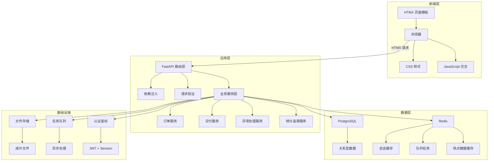
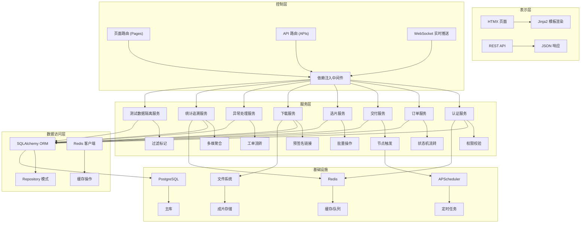

## 1. 架构设计



## 2. 技术描述

- **前端框架**: HTMX 1.9.x + Jinja2 模板引擎，无构建工具
- **后端框架**: FastAPI 0.104.x + Python 3.11
- **数据库**: PostgreSQL 15.x（主存储）
- **缓存/消息**: Redis 7.x（会话、缓存、任务队列）
- **ORM**: SQLAlchemy 2.0 + Alembic 数据迁移
- **认证**: JWT Access Token + Redis 存储 Session
- **文件存储**: 本地文件系统 + 预签名下载链接
- **异步任务**: APScheduler + Redis Queue
- **样式**: TailwindCSS 3.x + 自定义 CSS 变量

## 3. 路由定义

| 路由 | 方法 | 用途 | 权限 |
|------|------|------|------|
| `/` | GET | 首页/登录跳转 | 公开 |
| `/login` | GET/POST | 登录页面 | 公开 |
| `/logout` | POST | 登出 | 已认证 |
| `/dashboard` | GET | 摄影师工作台 | 摄影师 |
| `/orders` | GET | 订单列表 | 摄影师/管理员 |
| `/orders/{id}` | GET | 订单详情 | 摄影师/管理员 |
| `/orders/{id}/select` | GET/POST | 选片确认 | 摄影师 |
| `/orders/{id}/download` | GET | 成片下载 | 摄影师 |
| `/query/invoices` | GET | 发票周期查询 | 摄影师 |
| `/query/deliveries` | GET | 作品交付查询 | 摄影师 |
| `/query/authorizations` | GET | 素材授权查询 | 摄影师 |
| `/admin/orders` | GET/POST | 订单管理 | 管理员 |
| `/admin/nodes` | GET/POST | 交付节点配置 | 管理员 |
| `/admin/users` | GET/POST | 用户管理 | 管理员 |
| `/trace/satisfaction` | GET | 满意度追溯 | 管理员 |
| `/exceptions` | GET | 异常池列表 | 管理员/视频负责人 |
| `/exceptions/{id}` | GET/POST | 异常处理 | 视频负责人 |
| `/admin/settings/test-accounts` | GET/POST | 测试账号管理 | 管理员 |
| `/api/orders` | GET | 订单列表API | HTMX |
| `/api/orders/{id}/select` | POST | 选片确认API | HTMX |

## 4. API 定义

### 4.1 数据模型

```python
from datetime import datetime
from enum import Enum
from typing import Optional, List
from pydantic import BaseModel, Field

# 枚举类型
class OrderStatus(str, Enum):
    PENDING = "pending"
    SHOOTING = "shooting"
    SELECTING = "selecting"
    SELECTED = "selected"
    EDITING = "editing"
    DELIVERED = "delivered"
    CONFIRMED = "confirmed"
    COMPLETED = "completed"
    CANCELLED = "cancelled"

class DeliveryNodeType(str, Enum):
    SHOOT_COMPLETE = "shoot_complete"
    SELECT_CONFIRM = "select_confirm"
    EDIT_START = "edit_start"
    FIRST_DRAFT = "first_draft"
    REVISION = "revision"
    FINAL_DELIVER = "final_deliver"
    CUSTOMER_CONFIRM = "customer_confirm"

class ExceptionType(str, Enum):
    PRICE_DIFF = "price_diff"
    QUANTITY_DIFF = "quantity_diff"
    TIMEOUT_DIFF = "timeout_diff"
    QUALITY_DIFF = "quality_diff"
    OTHER_DIFF = "other_diff"

class ExceptionStatus(str, Enum):
    PENDING = "pending"
    PROCESSING = "processing"
    RESOLVED = "resolved"
    CLOSED = "closed"

class UserRole(str, Enum):
    PHOTOGRAPHER = "photographer"
    ADMIN = "admin"
    VIDEO_LEAD = "video_lead"
    CUSTOMER = "customer"

# 用户相关
class UserBase(BaseModel):
    username: str
    real_name: str
    email: Optional[str] = None
    phone: Optional[str] = None
    role: UserRole
    is_test_account: bool = False

class UserCreate(UserBase):
    password: str

class User(UserBase):
    id: int
    created_at: datetime
    last_login_at: Optional[datetime] = None

    class Config:
        from_attributes = True

# 订单相关
class OrderBase(BaseModel):
    order_no: str
    customer_name: str
    customer_phone: str
    photographer_id: int
    shoot_type: str
    shoot_date: datetime
    total_amount: float
    prepaid_amount: float = 0.0
    photo_count: int
    remark: Optional[str] = None

class OrderCreate(OrderBase):
    pass

class Order(OrderBase):
    id: int
    status: OrderStatus
    selected_count: int = 0
    delivered_count: int = 0
    is_test_data: bool = False
    created_at: datetime
    updated_at: datetime
    photographer: Optional[User] = None
    delivery_nodes: List["DeliveryNode"] = []

    class Config:
        from_attributes = True

# 交付节点
class DeliveryNodeBase(BaseModel):
    order_id: int
    node_type: DeliveryNodeType
    node_name: str
    expected_at: datetime
    operator_id: Optional[int] = None
    remark: Optional[str] = None

class DeliveryNodeCreate(DeliveryNodeBase):
    pass

class DeliveryNode(DeliveryNodeBase):
    id: int
    actual_at: Optional[datetime] = None
    is_completed: bool = False
    created_at: datetime
    operator: Optional[User] = None

    class Config:
        from_attributes = True

# 选片记录
class PhotoSelectionBase(BaseModel):
    order_id: int
    photo_key: str
    thumbnail_url: str
    original_url: str
    is_selected: bool = False
    selection_note: Optional[str] = None

class PhotoSelection(PhotoSelectionBase):
    id: int
    selected_at: Optional[datetime] = None
    selected_by: Optional[int] = None

    class Config:
        from_attributes = True

# 交付文件
class DeliveryFileBase(BaseModel):
    order_id: int
    file_name: str
    file_path: str
    file_size: int
    file_type: str
    is_downloaded: bool = False

class DeliveryFile(DeliveryFileBase):
    id: int
    download_count: int = 0
    last_downloaded_at: Optional[datetime] = None
    uploaded_at: datetime

    class Config:
        from_attributes = True

# 异常工单
class ExceptionTicketBase(BaseModel):
    order_id: int
    exception_type: ExceptionType
    title: str
    description: str
    amount_diff: float = 0.0
    assignee_id: Optional[int] = None

class ExceptionTicketCreate(ExceptionTicketBase):
    pass

class ExceptionTicket(ExceptionTicketBase):
    id: int
    status: ExceptionStatus
    resolution: Optional[str] = None
    resolved_at: Optional[datetime] = None
    resolved_by: Optional[int] = None
    created_at: datetime
    updated_at: datetime
    assignee: Optional[User] = None
    resolver: Optional[User] = None

    class Config:
        from_attributes = True

# 满意度评价
class SatisfactionBase(BaseModel):
    order_id: int
    rating: int = Field(ge=1, le=5)
    feedback: Optional[str] = None
    rated_by: int

class Satisfaction(SatisfactionBase):
    id: int
    created_at: datetime
    rater: Optional[User] = None

    class Config:
        from_attributes = True

# 发票记录
class InvoiceBase(BaseModel):
    order_id: int
    invoice_no: str
    amount: float
    invoice_date: datetime
    status: str
    is_received: bool = False

class Invoice(InvoiceBase):
    id: int
    created_at: datetime

    class Config:
        from_attributes = True

# 素材授权
class MaterialAuthorizationBase(BaseModel):
    order_id: int
    material_type: str
    scope: str
    valid_from: datetime
    valid_to: datetime
    is_approved: bool = False

class MaterialAuthorization(MaterialAuthorizationBase):
    id: int
    approved_at: Optional[datetime] = None
    approved_by: Optional[int] = None

    class Config:
        from_attributes = True
```

### 4.2 响应格式

```python
# 统一响应格式
class ApiResponse[T]:
    code: int
    message: str
    data: Optional[T] = None

# HTMX 片段响应
class HtmxFragment:
    html: str
    target: str
    swap: str = "innerHTML"
```

## 5. 服务器架构图



## 6. 数据模型

### 6.1 ER 图


### 6.2 DDL 语句

```sql
-- 启用 UUID 扩展
CREATE EXTENSION IF NOT EXISTS "uuid-ossp";

-- 用户表
CREATE TABLE users (
    id SERIAL PRIMARY KEY,
    username VARCHAR(50) UNIQUE NOT NULL,
    password_hash VARCHAR(255) NOT NULL,
    real_name VARCHAR(100) NOT NULL,
    email VARCHAR(100),
    phone VARCHAR(20),
    role VARCHAR(20) NOT NULL CHECK (role IN ('photographer', 'admin', 'video_lead', 'customer')),
    is_test_account BOOLEAN DEFAULT FALSE,
    created_at TIMESTAMP WITH TIME ZONE DEFAULT CURRENT_TIMESTAMP,
    last_login_at TIMESTAMP WITH TIME ZONE,
    INDEX idx_user_role (role),
    INDEX idx_test_account (is_test_account)
);

-- 订单表
CREATE TABLE orders (
    id SERIAL PRIMARY KEY,
    order_no VARCHAR(32) UNIQUE NOT NULL,
    customer_name VARCHAR(100) NOT NULL,
    customer_phone VARCHAR(20) NOT NULL,
    photographer_id INTEGER REFERENCES users(id),
    shoot_type VARCHAR(50) NOT NULL,
    shoot_date TIMESTAMP WITH TIME ZONE NOT NULL,
    total_amount DECIMAL(10,2) NOT NULL DEFAULT 0,
    prepaid_amount DECIMAL(10,2) NOT NULL DEFAULT 0,
    photo_count INTEGER NOT NULL DEFAULT 0,
    selected_count INTEGER NOT NULL DEFAULT 0,
    delivered_count INTEGER NOT NULL DEFAULT 0,
    status VARCHAR(20) NOT NULL DEFAULT 'pending',
    remark TEXT,
    is_test_data BOOLEAN DEFAULT FALSE,
    created_at TIMESTAMP WITH TIME ZONE DEFAULT CURRENT_TIMESTAMP,
    updated_at TIMESTAMP WITH TIME ZONE DEFAULT CURRENT_TIMESTAMP,
    INDEX idx_order_status (status),
    INDEX idx_photographer (photographer_id),
    INDEX idx_shoot_date (shoot_date),
    INDEX idx_test_data (is_test_data),
    INDEX idx_order_created (created_at)
);

-- 交付节点表
CREATE TABLE delivery_nodes (
    id SERIAL PRIMARY KEY,
    order_id INTEGER REFERENCES orders(id) ON DELETE CASCADE,
    node_type VARCHAR(30) NOT NULL,
    node_name VARCHAR(100) NOT NULL,
    expected_at TIMESTAMP WITH TIME ZONE NOT NULL,
    actual_at TIMESTAMP WITH TIME ZONE,
    is_completed BOOLEAN DEFAULT FALSE,
    operator_id INTEGER REFERENCES users(id),
    remark TEXT,
    created_at TIMESTAMP WITH TIME ZONE DEFAULT CURRENT_TIMESTAMP,
    INDEX idx_node_order (order_id),
    INDEX idx_node_type (node_type),
    INDEX idx_node_completed (is_completed)
);

-- 选片记录表
CREATE TABLE photo_selections (
    id SERIAL PRIMARY KEY,
    order_id INTEGER REFERENCES orders(id) ON DELETE CASCADE,
    photo_key VARCHAR(100) NOT NULL,
    thumbnail_url VARCHAR(500) NOT NULL,
    original_url VARCHAR(500) NOT NULL,
    is_selected BOOLEAN DEFAULT FALSE,
    selection_note TEXT,
    selected_at TIMESTAMP WITH TIME ZONE,
    selected_by INTEGER REFERENCES users(id),
    INDEX idx_selection_order (order_id),
    INDEX idx_selection_status (is_selected),
    UNIQUE(order_id, photo_key)
);

-- 交付文件表
CREATE TABLE delivery_files (
    id SERIAL PRIMARY KEY,
    order_id INTEGER REFERENCES orders(id) ON DELETE CASCADE,
    file_name VARCHAR(255) NOT NULL,
    file_path VARCHAR(500) NOT NULL,
    file_size BIGINT NOT NULL,
    file_type VARCHAR(50) NOT NULL,
    is_downloaded BOOLEAN DEFAULT FALSE,
    download_count INTEGER DEFAULT 0,
    last_downloaded_at TIMESTAMP WITH TIME ZONE,
    uploaded_at TIMESTAMP WITH TIME ZONE DEFAULT CURRENT_TIMESTAMP,
    INDEX idx_file_order (order_id),
    INDEX idx_file_downloaded (is_downloaded)
);

-- 异常工单表
CREATE TABLE exception_tickets (
    id SERIAL PRIMARY KEY,
    order_id INTEGER REFERENCES orders(id),
    exception_type VARCHAR(30) NOT NULL,
    title VARCHAR(200) NOT NULL,
    description TEXT,
    amount_diff DECIMAL(10,2) DEFAULT 0,
    status VARCHAR(20) NOT NULL DEFAULT 'pending',
    assignee_id INTEGER REFERENCES users(id),
    resolution TEXT,
    resolved_at TIMESTAMP WITH TIME ZONE,
    resolved_by INTEGER REFERENCES users(id),
    created_at TIMESTAMP WITH TIME ZONE DEFAULT CURRENT_TIMESTAMP,
    updated_at TIMESTAMP WITH TIME ZONE DEFAULT CURRENT_TIMESTAMP,
    INDEX idx_exception_type (exception_type),
    INDEX idx_exception_status (status),
    INDEX idx_exception_assignee (assignee_id),
    INDEX idx_exception_order (order_id)
);

-- 异常处理日志表
CREATE TABLE exception_logs (
    id SERIAL PRIMARY KEY,
    ticket_id INTEGER REFERENCES exception_tickets(id) ON DELETE CASCADE,
    action VARCHAR(50) NOT NULL,
    remark TEXT,
    operator_id INTEGER REFERENCES users(id),
    created_at TIMESTAMP WITH TIME ZONE DEFAULT CURRENT_TIMESTAMP,
    INDEX idx_log_ticket (ticket_id),
    INDEX idx_log_operator (operator_id)
);

-- 满意度评价表
CREATE TABLE satisfactions (
    id SERIAL PRIMARY KEY,
    order_id INTEGER REFERENCES orders(id) ON DELETE CASCADE,
    rating INTEGER NOT NULL CHECK (rating BETWEEN 1 AND 5),
    feedback TEXT,
    rated_by INTEGER REFERENCES users(id),
    created_at TIMESTAMP WITH TIME ZONE DEFAULT CURRENT_TIMESTAMP,
    INDEX idx_satisfaction_order (order_id),
    INDEX idx_satisfaction_rating (rating),
    INDEX idx_satisfaction_created (created_at),
    UNIQUE(order_id)
);

-- 发票记录表
CREATE TABLE invoices (
    id SERIAL PRIMARY KEY,
    order_id INTEGER REFERENCES orders(id),
    invoice_no VARCHAR(50) NOT NULL,
    amount DECIMAL(10,2) NOT NULL,
    invoice_date TIMESTAMP WITH TIME ZONE NOT NULL,
    status VARCHAR(20) NOT NULL,
    is_received BOOLEAN DEFAULT FALSE,
    created_at TIMESTAMP WITH TIME ZONE DEFAULT CURRENT_TIMESTAMP,
    INDEX idx_invoice_order (order_id),
    INDEX idx_invoice_date (invoice_date),
    INDEX idx_invoice_status (status)
);

-- 素材授权表
CREATE TABLE material_authorizations (
    id SERIAL PRIMARY KEY,
    order_id INTEGER REFERENCES orders(id),
    material_type VARCHAR(50) NOT NULL,
    scope TEXT NOT NULL,
    valid_from TIMESTAMP WITH TIME ZONE NOT NULL,
    valid_to TIMESTAMP WITH TIME ZONE NOT NULL,
    is_approved BOOLEAN DEFAULT FALSE,
    approved_at TIMESTAMP WITH TIME ZONE,
    approved_by INTEGER REFERENCES users(id),
    INDEX idx_auth_order (order_id),
    INDEX idx_auth_approved (is_approved),
    INDEX idx_auth_valid (valid_from, valid_to)
);

-- 会话表 (Redis 存储，此处为 DDL 参考)
CREATE TABLE IF NOT EXISTS sessions (
    session_id VARCHAR(64) PRIMARY KEY,
    user_id INTEGER NOT NULL,
    user_data JSONB,
    expires_at TIMESTAMP WITH TIME ZONE NOT NULL,
    created_at TIMESTAMP WITH TIME ZONE DEFAULT CURRENT_TIMESTAMP,
    INDEX idx_session_user (user_id),
    INDEX idx_session_expires (expires_at)
);

-- 初始数据
INSERT INTO users (username, password_hash, real_name, role, is_test_account) VALUES
('admin', '$2b$12$LQv3c1yqBWVHxkd0LHAkCOYz6TtxMQJqhN8/LewYGyJkHdKX2X7Jy', '系统管理员', 'admin', FALSE),
('test_photographer', '$2b$12$LQv3c1yqBWVHxkd0LHAkCOYz6TtxMQJqhN8/LewYGyJkHdKX2X7Jy', '测试摄影师', 'photographer', TRUE),
('test_video_lead', '$2b$12$LQv3c1yqBWVHxkd0LHAkCOYz6TtxMQJqhN8/LewYGyJkHdKX2X7Jy', '测试视频负责人', 'video_lead', TRUE);

-- 默认密码: admin123 (所有测试账号)
```
