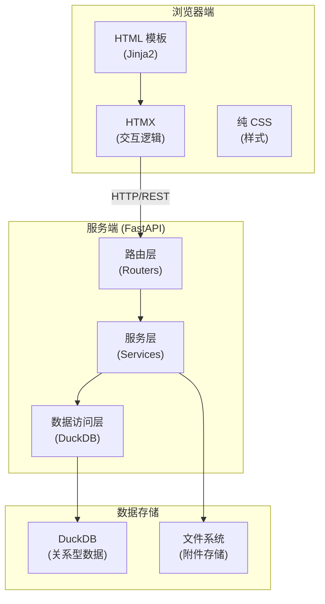
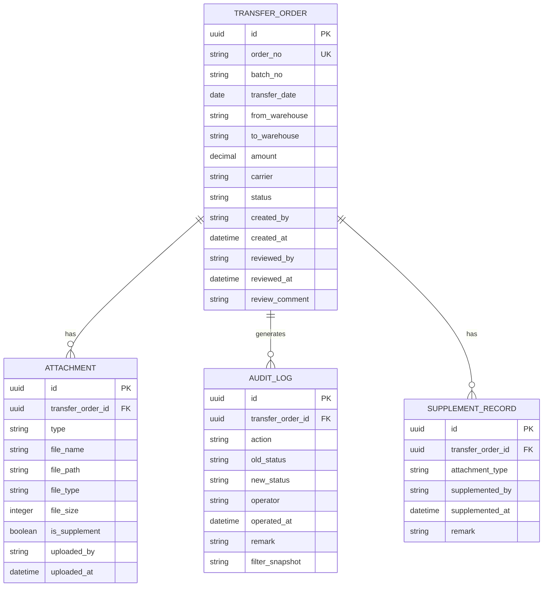

## 1. 架构设计



## 2. 技术描述

- **前端框架**：Jinja2 模板 + HTMX (无构建步骤，纯服务端渲染)
- **后端框架**：FastAPI (Python)
- **数据库**：DuckDB (嵌入式分析型数据库，支持 SQL)
- **附件存储**：本地文件系统，按日期/调拨单ID组织目录
- **Excel 处理**：openpyxl (导入导出)
- **认证**：简单 Session 基于 Cookie 的角色认证

## 3. 目录结构

```
project/
├── main.py                 # FastAPI 入口
├── requirements.txt        # 依赖清单
├── .env.example           # 环境变量示例
├── app/
│   ├── __init__.py
│   ├── config.py          # 配置
│   ├── database.py        # DuckDB 连接
│   ├── models.py          # 数据模型 (Pydantic)
│   ├── services/          # 业务逻辑
│   │   ├── __init__.py
│   │   ├── transfer.py    # 调拨单服务
│   │   ├── attachment.py  # 附件服务
│   │   ├── review.py      # 复核服务
│   │   ├── finance.py     # 财务服务
│   │   └── audit.py       # 审计服务
│   ├── routers/           # 路由
│   │   ├── __init__.py
│   │   ├── pages.py       # 页面路由
│   │   ├── api.py         # API 路由
│   │   └── htmx.py        # HTMX 交互路由
│   └── utils/             # 工具函数
│       ├── __init__.py
│       ├── file_validator.py
│       └── excel.py
├── templates/             # Jinja2 模板
│   ├── base.html
│   ├── index.html
│   ├── transfer/
│   │   ├── list.html
│   │   ├── detail.html
│   │   └── import.html
│   ├── review/
│   │   └── dashboard.html
│   ├── finance/
│   │   └── reconciliation.html
│   └── audit/
│       └── logs.html
├── static/                # 静态资源
│   ├── css/
│   │   └── main.css
│   └── js/
│       └── htmx.min.js
└── uploads/               # 附件上传目录
```

## 4. 路由定义

| 路由 | 方法 | 用途 |
|-------|------|------|
| / | GET | 首页/调拨单列表 |
| /transfer/{id} | GET | 调拨单详情 |
| /transfer/import | GET/POST | 导入调拨单预览 |
| /review | GET | 复核工作台 |
| /finance | GET | 财务对账页 |
| /audit | GET | 审计日志页 |
| /api/transfer | POST | 创建调拨单 |
| /api/transfer/{id}/attachment | POST | 上传附件 |
| /api/transfer/{id}/submit | POST | 提交复核 |
| /api/review/{id}/approve | POST | 复核通过 |
| /api/review/{id}/reject | POST | 复核驳回 |
| /api/finance/export | GET | 导出对账 Excel |
| /api/audit/logs | GET | 查询审计日志 |

## 5. 数据模型

### 5.1 ER 图



### 5.2 状态流转

```
DRAFT(草稿) → PENDING_REVIEW(待复核) → APPROVED(已通过) → SETTLED(已结算)
                    ↓                    ↓
                SUPPLEMENT(待补证)    REJECTED(已驳回)
```

### 5.3 DDL 语句

```sql
-- 调拨单表
CREATE TABLE IF NOT EXISTS transfer_orders (
    id VARCHAR PRIMARY KEY,
    order_no VARCHAR UNIQUE NOT NULL,
    batch_no VARCHAR,
    transfer_date DATE,
    from_warehouse VARCHAR,
    to_warehouse VARCHAR,
    amount DECIMAL(12,2),
    carrier VARCHAR,
    status VARCHAR NOT NULL DEFAULT 'DRAFT',
    created_by VARCHAR NOT NULL,
    created_at TIMESTAMP NOT NULL DEFAULT CURRENT_TIMESTAMP,
    reviewed_by VARCHAR,
    reviewed_at TIMESTAMP,
    review_comment VARCHAR
);

-- 附件表
CREATE TABLE IF NOT EXISTS attachments (
    id VARCHAR PRIMARY KEY,
    transfer_order_id VARCHAR NOT NULL,
    type VARCHAR NOT NULL, -- PACKING_PHOTO, RECEIPT, WAYBILL
    file_name VARCHAR NOT NULL,
    file_path VARCHAR NOT NULL,
    file_type VARCHAR,
    file_size INTEGER,
    is_supplement BOOLEAN NOT NULL DEFAULT FALSE,
    uploaded_by VARCHAR NOT NULL,
    uploaded_at TIMESTAMP NOT NULL DEFAULT CURRENT_TIMESTAMP,
    FOREIGN KEY (transfer_order_id) REFERENCES transfer_orders(id)
);

-- 补证记录表
CREATE TABLE IF NOT EXISTS supplement_records (
    id VARCHAR PRIMARY KEY,
    transfer_order_id VARCHAR NOT NULL,
    attachment_type VARCHAR NOT NULL,
    supplemented_by VARCHAR NOT NULL,
    supplemented_at TIMESTAMP NOT NULL DEFAULT CURRENT_TIMESTAMP,
    remark VARCHAR,
    FOREIGN KEY (transfer_order_id) REFERENCES transfer_orders(id)
);

-- 审计日志表
CREATE TABLE IF NOT EXISTS audit_logs (
    id VARCHAR PRIMARY KEY,
    transfer_order_id VARCHAR,
    action VARCHAR NOT NULL,
    old_status VARCHAR,
    new_status VARCHAR,
    operator VARCHAR NOT NULL,
    operated_at TIMESTAMP NOT NULL DEFAULT CURRENT_TIMESTAMP,
    remark VARCHAR,
    filter_snapshot VARCHAR -- JSON 格式的筛选条件快照
);

-- 用户表（简化）
CREATE TABLE IF NOT EXISTS users (
    id VARCHAR PRIMARY KEY,
    username VARCHAR UNIQUE NOT NULL,
    password VARCHAR NOT NULL,
    role VARCHAR NOT NULL, -- WATCHER, SUPERVISOR, FINANCE
    full_name VARCHAR
);

-- 索引
CREATE INDEX idx_transfer_status ON transfer_orders(status);
CREATE INDEX idx_transfer_batch ON transfer_orders(batch_no);
CREATE INDEX idx_attachment_order ON attachments(transfer_order_id);
CREATE INDEX idx_audit_order ON audit_logs(transfer_order_id);
CREATE INDEX idx_audit_operator ON audit_logs(operator);
```

## 6. 核心业务规则

### 6.1 附件校验规则

- **装箱照片 (PACKING_PHOTO)**：允许 JPG, PNG, JPEG，单文件最大 10MB
- **签收回执 (RECEIPT)**：允许 PDF, JPG, PNG，单文件最大 10MB
- **承运单 (WAYBILL)**：允许 PDF, JPG, PNG，单文件最大 10MB
- 缺少签收回执的调拨单不能提交复核

### 6.2 权限控制

- 值班员：只能操作自己创建的调拨单，可上传附件、提交复核
- 主管：可查看所有调拨单，可复核，可查看审计日志
- 财务：只能查看状态为 APPROVED 的调拨单，只能看到结算相关字段

### 6.3 审计日志触发点

- 调拨单创建
- 附件上传（含补证）
- 提交复核
- 复核通过/驳回
- 财务导出（记录筛选条件快照）
