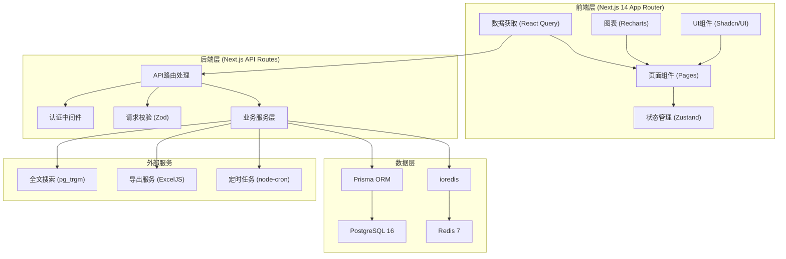
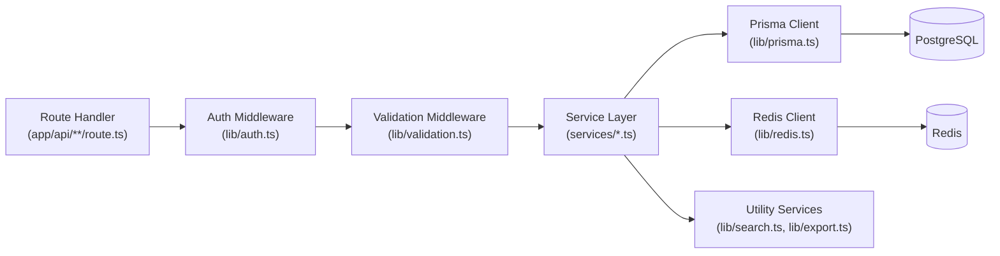
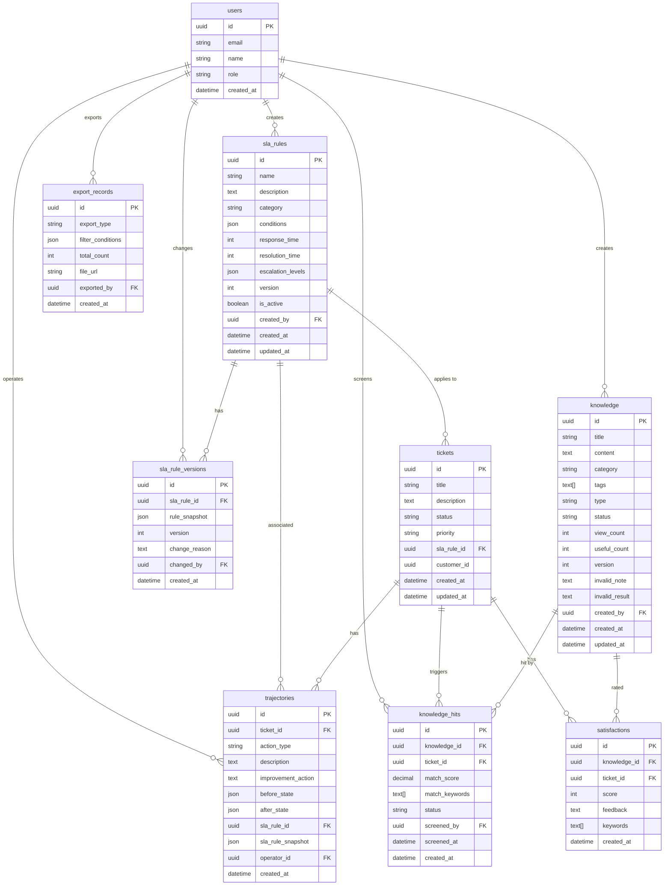

## 1. 架构设计



## 2. 技术描述

### 2.1 技术栈选型
- **前端框架**: Next.js 14 (App Router) + React 18 + TypeScript 5.4
- **UI组件库**: shadcn/ui + Tailwind CSS 3.4 + Radix UI
- **状态管理**: Zustand 4.5 + React Query 5 (TanStack Query)
- **图表库**: Recharts 2.12
- **后端**: Next.js API Routes (Route Handlers)
- **ORM**: Prisma 5.13
- **数据库**: PostgreSQL 16
- **缓存**: Redis 7 (ioredis 5.4)
- **表单校验**: Zod 3.23
- **导出**: ExcelJS 4.4
- **全文搜索**: PostgreSQL pg_trgm 扩展
- **图标**: lucide-react 0.378

### 2.2 核心技术决策
1. **Next.js App Router**: 利用 Server Components 减少客户端JS体积，配合 Route Handlers 提供 API
2. **Prisma ORM**: 类型安全的数据库访问，自动生成 TypeScript 类型，支持迁移管理
3. **PostgreSQL + pg_trgm**: 内置全文搜索能力，无需额外引入ES，降低复杂度
4. **Redis**: 缓存热点知识、SLA规则、会话管理，以及实时通知的发布订阅
5. **Zustand**: 轻量状态管理，避免 Redux 过度设计，适合中后台系统
6. **React Query**: 服务端状态管理，自动缓存、重试、后台刷新

## 3. 路由定义

| 路由路径 | 页面用途 | 服务端组件 |
|---------|---------|-----------|
| / | 预警台首页 | 是 |
| /knowledge | 知识库搜索 | 是 |
| /knowledge/[id] | 知识详情 | 是 |
| /knowledge/tutorials | 教程专区 | 是 |
| /sla/rules | SLA规则列表 | 是 |
| /sla/rules/[id] | 规则配置/详情 | 否（客户端交互多） |
| /sla/rules/[id]/compare | 版本对比 | 否 |
| /hits | 知识命中管理 | 是 |
| /hits/export | 导出记录 | 是 |
| /trajectory/[ticketId] | 处理轨迹详情 | 是 |
| /knowledge/invalid | 知识失效管理 | 是 |
| /knowledge/invalid/[id] | 失效知识详情 | 否 |
| /dashboard | 数据看板 | 否（图表交互多） |
| /api/health | 健康检查 | - |
| /api/knowledge/* | 知识库API | - |
| /api/sla/* | SLA规则API | - |
| /api/hits/* | 命中管理API | - |
| /api/trajectory/* | 轨迹API | - |
| /api/invalid/* | 失效管理API | - |
| /api/dashboard/* | 看板数据API | - |

## 4. API 定义

### 4.1 TypeScript 类型定义

```typescript
// 知识条目
interface Knowledge {
  id: string;
  title: string;
  content: string;
  category: string;
  tags: string[];
  type: 'ANSWER' | 'TUTORIAL';
  status: 'ACTIVE' | 'PENDING_INVALID' | 'INVALID';
  viewCount: number;
  usefulCount: number;
  version: number;
  createdAt: Date;
  updatedAt: Date;
  invalidNote?: string;
  invalidResult?: string;
}

// SLA规则
interface SLARule {
  id: string;
  name: string;
  description: string;
  category: string;
  conditions: SLACondition[];
  responseTime: number; // 分钟
  resolutionTime: number; // 分钟
  escalationLevels: EscalationLevel[];
  version: number;
  isActive: boolean;
  createdBy: string;
  createdAt: Date;
  updatedAt: Date;
}

interface SLACondition {
  field: string;
  operator: 'EQ' | 'NE' | 'GT' | 'LT' | 'CONTAINS';
  value: string;
}

interface EscalationLevel {
  level: number;
  threshold: number; // 分钟
  notifyRoles: string[];
  action: string;
}

// 处理轨迹
interface Trajectory {
  id: string;
  ticketId: string;
  actionType: 'CREATE' | 'STATUS_CHANGE' | 'SLA_CHANGE' | 'IMPROVEMENT' | 'RESOLVE';
  description: string;
  improvementAction?: string;
  beforeState: Record<string, unknown>;
  afterState: Record<string, unknown>;
  slaRuleId?: string;
  slaRuleSnapshot?: SLARule;
  operatorId: string;
  operatorName: string;
  createdAt: Date;
}

// 知识命中
interface KnowledgeHit {
  id: string;
  knowledgeId: string;
  ticketId: string;
  matchScore: number;
  matchKeywords: string[];
  status: 'PENDING' | 'VALID' | 'FALSE_POSITIVE';
  screenedBy?: string;
  screenedAt?: Date;
  createdAt: Date;
}

// 客户满意度
interface Satisfaction {
  id: string;
  knowledgeId?: string;
  ticketId: string;
  score: 1 | 2 | 3 | 4 | 5;
  feedback: string;
  keywords: string[];
  createdAt: Date;
}
```

### 4.2 请求/响应示例

```typescript
// POST /api/sla/rules
interface CreateSLARuleRequest {
  name: string;
  description: string;
  category: string;
  conditions: SLACondition[];
  responseTime: number;
  resolutionTime: number;
  escalationLevels: EscalationLevel[];
}

interface ApiResponse<T> {
  success: boolean;
  data?: T;
  error?: {
    code: string;
    message: string;
  };
}

// GET /api/knowledge/search?q=xxx
interface KnowledgeSearchResponse {
  items: Knowledge[];
  total: number;
  page: number;
  pageSize: number;
  highlights: Record<string, string>;
}
```

## 5. 服务端架构



### 5.1 目录结构
```
app/
  ├── layout.tsx              # 根布局（导航、主题）
  ├── page.tsx                # 预警台首页
  ├── knowledge/              # 知识库模块
  │   ├── page.tsx
  │   ├── [id]/page.tsx
  │   ├── tutorials/page.tsx
  │   └── invalid/page.tsx
  ├── sla/                    # SLA规则模块
  │   ├── rules/page.tsx
  │   └── rules/[id]/
  │       ├── page.tsx
  │       └── compare/page.tsx
  ├── hits/                   # 命中管理模块
  │   ├── page.tsx
  │   └── export/page.tsx
  ├── trajectory/
  │   └── [ticketId]/page.tsx
  ├── dashboard/page.tsx
  └── api/                    # API路由
      ├── knowledge/
      ├── sla/
      ├── hits/
      ├── trajectory/
      ├── invalid/
      └── dashboard/

lib/                           # 共享工具
  ├── prisma.ts               # Prisma客户端
  ├── redis.ts                # Redis客户端
  ├── auth.ts                 # 认证逻辑
  ├── validation.ts           # Zod校验模式
  ├── search.ts               # 全文搜索封装
  ├── export.ts               # 导出工具
  └── utils.ts                # 通用工具函数

services/                      # 业务服务层
  ├── knowledge.service.ts
  ├── sla.service.ts
  ├── hits.service.ts
  ├── trajectory.service.ts
  └── satisfaction.service.ts

components/                    # React组件
  ├── ui/                     # shadcn/ui基础组件
  ├── layout/                 # 布局组件（侧边栏、导航）
  ├── knowledge/              # 知识库相关组件
  ├── sla/                    # SLA相关组件
  ├── trajectory/             # 轨迹相关组件
  └── dashboard/              # 看板图表组件

stores/                        # Zustand状态
  ├── useSLAStore.ts
  └── useKnowledgeStore.ts

prisma/
  ├── schema.prisma           # 数据模型定义
  └── migrations/             # 数据库迁移
```

## 6. 数据模型

### 6.1 ER图



### 6.2 Prisma Schema DDL

```prisma
// prisma/schema.prisma
generator client {
  provider = "prisma-client-js"
}

datasource db {
  provider = "postgresql"
  url      = env("DATABASE_URL")
}

enum UserRole {
  MANAGER
  AGENT
  ADMIN
}

enum KnowledgeType {
  ANSWER
  TUTORIAL
}

enum KnowledgeStatus {
  ACTIVE
  PENDING_INVALID
  INVALID
}

enum HitStatus {
  PENDING
  VALID
  FALSE_POSITIVE
}

enum TrajectoryActionType {
  CREATE
  STATUS_CHANGE
  SLA_CHANGE
  IMPROVEMENT
  RESOLVE
}

model User {
  id        String   @id @default(uuid())
  email     String   @unique
  name      String
  role      UserRole
  createdAt DateTime @default(now())
  
  knowledge     Knowledge[]
  slaRules      SLARule[]
  slaVersions   SLARuleVersion[]
  trajectories  Trajectory[]
  screenedHits  KnowledgeHit[]
  exports       ExportRecord[]
}

model Knowledge {
  id            String          @id @default(uuid())
  title         String
  content       String
  category      String
  tags          String[]
  type          KnowledgeType
  status        KnowledgeStatus @default(ACTIVE)
  viewCount     Int             @default(0)
  usefulCount   Int             @default(0)
  version       Int             @default(1)
  invalidNote   String?
  invalidResult String?
  createdBy     String
  createdAt     DateTime        @default(now())
  updatedAt     DateTime        @updatedAt
  
  creator      User             @relation(fields: [createdBy], references: [id])
  hits         KnowledgeHit[]
  satisfactions Satisfaction[]
}

model SLARule {
  id                String             @id @default(uuid())
  name              String
  description       String
  category          String
  conditions        Json
  responseTime      Int
  resolutionTime    Int
  escalationLevels  Json
  version           Int                @default(1)
  isActive          Boolean            @default(true)
  createdBy         String
  createdAt         DateTime           @default(now())
  updatedAt         DateTime           @updatedAt
  
  creator      User               @relation(fields: [createdBy], references: [id])
  versions     SLARuleVersion[]
  tickets      Ticket[]
  trajectories Trajectory[]
}

model SLARuleVersion {
  id            String   @id @default(uuid())
  slaRuleId     String
  ruleSnapshot  Json
  version       Int
  changeReason  String
  changedBy     String
  createdAt     DateTime @default(now())
  
  rule    SLARule @relation(fields: [slaRuleId], references: [id], onDelete: Cascade)
  changer User    @relation(fields: [changedBy], references: [id])
}

model Ticket {
  id          String   @id @default(uuid())
  title       String
  description String
  status      String
  priority    String
  slaRuleId   String?
  customerId  String
  createdAt   DateTime @default(now())
  updatedAt   DateTime @updatedAt
  
  slaRule      SLARule?        @relation(fields: [slaRuleId], references: [id])
  trajectories Trajectory[]
  hits         KnowledgeHit[]
  satisfactions Satisfaction[]
}

model Trajectory {
  id                String                @id @default(uuid())
  ticketId          String
  actionType        TrajectoryActionType
  description       String
  improvementAction String?
  beforeState       Json
  afterState        Json
  slaRuleId         String?
  slaRuleSnapshot   Json?
  operatorId        String
  createdAt         DateTime              @default(now())
  
  ticket    Ticket   @relation(fields: [ticketId], references: [id], onDelete: Cascade)
  slaRule   SLARule? @relation(fields: [slaRuleId], references: [id])
  operator  User     @relation(fields: [operatorId], references: [id])
}

model KnowledgeHit {
  id            String    @id @default(uuid())
  knowledgeId   String
  ticketId      String
  matchScore    Decimal
  matchKeywords String[]
  status        HitStatus @default(PENDING)
  screenedBy    String?
  screenedAt    DateTime?
  createdAt     DateTime  @default(now())
  
  knowledge Knowledge @relation(fields: [knowledgeId], references: [id], onDelete: Cascade)
  ticket    Ticket    @relation(fields: [ticketId], references: [id], onDelete: Cascade)
  screener  User?     @relation(fields: [screenedBy], references: [id])
}

model Satisfaction {
  id          String   @id @default(uuid())
  knowledgeId String?
  ticketId    String
  score       Int
  feedback    String
  keywords    String[]
  createdAt   DateTime @default(now())
  
  knowledge Knowledge? @relation(fields: [knowledgeId], references: [id])
  ticket    Ticket     @relation(fields: [ticketId], references: [id], onDelete: Cascade)
}

model ExportRecord {
  id               String   @id @default(uuid())
  exportType       String
  filterConditions Json
  totalCount       Int
  fileUrl          String
  exportedBy       String
  createdAt        DateTime @default(now())
  
  exporter User @relation(fields: [exportedBy], references: [id])
}
```

### 6.3 索引与优化

```sql
-- 全文搜索索引（pg_trgm扩展）
CREATE EXTENSION IF NOT EXISTS pg_trgm;
CREATE INDEX idx_knowledge_title_trgm ON knowledge USING gin (title gin_trgm_ops);
CREATE INDEX idx_knowledge_content_trgm ON knowledge USING gin (content gin_trgm_ops);
CREATE INDEX idx_knowledge_tags ON knowledge USING gin (tags);

-- 常用查询索引
CREATE INDEX idx_knowledge_status ON knowledge(status);
CREATE INDEX idx_knowledge_category ON knowledge(category);
CREATE INDEX idx_sla_rules_active ON sla_rules(is_active);
CREATE INDEX idx_tickets_status ON tickets(status);
CREATE INDEX idx_tickets_sla_rule ON tickets(sla_rule_id);
CREATE INDEX idx_trajectories_ticket ON trajectories(ticket_id);
CREATE INDEX idx_trajectories_created ON trajectories(created_at DESC);
CREATE INDEX idx_hits_status ON knowledge_hits(status);
CREATE INDEX idx_hits_knowledge ON knowledge_hits(knowledge_id);
CREATE INDEX idx_satisfactions_knowledge ON satisfactions(knowledge_id);
CREATE INDEX idx_satisfactions_created ON satisfactions(created_at DESC);

-- 初始数据
INSERT INTO users (id, email, name, role) VALUES
('00000000-0000-0000-0000-000000000001', 'manager@example.com', '张经理', 'MANAGER'),
('00000000-0000-0000-0000-000000000002', 'agent@example.com', '李客服', 'AGENT');
```

## 7. Redis 缓存策略

| 缓存键 | 数据类型 | 过期时间 | 用途 |
|--------|---------|---------|------|
| `knowledge:hot:{id}` | string | 1h | 热点知识详情 |
| `knowledge:search:{query_hash}` | string | 5min | 搜索结果缓存 |
| `sla:rules:active` | list | 30min | 活跃SLA规则列表 |
| `sla:rule:{id}` | string | 1h | SLA规则详情 |
| `dashboard:metrics:{date}` | string | 15min | 看板统计数据 |
| `hits:notifications:{userId}` | set | - | 用户未读通知 |
| `session:{token}` | hash | 24h | 用户会话 |

## 8. 安全考虑

1. **认证**: JWT + HttpOnly Cookie，存储于 Redis
2. **授权**: 中间件按角色校验 API 访问权限
3. **SQL注入**: Prisma ORM 参数化查询，禁止拼接SQL
4. **XSS**: 所有用户输入使用 React 自动转义，富文本使用 DOMPurify 净化
5. **敏感数据**: 数据库连接串、Redis密码等通过环境变量管理
6. **操作审计**: 所有导出操作、规则变更记录审计日志
7. **速率限制**: API 接入 Redis 限流，防止恶意请求
