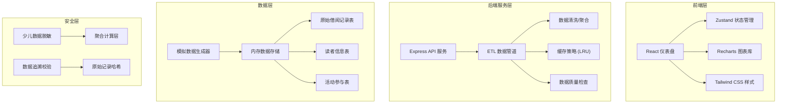
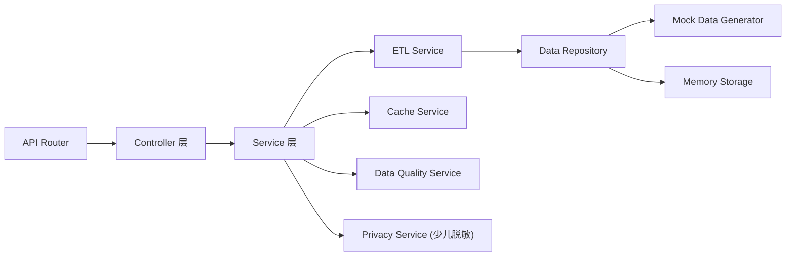
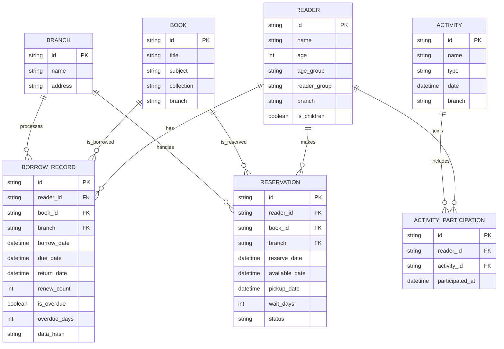

## 1. 架构设计



## 2. 技术描述
- **前端**: React@18 + TypeScript + Vite + TailwindCSS@3 + Zustand + Recharts
- **后端**: Express@4 + TypeScript
- **初始化工具**: vite-init
- **数据存储**: 内存数据存储 + 模拟数据生成器
- **图表库**: Recharts (React生态)

## 3. 路由定义
| 路由 | 页面名称 | 功能说明 |
|------|----------|----------|
| / | 仪表盘首页 | 核心KPI、主题趋势、分馆对比 |
| /reservation | 预约分析 | 预约等待、热门预约 |
| /overdue | 逾期分析 | 逾期热区、逾期趋势 |
| /readers | 读者分析 | 年龄段、活动参与、少儿聚合 |
| /data-quality | 数据质量 | ETL状态、字段检查、原始记录验证 |

## 4. API 定义

### 4.1 类型定义
```typescript
// 筛选条件
interface FilterParams {
  collections: string[];
  readerGroups: string[];
  subjects: string[];
  branches: string[];
  months: string[];
  timeWindow: '7d' | '30d' | '90d' | '1y' | 'all';
}

// KPI 数据
interface KPIData {
  totalBorrows: number;
  activeReaders: number;
  totalReservations: number;
  overdueRate: number;
  comparedToLastPeriod: number;
}

// 主题趋势数据
interface SubjectTrend {
  date: string;
  [subject: string]: number | string;
}

// 分馆对比数据
interface BranchComparison {
  branch: string;
  borrows: number;
  reservations: number;
  overdues: number;
}

// 逾期热区数据
interface OverdueHeatmap {
  branch: string;
  hour: number;
  count: number;
}

// 数据质量状态
interface DataQualityStatus {
  lastUpdate: string;
  updateStatus: 'success' | 'failed' | 'partial';
  missingFields: string[];
  recordCount: number;
  errors: string[];
}

// 保存的筛选组合
interface SavedFilter {
  id: string;
  name: string;
  params: FilterParams;
  createdAt: string;
}
```

### 4.2 API 端点
| 方法 | 路径 | 说明 |
|------|------|------|
| GET | /api/kpi | 获取KPI数据 |
| GET | /api/trends/subject | 获取主题趋势数据 |
| GET | /api/comparison/branch | 获取分馆对比数据 |
| GET | /api/reservations/wait-time | 获取预约等待分析 |
| GET | /api/overdue/heatmap | 获取逾期热区数据 |
| GET | /api/readers/age-groups | 获取读者年龄段分布（少儿数据聚合） |
| GET | /api/data-quality/status | 获取数据质量状态 |
| GET | /api/records/raw | 获取原始记录（用于追溯验证） |
| GET | /api/filters/saved | 获取保存的筛选组合 |
| POST | /api/filters/saved | 保存筛选组合 |
| DELETE | /api/filters/saved/:id | 删除保存的筛选组合 |

## 5. 服务器架构图



## 6. 数据模型

### 6.1 ER 图



### 6.2 数据质量设计
- 每条记录包含 `data_hash` 字段用于追溯验证
- ETL过程记录数据血统（lineage）
- 字段级完整性检查，缺失字段记录在案
- 少儿读者数据：仅提供聚合统计，不暴露单条记录
