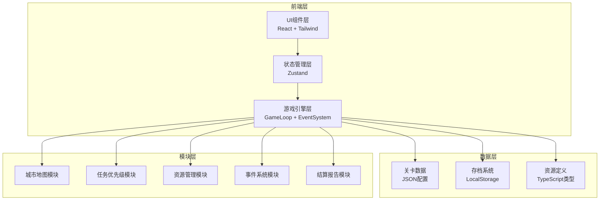
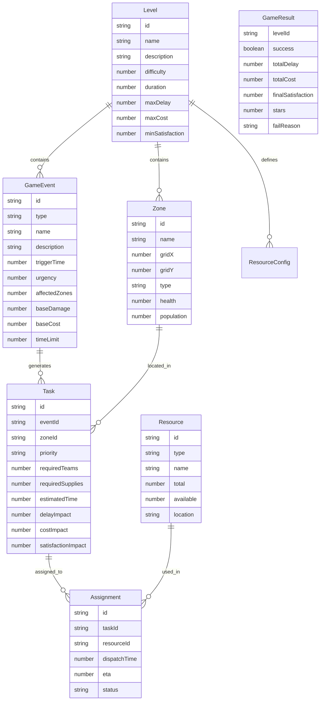

## 1. 架构设计



## 2. 技术说明

- **前端框架**：React@18 + TypeScript + Vite
- **样式方案**：Tailwind CSS@3
- **状态管理**：Zustand（游戏全局状态 + 各模块独立store）
- **路由**：react-router-dom（页面切换）
- **图标**：lucide-react
- **动画**：CSS动画 + requestAnimationFrame游戏循环
- **后端**：无（纯前端游戏，数据存LocalStorage）
- **构建目标**：WebGL兼容的现代浏览器

## 3. 路由定义

| 路由 | 用途 |
|------|------|
| `/` | 开始菜单 |
| `/tutorial` | 教程关卡 |
| `/levels` | 关卡选择 |
| `/game/:levelId` | 游戏主界面 |
| `/result/:levelId` | 结算界面 |
| `/settings` | 设置面板（覆盖层） |

## 4. 游戏核心数据模型

### 4.1 数据模型定义



### 4.2 类型定义

```typescript
type EventType = 'storm' | 'blackout' | 'traffic' | 'flood' | 'fire'
type Priority = 'critical' | 'high' | 'medium' | 'low'
type ZoneType = 'residential' | 'commercial' | 'industrial' | 'hospital' | 'powerplant' | 'transport'
type ResourceType = 'repair_team' | 'supply' | 'vehicle'
type AssignmentStatus = 'dispatched' | 'en_route' | 'working' | 'completed' | 'failed'
type GameState = 'idle' | 'playing' | 'paused' | 'success' | 'failed'
```

## 5. 模块架构

### 5.1 城市地图模块 (`src/game/map/`)

- `CityMap` 组件：6x6网格渲染，区域状态可视化
- `Zone` 组件：单个区域，显示类型图标、健康度、人口
- `mapStore`：地图状态管理，区域更新逻辑
- 可扩展：支持不同尺寸网格、自定义区域类型

### 5.2 任务优先级模块 (`src/game/task/`)

- `TaskPanel` 组件：任务列表，优先级排序，倒计时
- `TaskCard` 组件：单个任务卡片，显示影响预览
- `taskStore`：任务队列管理，优先级计算，超时处理
- 可扩展：支持自定义优先级规则、任务链

### 5.3 资源管理模块 (`src/game/resource/`)

- `ResourcePanel` 组件：资源概览，拖拽分配
- `ResourceItem` 组件：单个资源状态
- `resourceStore`：资源库存，分配/回收逻辑
- 可扩展：新资源类型、资源升级系统

### 5.4 事件系统模块 (`src/game/event/`)

- `EventAlert` 组件：新事件弹窗通知
- `eventEngine`：事件触发引擎，按时间轴生成事件
- `eventStore`：活跃事件管理
- 可扩展：事件链、随机事件池、事件组合效果

### 5.5 结算报告模块 (`src/game/report/`)

- `SettlementScreen` 组件：结算主界面
- `MetricsChart` 组件：三维指标可视化
- `DecisionTimeline` 组件：决策回放时间线
- `reportStore`：结算数据计算
- 可扩展：详细统计、成就系统

### 5.6 游戏引擎 (`src/game/engine/`)

- `GameLoop`：requestAnimationFrame驱动的游戏主循环
- `TimeManager`：游戏时间管理，暂停/加速
- `GameStateManager`：游戏状态机（idle→playing→paused→success/failed）
- `SaveManager`：LocalStorage存档读写

## 6. 关卡配置结构

```typescript
interface LevelConfig {
  id: string
  name: string
  description: string
  difficulty: 1 | 2 | 3 | 4 | 5
  duration: number
  gridCols: number
  gridRows: number
  zones: ZoneConfig[]
  events: EventConfig[]
  resources: ResourceConfig[]
  thresholds: {
    maxDelay: number
    maxCost: number
    minSatisfaction: number
  }
  tutorialSteps?: TutorialStep[]
}

interface EventConfig {
  id: string
  type: EventType
  triggerTime: number
  affectedZoneIds: string[]
  urgency: Priority
  timeLimit: number
}
```

## 7. 五个关卡设计

| 关卡 | 名称 | 难度 | 灾害类型 | 时长(秒) | 说明 |
|------|------|------|----------|----------|------|
| 1 | 暴雨初临 | ★ | 暴雨 | 120 | 教程关，2-3个事件，资源充足 |
| 2 | 停电危机 | ★★ | 停电 | 150 | 停电事件链，需优先恢复电力 |
| 3 | 交通瘫痪 | ★★★ | 交通拥堵 | 180 | 路线规划为主，物资运输受堵 |
| 4 | 风雨交加 | ★★★★ | 暴雨+停电 | 200 | 复合灾害，资源紧张 |
| 5 | 全城紧急 | ★★★★★ | 暴雨+停电+交通 | 240 | 极限调度，必须取舍 |

## 8. 项目目录结构

```
src/
├── components/          # 通用UI组件
│   ├── Button.tsx
│   ├── Modal.tsx
│   ├── Slider.tsx
│   └── ProgressBar.tsx
├── game/               # 游戏核心模块
│   ├── map/            # 城市地图
│   │   ├── CityMap.tsx
│   │   ├── Zone.tsx
│   │   └── mapStore.ts
│   ├── task/           # 任务优先级
│   │   ├── TaskPanel.tsx
│   │   ├── TaskCard.tsx
│   │   └── taskStore.ts
│   ├── resource/       # 资源管理
│   │   ├── ResourcePanel.tsx
│   │   ├── ResourceItem.tsx
│   │   └── resourceStore.ts
│   ├── event/          # 事件系统
│   │   ├── EventAlert.tsx
│   │   ├── eventEngine.ts
│   │   └── eventStore.ts
│   ├── report/         # 结算报告
│   │   ├── SettlementScreen.tsx
│   │   ├── MetricsChart.tsx
│   │   ├── DecisionTimeline.tsx
│   │   └── reportStore.ts
│   └── engine/         # 游戏引擎
│       ├── GameLoop.ts
│       ├── TimeManager.ts
│       ├── GameStateManager.ts
│       └── SaveManager.ts
├── levels/             # 关卡配置数据
│   ├── level1.ts
│   ├── level2.ts
│   ├── level3.ts
│   ├── level4.ts
│   └── level5.ts
├── pages/              # 页面组件
│   ├── MainMenu.tsx
│   ├── Tutorial.tsx
│   ├── LevelSelect.tsx
│   ├── GameScreen.tsx
│   ├── ResultScreen.tsx
│   └── Settings.tsx
├── stores/             # 全局状态
│   ├── gameStore.ts
│   ├── settingsStore.ts
│   └── debugStore.ts
├── types/              # 类型定义
│   └── game.ts
├── utils/              # 工具函数
│   └── helpers.ts
├── App.tsx
└── main.tsx
```
