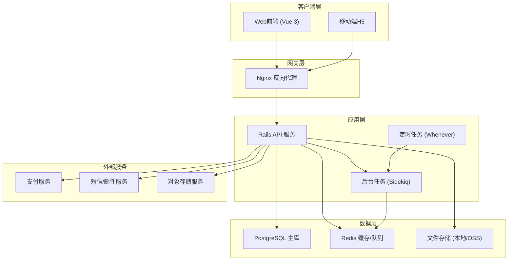
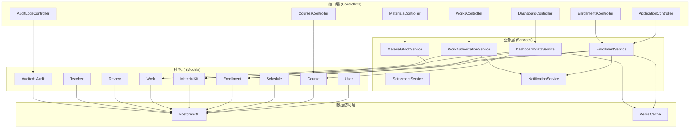
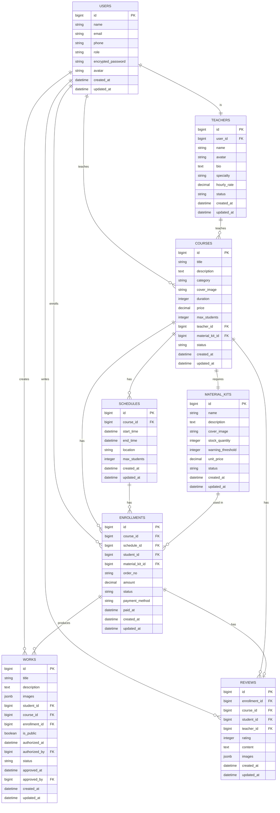

# 手作课程报名和作品展示平台 - 技术架构文档

## 1. 架构设计



## 2. 技术栈说明

### 2.1 前端技术
- **框架**: Vue 3 + Composition API
- **构建工具**: Vite 5
- **路由**: Vue Router 4
- **状态管理**: Pinia
- **UI组件库**: Element Plus (后台) + 自定义组件库 (前台)
- **CSS方案**: Tailwind CSS 3 + SCSS
- **图表**: ECharts 5
- **HTTP客户端**: Axios
- **类型系统**: TypeScript 5
- **代码规范**: ESLint + Prettier

### 2.2 后端技术
- **框架**: Ruby on Rails 7 (API mode)
- **Ruby版本**: 3.2+
- **数据库**: PostgreSQL 14+
- **缓存/队列**: Redis 7+
- **后台任务**: Sidekiq
- **定时任务**: Whenever
- **认证**: Devise Token Auth
- **授权**: Pundit
- **文件上传**: Active Storage
- **API文档**: Rswag
- **审计日志**: Audited
- **分页**: Kaminari

### 2.3 测试技术
- **后端测试**: RSpec + FactoryBot
- **前端测试**: Vitest + Vue Test Utils
- **E2E测试**: Playwright
- **代码覆盖率**: SimpleCov

## 3. 路由定义

### 3.1 前端路由

| 路由路径 | 页面名称 | 权限要求 |
|----------|----------|----------|
| / | 首页 | 公开 |
| /courses | 课程列表 | 公开 |
| /courses/:id | 课程详情 | 公开 |
| /gallery | 作品画廊 | 公开 |
| /gallery/:id | 作品详情 | 公开 |
| /login | 登录页 | 公开 |
| /register | 注册页 | 公开 |
| /checkout/:enrollmentId | 报名确认 | 学员 |
| /profile | 个人中心 | 已登录 |
| /profile/enrollments | 我的报名 | 学员 |
| /profile/works | 我的作品 | 学员 |
| /profile/reviews | 我的评价 | 学员 |
| /dashboard | 运营看板 | 管理员 |
| /admin/courses | 课程管理 | 管理员 |
| /admin/enrollments | 报名管理 | 管理员 |
| /admin/materials | 材料管理 | 管理员 |
| /admin/teachers | 老师管理 | 管理员 |
| /admin/students | 学员管理 | 管理员 |
| /admin/works | 作品审核 | 管理员 |
| /admin/audit-logs | 审计日志 | 超级管理员 |
| /admin/settings | 系统配置 | 超级管理员 |

### 3.2 后端API路由

| 方法 | 路径 | 控制器 | 说明 |
|------|------|--------|------|
| POST | /api/v1/auth/sign_in | sessions#create | 用户登录 |
| DELETE | /api/v1/auth/sign_out | sessions#destroy | 用户登出 |
| GET | /api/v1/courses | courses#index | 课程列表 |
| GET | /api/v1/courses/:id | courses#show | 课程详情 |
| POST | /api/v1/courses | courses#create | 创建课程 |
| PUT | /api/v1/courses/:id | courses#update | 更新课程 |
| DELETE | /api/v1/courses/:id | courses#destroy | 删除课程 |
| GET | /api/v1/courses/:id/schedules | schedules#index | 课程排期 |
| POST | /api/v1/enrollments | enrollments#create | 创建报名 |
| GET | /api/v1/enrollments | enrollments#index | 报名列表 |
| GET | /api/v1/enrollments/:id | enrollments#show | 报名详情 |
| PUT | /api/v1/enrollments/:id/status | enrollments#update_status | 状态变更 |
| POST | /api/v1/enrollments/:id/refund | enrollments#refund | 申请退款 |
| GET | /api/v1/materials | materials#index | 材料列表 |
| POST | /api/v1/materials | materials#create | 创建材料 |
| PUT | /api/v1/materials/:id/stock | materials#update_stock | 更新库存 |
| GET | /api/v1/works | works#index | 作品列表 |
| POST | /api/v1/works | works#create | 上传作品 |
| PUT | /api/v1/works/:id/authorize | works#authorize | 授权公开 |
| PUT | /api/v1/works/:id/approve | works#approve | 审核通过 |
| PUT | /api/v1/works/:id/reject | works#reject | 审核驳回 |
| GET | /api/v1/teachers | teachers#index | 老师列表 |
| GET | /api/v1/teachers/:id/settlements | settlements#index | 结算记录 |
| GET | /api/v1/dashboard/overview | dashboard#overview | 看板概览 |
| GET | /api/v1/dashboard/status_stats | dashboard#status_stats | 状态统计 |
| GET | /api/v1/dashboard/resource_usage | dashboard#resource_usage | 资源利用率 |
| GET | /api/v1/audit_logs | audit_logs#index | 审计日志 |

## 4. API定义

### 4.1 核心数据类型定义

```typescript
// 用户
interface User {
  id: number;
  name: string;
  email: string;
  phone: string;
  role: 'super_admin' | 'admin' | 'teacher' | 'student';
  avatar: string;
  created_at: string;
}

// 课程
interface Course {
  id: number;
  title: string;
  description: string;
  category: 'pottery' | 'silver' | 'leather';
  cover_image: string;
  duration: number;
  price: number;
  max_students: number;
  teacher_id: number;
  material_kit_id: number;
  status: 'draft' | 'published' | 'archived';
  created_at: string;
}

// 课程排期
interface Schedule {
  id: number;
  course_id: number;
  start_time: string;
  end_time: string;
  location: string;
  enrolled_count: number;
  max_students: number;
}

// 材料包
interface MaterialKit {
  id: number;
  name: string;
  description: string;
  cover_image: string;
  stock_quantity: number;
  warning_threshold: number;
  unit_price: number;
  status: 'active' | 'out_of_stock' | 'discontinued';
}

// 报名记录
interface Enrollment {
  id: number;
  course_id: number;
  schedule_id: number;
  student_id: number;
  material_kit_id: number;
  order_no: string;
  amount: number;
  status: 'pending_payment' | 'paid' | 'completed' | 'cancelled' | 'refunding' | 'refunded' | 'refund_rejected';
  payment_method: string;
  paid_at: string;
  created_at: string;
}

// 作品
interface Work {
  id: number;
  title: string;
  description: string;
  images: string[];
  student_id: number;
  course_id: number;
  enrollment_id: number;
  is_public: boolean;
  authorized_at: string;
  authorized_by: number;
  status: 'pending' | 'approved' | 'rejected';
  approved_at: string;
  approved_by: number;
  created_at: string;
}

// 评价
interface Review {
  id: number;
  enrollment_id: number;
  course_id: number;
  student_id: number;
  teacher_id: number;
  rating: number;
  content: string;
  images: string[];
  created_at: string;
}

// 老师
interface Teacher {
  id: number;
  user_id: number;
  name: string;
  avatar: string;
  bio: string;
  specialty: string[];
  hourly_rate: number;
  status: 'active' | 'inactive';
}

// 审计日志
interface AuditLog {
  id: number;
  action: string;
  auditable_type: string;
  auditable_id: number;
  user_id: number;
  user_name: string;
  changes: Record<string, any>;
  created_at: string;
}
```

## 5. 服务端架构图



## 6. 数据模型

### 6.1 ER图



### 6.2 关键索引

```sql
-- 课程表
CREATE INDEX idx_courses_category ON courses(category);
CREATE INDEX idx_courses_status ON courses(status);
CREATE INDEX idx_courses_teacher_id ON courses(teacher_id);

-- 排期表
CREATE INDEX idx_schedules_course_id ON schedules(course_id);
CREATE INDEX idx_schedules_start_time ON schedules(start_time);

-- 报名表
CREATE INDEX idx_enrollments_student_id ON enrollments(student_id);
CREATE INDEX idx_enrollments_course_id ON enrollments(course_id);
CREATE INDEX idx_enrollments_schedule_id ON enrollments(schedule_id);
CREATE INDEX idx_enrollments_status ON enrollments(status);
CREATE INDEX idx_enrollments_order_no ON enrollments(order_no);
CREATE INDEX idx_enrollments_created_at ON enrollments(created_at);

-- 作品表
CREATE INDEX idx_works_student_id ON works(student_id);
CREATE INDEX idx_works_course_id ON works(course_id);
CREATE INDEX idx_works_is_public ON works(is_public);
CREATE INDEX idx_works_status ON works(status);

-- 材料包
CREATE INDEX idx_material_kits_status ON material_kits(status);
CREATE INDEX idx_material_kits_stock_quantity ON material_kits(stock_quantity);

-- 审计日志
CREATE INDEX idx_audits_user_id ON audits(user_id);
CREATE INDEX idx_audits_auditable ON audits(auditable_type, auditable_id);
CREATE INDEX idx_audits_created_at ON audits(created_at);
```

## 7. 非功能性需求

### 7.1 安全要求
- 所有API接口需要身份认证（Token-based）
- 敏感操作需要二次确认
- SQL注入防护（使用Rails ORM）
- XSS防护（前端转义 + 后端Sanitize）
- 文件上传类型和大小限制
- 操作审计日志，不可篡改
- 学员作品授权记录永久保存

### 7.2 性能要求
- 页面首屏加载 < 2s
- API响应时间 < 200ms (95%)
- 列表查询支持分页
- 热门数据使用Redis缓存
- 图片使用CDN和懒加载

### 7.3 可维护性
- 代码遵循Rails和Vue最佳实践
- 关键逻辑有单元测试覆盖
- 复杂业务逻辑使用Service层封装
- 数据库变更使用Migration管理
- 配置使用环境变量管理

### 7.4 定时任务
- 每日凌晨生成前一日运营报表
- 每小时检查材料库存预警
- 开课前24小时发送提醒通知
- 每月1号生成老师结算单
- 定期清理过期的报名记录（软删除）
