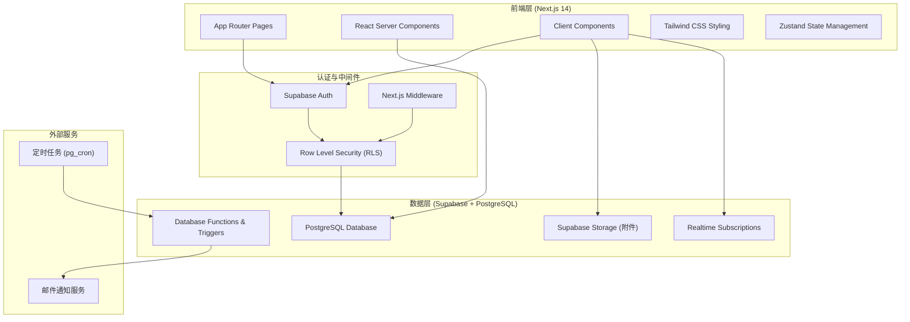
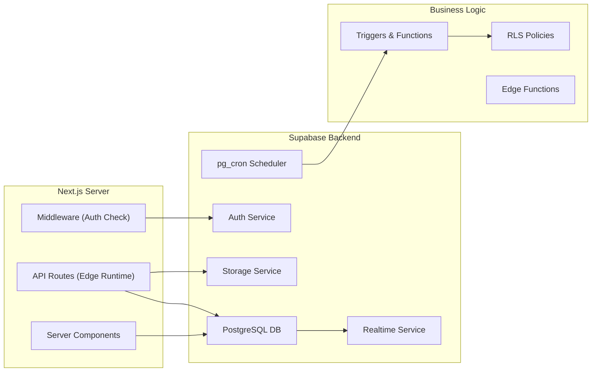
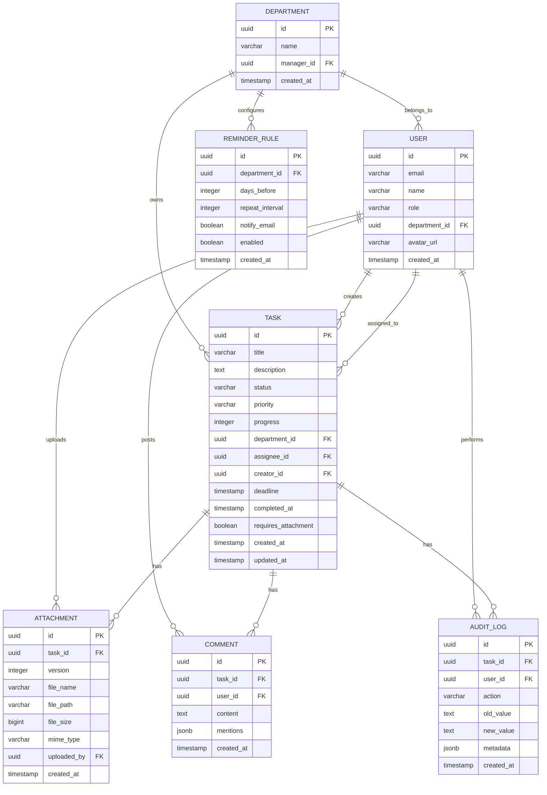

## 1. 架构设计



## 2. 技术描述

### 2.1 技术栈选型

- **前端框架**：Next.js 14 (App Router) + React 18 + TypeScript
- **样式方案**：Tailwind CSS 3.4
- **状态管理**：Zustand 4.5
- **UI 组件**：Radix UI + Lucide React Icons
- **图表库**：Recharts 2.12
- **后端服务**：Supabase (PostgreSQL 15 + Auth + Storage + Edge Functions)
- **数据库**：PostgreSQL 15 (支持 JSONB、触发器、行级安全)
- **文件存储**：Supabase Storage
- **实时通信**：Supabase Realtime
- **定时任务**：pg_cron (PostgreSQL 扩展)
- **开发工具**：ESLint + Prettier + Husky

### 2.2 核心技术决策

1. **Next.js App Router**：利用 Server Components 减少客户端 JS，提升首屏性能
2. **Supabase Row Level Security**：在数据库层面实现权限控制，确保数据安全
3. **Database Triggers**：自动记录操作日志，无需应用层干预
4. **Realtime Subscriptions**：实现评论和状态更新的实时推送
5. **pg_cron**：数据库层面实现定时催办任务检测

## 3. 路由定义

| 路由路径 | 页面用途 | 权限要求 |
|----------|----------|----------|
| `/login` | 用户登录页 | 公开 |
| `/` | 看板首页（事项四象限） | 已认证用户 |
| `/tasks/[id]` | 事项详情页 | 已认证用户 |
| `/statistics` | 统计分析页 | 部门主管/管理员 |
| `/admin` | 后台配置首页 | 管理员 |
| `/admin/users` | 用户管理 | 管理员 |
| `/admin/departments` | 部门管理 | 管理员 |
| `/admin/rules` | 催办规则配置 | 部门主管/管理员 |

## 4. API 与类型定义

### 4.1 核心数据类型

```typescript
// 用户
interface User {
  id: string;
  email: string;
  name: string;
  role: 'admin' | 'manager' | 'user';
  department_id: string;
  avatar_url?: string;
  created_at: string;
}

// 部门
interface Department {
  id: string;
  name: string;
  manager_id?: string;
  created_at: string;
}

// 事项主记录
interface Task {
  id: string;
  title: string;
  description: string;
  status: 'todo' | 'in_progress' | 'completed' | 'overdue';
  priority: 'low' | 'medium' | 'high' | 'urgent';
  progress: number; // 0-100
  department_id: string;
  assignee_id?: string;
  creator_id: string;
  deadline: string;
  completed_at?: string;
  requires_attachment: boolean;
  created_at: string;
  updated_at: string;
}

// 附件版本
interface Attachment {
  id: string;
  task_id: string;
  version: number;
  file_name: string;
  file_path: string;
  file_size: number;
  mime_type: string;
  uploaded_by: string;
  created_at: string;
}

// 评论
interface Comment {
  id: string;
  task_id: string;
  user_id: string;
  content: string;
  mentions: string[]; // user ids
  created_at: string;
}

// 操作日志
interface AuditLog {
  id: string;
  task_id: string;
  user_id: string;
  action: string; // 'create' | 'update_status' | 'update_progress' | 'upload_attachment' | 'delete_attachment' | 'comment' | 'missing_attachment'
  old_value?: string;
  new_value?: string;
  metadata?: Record<string, unknown>;
  created_at: string;
}

// 催办规则
interface ReminderRule {
  id: string;
  department_id?: string; // null 为全局规则
  days_before: number;
  repeat_interval: number; // 小时
  notify_email: boolean;
  enabled: boolean;
  created_at: string;
}
```

### 4.2 核心 API 端点

```typescript
// 事项相关
GET    /api/tasks?status=&department=&assignee=  // 获取事项列表
POST   /api/tasks                                // 创建事项
GET    /api/tasks/[id]                           // 获取事项详情
PATCH  /api/tasks/[id]                           // 更新事项
POST   /api/tasks/[id]/claim                     // 认领事项
POST   /api/tasks/[id]/progress                  // 更新进度

// 附件相关
GET    /api/tasks/[id]/attachments               // 获取附件列表
POST   /api/tasks/[id]/attachments               // 上传附件
DELETE /api/attachments/[id]                     // 删除附件（记录日志）

// 评论相关
GET    /api/tasks/[id]/comments                  // 获取评论列表
POST   /api/tasks/[id]/comments                  // 发表评论

// 统计相关
GET    /api/statistics/closure-rate              // 部门闭环率
GET    /api/statistics/overdue                   // 延期事项列表
GET    /api/statistics/trend                     // 趋势数据

// 管理相关
GET    /api/admin/users                          // 用户列表
POST   /api/admin/users                          // 创建用户
PATCH  /api/admin/users/[id]                     // 更新用户
GET    /api/admin/rules                          // 催办规则列表
PATCH  /api/admin/rules/[id]                     // 更新催办规则
```

## 5. 服务器架构



## 6. 数据模型

### 6.1 ER 图



### 6.2 DDL 语句

```sql
-- 启用扩展
CREATE EXTENSION IF NOT EXISTS "uuid-ossp";
CREATE EXTENSION IF NOT EXISTS "pg_cron";

-- 部门表
CREATE TABLE departments (
    id UUID PRIMARY KEY DEFAULT uuid_generate_v4(),
    name VARCHAR(100) NOT NULL,
    manager_id UUID,
    created_at TIMESTAMPTZ DEFAULT NOW()
);

-- 用户表（关联 Supabase auth.users）
CREATE TABLE users (
    id UUID PRIMARY KEY REFERENCES auth.users(id),
    email VARCHAR(255) UNIQUE NOT NULL,
    name VARCHAR(100) NOT NULL,
    role VARCHAR(20) NOT NULL DEFAULT 'user',
    department_id UUID REFERENCES departments(id),
    avatar_url VARCHAR(255),
    created_at TIMESTAMPTZ DEFAULT NOW()
);

-- 事项主表
CREATE TABLE tasks (
    id UUID PRIMARY KEY DEFAULT uuid_generate_v4(),
    title VARCHAR(255) NOT NULL,
    description TEXT,
    status VARCHAR(20) NOT NULL DEFAULT 'todo',
    priority VARCHAR(20) NOT NULL DEFAULT 'medium',
    progress INTEGER NOT NULL DEFAULT 0,
    department_id UUID NOT NULL REFERENCES departments(id),
    assignee_id UUID REFERENCES users(id),
    creator_id UUID NOT NULL REFERENCES users(id),
    deadline TIMESTAMPTZ NOT NULL,
    completed_at TIMESTAMPTZ,
    requires_attachment BOOLEAN NOT NULL DEFAULT false,
    created_at TIMESTAMPTZ DEFAULT NOW(),
    updated_at TIMESTAMPTZ DEFAULT NOW()
);

-- 附件表
CREATE TABLE attachments (
    id UUID PRIMARY KEY DEFAULT uuid_generate_v4(),
    task_id UUID NOT NULL REFERENCES tasks(id) ON DELETE CASCADE,
    version INTEGER NOT NULL DEFAULT 1,
    file_name VARCHAR(255) NOT NULL,
    file_path VARCHAR(500) NOT NULL,
    file_size BIGINT NOT NULL,
    mime_type VARCHAR(100),
    uploaded_by UUID NOT NULL REFERENCES users(id),
    created_at TIMESTAMPTZ DEFAULT NOW()
);

-- 评论表
CREATE TABLE comments (
    id UUID PRIMARY KEY DEFAULT uuid_generate_v4(),
    task_id UUID NOT NULL REFERENCES tasks(id) ON DELETE CASCADE,
    user_id UUID NOT NULL REFERENCES users(id),
    content TEXT NOT NULL,
    mentions JSONB DEFAULT '[]'::jsonb,
    created_at TIMESTAMPTZ DEFAULT NOW()
);

-- 审计日志表
CREATE TABLE audit_logs (
    id UUID PRIMARY KEY DEFAULT uuid_generate_v4(),
    task_id UUID NOT NULL REFERENCES tasks(id) ON DELETE CASCADE,
    user_id UUID NOT NULL REFERENCES users(id),
    action VARCHAR(50) NOT NULL,
    old_value TEXT,
    new_value TEXT,
    metadata JSONB,
    created_at TIMESTAMPTZ DEFAULT NOW()
);

-- 催办规则表
CREATE TABLE reminder_rules (
    id UUID PRIMARY KEY DEFAULT uuid_generate_v4(),
    department_id UUID REFERENCES departments(id),
    days_before INTEGER NOT NULL DEFAULT 3,
    repeat_interval INTEGER NOT NULL DEFAULT 24,
    notify_email BOOLEAN NOT NULL DEFAULT true,
    enabled BOOLEAN NOT NULL DEFAULT true,
    created_at TIMESTAMPTZ DEFAULT NOW()
);

-- 索引
CREATE INDEX idx_tasks_status ON tasks(status);
CREATE INDEX idx_tasks_department ON tasks(department_id);
CREATE INDEX idx_tasks_assignee ON tasks(assignee_id);
CREATE INDEX idx_tasks_deadline ON tasks(deadline);
CREATE INDEX idx_attachments_task ON attachments(task_id);
CREATE INDEX idx_comments_task ON comments(task_id);
CREATE INDEX idx_audit_logs_task ON audit_logs(task_id);
CREATE INDEX idx_audit_logs_action ON audit_logs(action);

-- 自动更新 updated_at 的触发器函数
CREATE OR REPLACE FUNCTION update_updated_at()
RETURNS TRIGGER AS $$
BEGIN
    NEW.updated_at = NOW();
    RETURN NEW;
END;
$$ LANGUAGE plpgsql;

CREATE TRIGGER trigger_tasks_updated_at
    BEFORE UPDATE ON tasks
    FOR EACH ROW
    EXECUTE FUNCTION update_updated_at();

-- 操作日志触发器函数
CREATE OR REPLACE FUNCTION log_task_change()
RETURNS TRIGGER AS $$
BEGIN
    IF TG_OP = 'INSERT' THEN
        INSERT INTO audit_logs (task_id, user_id, action, new_value, metadata)
        VALUES (NEW.id, NEW.creator_id, 'create', NEW.status, 
                jsonb_build_object('title', NEW.title));
    ELSIF TG_OP = 'UPDATE' THEN
        IF OLD.status != NEW.status THEN
            INSERT INTO audit_logs (task_id, user_id, action, old_value, new_value)
            VALUES (NEW.id, auth.uid(), 'update_status', OLD.status, NEW.status);
        END IF;
        IF OLD.progress != NEW.progress THEN
            INSERT INTO audit_logs (task_id, user_id, action, old_value, new_value)
            VALUES (NEW.id, auth.uid(), 'update_progress', 
                    OLD.progress::text, NEW.progress::text);
        END IF;
        -- 检查附件缺失情况
        IF NEW.status = 'completed' AND NEW.requires_attachment THEN
            IF NOT EXISTS (SELECT 1 FROM attachments WHERE task_id = NEW.id) THEN
                INSERT INTO audit_logs (task_id, user_id, action, metadata)
                VALUES (NEW.id, auth.uid(), 'missing_attachment',
                        jsonb_build_object('warning', '标记完成但未上传附件'));
            END IF;
        END IF;
    END IF;
    RETURN NEW;
END;
$$ LANGUAGE plpgsql SECURITY DEFINER;

CREATE TRIGGER trigger_task_audit
    AFTER INSERT OR UPDATE ON tasks
    FOR EACH ROW
    EXECUTE FUNCTION log_task_change();

-- 附件上传日志触发器
CREATE OR REPLACE FUNCTION log_attachment_change()
RETURNS TRIGGER AS $$
BEGIN
    IF TG_OP = 'INSERT' THEN
        INSERT INTO audit_logs (task_id, user_id, action, new_value, metadata)
        VALUES (NEW.task_id, NEW.uploaded_by, 'upload_attachment', NEW.file_name,
                jsonb_build_object('version', NEW.version, 'size', NEW.file_size));
    ELSIF TG_OP = 'DELETE' THEN
        INSERT INTO audit_logs (task_id, user_id, action, old_value, metadata)
        VALUES (OLD.task_id, auth.uid(), 'delete_attachment', OLD.file_name,
                jsonb_build_object('version', OLD.version));
    END IF;
    RETURN NEW;
END;
$$ LANGUAGE plpgsql SECURITY DEFINER;

CREATE TRIGGER trigger_attachment_audit
    AFTER INSERT OR DELETE ON attachments
    FOR EACH ROW
    EXECUTE FUNCTION log_attachment_change();

-- 评论日志触发器
CREATE OR REPLACE FUNCTION log_comment()
RETURNS TRIGGER AS $$
BEGIN
    INSERT INTO audit_logs (task_id, user_id, action, new_value)
    VALUES (NEW.task_id, NEW.user_id, 'comment', substring(NEW.content from 1 for 100));
    RETURN NEW;
END;
$$ LANGUAGE plpgsql SECURITY DEFINER;

CREATE TRIGGER trigger_comment_audit
    AFTER INSERT ON comments
    FOR EACH ROW
    EXECUTE FUNCTION log_comment();

-- 自动检查并更新延期状态的函数
CREATE OR REPLACE FUNCTION update_overdue_tasks()
RETURNS void AS $$
BEGIN
    UPDATE tasks
    SET status = 'overdue'
    WHERE status IN ('todo', 'in_progress')
      AND deadline < NOW()
      AND status != 'completed';
END;
$$ LANGUAGE plpgsql;

-- 每天凌晨 1 点运行延期检查
SELECT cron.schedule('check-overdue-tasks', '0 1 * * *', 'SELECT update_overdue_tasks();');

-- 催办邮件发送函数
CREATE OR REPLACE FUNCTION send_reminders()
RETURNS void AS $$
DECLARE
    rule RECORD;
    task RECORD;
BEGIN
    FOR rule IN SELECT * FROM reminder_rules WHERE enabled LOOP
        FOR task IN 
            SELECT t.*, u.email as assignee_email, u.name as assignee_name
            FROM tasks t
            JOIN users u ON t.assignee_id = u.id
            WHERE t.status IN ('todo', 'in_progress')
              AND t.deadline > NOW()
              AND t.deadline < NOW() + (rule.days_before || ' days')::interval
        LOOP
            -- 这里会调用 Edge Function 发送邮件
            PERFORM net.http_post(
                url := 'https://your-project.supabase.co/functions/v1/send-email',
                headers := '{"Content-Type": "application/json"}'::jsonb,
                body := jsonb_build_object(
                    'to', task.assignee_email,
                    'subject', '【催办】事项 "' || task.title || '" 即将到期',
                    'body', '您好 ' || task.assignee_name || '，您负责的事项 "' || task.title || '" 将在 ' || rule.days_before || ' 天后截止，请及时处理。'
                )
            );
        END LOOP;
    END LOOP;
END;
$$ LANGUAGE plpgsql;

-- 每天早上 9 点发送催办提醒
SELECT cron.schedule('send-reminders', '0 9 * * *', 'SELECT send_reminders();');

-- RLS 策略
ALTER TABLE users ENABLE ROW LEVEL SECURITY;
ALTER TABLE tasks ENABLE ROW LEVEL SECURITY;
ALTER TABLE attachments ENABLE ROW LEVEL SECURITY;
ALTER TABLE comments ENABLE ROW LEVEL SECURITY;
ALTER TABLE audit_logs ENABLE ROW LEVEL SECURITY;
ALTER TABLE departments ENABLE ROW LEVEL SECURITY;
ALTER TABLE reminder_rules ENABLE ROW LEVEL SECURITY;

-- 用户可以查看自己的信息
CREATE POLICY "Users view own profile" ON users
    FOR SELECT USING (id = auth.uid());

-- 管理员可以查看所有用户
CREATE POLICY "Admin view all users" ON users
    FOR SELECT USING (
        EXISTS (
            SELECT 1 FROM users 
            WHERE id = auth.uid() AND role = 'admin'
        )
    );

-- 事项权限：同部门可看，责任人可编辑
CREATE POLICY "View tasks in same department" ON tasks
    FOR SELECT USING (
        (SELECT department_id FROM users WHERE id = auth.uid()) = department_id
        OR EXISTS (SELECT 1 FROM users WHERE id = auth.uid() AND role = 'admin')
    );

CREATE POLICY "Edit assigned tasks" ON tasks
    FOR UPDATE USING (
        assignee_id = auth.uid()
        OR creator_id = auth.uid()
        OR EXISTS (SELECT 1 FROM users WHERE id = auth.uid() AND role = 'admin')
        OR EXISTS (
            SELECT 1 FROM users u
            JOIN departments d ON u.department_id = d.id
            WHERE u.id = auth.uid() 
              AND u.role = 'manager' 
              AND d.id = tasks.department_id
        )
    );

CREATE POLICY "Create tasks" ON tasks
    FOR INSERT WITH CHECK (
        creator_id = auth.uid()
        OR EXISTS (SELECT 1 FROM users WHERE id = auth.uid() AND role = 'admin')
    );

-- 附件权限
CREATE POLICY "View attachments" ON attachments
    FOR SELECT USING (
        EXISTS (
            SELECT 1 FROM tasks t
            WHERE t.id = attachments.task_id
              AND (
                t.department_id = (SELECT department_id FROM users WHERE id = auth.uid())
                OR EXISTS (SELECT 1 FROM users WHERE id = auth.uid() AND role = 'admin')
              )
        )
    );

CREATE POLICY "Upload attachments" ON attachments
    FOR INSERT WITH CHECK (
        uploaded_by = auth.uid()
    );

-- 评论权限
CREATE POLICY "View comments" ON comments
    FOR SELECT USING (
        EXISTS (
            SELECT 1 FROM tasks t
            WHERE t.id = comments.task_id
              AND (
                t.department_id = (SELECT department_id FROM users WHERE id = auth.uid())
                OR EXISTS (SELECT 1 FROM users WHERE id = auth.uid() AND role = 'admin')
              )
        )
    );

CREATE POLICY "Create comments" ON comments
    FOR INSERT WITH CHECK (
        user_id = auth.uid()
    );

-- 审计日志：仅管理员可查看
CREATE POLICY "Admin view audit logs" ON audit_logs
    FOR SELECT USING (
        EXISTS (
            SELECT 1 FROM users 
            WHERE id = auth.uid() AND role = 'admin'
        )
    );

-- 部门和催办规则：管理员和部门主管可管理
CREATE POLICY "View departments" ON departments
    FOR SELECT TO authenticated;

CREATE POLICY "Manage reminder rules" ON reminder_rules
    FOR ALL USING (
        EXISTS (SELECT 1 FROM users WHERE id = auth.uid() AND role = 'admin')
        OR (
            EXISTS (
                SELECT 1 FROM users u
                WHERE u.id = auth.uid() 
                  AND u.role = 'manager'
                  AND u.department_id = reminder_rules.department_id
            )
        )
    );
```
