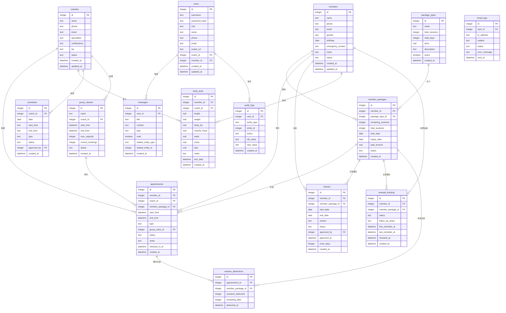

## 1. 架构设计

```mermaid
graph TB
    "React 前端" --> "Express REST API"
    "Express REST API" --> "SQLite 数据库"
    "Express REST API" --> "Redis 消息队列"
    "Express REST API" --> "本地文件存储(附件)"
    "Express REST API" --> "邮件服务(Nodemailer)"
    "Redis 消息队列" --> "通知消费者"
    "通知消费者" --> "站内消息写入"
    "通知消费者" --> "邮件发送"
```

## 2. 技术说明

- 前端：React@18 + TypeScript + TailwindCSS@3 + Vite + Zustand + React Router
- 初始化工具：vite-init (react-express-ts 模板)
- 后端：Express@4 + TypeScript (ESM)
- 数据库：SQLite (better-sqlite3) + Drizzle ORM
- 消息队列：Redis (ioredis) + BullMQ
- 对象存储：本地文件存储 (multer)，预留 S3 接口
- 邮件：Nodemailer (SMTP)
- 认证：JWT (jsonwebtoken)
- 日志：Winston
- 测试：Vitest

## 3. 路由定义

| 路由 | 用途 |
|------|------|
| /login | 登录页 |
| /dashboard | 工作台首页（角色定制） |
| /members | 会员列表 |
| /members/:id | 会员详情 |
| /coaches | 教练列表 |
| /coaches/:id | 教练详情/业绩 |
| /packages | 课包管理 |
| /group-classes | 团课管理 |
| /appointments | 预约排班 |
| /freeze | 请假冻结 |
| /body-tests | 体测记录 |
| /messages | 消息中心 |
| /renewal-funnel | 续费漏斗 |
| /audit-log | 操作审计 |

## 4. API 定义

### 4.1 认证

```
POST   /api/auth/login          # 登录
POST   /api/auth/logout         # 登出
GET    /api/auth/me             # 当前用户信息
```

### 4.2 会员

```
GET    /api/members             # 会员列表（分页/搜索/筛选）
POST   /api/members             # 创建会员
GET    /api/members/:id         # 会员详情
PUT    /api/members/:id         # 更新会员
DELETE /api/members/:id         # 删除会员
```

### 4.3 教练

```
GET    /api/coaches             # 教练列表
POST   /api/coaches             # 创建教练
GET    /api/coaches/:id         # 教练详情
PUT    /api/coaches/:id         # 更新教练
GET    /api/coaches/:id/performance  # 教练业绩（仅本人可查收入）
GET    /api/coaches/:id/schedule     # 教练排班
POST   /api/coaches/:id/schedule     # 提交排班申请
```

### 4.4 课包

```
GET    /api/packages            # 课包类型列表
POST   /api/packages            # 创建课包类型
PUT    /api/packages/:id        # 更新课包类型
DELETE /api/packages/:id        # 停用课包类型
POST   /api/members/:id/purchase-package  # 会员购买课包
GET    /api/members/:id/packages           # 会员课包列表
```

### 4.5 团课

```
GET    /api/group-classes       # 团课列表
POST   /api/group-classes       # 创建团课
PUT    /api/group-classes/:id   # 更新团课
DELETE /api/group-classes/:id   # 取消团课
POST   /api/group-classes/:id/book    # 预约团课
DELETE /api/group-classes/:id/book    # 取消预约
```

### 4.6 预约

```
GET    /api/appointments        # 预约列表
POST   /api/appointments        # 创建预约（含冻结/余额/冲突校验）
PUT    /api/appointments/:id    # 更新预约
DELETE /api/appointments/:id    # 取消预约
POST   /api/appointments/:id/checkin  # 签到（扣减课时）
```

### 4.7 请假冻结

```
GET    /api/freezes             # 冻结列表
POST   /api/freezes             # 申请冻结
PUT    /api/freezes/:id/approve # 审核冻结
GET    /api/members/:id/freezes # 会员冻结记录
```

### 4.8 体测

```
GET    /api/body-tests          # 体测列表
POST   /api/body-tests          # 录入体测
GET    /api/members/:id/body-tests  # 会员体测历史
```

### 4.9 消息

```
GET    /api/messages            # 消息列表（分页/已读筛选）
PUT    /api/messages/:id/read   # 标记已读
POST   /api/messages/send       # 发送消息
```

### 4.10 续费漏斗

```
GET    /api/renewal-funnel      # 续费漏斗数据
GET    /api/renewal-funnel/expiring  # 即将到期列表
PUT    /api/renewal-funnel/:id/follow-up  # 跟进标记
```

### 4.11 操作审计

```
GET    /api/audit-logs          # 审计日志（按实体/操作人/时间筛选）
```

### 4.12 文件上传

```
POST   /api/upload              # 上传附件
GET    /api/upload/:filename    # 下载附件
```

## 5. 服务端架构图

```mermaid
graph LR
    "Router/Controller" --> "Service Layer"
    "Service Layer" --> "Repository/ORM"
    "Repository/ORM" --> "SQLite"
    "Service Layer" --> "BullMQ Queue"
    "BullMQ Queue" --> "Notification Worker"
    "Notification Worker" --> "站内消息/邮件"
    "Service Layer" --> "Audit Logger"
    "Audit Logger" --> "audit_logs 表"
    "Middleware" --> "JWT 鉴权"
    "Middleware" --> "角色权限校验"
    "Middleware" --> "请求日志"
```

## 6. 数据模型

### 6.1 数据模型定义



### 6.2 数据定义语言（DDL）

```sql
CREATE TABLE users (
    id INTEGER PRIMARY KEY AUTOINCREMENT,
    username TEXT NOT NULL UNIQUE,
    password_hash TEXT NOT NULL,
    role TEXT NOT NULL CHECK(role IN ('admin', 'coach', 'receptionist', 'member')),
    name TEXT NOT NULL,
    phone TEXT,
    email TEXT,
    avatar_url TEXT,
    coach_id INTEGER REFERENCES coaches(id),
    member_id INTEGER REFERENCES members(id),
    created_at DATETIME DEFAULT CURRENT_TIMESTAMP,
    updated_at DATETIME DEFAULT CURRENT_TIMESTAMP
);

CREATE TABLE members (
    id INTEGER PRIMARY KEY AUTOINCREMENT,
    name TEXT NOT NULL,
    phone TEXT NOT NULL,
    email TEXT,
    gender TEXT CHECK(gender IN ('M', 'F', 'Other')),
    birthday DATE,
    emergency_contact TEXT,
    notes TEXT,
    status TEXT NOT NULL DEFAULT 'active' CHECK(status IN ('active', 'frozen', 'expired', 'cancelled')),
    created_at DATETIME DEFAULT CURRENT_TIMESTAMP,
    updated_at DATETIME DEFAULT CURRENT_TIMESTAMP
);

CREATE TABLE coaches (
    id INTEGER PRIMARY KEY AUTOINCREMENT,
    name TEXT NOT NULL,
    phone TEXT NOT NULL,
    email TEXT,
    specialties TEXT,
    certifications TEXT,
    bio TEXT,
    status TEXT NOT NULL DEFAULT 'active' CHECK(status IN ('active', 'inactive')),
    created_at DATETIME DEFAULT CURRENT_TIMESTAMP,
    updated_at DATETIME DEFAULT CURRENT_TIMESTAMP
);

CREATE TABLE package_types (
    id INTEGER PRIMARY KEY AUTOINCREMENT,
    name TEXT NOT NULL,
    total_sessions INTEGER NOT NULL,
    valid_days INTEGER NOT NULL,
    price REAL NOT NULL,
    description TEXT,
    active BOOLEAN DEFAULT 1,
    created_at DATETIME DEFAULT CURRENT_TIMESTAMP
);

CREATE TABLE member_packages (
    id INTEGER PRIMARY KEY AUTOINCREMENT,
    member_id INTEGER NOT NULL REFERENCES members(id),
    package_type_id INTEGER NOT NULL REFERENCES package_types(id),
    remaining_sessions INTEGER NOT NULL,
    total_sessions INTEGER NOT NULL,
    start_date DATE NOT NULL,
    expiry_date DATE NOT NULL,
    paid_amount REAL NOT NULL,
    status TEXT NOT NULL DEFAULT 'active' CHECK(status IN ('active', 'frozen', 'expired', 'exhausted', 'cancelled')),
    created_at DATETIME DEFAULT CURRENT_TIMESTAMP
);

CREATE TABLE group_classes (
    id INTEGER PRIMARY KEY AUTOINCREMENT,
    name TEXT NOT NULL,
    coach_id INTEGER NOT NULL REFERENCES coaches(id),
    start_time DATETIME NOT NULL,
    end_time DATETIME NOT NULL,
    max_capacity INTEGER NOT NULL DEFAULT 20,
    current_bookings INTEGER NOT NULL DEFAULT 0,
    status TEXT NOT NULL DEFAULT 'scheduled' CHECK(status IN ('scheduled', 'cancelled', 'completed')),
    created_at DATETIME DEFAULT CURRENT_TIMESTAMP
);

CREATE TABLE appointments (
    id INTEGER PRIMARY KEY AUTOINCREMENT,
    member_id INTEGER NOT NULL REFERENCES members(id),
    coach_id INTEGER NOT NULL REFERENCES coaches(id),
    member_package_id INTEGER REFERENCES member_packages(id),
    start_time DATETIME NOT NULL,
    end_time DATETIME NOT NULL,
    type TEXT NOT NULL CHECK(type IN ('private', 'group')),
    group_class_id INTEGER REFERENCES group_classes(id),
    status TEXT NOT NULL DEFAULT 'booked' CHECK(status IN ('booked', 'checked_in', 'cancelled', 'no_show')),
    notes TEXT,
    checked_in_at DATETIME,
    created_at DATETIME DEFAULT CURRENT_TIMESTAMP
);

CREATE TABLE freezes (
    id INTEGER PRIMARY KEY AUTOINCREMENT,
    member_id INTEGER NOT NULL REFERENCES members(id),
    member_package_id INTEGER REFERENCES member_packages(id),
    start_date DATE NOT NULL,
    end_date DATE NOT NULL,
    reason TEXT,
    status TEXT NOT NULL DEFAULT 'pending' CHECK(status IN ('pending', 'approved', 'rejected', 'completed')),
    approved_by INTEGER REFERENCES users(id),
    approved_at DATETIME,
    extra_days INTEGER DEFAULT 0,
    created_at DATETIME DEFAULT CURRENT_TIMESTAMP
);

CREATE TABLE body_tests (
    id INTEGER PRIMARY KEY AUTOINCREMENT,
    member_id INTEGER NOT NULL REFERENCES members(id),
    coach_id INTEGER NOT NULL REFERENCES coaches(id),
    height REAL,
    weight REAL,
    body_fat REAL,
    muscle_mass REAL,
    waist REAL,
    chest REAL,
    hips REAL,
    notes TEXT,
    test_date DATETIME NOT NULL,
    created_at DATETIME DEFAULT CURRENT_TIMESTAMP
);

CREATE TABLE messages (
    id INTEGER PRIMARY KEY AUTOINCREMENT,
    user_id INTEGER NOT NULL REFERENCES users(id),
    title TEXT NOT NULL,
    content TEXT NOT NULL,
    type TEXT NOT NULL CHECK(type IN ('system', 'reminder', 'approval', 'notification')),
    read BOOLEAN DEFAULT 0,
    related_entity_type TEXT,
    related_entity_id INTEGER,
    created_at DATETIME DEFAULT CURRENT_TIMESTAMP
);

CREATE TABLE email_logs (
    id INTEGER PRIMARY KEY AUTOINCREMENT,
    user_id INTEGER REFERENCES users(id),
    to_address TEXT NOT NULL,
    subject TEXT NOT NULL,
    status TEXT NOT NULL CHECK(status IN ('sent', 'failed')),
    error_message TEXT,
    sent_at DATETIME DEFAULT CURRENT_TIMESTAMP
);

CREATE TABLE schedules (
    id INTEGER PRIMARY KEY AUTOINCREMENT,
    coach_id INTEGER NOT NULL REFERENCES coaches(id),
    date DATE NOT NULL,
    start_time TEXT NOT NULL,
    end_time TEXT NOT NULL,
    type TEXT NOT NULL CHECK(type IN ('private', 'group', 'rest', 'leave')),
    status TEXT NOT NULL DEFAULT 'pending' CHECK(status IN ('pending', 'approved', 'rejected')),
    approved_by INTEGER REFERENCES users(id),
    created_at DATETIME DEFAULT CURRENT_TIMESTAMP
);

CREATE TABLE audit_logs (
    id INTEGER PRIMARY KEY AUTOINCREMENT,
    user_id INTEGER REFERENCES users(id),
    entity_type TEXT NOT NULL,
    entity_id INTEGER NOT NULL,
    action TEXT NOT NULL,
    old_value TEXT,
    new_value TEXT,
    created_at DATETIME DEFAULT CURRENT_TIMESTAMP
);

CREATE TABLE session_deductions (
    id INTEGER PRIMARY KEY AUTOINCREMENT,
    appointment_id INTEGER NOT NULL REFERENCES appointments(id),
    member_package_id INTEGER NOT NULL REFERENCES member_packages(id),
    sessions_deducted INTEGER NOT NULL DEFAULT 1,
    remaining_after INTEGER NOT NULL,
    deducted_at DATETIME DEFAULT CURRENT_TIMESTAMP
);

CREATE TABLE renewal_tracking (
    id INTEGER PRIMARY KEY AUTOINCREMENT,
    member_id INTEGER NOT NULL REFERENCES members(id),
    member_package_id INTEGER NOT NULL REFERENCES member_packages(id),
    status TEXT NOT NULL DEFAULT 'expiring' CHECK(status IN ('expiring', 'expired', 'renewed', 'lost')),
    follow_up_notes TEXT,
    first_reminder_at DATETIME,
    last_reminder_at DATETIME,
    renewed_at DATETIME,
    created_at DATETIME DEFAULT CURRENT_TIMESTAMP
);

CREATE INDEX idx_members_status ON members(status);
CREATE INDEX idx_members_phone ON members(phone);
CREATE INDEX idx_appointments_member ON appointments(member_id);
CREATE INDEX idx_appointments_coach ON appointments(coach_id);
CREATE INDEX idx_appointments_status ON appointments(status);
CREATE INDEX idx_appointments_start ON appointments(start_time);
CREATE INDEX idx_member_packages_member ON member_packages(member_id);
CREATE INDEX idx_member_packages_status ON member_packages(status);
CREATE INDEX idx_freezes_member ON freezes(member_id);
CREATE INDEX idx_freezes_status ON freezes(status);
CREATE INDEX idx_messages_user ON messages(user_id, read);
CREATE INDEX idx_audit_logs_entity ON audit_logs(entity_type, entity_id);
CREATE INDEX idx_audit_logs_user ON audit_logs(user_id);
CREATE INDEX idx_schedules_coach_date ON schedules(coach_id, date);
CREATE INDEX idx_body_tests_member ON body_tests(member_id);
CREATE INDEX idx_renewal_tracking_status ON renewal_tracking(status);
CREATE INDEX idx_session_deductions_package ON session_deductions(member_package_id);

-- 测试账号初始数据
INSERT INTO coaches (id, name, phone, email, specialties, certifications, bio, status) VALUES
(1, '张教练', '13800000001', 'coach1@fit.com', '增肌,减脂', 'NSCA-CPT', '10年健身经验', 'active'),
(2, '李教练', '13800000002', 'coach2@fit.com', '瑜伽,普拉提', 'ACE-CPT', '瑜伽高级导师', 'active'),
(3, '王教练', '13800000003', 'coach3@fit.com', '拳击,体能', 'NASM-CPT', '拳击专项教练', 'active');

INSERT INTO members (id, name, phone, email, gender, birthday, status) VALUES
(1, '赵会员', '13900000001', 'member1@fit.com', 'M', '1990-05-15', 'active'),
(2, '钱会员', '13900000002', 'member2@fit.com', 'F', '1995-08-20', 'active'),
(3, '孙会员', '13900000003', 'member3@fit.com', 'M', '1988-03-10', 'frozen'),
(4, '周会员', '13900000004', 'member4@fit.com', 'F', '2000-11-25', 'active');

INSERT INTO users (id, username, password_hash, role, name, phone, email, coach_id, member_id) VALUES
(1, 'admin', '$2b$10$dummyhashadmin', 'admin', '系统管理员', '13700000000', 'admin@fit.com', NULL, NULL),
(2, 'coach1', '$2b$10$dummyhashcoach1', 'coach', '张教练', '13800000001', 'coach1@fit.com', 1, NULL),
(3, 'coach2', '$2b$10$dummyhashcoach2', 'coach', '李教练', '13800000002', 'coach2@fit.com', 2, NULL),
(4, 'receptionist1', '$2b$10$dummyhashrecep', 'receptionist', '前台小刘', '13600000001', 'reception@fit.com', NULL, NULL),
(5, 'member1', '$2b$10$dummyhashmember1', 'member', '赵会员', '13900000001', 'member1@fit.com', NULL, 1);

INSERT INTO package_types (id, name, total_sessions, valid_days, price, description, active) VALUES
(1, '私教10次卡', 10, 90, 3000.00, '10次私教课，有效期90天', 1),
(2, '私教20次卡', 20, 180, 5400.00, '20次私教课，有效期180天', 1),
(3, '私教50次卡', 50, 365, 12000.00, '50次私教课，有效期365天', 1),
(4, '团课月卡', 99, 30, 399.00, '团课不限次月卡', 1);
```
