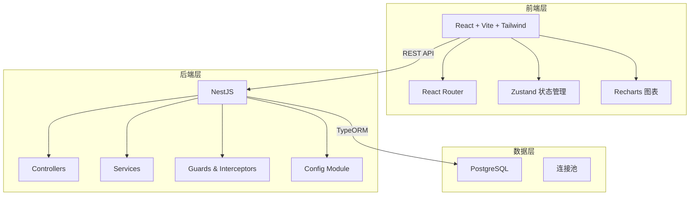
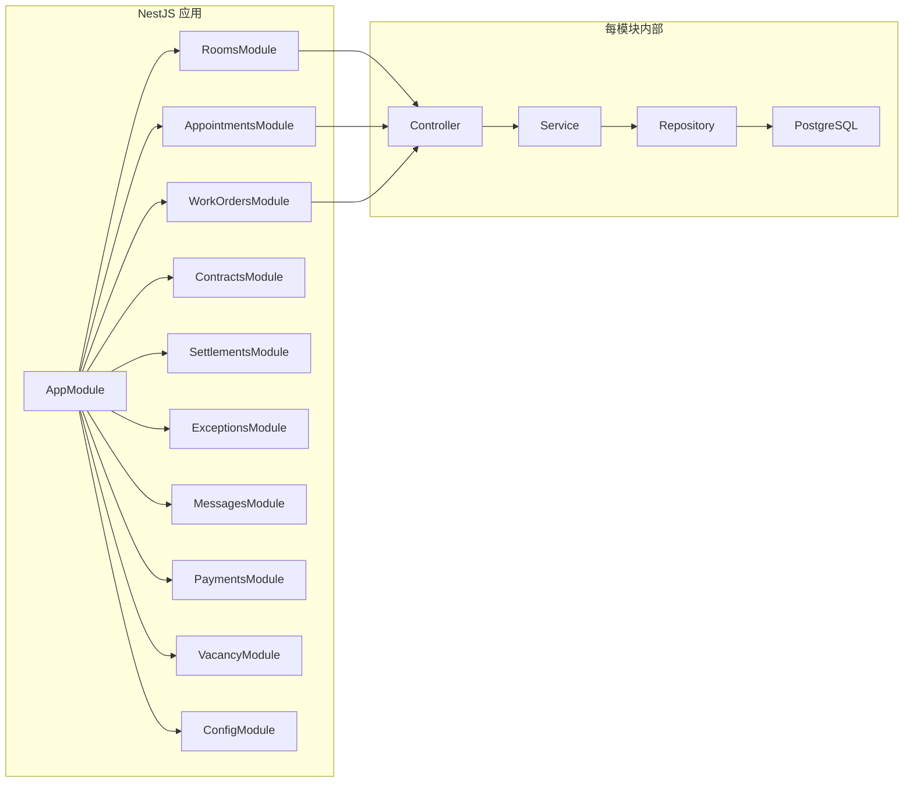
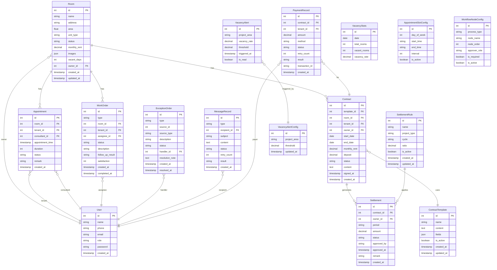

## 1. 架构设计



## 2. 技术说明

- 前端：React@18 + TailwindCSS@3 + Vite + Zustand + Recharts
- 初始化工具：vite-init
- 后端：NestJS + TypeORM
- 数据库：PostgreSQL
- 前端端口：5173，后端端口：3000
- API前缀：`/api/v1`

## 3. 路由定义

| 路由 | 用途 |
|------|------|
| `/` | 工作台首页 |
| `/rooms` | 房源列表 |
| `/rooms/:id` | 房源详情 |
| `/appointments` | 预约看房列表 |
| `/appointments/calendar` | 预约日历 |
| `/work-orders` | 派工单列表 |
| `/work-orders/:id` | 派工详情/回访 |
| `/contracts` | 合同列表 |
| `/contracts/:id` | 合同详情/签署 |
| `/contracts/templates` | 合同模板管理 |
| `/settlements` | 业主结算列表 |
| `/settlements/:id` | 结算详情/审批 |
| `/exceptions` | 异常单列表 |
| `/exceptions/:id` | 异常详情/处理 |
| `/messages` | 消息记录 |
| `/payments` | 支付流水 |
| `/settings` | 配置中心 |
| `/settings/contract-templates` | 合同模板配置 |
| `/settings/settlement-rules` | 结算规则配置 |
| `/settings/appointment-slots` | 预约时段配置 |
| `/settings/workflow-nodes` | 工作流节点配置 |

## 4. API 定义

### 4.1 房源模块
```typescript
interface Room {
  id: number;
  name: string;
  address: string;
  area: number;
  unitType: string;
  status: "vacant" | "rented" | "maintenance" | "reserved";
  monthlyRent: number;
  images: string[];
  vacantDays: number;
  createdAt: string;
  updatedAt: string;
}

// GET /api/v1/rooms?status=vacant&area=xxx&page=1&limit=20
// GET /api/v1/rooms/:id
// POST /api/v1/rooms
// PUT /api/v1/rooms/:id
// GET /api/v1/rooms/vacancy-stats?days=30
```

### 4.2 预约模块
```typescript
interface Appointment {
  id: number;
  roomId: number;
  roomName: string;
  tenantId: number;
  tenantName: string;
  consultantId: number;
  consultantName: string;
  appointmentTime: string;
  duration: number;
  status: "pending" | "confirmed" | "completed" | "cancelled" | "conflict";
  remark: string;
  createdAt: string;
}
// GET /api/v1/appointments?status=pending&date=2026-06-16
// POST /api/v1/appointments
// PUT /api/v1/appointments/:id/status
// GET /api/v1/appointments/calendar?month=2026-06
```

### 4.3 派工模块
```typescript
interface WorkOrder {
  id: number;
  type: "repair" | "clean" | "inspect" | "followup";
  roomId: number;
  roomName: string;
  tenantId: number;
  tenantName: string;
  assigneeId: number;
  assigneeName: string;
  status: "pending" | "in_progress" | "completed" | "closed";
  description: string;
  followUpResult: string;
  satisfaction: number;
  createdAt: string;
  completedAt: string;
}
// GET /api/v1/work-orders?status=pending
// POST /api/v1/work-orders
// PUT /api/v1/work-orders/:id
// POST /api/v1/work-orders/:id/follow-up
```

### 4.4 合同模块
```typescript
interface Contract {
  id: number;
  templateId: number;
  roomId: number;
  roomName: string;
  tenantId: number;
  tenantName: string;
  ownerId: number;
  ownerName: string;
  startDate: string;
  endDate: string;
  monthlyRent: number;
  deposit: number;
  status: "draft" | "owner_signed" | "tenant_signed" | "archived" | "terminated";
  content: string;
  signedAt: string;
  createdAt: string;
}

interface ContractTemplate {
  id: number;
  name: string;
  content: string;
  fields: string[];
  isActive: boolean;
  createdAt: string;
  updatedAt: string;
}
// GET /api/v1/contracts?status=draft
// POST /api/v1/contracts
// PUT /api/v1/contracts/:id/sign
// GET /api/v1/contract-templates
// POST /api/v1/contract-templates
// PUT /api/v1/contract-templates/:id
```

### 4.5 结算模块
```typescript
interface Settlement {
  id: number;
  contractId: number;
  ownerId: number;
  ownerName: string;
  period: string;
  amount: number;
  status: "pending" | "approved" | "rejected" | "paid";
  approvedBy: string;
  approvedAt: string;
  remark: string;
  createdAt: string;
}

interface SettlementRule {
  id: number;
  name: string;
  projectType: string;
  cycle: "monthly" | "quarterly" | "yearly";
  ratio: number;
  isActive: boolean;
  createdAt: string;
  updatedAt: string;
}
// GET /api/v1/settlements?status=pending
// POST /api/v1/settlements
// PUT /api/v1/settlements/:id/approve
// GET /api/v1/settlement-rules
// POST /api/v1/settlement-rules
// PUT /api/v1/settlement-rules/:id
```

### 4.6 异常模块
```typescript
interface ExceptionOrder {
  id: number;
  type: "room_conflict" | "system_error" | "payment_failed" | "message_failed";
  sourceId: number;
  sourceType: "appointment" | "contract" | "payment" | "message";
  description: string;
  status: "open" | "processing" | "resolved";
  handlerId: number;
  handlerName: string;
  resolutionNote: string;
  createdAt: string;
  resolvedAt: string;
}
// GET /api/v1/exceptions?status=open&type=room_conflict
// GET /api/v1/exceptions/:id
// PUT /api/v1/exceptions/:id/resolve
```

### 4.7 消息与支付模块
```typescript
interface MessageRecord {
  id: number;
  type: "sms" | "email" | "push";
  recipientId: number;
  recipientName: string;
  subject: string;
  content: string;
  status: "pending" | "sent" | "failed";
  retryCount: number;
  result: string;
  createdAt: string;
}

interface PaymentRecord {
  id: number;
  contractId: number;
  tenantId: number;
  tenantName: string;
  amount: number;
  method: "alipay" | "wechat" | "bank";
  status: "pending" | "success" | "failed";
  retryCount: number;
  result: string;
  transactionId: string;
  createdAt: string;
}
// GET /api/v1/messages?status=failed
// POST /api/v1/messages/:id/retry
// PUT /api/v1/messages/:id/result
// GET /api/v1/payments?status=failed
// POST /api/v1/payments/:id/retry
// PUT /api/v1/payments/:id/result
```

### 4.8 空置率模块
```typescript
interface VacancyStats {
  date: string;
  totalRooms: number;
  vacantRooms: number;
  vacancyRate: number;
}

interface VacancyAlert {
  id: number;
  projectArea: string;
  vacancyRate: number;
  threshold: number;
  triggeredAt: string;
  isRead: boolean;
}
// GET /api/v1/vacancy/stats?days=30
// GET /api/v1/vacancy/alerts
// PUT /api/v1/vacancy/alerts/:id/read
// GET /api/v1/vacancy/alerts/config
// PUT /api/v1/vacancy/alerts/config
```

### 4.9 配置模块
```typescript
interface AppointmentSlotConfig {
  id: number;
  dayOfWeek: number;
  startTime: string;
  endTime: string;
  interval: number;
  isActive: boolean;
}

interface WorkflowNodeConfig {
  id: number;
  processType: "contract" | "settlement" | "appointment";
  nodeName: string;
  nodeOrder: number;
  approverRole: string;
  isRequired: boolean;
  isActive: boolean;
}
// GET /api/v1/configs/appointment-slots
// POST /api/v1/configs/appointment-slots
// PUT /api/v1/configs/appointment-slots/:id
// GET /api/v1/configs/workflow-nodes
// POST /api/v1/configs/workflow-nodes
// PUT /api/v1/configs/workflow-nodes/:id
```

## 5. 服务端架构图



## 6. 数据模型

### 6.1 数据模型定义



### 6.2 数据定义语言

```sql
CREATE TABLE users (
    id SERIAL PRIMARY KEY,
    name VARCHAR(100) NOT NULL,
    phone VARCHAR(20),
    email VARCHAR(200),
    role VARCHAR(20) NOT NULL DEFAULT 'tenant',
    password VARCHAR(255) NOT NULL,
    created_at TIMESTAMP DEFAULT CURRENT_TIMESTAMP
);

CREATE TABLE rooms (
    id SERIAL PRIMARY KEY,
    name VARCHAR(200) NOT NULL,
    address VARCHAR(500) NOT NULL,
    area DECIMAL(10,2),
    unit_type VARCHAR(50),
    status VARCHAR(20) NOT NULL DEFAULT 'vacant',
    monthly_rent DECIMAL(10,2),
    images JSONB DEFAULT '[]',
    vacant_days INT DEFAULT 0,
    owner_id INT REFERENCES users(id),
    created_at TIMESTAMP DEFAULT CURRENT_TIMESTAMP,
    updated_at TIMESTAMP DEFAULT CURRENT_TIMESTAMP
);

CREATE TABLE appointments (
    id SERIAL PRIMARY KEY,
    room_id INT REFERENCES rooms(id),
    tenant_id INT REFERENCES users(id),
    consultant_id INT REFERENCES users(id),
    appointment_time TIMESTAMP NOT NULL,
    duration INT DEFAULT 60,
    status VARCHAR(20) NOT NULL DEFAULT 'pending',
    remark TEXT,
    created_at TIMESTAMP DEFAULT CURRENT_TIMESTAMP
);

CREATE TABLE work_orders (
    id SERIAL PRIMARY KEY,
    type VARCHAR(30) NOT NULL,
    room_id INT REFERENCES rooms(id),
    tenant_id INT REFERENCES users(id),
    assignee_id INT REFERENCES users(id),
    status VARCHAR(20) NOT NULL DEFAULT 'pending',
    description TEXT,
    follow_up_result TEXT,
    satisfaction INT,
    created_at TIMESTAMP DEFAULT CURRENT_TIMESTAMP,
    completed_at TIMESTAMP
);

CREATE TABLE contract_templates (
    id SERIAL PRIMARY KEY,
    name VARCHAR(200) NOT NULL,
    content TEXT NOT NULL,
    fields JSONB DEFAULT '[]',
    is_active BOOLEAN DEFAULT TRUE,
    created_at TIMESTAMP DEFAULT CURRENT_TIMESTAMP,
    updated_at TIMESTAMP DEFAULT CURRENT_TIMESTAMP
);

CREATE TABLE contracts (
    id SERIAL PRIMARY KEY,
    template_id INT REFERENCES contract_templates(id),
    room_id INT REFERENCES rooms(id),
    tenant_id INT REFERENCES users(id),
    owner_id INT REFERENCES users(id),
    start_date DATE NOT NULL,
    end_date DATE NOT NULL,
    monthly_rent DECIMAL(10,2),
    deposit DECIMAL(10,2),
    status VARCHAR(20) NOT NULL DEFAULT 'draft',
    content TEXT,
    signed_at TIMESTAMP,
    created_at TIMESTAMP DEFAULT CURRENT_TIMESTAMP
);

CREATE TABLE settlement_rules (
    id SERIAL PRIMARY KEY,
    name VARCHAR(200) NOT NULL,
    project_type VARCHAR(100),
    cycle VARCHAR(20) NOT NULL DEFAULT 'monthly',
    ratio DECIMAL(5,4) NOT NULL DEFAULT 1.0,
    is_active BOOLEAN DEFAULT TRUE,
    created_at TIMESTAMP DEFAULT CURRENT_TIMESTAMP,
    updated_at TIMESTAMP DEFAULT CURRENT_TIMESTAMP
);

CREATE TABLE settlements (
    id SERIAL PRIMARY KEY,
    contract_id INT REFERENCES contracts(id),
    owner_id INT REFERENCES users(id),
    period VARCHAR(20) NOT NULL,
    amount DECIMAL(12,2) NOT NULL,
    status VARCHAR(20) NOT NULL DEFAULT 'pending',
    approved_by VARCHAR(100),
    approved_at TIMESTAMP,
    remark TEXT,
    created_at TIMESTAMP DEFAULT CURRENT_TIMESTAMP
);

CREATE TABLE exception_orders (
    id SERIAL PRIMARY KEY,
    type VARCHAR(30) NOT NULL,
    source_id INT,
    source_type VARCHAR(30),
    description TEXT NOT NULL,
    status VARCHAR(20) NOT NULL DEFAULT 'open',
    handler_id INT REFERENCES users(id),
    resolution_note TEXT,
    created_at TIMESTAMP DEFAULT CURRENT_TIMESTAMP,
    resolved_at TIMESTAMP
);

CREATE TABLE message_records (
    id SERIAL PRIMARY KEY,
    type VARCHAR(20) NOT NULL,
    recipient_id INT REFERENCES users(id),
    subject VARCHAR(300),
    content TEXT NOT NULL,
    status VARCHAR(20) NOT NULL DEFAULT 'pending',
    retry_count INT DEFAULT 0,
    result TEXT,
    created_at TIMESTAMP DEFAULT CURRENT_TIMESTAMP
);

CREATE TABLE payment_records (
    id SERIAL PRIMARY KEY,
    contract_id INT REFERENCES contracts(id),
    tenant_id INT REFERENCES users(id),
    amount DECIMAL(12,2) NOT NULL,
    method VARCHAR(20) NOT NULL,
    status VARCHAR(20) NOT NULL DEFAULT 'pending',
    retry_count INT DEFAULT 0,
    result TEXT,
    transaction_id VARCHAR(200),
    created_at TIMESTAMP DEFAULT CURRENT_TIMESTAMP
);

CREATE TABLE vacancy_stats (
    id SERIAL PRIMARY KEY,
    date DATE NOT NULL,
    total_rooms INT NOT NULL DEFAULT 0,
    vacant_rooms INT NOT NULL DEFAULT 0,
    vacancy_rate DECIMAL(5,4) NOT NULL DEFAULT 0
);

CREATE TABLE vacancy_alert_configs (
    id SERIAL PRIMARY KEY,
    project_area VARCHAR(200) NOT NULL,
    threshold DECIMAL(5,4) NOT NULL DEFAULT 0.15,
    updated_at TIMESTAMP DEFAULT CURRENT_TIMESTAMP
);

CREATE TABLE vacancy_alerts (
    id SERIAL PRIMARY KEY,
    project_area VARCHAR(200) NOT NULL,
    vacancy_rate DECIMAL(5,4) NOT NULL,
    threshold DECIMAL(5,4) NOT NULL,
    triggered_at TIMESTAMP DEFAULT CURRENT_TIMESTAMP,
    is_read BOOLEAN DEFAULT FALSE
);

CREATE TABLE appointment_slot_configs (
    id SERIAL PRIMARY KEY,
    day_of_week INT NOT NULL,
    start_time VARCHAR(10) NOT NULL,
    end_time VARCHAR(10) NOT NULL,
    interval INT NOT NULL DEFAULT 60,
    is_active BOOLEAN DEFAULT TRUE
);

CREATE TABLE workflow_node_configs (
    id SERIAL PRIMARY KEY,
    process_type VARCHAR(30) NOT NULL,
    node_name VARCHAR(200) NOT NULL,
    node_order INT NOT NULL DEFAULT 0,
    approver_role VARCHAR(50),
    is_required BOOLEAN DEFAULT TRUE,
    is_active BOOLEAN DEFAULT TRUE
);

CREATE INDEX idx_rooms_status ON rooms(status);
CREATE INDEX idx_rooms_owner ON rooms(owner_id);
CREATE INDEX idx_appointments_room ON appointments(room_id);
CREATE INDEX idx_appointments_status ON appointments(status);
CREATE INDEX idx_appointments_time ON appointments(appointment_time);
CREATE INDEX idx_work_orders_assignee ON work_orders(assignee_id);
CREATE INDEX idx_work_orders_status ON work_orders(status);
CREATE INDEX idx_contracts_status ON contracts(status);
CREATE INDEX idx_settlements_owner ON settlements(owner_id);
CREATE INDEX idx_settlements_status ON settlements(status);
CREATE INDEX idx_exceptions_status ON exception_orders(status);
CREATE INDEX idx_exceptions_type ON exception_orders(type);
CREATE INDEX idx_messages_status ON message_records(status);
CREATE INDEX idx_payments_status ON payment_records(status);
CREATE INDEX idx_vacancy_stats_date ON vacancy_stats(date);
CREATE INDEX idx_vacancy_alerts_read ON vacancy_alerts(is_read);
```
