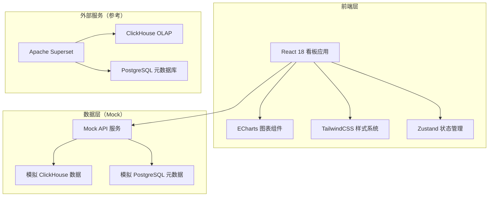
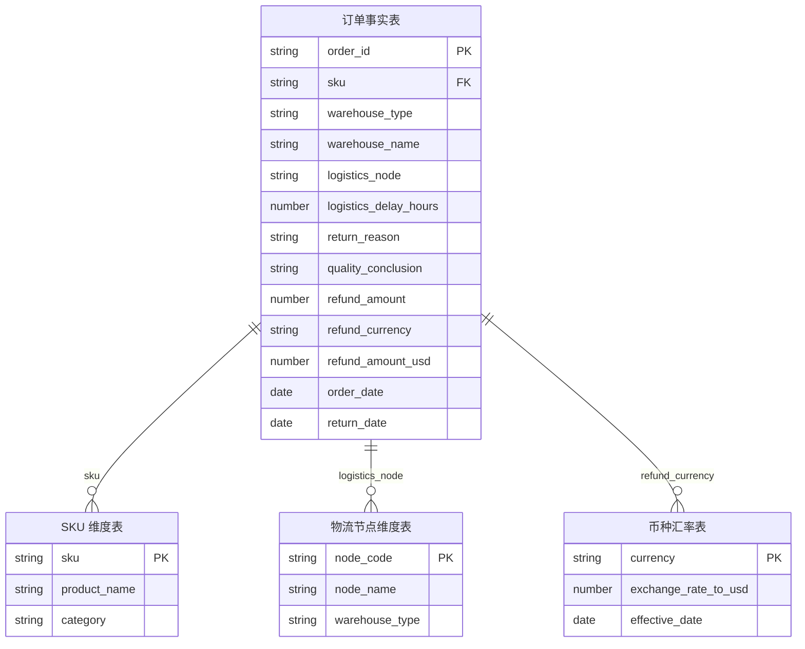

## 1. 架构设计



前端采用 React SPA 单页应用，通过 Mock API 模拟 Superset + ClickHouse + PostgreSQL 的数据查询能力。生产环境中 Superset 作为 BI 中间层，负责数据模型定义、缓存策略、行级权限和报表导出；ClickHouse 存储 OLAP 事实表，PostgreSQL 存储维度表与权限元数据。本看板前端聚焦数据可视化与交互逻辑。

## 2. 技术说明
- 前端：React@18 + TailwindCSS@3 + Vite
- 初始化工具：Vite (React + TypeScript 模板)
- 图表库：ECharts@5（折线图、散点图、环形图、柱状图）
- 状态管理：Zustand（轻量级，仓库口径切换等全局状态）
- 后端：无（纯前端 + Mock 数据）
- 数据库：无（使用内存 Mock 数据模拟 ClickHouse/PostgreSQL 查询结果）

## 3. 路由定义
| 路由 | 用途 |
|------|------|
| / | 总览看板：KPI 卡片 + 退货率趋势 + 仓库口径切换 |
| /sku | SKU 排名页：高退货率排行榜 + 低样本提示 + SKU 下钻 |
| /logistics | 物流关联页：延误散点图 + 延误归因表 |
| /quality | 质检分析页：质检结论分布 + 仓库破损分层 + 退款金额报表 |

## 4. API 定义（Mock）

### 4.1 数据类型定义

```typescript
interface OrderRecord {
  orderId: string
  sku: string
  warehouseType: "overseas" | "domestic"
  warehouseName: string
  logisticsNode: string
  logisticsDelayHours: number
  returnReason: string
  qualityConclusion: "warehouse_damage" | "consumer_reason" | "other"
  refundAmount: number
  refundCurrency: string
  refundAmountUSD: number
  orderDate: string
  returnDate: string
}

interface SKUReturnStats {
  sku: string
  productName: string
  totalOrders: number
  returnCount: number
  returnRate: number
  isLowSample: boolean
  topReturnReasons: { reason: string; count: number }[]
}

interface LogisticsNodeStats {
  node: string
  avgDelayHours: number
  delayRate: number
  returnRate: number
  orderCount: number
}

interface QualityConclusionStats {
  conclusion: string
  count: number
  percentage: number
  totalRefundUSD: number
}

interface RefundByCurrency {
  currency: string
  originalAmount: number
  convertedUSD: number
  exchangeRate: number
}

interface ReturnRateTrend {
  date: string
  overseasRate: number
  domesticRate: number
  overallRate: number
}
```

### 4.2 Mock API 端点

| 端点 | 方法 | 描述 |
|------|------|------|
| /api/kpi | GET | 返回总退货率、退款总额、退货订单数、平均处理时长 |
| /api/return-rate-trend | GET | 返回退货率趋势数据（按日/周/月） |
| /api/sku-ranking | GET | 返回 SKU 排名数据，含低样本标记 |
| /api/sku-detail/:sku | GET | 返回指定 SKU 的退货原因、物流、质检详情 |
| /api/logistics-correlation | GET | 返回物流节点延误与退货关联散点数据 |
| /api/quality-distribution | GET | 返回质检结论分布（仓库破损 vs 消费者原因） |
| /api/refund-report | GET | 返回按币种换算的退款金额报表 |

## 5. 服务器架构图
不适用（纯前端项目）

## 6. 数据模型

### 6.1 数据模型定义



### 6.2 数据定义语言

```sql
CREATE TABLE order_facts (
    order_id        VARCHAR(32) PRIMARY KEY,
    sku             VARCHAR(64) NOT NULL,
    warehouse_type  ENUM('overseas', 'domestic') NOT NULL,
    warehouse_name  VARCHAR(128) NOT NULL,
    logistics_node  VARCHAR(64) NOT NULL,
    logistics_delay_hours DECIMAL(8,2) DEFAULT 0,
    return_reason   VARCHAR(256),
    quality_conclusion ENUM('warehouse_damage', 'consumer_reason', 'other') NOT NULL,
    refund_amount   DECIMAL(12,2) DEFAULT 0,
    refund_currency VARCHAR(3) DEFAULT 'USD',
    refund_amount_usd DECIMAL(12,2) DEFAULT 0,
    order_date      DATE NOT NULL,
    return_date     DATE
);

CREATE TABLE sku_dimension (
    sku          VARCHAR(64) PRIMARY KEY,
    product_name VARCHAR(256) NOT NULL,
    category     VARCHAR(64)
);

CREATE TABLE logistics_node_dimension (
    node_code      VARCHAR(64) PRIMARY KEY,
    node_name      VARCHAR(128) NOT NULL,
    warehouse_type ENUM('overseas', 'domestic') NOT NULL
);

CREATE TABLE currency_exchange (
    currency             VARCHAR(3) PRIMARY KEY,
    exchange_rate_to_usd DECIMAL(10,6) NOT NULL,
    effective_date       DATE NOT NULL
);
```

## 7. 业务规则说明

### 7.1 低样本过滤
- SKU 样本量（总订单数）低于阈值（默认 30 单）时，标记为「样本不足」
- 样本不足的 SKU 仅在排行榜中显示黄色提示标签，不参与排名排序
- 物流节点、质检结论等维度同样适用低样本规则

### 7.2 仓库口径分离
- 海外仓与国内仓的所有指标独立计算，互不混淆
- 总览看板默认展示全口径，切换后仅展示对应仓库口径数据
- SKU 排名在口径切换后重新计算排名

### 7.3 质检结论分层
- 仓库破损（warehouse_damage）与消费者原因（consumer_reason）在质检分析页分开统计和展示
- 退货率计算中仓库破损不计入消费者退货率指标

### 7.4 币种换算
- 退款金额统一换算为 USD 写入报表
- 换算汇率取自币种汇率表的最新生效汇率
- 报表同时展示原币种金额和换算后 USD 金额
