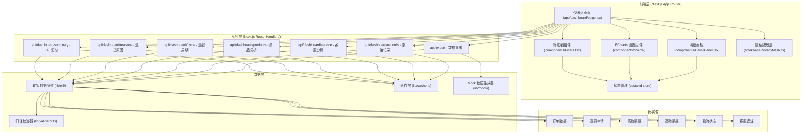
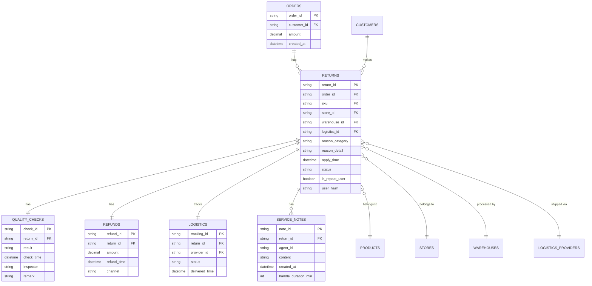
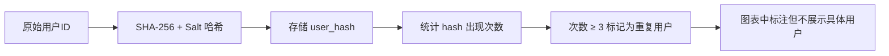

## 1. 架构设计



## 2. 技术说明

- **前端框架**: Next.js 14 (App Router) + React 18 + TypeScript
- **样式方案**: TailwindCSS 3
- **图表库**: ECharts 5
- **状态管理**: Zustand 4
- **图标库**: Lucide React
- **数据处理**: 内置 ETL 管道，使用 Mock 数据模拟真实数据源
- **缓存策略**: 服务端内存缓存 + 时间窗口分片缓存（TTL 5分钟）
- **导出格式**: CSV（内置口径说明 Sheet）

## 3. 路由定义

| 路由 | 用途 |
|------|------|
| / | 仪表盘首页（重定向） |
| /dashboard | 主仪表盘页面 |
| /api/dashboard/summary | KPI 汇总数据 API |
| /api/dashboard/reasons | 退货原因树图数据 API |
| /api/dashboard/cycle | 退款周期分布数据 API |
| /api/dashboard/products | 商品排行数据 API |
| /api/dashboard/service | 客服处理时长数据 API |
| /api/dashboard/records | 原始记录明细 API |
| /api/export | 数据导出 API |

## 4. API 数据结构定义

```typescript
// 筛选条件
interface FilterParams {
  dateRange: { start: string; end: string };
  timeWindow: 'today' | '7d' | '30d' | 'custom';
  products: string[];
  stores: string[];
  reasons: string[];
  warehouses: string[];
  logistics: string[];
}

// KPI 汇总
interface SummaryData {
  totalReturns: number;
  returnRate: number;
  avgRefundCycle: number;
  avgServiceTime: number;
  repeatUserRate: number;
  sampleSize: number;
  trend: {
    returns: number;
    refundCycle: number;
    serviceTime: number;
  };
  validation: {
    dataConsistency: number;
    missingFields: number;
    lastUpdate: string;
  };
}

// 退货原因节点
interface ReasonNode {
  name: string;
  value: number;
  children?: ReasonNode[];
  path: string;
}

// 退款周期分布
interface CycleDistribution {
  bins: { range: string; count: number; avgDays: number }[];
  percentiles: { p50: number; p90: number; p99: number };
  stageBreakdown: {
    applyToQuality: number;
    qualityToRefund: number;
    total: number;
  };
}

// 商品排行
interface ProductRank {
  sku: string;
  name: string;
  category: string;
  returns: number;
  returnRate: number;
  topReason: string;
}

// 客服数据
interface ServiceMetrics {
  avgHandleTime: number;
  agentRanking: { agentId: string; avgTime: number; cases: number }[];
  distribution: { range: string; count: number }[];
}

// 原始记录（脱敏后）
interface ReturnRecord {
  returnId: string;
  orderId: string;
  productName: string;
  sku: string;
  store: string;
  reason: string;
  reasonDetail: string;
  warehouse: string;
  logistics: string;
  applyTime: string;
  qualityTime: string;
  refundTime: string;
  refundCycle: number;
  serviceHandleTime: number;
  agentId: string;
  customerRemark: string;
  isRepeatUser: boolean;
  userHash: string;
  qualityResult: string;
}
```

## 5. 数据模型

### 5.1 ER 图



### 5.2 数据口径说明

| 指标 | 计算口径 | 数据源 |
|------|----------|--------|
| 退货率 | 退货单数量 / 订单数量 × 100% | 订单表 + 退货申请表 |
| 平均退款周期 | (退款时间 - 申请时间) 的平均值 | 退货申请 + 退款表 |
| 客服处理时长 | 客服首条备注到最后一条备注的时间差 | 客服备注表 |
| 重复退货用户 | 同一用户（脱敏 hash）退货次数 ≥ 3 | 退货申请表（用户 hash） |
| P90 退款周期 | 所有退款周期升序排列后第 90 百分位值 | 退款周期明细 |

## 6. 隐私保护方案

### 6.1 脱敏规则
- 用户手机号/邮箱/姓名：不存储、不传输、不展示
- 用户标识：使用 SHA-256 + Salt 生成不可逆 hash，仅用于重复识别
- 客服人员：仅展示 agentId（如 KF001），不展示真实姓名
- 导出数据：自动移除所有可能识别个人的字段

### 6.2 重复用户识别流程


## 7. 缓存策略

```typescript
// 缓存键结构
// dashboard:{endpoint}:{dateRange}:{filterHash}
// TTL: 300 秒（5分钟）
// 分片策略：按 dateRange 分片，相同时间窗口共享缓存
```

- 热数据（近7天）：内存缓存 + 更高优先级
- 冷数据（超过30天）：按需计算，缓存 TTL 延长至 1 小时
- 空结果：缓存 60 秒防止缓存穿透
