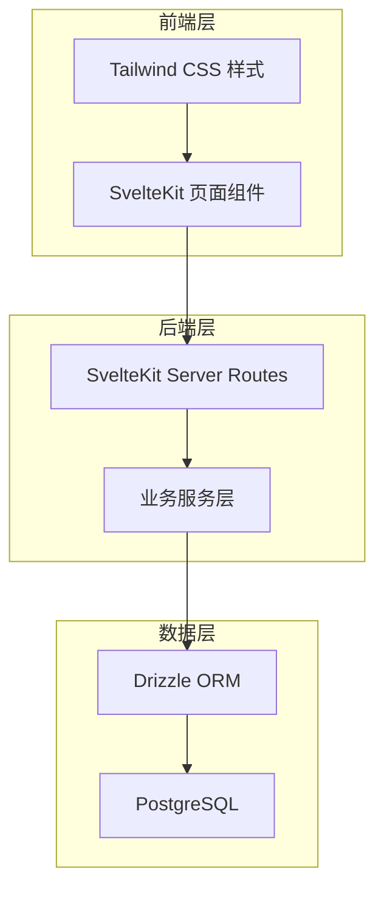
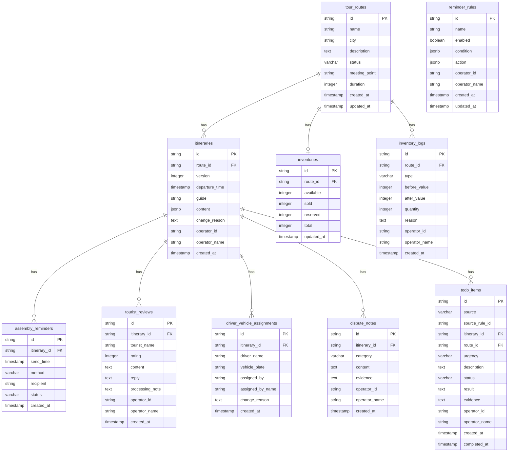

## 1. 架构设计



## 2. 技术说明

- 前端：SvelteKit + Tailwind CSS
- 初始化工具：sv (SvelteKit CLI)
- 后端：SvelteKit Server Routes（API Routes）
- 数据库：PostgreSQL + Drizzle ORM
- 运行时：Node.js

## 3. 路由定义

| 路由 | 用途 |
|------|------|
| / | 重定向到路线总览 |
| /routes | 导览路线总览页 |
| /routes/[id] | 行程详情/版本管理页 |
| /inventory | 库存看板页 |
| /traceability | 追溯中心页 |
| /rules | 提醒规则配置页 |
| /todos | 待办中心页 |

## 4. API 定义

### 4.1 导览路线

```typescript
interface TourRoute {
  id: string;
  name: string;
  city: string;
  description: string;
  status: "active" | "upcoming" | "ended";
  meetingPoint: string;
  duration: number;
  createdAt: Date;
  updatedAt: Date;
}

// GET /api/routes - 获取路线列表
// GET /api/routes/:id - 获取路线详情
```

### 4.2 行程版本

```typescript
interface Itinerary {
  id: string;
  routeId: string;
  version: number;
  departureTime: Date;
  guide: string;
  content: Record<string, unknown>;
  changeReason: string;
  operatorId: string;
  operatorName: string;
  createdAt: Date;
}

// GET /api/routes/:id/itineraries - 获取行程版本列表
// GET /api/routes/:id/itineraries/:version - 获取指定版本
// POST /api/routes/:id/itineraries - 创建新版本
// POST /api/routes/:id/itineraries/rollback - 回滚到指定版本
```

### 4.3 库存

```typescript
interface Inventory {
  id: string;
  routeId: string;
  available: number;
  sold: number;
  reserved: number;
  total: number;
  updatedAt: Date;
}

interface InventoryLog {
  id: string;
  routeId: string;
  type: "manual_adjust" | "order_deduct" | "reserve_release" | "reserve_hold";
  beforeValue: number;
  afterValue: number;
  quantity: number;
  reason: string;
  operatorId: string;
  operatorName: string;
  createdAt: Date;
}

// GET /api/inventory - 获取库存概览
// PUT /api/inventory/:id - 调整库存
// GET /api/inventory/logs - 获取库存变动日志
```

### 4.4 追溯记录

```typescript
interface AssemblyReminder {
  id: string;
  itineraryId: string;
  sendTime: Date;
  method: "sms" | "wechat" | "app_push";
  recipient: string;
  status: "sent" | "delivered" | "failed";
  createdAt: Date;
}

interface TouristReview {
  id: string;
  itineraryId: string;
  touristName: string;
  rating: number;
  content: string;
  reply: string | null;
  processingNote: string | null;
  operatorId: string | null;
  operatorName: string | null;
  createdAt: Date;
}

interface DriverVehicleAssignment {
  id: string;
  itineraryId: string;
  driverName: string;
  vehiclePlate: string;
  assignedBy: string;
  assignedByName: string;
  changeReason: string;
  createdAt: Date;
}

interface DisputeNote {
  id: string;
  itineraryId: string;
  category: "assembly" | "review" | "driver_vehicle" | "other";
  content: string;
  evidence: string;
  operatorId: string;
  operatorName: string;
  createdAt: Date;
}

// GET /api/traceability/reminders/:itineraryId - 获取集合提醒记录
// GET /api/traceability/reviews/:itineraryId - 获取游客评价
// POST /api/traceability/reviews/:id/reply - 回复评价
// GET /api/traceability/assignments/:itineraryId - 获取司机车辆分配
// POST /api/traceability/assignments - 新增分配记录
// POST /api/traceability/disputes - 新增争议备注
// GET /api/traceability/disputes/:itineraryId - 获取争议备注列表
```

### 4.5 提醒规则

```typescript
interface ReminderRule {
  id: string;
  name: string;
  enabled: boolean;
  condition: {
    type: "inventory_below" | "inventory_change_rate" | "time_window";
    threshold: number;
    timeWindowMinutes?: number;
  };
  action: {
    method: "sms" | "wechat" | "app_push" | "email";
    recipients: string[];
    escalationMinutes?: number;
  };
  operatorId: string;
  operatorName: string;
  createdAt: Date;
  updatedAt: Date;
}

// GET /api/rules - 获取规则列表
// POST /api/rules - 创建规则
// PUT /api/rules/:id - 编辑规则
// PATCH /api/rules/:id/toggle - 启停规则
```

### 4.6 待办

```typescript
interface TodoItem {
  id: string;
  source: "escalation" | "manual";
  sourceRuleId: string | null;
  itineraryId: string;
  routeId: string;
  urgency: "high" | "medium" | "low";
  description: string;
  status: "pending" | "in_progress" | "completed";
  result: string | null;
  evidence: string | null;
  operatorId: string | null;
  operatorName: string | null;
  createdAt: Date;
  completedAt: Date | null;
}

// GET /api/todos - 获取待办列表
// PATCH /api/todos/:id - 更新待办状态/处理结果
```

## 5. 服务端架构图

```mermaid
flowchart LR
    A["SvelteKit Server Routes"] --> B["Route Service"]
    A --> C["Itinerary Service"]
    A --> D["Inventory Service"]
    A --> E["Traceability Service"]
    A --> F["Rule Service"]
    A --> G["Todo Service"]
    B --> H["Drizzle ORM"]
    C --> H
    D --> H
    E --> H
    F --> H
    G --> H
    H --> I["PostgreSQL"]
```



## 6. 数据模型

### 6.1 数据模型定义



### 6.2 数据定义语言

```sql
CREATE TABLE tour_routes (
  id UUID PRIMARY KEY DEFAULT gen_random_uuid(),
  name VARCHAR(200) NOT NULL,
  city VARCHAR(100) NOT NULL,
  description TEXT,
  status VARCHAR(20) NOT NULL DEFAULT 'active' CHECK (status IN ('active', 'upcoming', 'ended')),
  meeting_point VARCHAR(500),
  duration INTEGER NOT NULL DEFAULT 0,
  created_at TIMESTAMP NOT NULL DEFAULT NOW(),
  updated_at TIMESTAMP NOT NULL DEFAULT NOW()
);

CREATE TABLE itineraries (
  id UUID PRIMARY KEY DEFAULT gen_random_uuid(),
  route_id UUID NOT NULL REFERENCES tour_routes(id) ON DELETE CASCADE,
  version INTEGER NOT NULL DEFAULT 1,
  departure_time TIMESTAMP NOT NULL,
  guide VARCHAR(200),
  content JSONB NOT NULL DEFAULT '{}',
  change_reason TEXT NOT NULL,
  operator_id VARCHAR(100) NOT NULL,
  operator_name VARCHAR(200) NOT NULL,
  created_at TIMESTAMP NOT NULL DEFAULT NOW(),
  UNIQUE(route_id, version)
);

CREATE TABLE inventories (
  id UUID PRIMARY KEY DEFAULT gen_random_uuid(),
  route_id UUID NOT NULL UNIQUE REFERENCES tour_routes(id) ON DELETE CASCADE,
  available INTEGER NOT NULL DEFAULT 0,
  sold INTEGER NOT NULL DEFAULT 0,
  reserved INTEGER NOT NULL DEFAULT 0,
  total INTEGER NOT NULL DEFAULT 0,
  updated_at TIMESTAMP NOT NULL DEFAULT NOW()
);

CREATE TABLE inventory_logs (
  id UUID PRIMARY KEY DEFAULT gen_random_uuid(),
  route_id UUID NOT NULL REFERENCES tour_routes(id) ON DELETE CASCADE,
  type VARCHAR(30) NOT NULL CHECK (type IN ('manual_adjust', 'order_deduct', 'reserve_release', 'reserve_hold')),
  before_value INTEGER NOT NULL,
  after_value INTEGER NOT NULL,
  quantity INTEGER NOT NULL,
  reason TEXT NOT NULL,
  operator_id VARCHAR(100) NOT NULL,
  operator_name VARCHAR(200) NOT NULL,
  created_at TIMESTAMP NOT NULL DEFAULT NOW()
);

CREATE TABLE assembly_reminders (
  id UUID PRIMARY KEY DEFAULT gen_random_uuid(),
  itinerary_id UUID NOT NULL REFERENCES itineraries(id) ON DELETE CASCADE,
  send_time TIMESTAMP NOT NULL,
  method VARCHAR(20) NOT NULL CHECK (method IN ('sms', 'wechat', 'app_push')),
  recipient VARCHAR(200) NOT NULL,
  status VARCHAR(20) NOT NULL DEFAULT 'sent' CHECK (status IN ('sent', 'delivered', 'failed')),
  created_at TIMESTAMP NOT NULL DEFAULT NOW()
);

CREATE TABLE tourist_reviews (
  id UUID PRIMARY KEY DEFAULT gen_random_uuid(),
  itinerary_id UUID NOT NULL REFERENCES itineraries(id) ON DELETE CASCADE,
  tourist_name VARCHAR(200) NOT NULL,
  rating INTEGER NOT NULL CHECK (rating BETWEEN 1 AND 5),
  content TEXT NOT NULL,
  reply TEXT,
  processing_note TEXT,
  operator_id VARCHAR(100),
  operator_name VARCHAR(200),
  created_at TIMESTAMP NOT NULL DEFAULT NOW()
);

CREATE TABLE driver_vehicle_assignments (
  id UUID PRIMARY KEY DEFAULT gen_random_uuid(),
  itinerary_id UUID NOT NULL REFERENCES itineraries(id) ON DELETE CASCADE,
  driver_name VARCHAR(200) NOT NULL,
  vehicle_plate VARCHAR(50) NOT NULL,
  assigned_by VARCHAR(100) NOT NULL,
  assigned_by_name VARCHAR(200) NOT NULL,
  change_reason TEXT NOT NULL,
  created_at TIMESTAMP NOT NULL DEFAULT NOW()
);

CREATE TABLE dispute_notes (
  id UUID PRIMARY KEY DEFAULT gen_random_uuid(),
  itinerary_id UUID NOT NULL REFERENCES itineraries(id) ON DELETE CASCADE,
  category VARCHAR(30) NOT NULL CHECK (category IN ('assembly', 'review', 'driver_vehicle', 'other')),
  content TEXT NOT NULL,
  evidence TEXT NOT NULL,
  operator_id VARCHAR(100) NOT NULL,
  operator_name VARCHAR(200) NOT NULL,
  created_at TIMESTAMP NOT NULL DEFAULT NOW()
);

CREATE TABLE reminder_rules (
  id UUID PRIMARY KEY DEFAULT gen_random_uuid(),
  name VARCHAR(200) NOT NULL,
  enabled BOOLEAN NOT NULL DEFAULT true,
  condition JSONB NOT NULL DEFAULT '{}',
  action JSONB NOT NULL DEFAULT '{}',
  operator_id VARCHAR(100) NOT NULL,
  operator_name VARCHAR(200) NOT NULL,
  created_at TIMESTAMP NOT NULL DEFAULT NOW(),
  updated_at TIMESTAMP NOT NULL DEFAULT NOW()
);

CREATE TABLE todo_items (
  id UUID PRIMARY KEY DEFAULT gen_random_uuid(),
  source VARCHAR(20) NOT NULL DEFAULT 'escalation' CHECK (source IN ('escalation', 'manual')),
  source_rule_id UUID REFERENCES reminder_rules(id),
  itinerary_id UUID REFERENCES itineraries(id) ON DELETE SET NULL,
  route_id UUID REFERENCES tour_routes(id) ON DELETE SET NULL,
  urgency VARCHAR(10) NOT NULL DEFAULT 'medium' CHECK (urgency IN ('high', 'medium', 'low')),
  description TEXT NOT NULL,
  status VARCHAR(20) NOT NULL DEFAULT 'pending' CHECK (status IN ('pending', 'in_progress', 'completed')),
  result TEXT,
  evidence TEXT,
  operator_id VARCHAR(100),
  operator_name VARCHAR(200),
  created_at TIMESTAMP NOT NULL DEFAULT NOW(),
  completed_at TIMESTAMP
);

CREATE INDEX idx_itineraries_route_id ON itineraries(route_id);
CREATE INDEX idx_inventory_logs_route_id ON inventory_logs(route_id);
CREATE INDEX idx_inventory_logs_created_at ON inventory_logs(created_at);
CREATE INDEX idx_assembly_reminders_itinerary_id ON assembly_reminders(itinerary_id);
CREATE INDEX idx_tourist_reviews_itinerary_id ON tourist_reviews(itinerary_id);
CREATE INDEX idx_driver_vehicle_assignments_itinerary_id ON driver_vehicle_assignments(itinerary_id);
CREATE INDEX idx_dispute_notes_itinerary_id ON dispute_notes(itinerary_id);
CREATE INDEX idx_todo_items_status ON todo_items(status);
CREATE INDEX idx_todo_items_urgency ON todo_items(urgency);
```
