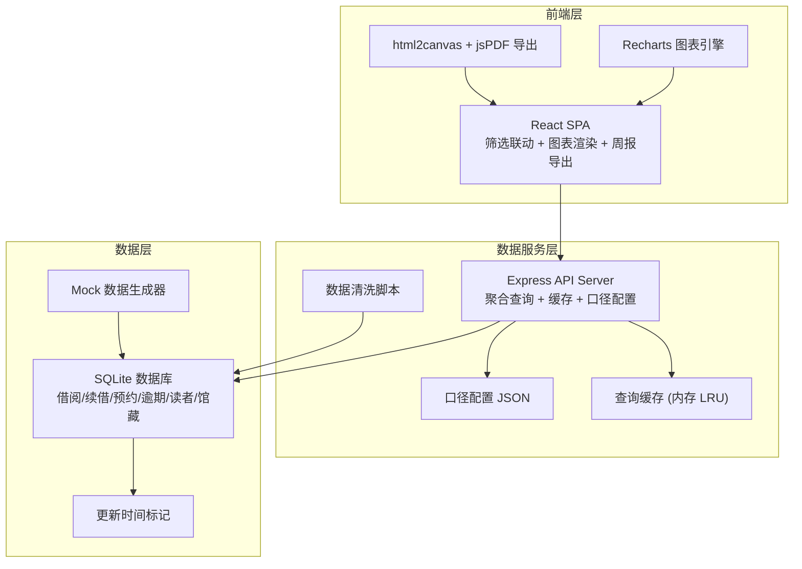
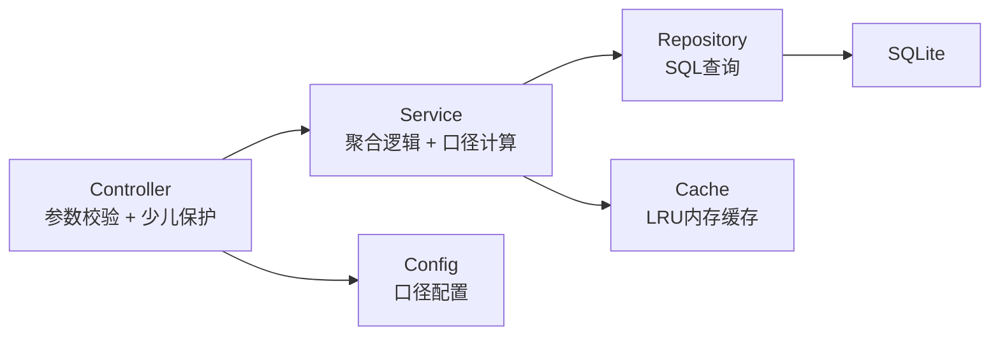

## 1. 架构设计



## 2. 技术说明

- **前端**：React@18 + Tailwind CSS@3 + Vite + Recharts + Zustand（筛选状态管理）
- **初始化工具**：Vite
- **后端**：Express@4，提供聚合 API
- **数据库**：SQLite（通过 better-sqlite3），含 Mock 数据生成器
- **图表**：Recharts（主题趋势、分馆对比、预约等待）+ 自定义 Canvas（逾期热力图）
- **导出**：html2canvas + jsPDF 生成 PDF/PNG
- **状态管理**：Zustand 管理全局筛选状态，确保筛选贯穿图表联动和报告下载
- **缓存**：内存 LRU 缓存，按筛选参数 hash 作 key，TTL 5分钟

## 3. 路由定义

| 路由 | 用途 |
|------|------|
| `/` | 数据总览页，全局筛选器和KPI卡片 |
| `/theme-trends` | 主题趋势分析页 |
| `/branch-compare` | 分馆对比页 |
| `/reservation-wait` | 预约等待分析页 |
| `/overdue-heatmap` | 逾期热区页 |
| `/weekly-reports` | 周报中心页 |

## 4. API 定义

### 4.1 聚合查询 API

```typescript
interface FilterState {
  collectionTypes: string[]
  readerGroups: string[]
  themes: string[]
  branches: string[]
  dateRange: { start: string; end: string }
}

interface AggregationRequest {
  filters: FilterState
  metrics: string[]
  groupBy: string[]
  granularity?: 'day' | 'week' | 'month'
}

interface AggregationResponse {
  data: Record<string, any>[]
  meta: {
    updatedAt: string
    cacheHit: boolean
    filterSnapshot: FilterState
    childDataAggregated: boolean
  }
}

// POST /api/aggregate - 通用聚合查询
// POST /api/kpi - KPI 卡片数据
// POST /api/theme-trends - 主题趋势数据
// POST /api/branch-compare - 分馆对比数据
// POST /api/reservation-wait - 预约等待数据
// POST /api/overdue-heatmap - 逾期热区数据
// GET  /api/weekly-reports - 周报列表
// GET  /api/weekly-reports/:id - 周报详情
// POST /api/weekly-reports/generate - 手动触发生成周报
// GET  /api/filter-options - 筛选器可选项（馆藏类型/主题/分馆列表）
// GET  /api/update-time - 数据最新更新时间
```

### 4.2 少儿数据保护 API 规则

```typescript
// 所有 API 响应必须遵守：
interface ChildDataPolicy {
  childDataAggregated: boolean  // 必须为 true
  minGroupSize: number          // 聚合最小分组 >= 5
  noIndividualRecords: boolean  // 禁止返回个人记录
}
```

## 5. 服务架构图



## 6. 数据模型

### 6.1 数据模型定义

```mermaid
erdiag
    BOOK {
        string book_id PK
        string title
        string author
        string collection_type
        string theme_category
        string sub_theme
        string branch_id FK
        int total_copies
        int available_copies
    }
    READER {
        string reader_id PK
        string age_group
        string branch_id FK
        boolean is_child
        date register_date
    }
    BORROW_RECORD {
        string record_id PK
        string book_id FK
        string reader_id FK
        string branch_id FK
        date borrow_date
        date due_date
        date return_date
        boolean is_renewed
        boolean is_overdue
        int overdue_days
    }
    RESERVATION {
        string reservation_id PK
        string book_id FK
        string reader_id FK
        string branch_id FK
        date reserve_date
        date fulfill_date
        int queue_position
        string status
    }
    BRANCH {
        string branch_id PK
        string branch_name
        string district
    }
    ACTIVITY {
        string activity_id PK
        string branch_id FK
        string activity_type
        date activity_date
        int participant_count
        int child_participant_count
    }
    WEEKLY_REPORT {
        string report_id PK
        date week_start
        date week_end
        text key_changes
        text yoy_comparison
        text mom_comparison
        text anomalies
        text filter_snapshot
        datetime generated_at
    }

    BOOK ||--o{ BORROW_RECORD : "has"
    READER ||--o{ BORROW_RECORD : "makes"
    BOOK ||--o{ RESERVATION : "reserved"
    READER ||--o{ RESERVATION : "requests"
    BRANCH ||--o{ BOOK : "holds"
    BRANCH ||--o{ ACTIVITY : "hosts"
```

### 6.2 数据定义语言

```sql
CREATE TABLE branch (
  branch_id TEXT PRIMARY KEY,
  branch_name TEXT NOT NULL,
  district TEXT NOT NULL
);

CREATE TABLE book (
  book_id TEXT PRIMARY KEY,
  title TEXT NOT NULL,
  author TEXT NOT NULL,
  collection_type TEXT NOT NULL,
  theme_category TEXT NOT NULL,
  sub_theme TEXT,
  branch_id TEXT NOT NULL REFERENCES branch(branch_id),
  total_copies INTEGER NOT NULL DEFAULT 1,
  available_copies INTEGER NOT NULL DEFAULT 1
);

CREATE TABLE reader (
  reader_id TEXT PRIMARY KEY,
  age_group TEXT NOT NULL CHECK (age_group IN ('child', 'youth', 'middle', 'senior')),
  branch_id TEXT NOT NULL REFERENCES branch(branch_id),
  is_child BOOLEAN NOT NULL DEFAULT 0,
  register_date DATE NOT NULL
);

CREATE TABLE borrow_record (
  record_id TEXT PRIMARY KEY,
  book_id TEXT NOT NULL REFERENCES book(book_id),
  reader_id TEXT NOT NULL REFERENCES reader(reader_id),
  branch_id TEXT NOT NULL REFERENCES branch(branch_id),
  borrow_date DATE NOT NULL,
  due_date DATE NOT NULL,
  return_date DATE,
  is_renewed BOOLEAN NOT NULL DEFAULT 0,
  is_overdue BOOLEAN NOT NULL DEFAULT 0,
  overdue_days INTEGER NOT NULL DEFAULT 0
);

CREATE TABLE reservation (
  reservation_id TEXT PRIMARY KEY,
  book_id TEXT NOT NULL REFERENCES book(book_id),
  reader_id TEXT NOT NULL REFERENCES reader(reader_id),
  branch_id TEXT NOT NULL REFERENCES branch(branch_id),
  reserve_date DATE NOT NULL,
  fulfill_date DATE,
  queue_position INTEGER NOT NULL,
  status TEXT NOT NULL CHECK (status IN ('waiting', 'fulfilled', 'cancelled'))
);

CREATE TABLE activity (
  activity_id TEXT PRIMARY KEY,
  branch_id TEXT NOT NULL REFERENCES branch(branch_id),
  activity_type TEXT NOT NULL,
  activity_date DATE NOT NULL,
  participant_count INTEGER NOT NULL DEFAULT 0,
  child_participant_count INTEGER NOT NULL DEFAULT 0
);

CREATE TABLE weekly_report (
  report_id TEXT PRIMARY KEY,
  week_start DATE NOT NULL,
  week_end DATE NOT NULL,
  key_changes TEXT NOT NULL,
  yoy_comparison TEXT NOT NULL,
  mom_comparison TEXT NOT NULL,
  anomalies TEXT NOT NULL,
  filter_snapshot TEXT NOT NULL,
  generated_at DATETIME NOT NULL DEFAULT CURRENT_TIMESTAMP
);

CREATE INDEX idx_borrow_date ON borrow_record(borrow_date);
CREATE INDEX idx_borrow_branch ON borrow_record(branch_id);
CREATE INDEX idx_borrow_reader ON borrow_record(reader_id);
CREATE INDEX idx_reservation_status ON reservation(status);
CREATE INDEX idx_reader_age ON reader(age_group);
CREATE INDEX idx_book_theme ON book(theme_category);
```

## 7. 关键技术实现

### 7.1 筛选状态贯穿机制

使用 Zustand 全局 Store 管理筛选状态，所有图表组件订阅同一 Store：
- 筛选变更 → Store 更新 → 所有订阅图表自动重新请求和渲染
- 周报下载时，当前筛选状态嵌入报告水印和元数据
- URL 同步：筛选状态序列化到 URL query params，支持分享和书签

### 7.2 口径配置

```json
{
  "metrics": {
    "borrow_count": { "label": "借阅量", "unit": "次", "sql_field": "COUNT(*)" },
    "renewal_rate": { "label": "续借率", "unit": "%", "sql_field": "SUM(is_renewed)*100/COUNT(*)" },
    "reservation_fulfill_rate": { "label": "预约满足率", "unit": "%" },
    "overdue_rate": { "label": "逾期率", "unit": "%", "sql_field": "SUM(is_overdue)*100/COUNT(*)" }
  },
  "age_groups": {
    "child": { "label": "少儿", "aggregation_only": true, "min_group_size": 5 },
    "youth": { "label": "青年", "aggregation_only": false },
    "middle": { "label": "中年", "aggregation_only": false },
    "senior": { "label": "老年", "aggregation_only": false }
  },
  "anomaly_threshold": {
    "overdue_rate": 15,
    "reservation_wait_days": 30,
    "borrow_count_change_pct": 20
  }
}
```

### 7.3 查询缓存策略

- 缓存 Key = hash(filters + metrics + groupBy + granularity)
- LRU 缓存，最大 100 条，TTL 5分钟
- 周报生成后清除相关缓存
- 响应头包含 `X-Cache-Status: HIT/MISS` 和 `X-Data-Updated-At`

### 7.4 周报自动生成

- 服务端 cron 每周一 02:00 执行
- 生成逻辑：聚合上周数据 → 计算同比环比 → 异常检测 → 写入 weekly_report 表
- 前端可手动触发 `/api/weekly-reports/generate`
- 报告内容：关键变化摘要、同比环比表格、异常点列表、筛选口径快照

### 7.5 少儿数据保护实现

- SQL 层：涉及少儿读者的查询，强制 GROUP BY 至少包含 age_group，且 WHERE is_child=1 时结果集 ≥ 5 条
- API 层：中间件检查响应，如果少儿数据未聚合则拒绝返回
- 前端层：少儿相关图表区域显示锁图标和提示文案
- 导出层：PDF/PNG 生成时，少儿数据区域覆盖"已脱敏聚合"水印
