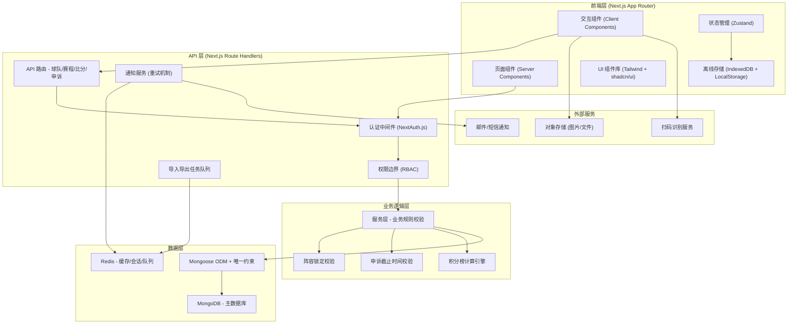
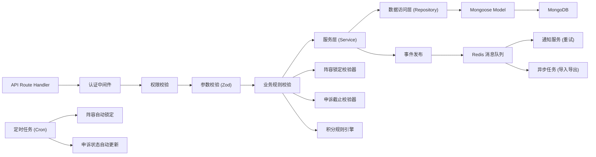
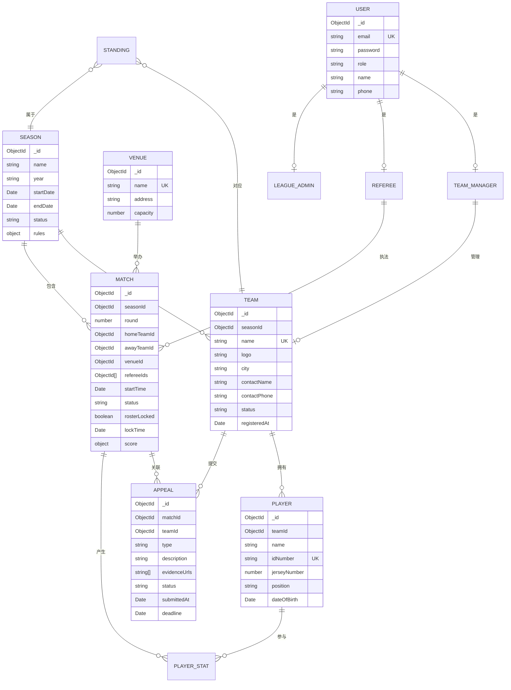

## 1. 架构设计



## 2. 技术选型说明

| 层级 | 技术 | 版本 | 说明 |
|------|------|------|------|
| 前端框架 | Next.js | 14.x | App Router, Server/Client Components |
| 前端语言 | TypeScript | 5.x | 类型安全 |
| UI 框架 | Tailwind CSS | 3.x | 原子化 CSS |
| UI 组件 | shadcn/ui | latest | 高质量可定制组件 |
| 状态管理 | Zustand | 4.x | 轻量级状态管理 |
| 数据请求 | TanStack Query | 5.x | 服务端状态缓存、重试 |
| 离线存储 | Dexie.js | 3.x | IndexedDB 封装 |
| 后端运行时 | Node.js | 18.x | Next.js 内置 |
| 数据库 | MongoDB | 6.x | 文档型数据库 |
| ODM | Mongoose | 8.x | Schema + 唯一约束 |
| 缓存/队列 | Redis | 7.x | BullMQ 任务队列 |
| 认证 | NextAuth.js | 5.x | Auth.js, 多角色认证 |
| 文件存储 | 本地/S3 兼容 | - | 图片和文件上传 |
| 表单校验 | Zod | 3.x | 运行时类型校验 |
| 导入导出 | exceljs + csv-parse | latest | Excel/CSV 处理 |

## 3. 路由定义

| 路由 | 页面/功能 | 权限要求 |
|------|-----------|----------|
| / | 首页 - 联赛概览、赛程、积分榜 | 公开 |
| /teams | 球队列表 | 公开 |
| /teams/[id] | 球队详情 | 公开 |
| /teams/register | 球队报名 | 球队负责人 |
| /schedule | 赛程日历 | 公开 |
| /schedule/[id] | 比赛详情 | 公开 |
| /standings | 积分榜 | 公开 |
| /appeals | 申诉列表 | 已登录 |
| /appeals/new | 提交申诉 | 球队负责人 |
| /referee | 裁判中心 | 裁判员 |
| /referee/matches/[id] | 比分录入 | 裁判员 |
| /admin | 管理后台首页 | 管理员 |
| /admin/teams | 球队审核 | 管理员 |
| /admin/schedule | 赛程管理 | 管理员 |
| /admin/scores | 比分校验 | 管理员 |
| /admin/appeals | 申诉处理 | 管理员 |
| /admin/import-export | 数据导入导出 | 超级管理员 |
| /admin/settings | 系统设置 | 超级管理员 |
| /mobile/checkin | 现场扫码签到 | 现场工作人员 |
| /mobile/offline | 离线数据中心 | 现场工作人员 |
| /api/auth/* | NextAuth 认证路由 | - |
| /api/* | 业务 API 路由 | 按权限控制 |

## 4. API 权限边界定义

### 4.1 认证与权限中间件

```typescript
// 角色枚举
type UserRole = 'SUPER_ADMIN' | 'LEAGUE_ADMIN' | 'TEAM_MANAGER' | 'REFEREE' | 'FIELD_STAFF' | 'VIEWER';

// API 权限矩阵
interface ApiPermission {
  endpoint: string;
  method: 'GET' | 'POST' | 'PUT' | 'DELETE' | 'PATCH';
  allowedRoles: UserRole[];
  sensitiveFields: string[]; // 按角色隐藏的字段
}

// 示例：球队 API 权限配置
const teamApiPermissions: ApiPermission[] = [
  {
    endpoint: '/api/teams',
    method: 'GET',
    allowedRoles: ['*'],
    sensitiveFields: ['contactPhone', 'idCardNumber', 'bankAccount']
  },
  {
    endpoint: '/api/teams/:id',
    method: 'PUT',
    allowedRoles: ['SUPER_ADMIN', 'LEAGUE_ADMIN', 'TEAM_MANAGER'],
    sensitiveFields: []
  },
  {
    endpoint: '/api/teams/:id/roster',
    method: 'PUT',
    allowedRoles: ['TEAM_MANAGER'],
    sensitiveFields: [],
    preValidation: 'validateRosterLock' // 阵容锁定校验
  }
];
```

### 4.2 核心 API 定义

```typescript
// 球队相关
interface Team {
  id: string;
  name: string;
  logo: string;
  city: string;
  coach: string;
  contactName: string;
  contactPhone: string; // 敏感字段
  status: 'PENDING' | 'APPROVED' | 'REJECTED';
  players: Player[];
  registeredAt: Date;
}

// 赛程相关
interface Match {
  id: string;
  round: number;
  group?: string;
  homeTeamId: string;
  awayTeamId: string;
  venueId: string;
  refereeIds: string[];
  startTime: Date;
  endTime?: Date;
  status: 'SCHEDULED' | 'LIVE' | 'FINISHED' | 'CANCELLED' | 'POSTPONED';
  homeScore?: number;
  awayScore?: number;
  quarterScores?: number[][];
  rosterLocked: boolean;
  lockTime: Date; // 比赛开始前1小时
  playerStats?: PlayerStat[];
}

// 申诉相关
interface Appeal {
  id: string;
  matchId: string;
  teamId: string;
  type: 'SCORE' | 'FOUL' | 'REFEREE' | 'OTHER';
  description: string;
  evidenceUrls: string[];
  status: 'PENDING' | 'REVIEWING' | 'UPHELD' | 'REJECTED';
  submittedAt: Date;
  deadline: Date; // 申诉截止时间
  decidedAt?: Date;
  decision?: string;
}

// 积分榜
interface Standing {
  teamId: string;
  played: number;
  won: number;
  drawn: number;
  lost: number;
  pointsFor: number;
  pointsAgainst: number;
  pointDifference: number;
  points: number;
  rank: number;
}
```

## 5. 服务端架构



## 6. 数据模型

### 6.1 ER 图



### 6.2 数据库唯一约束 (Mongoose Schema)

```typescript
// 核心集合的唯一约束定义

// 1. 赛季 - 同年份同名唯一
const seasonSchema = new Schema({
  name: { type: String, required: true },
  year: { type: String, required: true },
}, {
  timestamps: true
});
seasonSchema.index({ name: 1, year: 1 }, { unique: true });

// 2. 球队 - 同赛季队名唯一
const teamSchema = new Schema({
  seasonId: { type: ObjectId, ref: 'Season', required: true },
  name: { type: String, required: true },
  contactPhone: { type: String, required: true },
}, {
  timestamps: true
});
teamSchema.index({ seasonId: 1, name: 1 }, { unique: true });

// 3. 球员 - 同球队身份证号唯一 + 全局身份证号+赛季唯一
const playerSchema = new Schema({
  teamId: { type: ObjectId, ref: 'Team', required: true },
  idNumber: { type: String, required: true },
  jerseyNumber: { type: Number, required: true },
}, {
  timestamps: true
});
playerSchema.index({ teamId: 1, idNumber: 1 }, { unique: true });
playerSchema.index({ teamId: 1, jerseyNumber: 1 }, { unique: true });

// 4. 比赛 - 同赛季同轮次同主场唯一
const matchSchema = new Schema({
  seasonId: { type: ObjectId, ref: 'Season', required: true },
  round: { type: Number, required: true },
  homeTeamId: { type: ObjectId, ref: 'Team', required: true },
  awayTeamId: { type: ObjectId, ref: 'Team', required: true },
  startTime: { type: Date, required: true },
  venueId: { type: ObjectId, ref: 'Venue', required: true },
}, {
  timestamps: true
});
matchSchema.index({ seasonId: 1, round: 1, homeTeamId: 1 }, { unique: true });
matchSchema.index({ venueId: 1, startTime: 1 }, { unique: true }); // 同时段同场馆唯一

// 5. 用户 - 邮箱唯一
const userSchema = new Schema({
  email: { type: String, required: true, unique: true },
  role: { type: String, required: true, enum: ['SUPER_ADMIN', 'LEAGUE_ADMIN', 'TEAM_MANAGER', 'REFEREE', 'FIELD_STAFF'] },
}, {
  timestamps: true
});

// 6. 申诉 - 每场每队只能申诉一次
const appealSchema = new Schema({
  matchId: { type: ObjectId, ref: 'Match', required: true },
  teamId: { type: ObjectId, ref: 'Team', required: true },
  type: { type: String, required: true },
}, {
  timestamps: true
});
appealSchema.index({ matchId: 1, teamId: 1 }, { unique: true });

// 7. 积分榜 - 每队每赛季唯一
const standingSchema = new Schema({
  seasonId: { type: ObjectId, ref: 'Season', required: true },
  teamId: { type: ObjectId, ref: 'Team', required: true },
  points: { type: Number, default: 0 },
}, {
  timestamps: true
});
standingSchema.index({ seasonId: 1, teamId: 1 }, { unique: true });
```

## 7. 前端状态管理设计

### 7.1 Zustand Store 划分

```typescript
// 1. 认证状态
interface AuthState {
  user: User | null;
  role: UserRole | null;
  permissions: string[];
  login: (credentials: Credentials) => Promise<void>;
  logout: () => void;
  hasPermission: (action: string) => boolean;
}

// 2. 赛程状态
interface ScheduleState {
  matches: Match[];
  selectedDate: Date | null;
  filters: ScheduleFilters;
  loading: boolean;
  fetchMatches: (filters?: ScheduleFilters) => Promise<void>;
  getMatchById: (id: string) => Match | undefined;
}

// 3. 离线队列状态
interface OfflineState {
  pendingActions: OfflineAction[];
  isOnline: boolean;
  syncStatus: 'idle' | 'syncing' | 'error';
  addOfflineAction: (action: OfflineAction) => void;
  syncPendingActions: () => Promise<void>;
  clearSyncedActions: () => void;
}

// 4. 积分榜状态
interface StandingState {
  standings: Standing[];
  seasonId: string | null;
  loading: boolean;
  fetchStandings: (seasonId: string) => Promise<void>;
  recalculateStandings: () => Promise<void>;
}

// 5. UI 状态
interface UIState {
  sidebarOpen: boolean;
  mobileMenuOpen: boolean;
  notifications: Notification[];
  toastMessage: ToastMessage | null;
  toggleSidebar: () => void;
  showToast: (message: ToastMessage) => void;
  addNotification: (notification: Notification) => void;
}
```

### 7.2 离线数据同步策略

```typescript
// 离线操作类型
interface OfflineAction {
  id: string;
  type: 'SCORE_UPDATE' | 'CHECKIN' | 'PHOTO_UPLOAD' | 'PLAYER_STAT';
  payload: any;
  createdAt: number;
  retryCount: number;
  status: 'pending' | 'syncing' | 'failed';
}

// 同步策略：
// 1. 网络状态监听 (navigator.onLine)
// 2. 网络恢复时自动触发同步
// 3. 失败指数退避重试 (1s, 2s, 4s, 8s, 最多 5 次)
// 4. IndexedDB 持久化存储待同步数据
// 5. 同步完成后清理已成功数据
```

## 8. 导入导出任务设计

### 8.1 支持的数据类型
- 球队信息 (Excel)
- 球员名单 (Excel/CSV)
- 赛程 (Excel)
- 比分数据 (Excel)
- 积分榜导出 (Excel/PDF)
- 比赛报告导出 (PDF)

### 8.2 任务队列架构

```typescript
// 导入导出任务定义
interface ImportExportTask {
  id: string;
  type: 'IMPORT' | 'EXPORT';
  entity: 'TEAMS' | 'PLAYERS' | 'SCHEDULE' | 'SCORES' | 'STANDINGS';
  status: 'PENDING' | 'PROCESSING' | 'COMPLETED' | 'FAILED';
  fileUrl?: string;
  progress: number;
  totalRecords: number;
  processedRecords: number;
  errors: ImportError[];
  createdAt: Date;
  createdBy: string;
}

// 回滚策略：
// 1. 导入操作使用事务 (MongoDB Transactions)
// 2. 单条记录失败不影响其他记录
// 3. 失败记录写入错误报告
// 4. 支持按批次回滚 (记录导入批次号)
// 5. 导出任务失败可重试，无需回滚
```

## 9. 通知重试与回滚策略

### 9.1 通知类型
- 赛程变动通知
- 报名审核结果通知
- 申诉处理结果通知
- 比赛开始提醒
- 阵容锁定提醒
- 系统公告

### 9.2 重试机制

```typescript
// 通知任务
interface NotificationTask {
  id: string;
  type: 'EMAIL' | 'SMS' | 'PUSH' | 'IN_APP';
  recipient: string;
  subject: string;
  content: string;
  templateId: string;
  status: 'PENDING' | 'SENT' | 'FAILED';
  retryCount: number;
  maxRetries: number;
  nextRetryAt: Date;
  sentAt?: Date;
  errorMessage?: string;
}

// 重试策略 (Exponential Backoff):
// 第1次失败: 1分钟后重试
// 第2次失败: 5分钟后重试
// 第3次失败: 15分钟后重试
// 第4次失败: 30分钟后重试
// 第5次失败: 标记为永久失败，记录日志，人工介入
```

### 9.3 回滚策略

| 操作类型 | 回滚触发条件 | 回滚方式 |
|----------|-------------|----------|
| 球队报名导入 | 批量导入中途失败 | 按批次号删除已导入记录 |
| 比分录入后 | 申诉成立需要改判 | 撤销原比分，重新计算积分榜 |
| 赛程调整通知 | 通知发送失败 | 回滚状态，重新进入通知队列 |
| 阵容修改 | 比赛开始前违规修改 | 自动恢复到锁定时的阵容版本 |
| 积分榜更新 | 计算错误 | 重新执行积分计算引擎覆盖 |
| 文件导入 | 数据格式校验失败 | 完全回滚，返回错误报告 |
