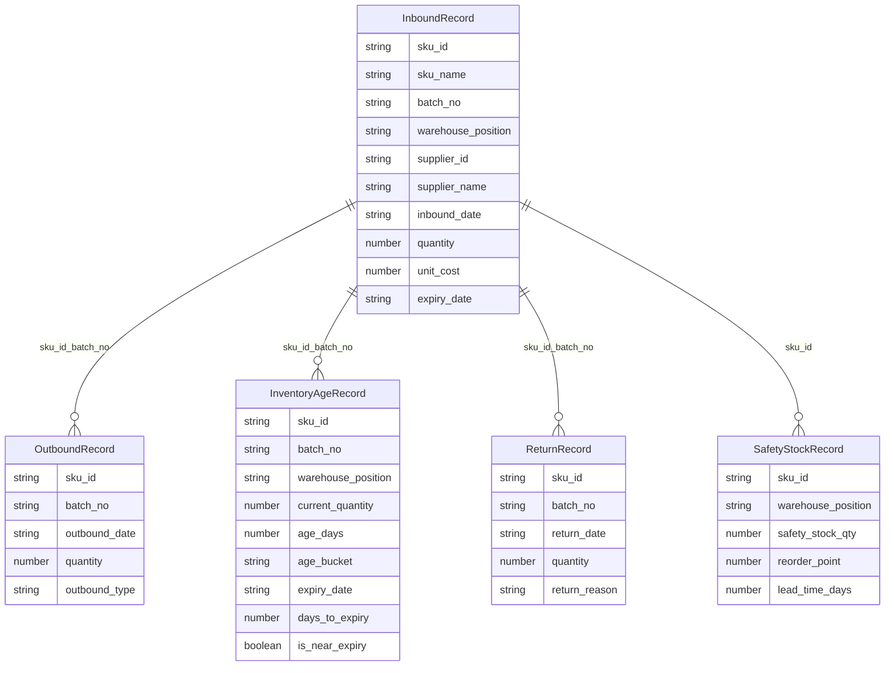

## 1. 架构设计

```mermaid
flowchart TB
    subgraph "前端层"
        "SvelteKit 页面路由"
        "Svelte 组件库"
        "Apache ECharts 图表"
        "DuckDB-WASM 客户端查询"
    end
    subgraph "数据层"
        "Mock 数据生成器"
        "CSV 批量导入"
        "数据字典"
        "缺失值处理引擎"
    end
    subgraph "导出与报告层"
        "周报自动生成器"
        "PDF 导出"
        "图片导出"
        "CSV 导出"
    end
    "SvelteKit 页面路由" --> "Svelte 组件库"
    "Svelte 组件库" --> "Apache ECharts 图表"
    "Svelte 组件库" --> "DuckDB-WASM 客户端查询"
    "DuckDB-WASM 客户端查询" --> "Mock 数据生成器"
    "DuckDB-WASM 客户端查询" --> "CSV 批量导入"
    "DuckDB-WASM 客户端查询" --> "数据字典"
    "DuckDB-WASM 客户端查询" --> "缺失值处理引擎"
    "SvelteKit 页面路由" --> "导出与报告层"
```

## 2. 技术说明
- 前端框架：SvelteKit + TypeScript
- 图表库：Apache ECharts（echarts + echarts-stat）
- 客户端数据库：DuckDB-WASM（浏览器内 SQL 查询引擎）
- 样式：TailwindCSS
- 状态管理：Svelte Stores
- PDF 导出：html2canvas + jsPDF
- CSV 解析：PapaParse
- 初始化工具：SvelteKit CLI（npm create svelte@latest）

## 3. 路由定义
| 路由 | 用途 |
|------|------|
| / | 分析仪表盘：筛选面板 + 库存漏斗 + 库龄分布 + 周转排行 + 补货建议 + 近效期提醒 |
| /data | 数据管理：批量导入 + 数据字典 + 缺失值处理 + 权限过滤 |
| /reports | 周报中心：周报列表 + 报告详情 + 导出 |
| /validation | 维度校验：校验口径 + 下钻路径 + 校验结果 |

## 4. API 定义（客户端 DuckDB 查询接口）

```typescript
interface InboundRecord {
  sku_id: string
  sku_name: string
  batch_no: string
  warehouse_position: string
  supplier_id: string
  supplier_name: string
  inbound_date: string
  quantity: number
  unit_cost: number
  expiry_date: string | null
}

interface OutboundRecord {
  sku_id: string
  batch_no: string
  outbound_date: string
  quantity: number
  outbound_type: 'sale' | 'transfer' | 'return_out'
}

interface InventoryAgeRecord {
  sku_id: string
  batch_no: string
  warehouse_position: string
  current_quantity: number
  age_days: number
  age_bucket: '0-30' | '30-60' | '60-90' | '90-180' | '180+'
  expiry_date: string | null
  days_to_expiry: number | null
  is_near_expiry: boolean
}

interface ReturnRecord {
  sku_id: string
  batch_no: string
  return_date: string
  quantity: number
  return_reason: string
}

interface SafetyStockRecord {
  sku_id: string
  warehouse_position: string
  safety_stock_qty: number
  reorder_point: number
  lead_time_days: number
}

interface FilterState {
  sku_ids: string[]
  warehouse_positions: string[]
  supplier_ids: string[]
  batch_nos: string[]
  age_buckets: string[]
  date_range: { start: string; end: string }
}

interface FunnelData {
  total_inbound: number
  current_inventory: number
  effective_turnover: number
  fast_turnover: number
}

interface TurnoverRanking {
  sku_id: string
  sku_name: string
  batch_no: string
  turnover_rate: number
  avg_age_days: number
  current_qty: number
  rank_type: 'top' | 'bottom'
}

interface ReplenishmentSuggestion {
  sku_id: string
  sku_name: string
  warehouse_position: string
  current_qty: number
  safety_stock_qty: number
  gap: number
  priority: 'urgent' | 'high' | 'medium' | 'low'
  suggested_qty: number
  lead_time_days: number
}

interface WeeklyReport {
  report_id: string
  week_start: string
  week_end: string
  key_changes: string[]
  yoy_comparison: Record<string, { current: number; previous: number; change_pct: number }>
  mom_comparison: Record<string, { current: number; previous: number; change_pct: number }>
  anomalies: Array<{ metric: string; description: string; severity: 'high' | 'medium' | 'low' }>
  filter_snapshot: FilterState
  generated_at: string
}

interface ValidationRule {
  rule_id: string
  metric_name: string
  formula: string
  description: string
  expected_range: { min: number; max: number }
  is_active: boolean
}

interface DrillDownPath {
  path_id: string
  name: string
  levels: Array<{ field: string; label: string; order: number }>
}
```

## 5. 服务器架构
无独立后端服务，所有数据处理在客户端通过 DuckDB-WASM 完成。数据来源为 Mock 数据生成器 + CSV 导入。

## 6. 数据模型

### 6.1 数据模型定义



### 6.2 数据定义语言（DuckDB SQL）

```sql
CREATE TABLE inbound (
  sku_id VARCHAR NOT NULL,
  sku_name VARCHAR NOT NULL,
  batch_no VARCHAR NOT NULL,
  warehouse_position VARCHAR NOT NULL,
  supplier_id VARCHAR NOT NULL,
  supplier_name VARCHAR NOT NULL,
  inbound_date DATE NOT NULL,
  quantity INTEGER NOT NULL,
  unit_cost DOUBLE NOT NULL,
  expiry_date DATE
);

CREATE TABLE outbound (
  sku_id VARCHAR NOT NULL,
  batch_no VARCHAR NOT NULL,
  outbound_date DATE NOT NULL,
  quantity INTEGER NOT NULL,
  outbound_type VARCHAR NOT NULL
);

CREATE TABLE inventory_age (
  sku_id VARCHAR NOT NULL,
  batch_no VARCHAR NOT NULL,
  warehouse_position VARCHAR NOT NULL,
  current_quantity INTEGER NOT NULL,
  age_days INTEGER NOT NULL,
  age_bucket VARCHAR NOT NULL,
  expiry_date DATE,
  days_to_expiry INTEGER,
  is_near_expiry BOOLEAN
);

CREATE TABLE returns (
  sku_id VARCHAR NOT NULL,
  batch_no VARCHAR NOT NULL,
  return_date DATE NOT NULL,
  quantity INTEGER NOT NULL,
  return_reason VARCHAR NOT NULL
);

CREATE TABLE safety_stock (
  sku_id VARCHAR NOT NULL,
  warehouse_position VARCHAR NOT NULL,
  safety_stock_qty INTEGER NOT NULL,
  reorder_point INTEGER NOT NULL,
  lead_time_days INTEGER NOT NULL
);

CREATE INDEX idx_inbound_sku ON inbound(sku_id, batch_no);
CREATE INDEX idx_outbound_sku ON outbound(sku_id, batch_no);
CREATE INDEX idx_inventory_sku ON inventory_age(sku_id, batch_no);
CREATE INDEX idx_returns_sku ON returns(sku_id, batch_no);
CREATE INDEX idx_safety_sku ON safety_stock(sku_id);
```
