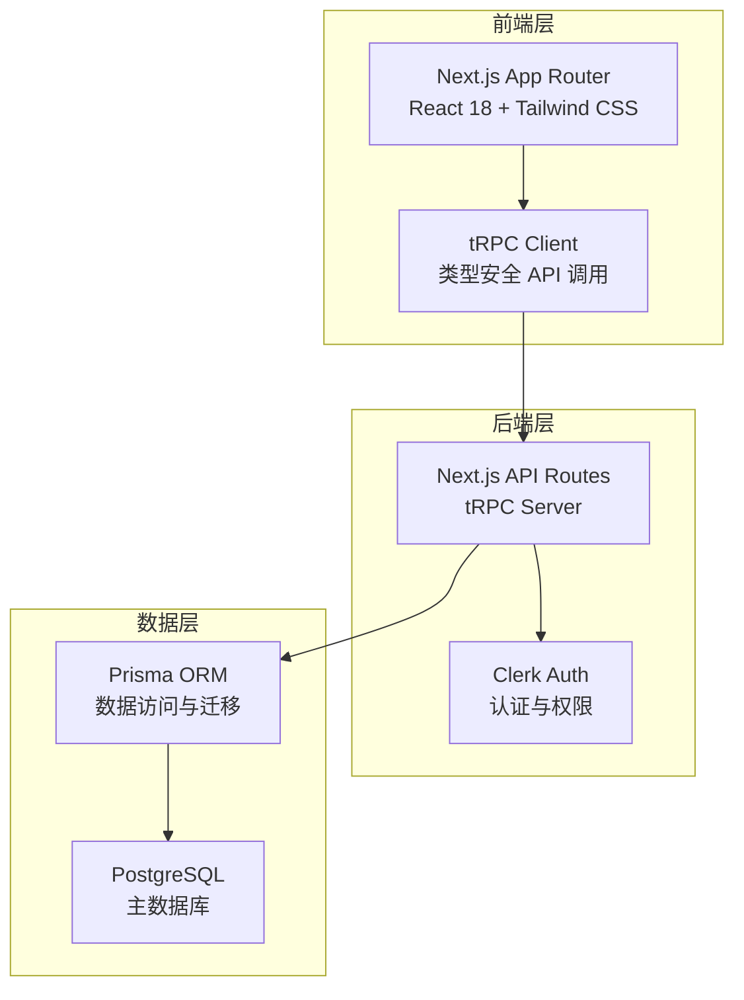
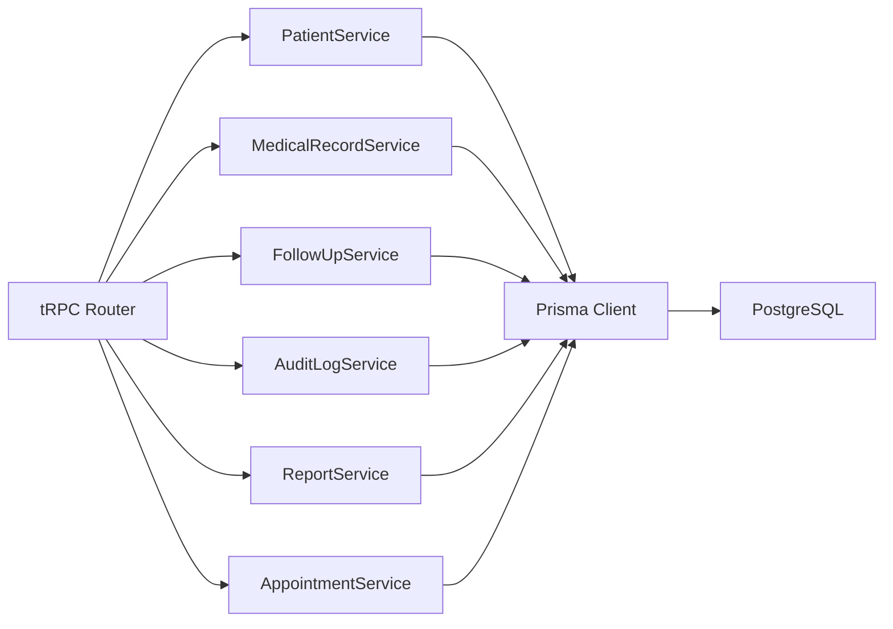
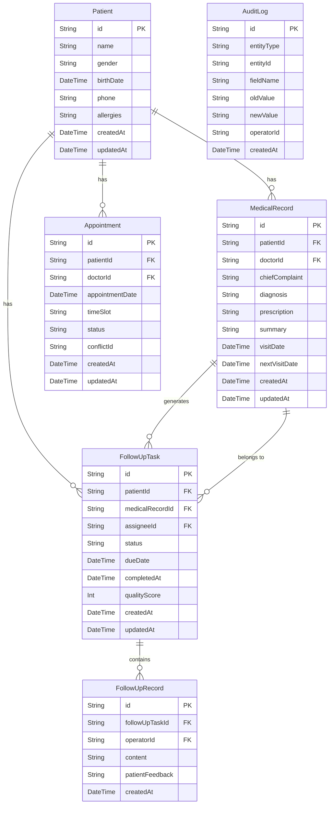

## 1. 架构设计



## 2. 技术说明

- 前端：Next.js 14 (App Router) + React 18 + Tailwind CSS + Zustand
- 后端：Next.js API Routes + tRPC (类型安全全栈 RPC)
- 认证：Clerk（用户管理、角色权限、邀请注册）
- 数据库：PostgreSQL + Prisma ORM
- 初始化工具：create-next-app
- 状态管理：Zustand
- 图标库：lucide-react
- 图表库：recharts

## 3. 路由定义

| 路由 | 用途 |
|------|------|
| / | 病历随访台（核心首页） |
| /patients/[id] | 患者档案详情页 |
| /follow-ups | 随访任务管理页 |
| /follow-ups/[id] | 随访任务详情页 |
| /reports | 复诊率报表页 |
| /audit | 变更审计页 |
| /sign-in | Clerk 登录页 |
| /sign-up | Clerk 注册页 |

## 4. API 定义

### 4.1 tRPC Router 结构

```typescript
// 顶层路由
export const appRouter = router({
  patient: patientRouter,       // 患者相关
  medicalRecord: medicalRecordRouter, // 病历相关
  followUp: followUpRouter,     // 随访相关
  auditLog: auditLogRouter,     // 变更审计
  report: reportRouter,         // 报表相关
  appointment: appointmentRouter, // 号源相关
});

// 患者 Router
patientRouter = {
  list: publicProcedure.query(),           // 患者列表
  getById: publicProcedure.query(),        // 患者详情
  create: publicProcedure.mutation(),      // 创建患者
  update: publicProcedure.mutation(),      // 更新患者（触发审计）
};

// 病历 Router
medicalRecordRouter = {
  list: publicProcedure.query(),           // 病历列表
  getById: publicProcedure.query(),        // 病历详情
  create: publicProcedure.mutation(),      // 创建病历
  update: publicProcedure.mutation(),      // 更新病历（触发审计）
  getSummary: publicProcedure.query(),     // 获取病例摘要
  updateSummary: publicProcedure.mutation(), // 维护病例摘要
};

// 随访 Router
followUpRouter = {
  list: publicProcedure.query(),           // 随访任务列表
  getById: publicProcedure.query(),        // 随访详情
  create: publicProcedure.mutation(),      // 创建随访任务
  assign: publicProcedure.mutation(),      // 分配随访专员
  updateStatus: publicProcedure.mutation(), // 更新随访状态
  addRecord: publicProcedure.mutation(),   // 录入随访记录
  getConflicts: publicProcedure.query(),   // 获取号源冲突
  resolveConflict: publicProcedure.mutation(), // 解决号源冲突
};

// 审计 Router
auditLogRouter = {
  list: publicProcedure.query(),           // 审计记录列表
  getByEntity: publicProcedure.query(),    // 按实体查询变更
};

// 报表 Router
reportRouter = {
  getFollowUpRate: publicProcedure.query(),  // 复诊率统计
  getFollowUpRateTrend: publicProcedure.query(), // 复诊率趋势
  getFollowUpRateByDoctor: publicProcedure.query(), // 按医师统计
};

// 号源 Router
appointmentRouter = {
  list: publicProcedure.query(),           // 号源列表
  create: publicProcedure.mutation(),      // 创建号源
  update: publicProcedure.mutation(),      // 更新号源
  detectConflicts: publicProcedure.query(), // 检测冲突
};
```

### 4.2 核心类型定义

```typescript
type Patient = {
  id: string;
  name: string;
  gender: "MALE" | "FEMALE";
  birthDate: Date;
  phone: string;
  allergies: string;
  createdAt: Date;
  updatedAt: Date;
};

type MedicalRecord = {
  id: string;
  patientId: string;
  doctorId: string;
  chiefComplaint: string;
  diagnosis: string;
  prescription: string;
  summary: string;
  visitDate: Date;
  nextVisitDate: Date | null;
  createdAt: Date;
  updatedAt: Date;
};

type FollowUpTask = {
  id: string;
  patientId: string;
  medicalRecordId: string;
  assigneeId: string | null;
  status: "PENDING" | "IN_PROGRESS" | "COMPLETED" | "LOST";
  dueDate: Date;
  completedAt: Date | null;
  qualityScore: number | null;
  createdAt: Date;
  updatedAt: Date;
};

type FollowUpRecord = {
  id: string;
  followUpTaskId: string;
  operatorId: string;
  content: string;
  patientFeedback: string;
  createdAt: Date;
};

type AuditLog = {
  id: string;
  entityType: string;
  entityId: string;
  fieldName: string;
  oldValue: string | null;
  newValue: string | null;
  operatorId: string;
  createdAt: Date;
};

type Appointment = {
  id: string;
  patientId: string;
  doctorId: string;
  appointmentDate: Date;
  timeSlot: string;
  status: "SCHEDULED" | "CONFLICT" | "RESCHEDULED" | "CANCELLED";
  conflictId: string | null;
  createdAt: Date;
  updatedAt: Date;
};
```

## 5. 服务架构图



## 6. 数据模型

### 6.1 数据模型定义



### 6.2 数据定义语言

```sql
CREATE TABLE "Patient" (
  "id" TEXT PRIMARY KEY DEFAULT gen_random_uuid(),
  "name" TEXT NOT NULL,
  "gender" TEXT NOT NULL CHECK ("gender" IN ('MALE', 'FEMALE')),
  "birthDate" TIMESTAMP NOT NULL,
  "phone" TEXT NOT NULL,
  "allergies" TEXT DEFAULT '',
  "createdAt" TIMESTAMP NOT NULL DEFAULT NOW(),
  "updatedAt" TIMESTAMP NOT NULL DEFAULT NOW()
);

CREATE TABLE "MedicalRecord" (
  "id" TEXT PRIMARY KEY DEFAULT gen_random_uuid(),
  "patientId" TEXT NOT NULL REFERENCES "Patient"("id") ON DELETE CASCADE,
  "doctorId" TEXT NOT NULL,
  "chiefComplaint" TEXT NOT NULL,
  "diagnosis" TEXT NOT NULL DEFAULT '',
  "prescription" TEXT NOT NULL DEFAULT '',
  "summary" TEXT DEFAULT '',
  "visitDate" TIMESTAMP NOT NULL,
  "nextVisitDate" TIMESTAMP,
  "createdAt" TIMESTAMP NOT NULL DEFAULT NOW(),
  "updatedAt" TIMESTAMP NOT NULL DEFAULT NOW()
);

CREATE TABLE "FollowUpTask" (
  "id" TEXT PRIMARY KEY DEFAULT gen_random_uuid(),
  "patientId" TEXT NOT NULL REFERENCES "Patient"("id") ON DELETE CASCADE,
  "medicalRecordId" TEXT NOT NULL REFERENCES "MedicalRecord"("id") ON DELETE CASCADE,
  "assigneeId" TEXT,
  "status" TEXT NOT NULL DEFAULT 'PENDING' CHECK ("status" IN ('PENDING', 'IN_PROGRESS', 'COMPLETED', 'LOST')),
  "dueDate" TIMESTAMP NOT NULL,
  "completedAt" TIMESTAMP,
  "qualityScore" INTEGER,
  "createdAt" TIMESTAMP NOT NULL DEFAULT NOW(),
  "updatedAt" TIMESTAMP NOT NULL DEFAULT NOW()
);

CREATE TABLE "FollowUpRecord" (
  "id" TEXT PRIMARY KEY DEFAULT gen_random_uuid(),
  "followUpTaskId" TEXT NOT NULL REFERENCES "FollowUpTask"("id") ON DELETE CASCADE,
  "operatorId" TEXT NOT NULL,
  "content" TEXT NOT NULL,
  "patientFeedback" TEXT DEFAULT '',
  "createdAt" TIMESTAMP NOT NULL DEFAULT NOW()
);

CREATE TABLE "AuditLog" (
  "id" TEXT PRIMARY KEY DEFAULT gen_random_uuid(),
  "entityType" TEXT NOT NULL,
  "entityId" TEXT NOT NULL,
  "fieldName" TEXT NOT NULL,
  "oldValue" TEXT,
  "newValue" TEXT,
  "operatorId" TEXT NOT NULL,
  "createdAt" TIMESTAMP NOT NULL DEFAULT NOW()
);

CREATE TABLE "Appointment" (
  "id" TEXT PRIMARY KEY DEFAULT gen_random_uuid(),
  "patientId" TEXT NOT NULL REFERENCES "Patient"("id") ON DELETE CASCADE,
  "doctorId" TEXT NOT NULL,
  "appointmentDate" TIMESTAMP NOT NULL,
  "timeSlot" TEXT NOT NULL,
  "status" TEXT NOT NULL DEFAULT 'SCHEDULED' CHECK ("status" IN ('SCHEDULED', 'CONFLICT', 'RESCHEDULED', 'CANCELLED')),
  "conflictId" TEXT,
  "createdAt" TIMESTAMP NOT NULL DEFAULT NOW(),
  "updatedAt" TIMESTAMP NOT NULL DEFAULT NOW()
);

CREATE INDEX idx_medical_record_patient ON "MedicalRecord"("patientId");
CREATE INDEX idx_medical_record_doctor ON "MedicalRecord"("doctorId");
CREATE INDEX idx_follow_up_task_status ON "FollowUpTask"("status");
CREATE INDEX idx_follow_up_task_assignee ON "FollowUpTask"("assigneeId");
CREATE INDEX idx_follow_up_task_due ON "FollowUpTask"("dueDate");
CREATE INDEX idx_follow_up_record_task ON "FollowUpRecord"("followUpTaskId");
CREATE INDEX idx_audit_log_entity ON "AuditLog"("entityType", "entityId");
CREATE INDEX idx_audit_log_created ON "AuditLog"("createdAt");
CREATE INDEX idx_appointment_date ON "Appointment"("appointmentDate");
CREATE INDEX idx_appointment_doctor ON "Appointment"("doctorId");
CREATE INDEX idx_appointment_status ON "Appointment"("status");
```
