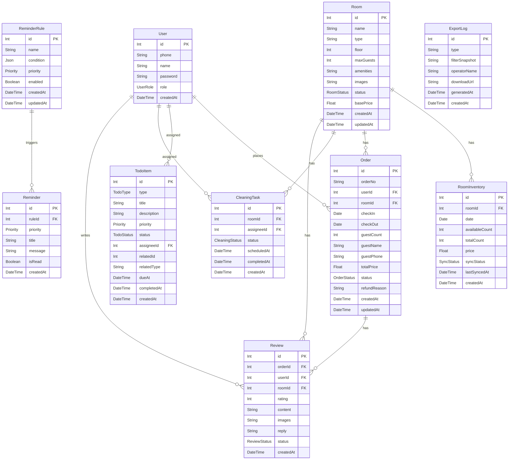

## 1. 架构设计

```mermaid
graph TB
    subgraph "前端层"
        "Nuxt 3 用户侧" --> "Nitro API"
        "Nuxt 3 管理侧" --> "Nitro API"
    end
    subgraph "服务层 - Nitro"
        "Nitro API" --> "房态服务"
        "Nitro API" --> "订单服务"
        "Nitro API" --> "待办服务"
        "Nitro API" --> "提醒服务"
        "Nitro API" --> "导出服务"
    end
    subgraph "数据层"
        "房态服务" --> "MySQL"
        "订单服务" --> "MySQL"
        "待办服务" --> "MySQL"
        "提醒服务" --> "Redis"
        "提醒服务" --> "MySQL"
        "导出服务" --> "MySQL"
        "房态服务" --> "Redis"
    end
```

## 2. 技术说明

- **前端**: Nuxt 3 + Tailwind CSS 3 + Vue 3 Composition API
- **初始化工具**: npx nuxi@latest init
- **后端**: Nitro (Nuxt 内置服务引擎)
- **ORM**: Prisma 5 + @prisma/client
- **数据库**: MySQL 8.0
- **缓存/队列**: Redis 7 (房态缓存 + 提醒队列 + 会话存储)
- **图表**: Chart.js + vue-chartjs
- **导出**: exceljs (Excel 导出保留筛选口径)

## 3. 路由定义

| 路由 | 用途 | 权限 |
|------|------|------|
| `/` | 用户侧首页，房态日历与房型列表 | 公开 |
| `/room/[id]` | 房间详情页，实时房态与评价 | 公开 |
| `/order` | 订单中心，下单与退款 | 住客 |
| `/order/[id]` | 订单详情 | 住客 |
| `/admin` | 管理仪表盘，房态总览与看板 | 运营/管理员 |
| `/admin/rooms` | 房态管理页，日历编辑与库存同步 | 运营/管理员 |
| `/admin/todos` | 待办中心，待办列表与分级提醒 | 运营/管理员 |
| `/admin/reports` | 报表导出页，统计与导出 | 运营/管理员 |
| `/admin/reminders` | 提醒规则配置页 | 管理员 |
| `/login` | 登录页 | 公开 |

## 4. API 定义

### 4.1 房态相关

```typescript
interface Room {
  id: number
  name: string
  type: string
  floor: number
  maxGuests: number
  amenities: string[]
  images: string[]
  status: RoomStatus
  basePrice: number
}

type RoomStatus = 'AVAILABLE' | 'BOOKED' | 'OCCUPIED' | 'MAINTENANCE' | 'CLEANING'

interface RoomInventory {
  id: number
  roomId: number
  date: string
  availableCount: number
  totalCount: number
  price: number
  syncStatus: SyncStatus
  lastSyncedAt: string | null
}

type SyncStatus = 'PENDING' | 'SYNCING' | 'SYNCED' | 'FAILED'

// GET /api/rooms/inventory?startDate=2026-06-12&endDate=2026-06-20&type=DELUXE
interface GetInventoryQuery {
  startDate: string
  endDate: string
  type?: string
  status?: RoomStatus
}

interface GetInventoryResponse {
  inventories: RoomInventory[]
  rooms: Room[]
}

// PUT /api/rooms/inventory/:id
interface UpdateInventoryBody {
  availableCount?: number
  price?: number
  status?: RoomStatus
}

// POST /api/rooms/inventory/sync
interface SyncInventoryBody {
  roomIds?: number[]
  dateRange: { start: string; end: string }
}
```

### 4.2 订单相关

```typescript
interface Order {
  id: number
  orderNo: string
  userId: number
  roomId: number
  checkIn: string
  checkOut: string
  guestCount: number
  guestName: string
  guestPhone: string
  totalPrice: number
  status: OrderStatus
  refundReason: string | null
  createdAt: string
  updatedAt: string
}

type OrderStatus = 'PENDING_PAYMENT' | 'PAID' | 'CHECKED_IN' | 'CHECKED_OUT' | 'REFUNDING' | 'REFUNDED' | 'CANCELLED'

// POST /api/orders
interface CreateOrderBody {
  roomId: number
  checkIn: string
  checkOut: string
  guestCount: number
  guestName: string
  guestPhone: string
}

// POST /api/orders/:id/refund
interface RefundOrderBody {
  reason: string
}

// GET /api/orders?status=PAID&page=1&pageSize=20
interface GetOrdersQuery {
  status?: OrderStatus
  page?: number
  pageSize?: number
  startDate?: string
  endDate?: string
}
```

### 4.3 待办相关

```typescript
interface TodoItem {
  id: number
  type: TodoType
  title: string
  description: string
  priority: Priority
  status: TodoStatus
  assigneeId: number
  relatedId: number
  relatedType: 'ORDER' | 'CLEANING' | 'REVIEW'
  dueAt: string | null
  completedAt: string | null
  createdAt: string
}

type TodoType = 'REFUND_APPROVAL' | 'CLEANING' | 'REVIEW_REPLY'
type Priority = 'P0' | 'P1' | 'P2'
type TodoStatus = 'PENDING' | 'IN_PROGRESS' | 'COMPLETED'

// GET /api/todos?status=PENDING&priority=P0
interface GetTodosQuery {
  status?: TodoStatus
  priority?: Priority
  type?: TodoType
  assigneeId?: number
}

// PUT /api/todos/:id/complete
interface CompleteTodoResponse {
  todo: TodoItem
  vacancyUpdated: boolean
}
```

### 4.4 提醒相关

```typescript
interface ReminderRule {
  id: number
  name: string
  condition: ReminderCondition
  priority: Priority
  enabled: boolean
  createdAt: string
}

interface ReminderCondition {
  field: 'availableCount' | 'vacancyRate'
  operator: 'LT' | 'LTE' | 'GT' | 'GTE' | 'EQ'
  value: number
  timeWindow?: string
}

interface Reminder {
  id: number
  ruleId: number
  priority: Priority
  title: string
  message: string
  isRead: boolean
  createdAt: string
}

// GET /api/reminders?priority=P0&isRead=false
interface GetRemindersQuery {
  priority?: Priority
  isRead?: boolean
}

// PUT /api/reminders/:id/read
interface MarkReminderReadResponse {
  success: boolean
}

// POST /api/reminders/rules
interface CreateReminderRuleBody {
  name: string
  condition: ReminderCondition
  priority: Priority
  enabled: boolean
}
```

### 4.5 评价相关

```typescript
interface Review {
  id: number
  orderId: number
  userId: number
  roomId: number
  rating: number
  content: string
  images: string[]
  reply: string | null
  status: ReviewStatus
  createdAt: string
}

type ReviewStatus = 'PENDING_REPLY' | 'REPLIED'

// POST /api/reviews
interface CreateReviewBody {
  orderId: number
  rating: number
  content: string
  images?: string[]
}

// PUT /api/reviews/:id/reply
interface ReplyReviewBody {
  reply: string
}
```

### 4.6 导出相关

```typescript
// POST /api/reports/export
interface ExportReportBody {
  type: 'OCCUPANCY' | 'CONVERSION' | 'REVENUE' | 'REFUND'
  filters: {
    startDate: string
    endDate: string
    roomType?: string
    status?: string
    [key: string]: string | number | undefined
  }
  operatorName: string
}

interface ExportReportResponse {
  downloadUrl: string
  filterSnapshot: string
  generatedAt: string
  operator: string
}
```

### 4.7 统计相关

```typescript
// GET /api/stats/dashboard
interface DashboardStats {
  totalRooms: number
  availableRooms: number
  occupancyRate: number
  pendingTodos: number
  p0Reminders: number
  todayCheckIns: number
  todayCheckOuts: number
  vacancyTrend: { date: string; rate: number }[]
}
```

## 5. 服务架构图

```mermaid
graph LR
    subgraph "Controller 层"
        "RoomController" --> "RoomService"
        "OrderController" --> "OrderService"
        "TodoController" --> "TodoService"
        "ReminderController" --> "ReminderService"
        "ReportController" --> "ReportService"
        "ReviewController" --> "ReviewService"
    end
    subgraph "Service 层"
        "RoomService" --> "RoomRepo"
        "RoomService" --> "RedisCache"
        "OrderService" --> "OrderRepo"
        "TodoService" --> "TodoRepo"
        "TodoService" --> "ReminderService"
        "ReminderService" --> "ReminderRepo"
        "ReminderService" --> "RedisQueue"
        "ReportService" --> "OrderRepo"
        "ReportService" --> "RoomRepo"
        "ReviewService" --> "ReviewRepo"
        "ReviewService" --> "TodoService"
    end
    subgraph "Repository 层"
        "RoomRepo" --> "MySQL"
        "OrderRepo" --> "MySQL"
        "TodoRepo" --> "MySQL"
        "ReminderRepo" --> "MySQL"
        "ReviewRepo" --> "MySQL"
        "RedisCache" --> "Redis"
        "RedisQueue" --> "Redis"
    end
```

## 6. 数据模型

### 6.1 数据模型定义



### 6.2 数据定义语言

```sql
CREATE TABLE `Room` (
  `id` INT AUTO_INCREMENT PRIMARY KEY,
  `name` VARCHAR(100) NOT NULL,
  `type` VARCHAR(50) NOT NULL,
  `floor` INT NOT NULL DEFAULT 1,
  `maxGuests` INT NOT NULL DEFAULT 2,
  `amenities` JSON,
  `images` JSON,
  `status` ENUM('AVAILABLE','BOOKED','OCCUPIED','MAINTENANCE','CLEANING') NOT NULL DEFAULT 'AVAILABLE',
  `basePrice` DECIMAL(10,2) NOT NULL,
  `createdAt` DATETIME(3) NOT NULL DEFAULT CURRENT_TIMESTAMP(3),
  `updatedAt` DATETIME(3) NOT NULL DEFAULT CURRENT_TIMESTAMP(3) ON UPDATE CURRENT_TIMESTAMP(3),
  INDEX `idx_room_type` (`type`),
  INDEX `idx_room_status` (`status`)
) ENGINE=InnoDB DEFAULT CHARSET=utf8mb4;

CREATE TABLE `RoomInventory` (
  `id` INT AUTO_INCREMENT PRIMARY KEY,
  `roomId` INT NOT NULL,
  `date` DATE NOT NULL,
  `availableCount` INT NOT NULL DEFAULT 1,
  `totalCount` INT NOT NULL DEFAULT 1,
  `price` DECIMAL(10,2) NOT NULL,
  `syncStatus` ENUM('PENDING','SYNCING','SYNCED','FAILED') NOT NULL DEFAULT 'PENDING',
  `lastSyncedAt` DATETIME(3) NULL,
  `createdAt` DATETIME(3) NOT NULL DEFAULT CURRENT_TIMESTAMP(3),
  UNIQUE INDEX `idx_room_date` (`roomId`, `date`),
  INDEX `idx_inventory_date` (`date`),
  INDEX `idx_inventory_sync` (`syncStatus`),
  FOREIGN KEY (`roomId`) REFERENCES `Room`(`id`) ON DELETE CASCADE
) ENGINE=InnoDB DEFAULT CHARSET=utf8mb4;

CREATE TABLE `User` (
  `id` INT AUTO_INCREMENT PRIMARY KEY,
  `phone` VARCHAR(20) NOT NULL UNIQUE,
  `name` VARCHAR(50) NOT NULL,
  `password` VARCHAR(255) NOT NULL,
  `role` ENUM('GUEST','OPERATOR','CLEANER','ADMIN') NOT NULL DEFAULT 'GUEST',
  `createdAt` DATETIME(3) NOT NULL DEFAULT CURRENT_TIMESTAMP(3),
  INDEX `idx_user_role` (`role`)
) ENGINE=InnoDB DEFAULT CHARSET=utf8mb4;

CREATE TABLE `Order` (
  `id` INT AUTO_INCREMENT PRIMARY KEY,
  `orderNo` VARCHAR(32) NOT NULL UNIQUE,
  `userId` INT NOT NULL,
  `roomId` INT NOT NULL,
  `checkIn` DATE NOT NULL,
  `checkOut` DATE NOT NULL,
  `guestCount` INT NOT NULL DEFAULT 1,
  `guestName` VARCHAR(50) NOT NULL,
  `guestPhone` VARCHAR(20) NOT NULL,
  `totalPrice` DECIMAL(10,2) NOT NULL,
  `status` ENUM('PENDING_PAYMENT','PAID','CHECKED_IN','CHECKED_OUT','REFUNDING','REFUNDED','CANCELLED') NOT NULL DEFAULT 'PENDING_PAYMENT',
  `refundReason` TEXT NULL,
  `createdAt` DATETIME(3) NOT NULL DEFAULT CURRENT_TIMESTAMP(3),
  `updatedAt` DATETIME(3) NOT NULL DEFAULT CURRENT_TIMESTAMP(3) ON UPDATE CURRENT_TIMESTAMP(3),
  INDEX `idx_order_user` (`userId`),
  INDEX `idx_order_room` (`roomId`),
  INDEX `idx_order_status` (`status`),
  INDEX `idx_order_checkin` (`checkIn`),
  INDEX `idx_order_checkout` (`checkOut`),
  FOREIGN KEY (`userId`) REFERENCES `User`(`id`),
  FOREIGN KEY (`roomId`) REFERENCES `Room`(`id`)
) ENGINE=InnoDB DEFAULT CHARSET=utf8mb4;

CREATE TABLE `TodoItem` (
  `id` INT AUTO_INCREMENT PRIMARY KEY,
  `type` ENUM('REFUND_APPROVAL','CLEANING','REVIEW_REPLY') NOT NULL,
  `title` VARCHAR(200) NOT NULL,
  `description` TEXT,
  `priority` ENUM('P0','P1','P2') NOT NULL DEFAULT 'P2',
  `status` ENUM('PENDING','IN_PROGRESS','COMPLETED') NOT NULL DEFAULT 'PENDING',
  `assigneeId` INT NOT NULL,
  `relatedId` INT NOT NULL,
  `relatedType` ENUM('ORDER','CLEANING','REVIEW') NOT NULL,
  `dueAt` DATETIME(3) NULL,
  `completedAt` DATETIME(3) NULL,
  `createdAt` DATETIME(3) NOT NULL DEFAULT CURRENT_TIMESTAMP(3),
  INDEX `idx_todo_assignee` (`assigneeId`),
  INDEX `idx_todo_status` (`status`),
  INDEX `idx_todo_priority` (`priority`),
  INDEX `idx_todo_type` (`type`),
  FOREIGN KEY (`assigneeId`) REFERENCES `User`(`id`)
) ENGINE=InnoDB DEFAULT CHARSET=utf8mb4;

CREATE TABLE `ReminderRule` (
  `id` INT AUTO_INCREMENT PRIMARY KEY,
  `name` VARCHAR(100) NOT NULL,
  `condition` JSON NOT NULL,
  `priority` ENUM('P0','P1','P2') NOT NULL DEFAULT 'P2',
  `enabled` BOOLEAN NOT NULL DEFAULT TRUE,
  `createdAt` DATETIME(3) NOT NULL DEFAULT CURRENT_TIMESTAMP(3),
  `updatedAt` DATETIME(3) NOT NULL DEFAULT CURRENT_TIMESTAMP(3) ON UPDATE CURRENT_TIMESTAMP(3)
) ENGINE=InnoDB DEFAULT CHARSET=utf8mb4;

CREATE TABLE `Reminder` (
  `id` INT AUTO_INCREMENT PRIMARY KEY,
  `ruleId` INT NULL,
  `priority` ENUM('P0','P1','P2') NOT NULL DEFAULT 'P2',
  `title` VARCHAR(200) NOT NULL,
  `message` TEXT NOT NULL,
  `isRead` BOOLEAN NOT NULL DEFAULT FALSE,
  `createdAt` DATETIME(3) NOT NULL DEFAULT CURRENT_TIMESTAMP(3),
  INDEX `idx_reminder_priority` (`priority`),
  INDEX `idx_reminder_read` (`isRead`),
  FOREIGN KEY (`ruleId`) REFERENCES `ReminderRule`(`id`) ON DELETE SET NULL
) ENGINE=InnoDB DEFAULT CHARSET=utf8mb4;

CREATE TABLE `Review` (
  `id` INT AUTO_INCREMENT PRIMARY KEY,
  `orderId` INT NOT NULL,
  `userId` INT NOT NULL,
  `roomId` INT NOT NULL,
  `rating` INT NOT NULL CHECK (`rating` BETWEEN 1 AND 5),
  `content` TEXT NOT NULL,
  `images` JSON,
  `reply` TEXT NULL,
  `status` ENUM('PENDING_REPLY','REPLIED') NOT NULL DEFAULT 'PENDING_REPLY',
  `createdAt` DATETIME(3) NOT NULL DEFAULT CURRENT_TIMESTAMP(3),
  INDEX `idx_review_room` (`roomId`),
  INDEX `idx_review_status` (`status`),
  FOREIGN KEY (`orderId`) REFERENCES `Order`(`id`),
  FOREIGN KEY (`userId`) REFERENCES `User`(`id`),
  FOREIGN KEY (`roomId`) REFERENCES `Room`(`id`)
) ENGINE=InnoDB DEFAULT CHARSET=utf8mb4;

CREATE TABLE `CleaningTask` (
  `id` INT AUTO_INCREMENT PRIMARY KEY,
  `roomId` INT NOT NULL,
  `assigneeId` INT NOT NULL,
  `status` ENUM('PENDING','IN_PROGRESS','COMPLETED') NOT NULL DEFAULT 'PENDING',
  `scheduledAt` DATETIME(3) NOT NULL,
  `completedAt` DATETIME(3) NULL,
  `createdAt` DATETIME(3) NOT NULL DEFAULT CURRENT_TIMESTAMP(3),
  INDEX `idx_cleaning_room` (`roomId`),
  INDEX `idx_cleaning_assignee` (`assigneeId`),
  INDEX `idx_cleaning_status` (`status`),
  FOREIGN KEY (`roomId`) REFERENCES `Room`(`id`),
  FOREIGN KEY (`assigneeId`) REFERENCES `User`(`id`)
) ENGINE=InnoDB DEFAULT CHARSET=utf8mb4;

CREATE TABLE `ExportLog` (
  `id` INT AUTO_INCREMENT PRIMARY KEY,
  `type` VARCHAR(50) NOT NULL,
  `filterSnapshot` JSON NOT NULL,
  `operatorName` VARCHAR(50) NOT NULL,
  `downloadUrl` VARCHAR(500) NOT NULL,
  `generatedAt` DATETIME(3) NOT NULL DEFAULT CURRENT_TIMESTAMP(3),
  `createdAt` DATETIME(3) NOT NULL DEFAULT CURRENT_TIMESTAMP(3),
  INDEX `idx_export_type` (`type`),
  INDEX `idx_export_operator` (`operatorName`)
) ENGINE=InnoDB DEFAULT CHARSET=utf8mb4;
```
