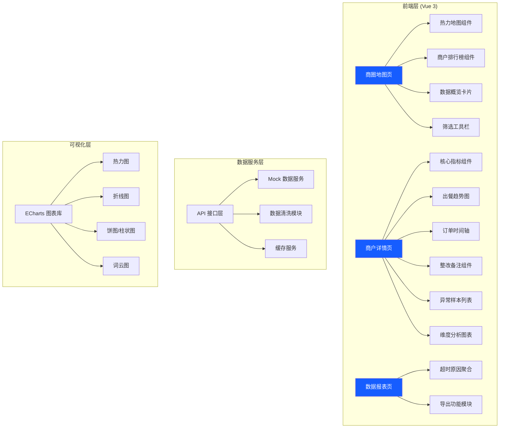
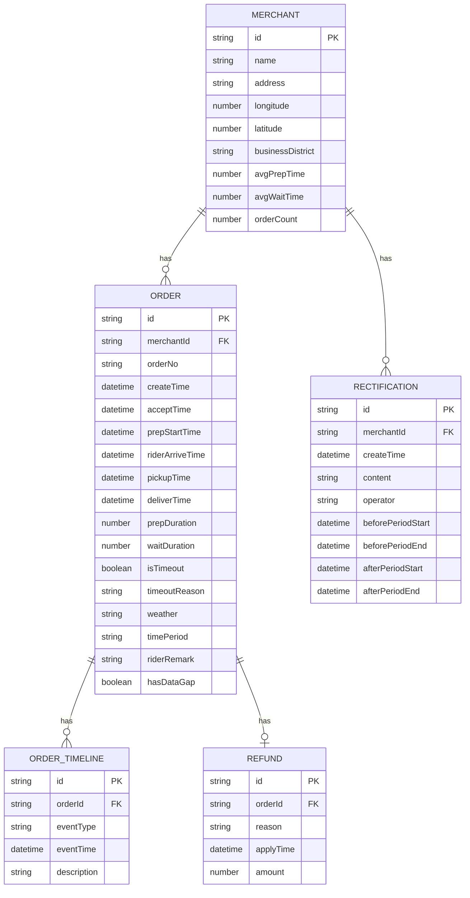

## 1. 架构设计



## 2. 技术描述

- **前端框架**：Vue 3.4 + TypeScript + Vite 5
- **UI 组件库**：Element Plus
- **图表库**：ECharts 5.5
- **路由**：Vue Router 4
- **状态管理**：Pinia
- **HTTP 客户端**：Axios
- **图标**：Lucide Vue
- **样式方案**：SCSS + CSS Variables
- **Mock 数据**：MSW (Mock Service Worker)
- **后端**：前端独立 Mock，不依赖真实后端
- **数据存储**：LocalStorage (整改备注、用户偏好)

## 3. 路由定义

| 路由 | 页面 | 用途 |
|------|------|------|
| `/` | 商圈地图页 | 首页，展示商圈整体出餐情况热力分布 |
| `/merchant/:id` | 商户详情页 | 商户各环节时长分析、整改记录、异常样本 |
| `/reports` | 数据报表页 | 超时原因聚合、报表导出 |

## 4. 数据模型

### 4.1 核心数据结构



### 4.2 核心计算规则

1. **备餐时长 (prepDuration)** = 备餐开始时间 - 商户接单时间
2. **骑手等待时长 (waitDuration)** = 取餐时间 - 骑手到店时间
   - 若骑手到店时间缺失，该订单不计入等待均值，标记为数据缺口
3. **总出餐时长** = 取餐时间 - 商户接单时间
4. **超时判定**：备餐时长 > 阈值 或 等待时长 > 阈值（阈值可配置）

### 4.3 缓存策略

- 商户排行榜数据：5 分钟缓存
- 热力图数据：10 分钟缓存
- 商户详情基础数据：2 分钟缓存
- 整改备注：实时读写 LocalStorage

## 5. 核心模块设计

### 5.1 数据清洗模块

职责：处理原始订单时间戳，计算各环节时长，标记数据缺口

```typescript
interface OrderRaw {
  id: string;
  merchantId: string;
  createTime: string;
  acceptTime?: string;
  prepStartTime?: string;
  riderArriveTime?: string;
  pickupTime?: string;
}

function cleanOrderData(raw: OrderRaw): ProcessedOrder {
  const result: ProcessedOrder = { ...raw, hasDataGap: false };
  
  // 时间戳标准化
  const times = ['acceptTime', 'prepStartTime', 'riderArriveTime', 'pickupTime'];
  times.forEach(t => {
    if (result[t]) result[t] = normalizeTimestamp(result[t]);
  });
  
  // 计算备餐时长
  if (result.acceptTime && result.prepStartTime) {
    result.prepDuration = diffMinutes(result.prepStartTime, result.acceptTime);
  }
  
  // 计算等待时长（骑手到店时间缺失则标记数据缺口）
  if (result.riderArriveTime && result.pickupTime) {
    result.waitDuration = diffMinutes(result.pickupTime, result.riderArriveTime);
  } else {
    result.hasDataGap = true;
  }
  
  return result;
}
```

### 5.2 超时原因聚合模块

```typescript
function aggregateTimeoutReasons(orders: ProcessedOrder[]): ReasonAggregation[] {
  const validOrders = orders.filter(o => o.isTimeout && !o.hasDataGap);
  const groups = groupBy(validOrders, 'timeoutReason');
  return Object.entries(groups).map(([reason, list]) => ({
    reason,
    count: list.length,
    percentage: list.length / validOrders.length
  })).sort((a, b) => b.count - a.count);
}
```

### 5.3 整改对比模块

```typescript
function compareRectification(
  merchantId: string,
  rectificationTime: Date
): { before: Metrics; after: Metrics } {
  const beforeOrders = getOrdersByPeriod(merchantId, 
    addDays(rectificationTime, -14), 
    addDays(rectificationTime, -1)
  );
  const afterOrders = getOrdersByPeriod(merchantId,
    addDays(rectificationTime, 1),
    addDays(rectificationTime, 14)
  );
  
  return {
    before: calculateMetrics(beforeOrders),
    after: calculateMetrics(afterOrders)
  };
}
```
