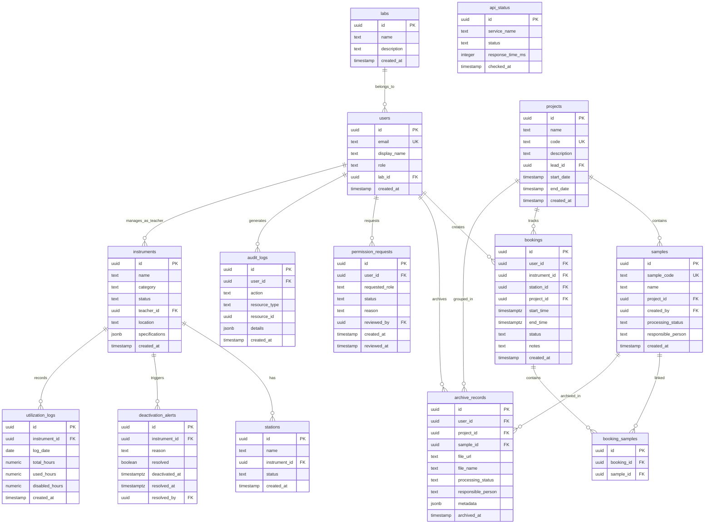

## 1. 架构设计

```mermaid
graph TB
    subgraph "前端层"
        "Next.js App Router" --> "Server Components"
        "Next.js App Router" --> "Client Components"
        "Next.js App Router" --> "API Routes"
    end

    subgraph "服务层"
        "API Routes" --> "Supabase Client"
        "Server Components" --> "Supabase Client"
        "Client Components" --> "Supabase Client"
    end

    subgraph "数据层"
        "Supabase Client" --> "PostgreSQL"
        "Supabase Client" --> "Supabase Auth"
        "Supabase Client" --> "Supabase Storage"
        "Supabase Client" --> "Supabase Realtime"
    end

    subgraph "外部服务"
        "Supabase Auth" --> "邮件通知"
        "Supabase Realtime" --> "设备停用推送"
    end
```

## 2. 技术说明

- **前端**：Next.js 14 (App Router) + Tailwind CSS 3 + shadcn/ui
- **初始化工具**：create-next-app
- **后端**：Next.js API Routes + Supabase Server/Client
- **数据库**：PostgreSQL (通过 Supabase 托管)
- **认证**：Supabase Auth + Row Level Security (RLS)
- **实时通信**：Supabase Realtime（设备停用提醒推送）
- **文件存储**：Supabase Storage（实验数据文件）
- **图表**：Recharts
- **日期处理**：date-fns
- **图标**：lucide-react

## 3. 路由定义

| 路由 | 用途 |
|------|------|
| `/login` | 登录/注册页面 |
| `/` | 首页仪表盘概览 |
| `/booking` | 预约大厅 - 仪器列表与台位日历 |
| `/booking/new` | 创建新预约 |
| `/booking/mine` | 我的预约记录 |
| `/archive` | 数据归档 - 归档列表 |
| `/archive/upload` | 上传实验数据 |
| `/api-status` | 接口状态看板 |
| `/permissions` | 权限控制中心 |
| `/permissions/audit` | 权限审核队列 |
| `/permissions/logs` | 操作日志 |
| `/equipment` | 设备利用率看板 |
| `/equipment/alerts` | 设备停用提醒 |
| `/admin/samples` | 样本去向追踪 |
| `/admin/reports` | 课题报表 |
| `/admin/filter` | 管理员筛选面板 |

## 4. API 定义

### 4.1 认证接口

```typescript
interface AuthUser {
  id: string
  email: string
  role: 'researcher' | 'archivist' | 'admin' | 'equipment_teacher'
  display_name: string
  lab_id: string
}
```

### 4.2 预约接口

```typescript
interface Booking {
  id: string
  user_id: string
  instrument_id: string
  station_id: string
  start_time: string
  end_time: string
  sample_ids: string[]
  project_id: string
  status: 'pending' | 'confirmed' | 'cancelled' | 'completed'
  notes: string
  created_at: string
}

interface BookingCreateRequest {
  instrument_id: string
  station_id: string
  start_time: string
  end_time: string
  sample_ids: string[]
  project_id: string
  notes?: string
}

interface BookingConflictResponse {
  has_conflict: boolean
  conflicting_bookings: Booking[]
}
```

### 4.3 数据归档接口

```typescript
interface ArchiveRecord {
  id: string
  user_id: string
  project_id: string
  sample_id: string
  processing_status: 'pending' | 'in_progress' | 'completed'
  responsible_person: string
  file_url: string
  file_name: string
  metadata: Record<string, string>
  archived_at: string
}
```

### 4.4 设备接口

```typescript
interface Instrument {
  id: string
  name: string
  category: string
  status: 'available' | 'in_use' | 'disabled'
  teacher_id: string
  location: string
  specifications: Record<string, string>
}

interface DeactivationAlert {
  id: string
  instrument_id: string
  reason: string
  deactivated_at: string
  resolved: boolean
  resolved_at?: string
  resolved_by?: string
}

interface UtilizationData {
  instrument_id: string
  instrument_name: string
  date: string
  total_hours: number
  used_hours: number
  utilization_rate: number
  disabled_hours: number
}
```

### 4.5 筛选与报表接口

```typescript
interface FilterParams {
  date_from?: string
  date_to?: string
  processing_status?: 'pending' | 'in_progress' | 'completed'
  responsible_person?: string
  project_id?: string
  instrument_id?: string
}

interface SampleTracking {
  sample_id: string
  timeline: Array<{
    timestamp: string
    action: string
    operator: string
    location: string
    notes: string
  }>
}

interface ProjectReport {
  project_id: string
  project_name: string
  booking_count: number
  total_hours: number
  sample_count: number
  team_members: string[]
}
```

## 5. 服务端架构图

```mermaid
graph LR
    "Next.js API Routes" --> "Service Layer"
    "Service Layer" --> "Supabase Query Builder"
    "Supabase Query Builder" --> "PostgreSQL"
    "Service Layer" --> "Supabase Storage"
    "Service Layer" --> "Supabase Realtime"
    "Next.js Middleware" --> "Auth Guard"
    "Auth Guard" --> "Role Check"
```

## 6. 数据模型

### 6.1 数据模型定义



### 6.2 数据定义语言

```sql
-- 实验室
CREATE TABLE labs (
  id UUID PRIMARY KEY DEFAULT gen_random_uuid(),
  name TEXT NOT NULL,
  description TEXT,
  created_at TIMESTAMPTZ DEFAULT now()
);

-- 用户（Supabase Auth 关联）
CREATE TABLE users (
  id UUID PRIMARY KEY REFERENCES auth.users(id),
  email TEXT NOT NULL UNIQUE,
  display_name TEXT NOT NULL,
  role TEXT NOT NULL CHECK (role IN ('researcher', 'archivist', 'admin', 'equipment_teacher')),
  lab_id UUID REFERENCES labs(id),
  created_at TIMESTAMPTZ DEFAULT now()
);

-- 课题
CREATE TABLE projects (
  id UUID PRIMARY KEY DEFAULT gen_random_uuid(),
  name TEXT NOT NULL,
  code TEXT NOT NULL UNIQUE,
  description TEXT,
  lead_id UUID REFERENCES users(id),
  start_date DATE,
  end_date DATE,
  created_at TIMESTAMPTZ DEFAULT now()
);

-- 仪器
CREATE TABLE instruments (
  id UUID PRIMARY KEY DEFAULT gen_random_uuid(),
  name TEXT NOT NULL,
  category TEXT NOT NULL,
  status TEXT NOT NULL DEFAULT 'available' CHECK (status IN ('available', 'in_use', 'disabled')),
  teacher_id UUID REFERENCES users(id),
  location TEXT,
  specifications JSONB DEFAULT '{}',
  created_at TIMESTAMPTZ DEFAULT now()
);

-- 台位
CREATE TABLE stations (
  id UUID PRIMARY KEY DEFAULT gen_random_uuid(),
  name TEXT NOT NULL,
  instrument_id UUID NOT NULL REFERENCES instruments(id),
  status TEXT NOT NULL DEFAULT 'available' CHECK (status IN ('available', 'occupied', 'disabled')),
  created_at TIMESTAMPTZ DEFAULT now()
);

-- 样本
CREATE TABLE samples (
  id UUID PRIMARY KEY DEFAULT gen_random_uuid(),
  sample_code TEXT NOT NULL UNIQUE,
  name TEXT NOT NULL,
  project_id UUID REFERENCES projects(id),
  created_by UUID REFERENCES users(id),
  processing_status TEXT NOT NULL DEFAULT 'pending' CHECK (processing_status IN ('pending', 'in_progress', 'completed')),
  responsible_person TEXT,
  created_at TIMESTAMPTZ DEFAULT now()
);

-- 预约
CREATE TABLE bookings (
  id UUID PRIMARY KEY DEFAULT gen_random_uuid(),
  user_id UUID NOT NULL REFERENCES users(id),
  instrument_id UUID NOT NULL REFERENCES instruments(id),
  station_id UUID NOT NULL REFERENCES stations(id),
  project_id UUID REFERENCES projects(id),
  start_time TIMESTAMPTZ NOT NULL,
  end_time TIMESTAMPTZ NOT NULL,
  status TEXT NOT NULL DEFAULT 'pending' CHECK (status IN ('pending', 'confirmed', 'cancelled', 'completed')),
  notes TEXT,
  created_at TIMESTAMPTZ DEFAULT now(),
  CONSTRAINT booking_time_check CHECK (end_time > start_time)
);

-- 预约-样本关联
CREATE TABLE booking_samples (
  id UUID PRIMARY KEY DEFAULT gen_random_uuid(),
  booking_id UUID NOT NULL REFERENCES bookings(id) ON DELETE CASCADE,
  sample_id UUID NOT NULL REFERENCES samples(id)
);

-- 归档记录
CREATE TABLE archive_records (
  id UUID PRIMARY KEY DEFAULT gen_random_uuid(),
  user_id UUID NOT NULL REFERENCES users(id),
  project_id UUID REFERENCES projects(id),
  sample_id UUID REFERENCES samples(id),
  file_url TEXT NOT NULL,
  file_name TEXT NOT NULL,
  processing_status TEXT NOT NULL DEFAULT 'pending' CHECK (processing_status IN ('pending', 'in_progress', 'completed')),
  responsible_person TEXT,
  metadata JSONB DEFAULT '{}',
  archived_at TIMESTAMPTZ DEFAULT now()
);

-- 停用提醒
CREATE TABLE deactivation_alerts (
  id UUID PRIMARY KEY DEFAULT gen_random_uuid(),
  instrument_id UUID NOT NULL REFERENCES instruments(id),
  reason TEXT NOT NULL,
  resolved BOOLEAN NOT NULL DEFAULT false,
  deactivated_at TIMESTAMPTZ DEFAULT now(),
  resolved_at TIMESTAMPTZ,
  resolved_by UUID REFERENCES users(id)
);

-- 利用率日志
CREATE TABLE utilization_logs (
  id UUID PRIMARY KEY DEFAULT gen_random_uuid(),
  instrument_id UUID NOT NULL REFERENCES instruments(id),
  log_date DATE NOT NULL,
  total_hours NUMERIC(6,2) NOT NULL DEFAULT 24,
  used_hours NUMERIC(6,2) NOT NULL DEFAULT 0,
  disabled_hours NUMERIC(6,2) NOT NULL DEFAULT 0,
  created_at TIMESTAMPTZ DEFAULT now(),
  UNIQUE(instrument_id, log_date)
);

-- 权限申请
CREATE TABLE permission_requests (
  id UUID PRIMARY KEY DEFAULT gen_random_uuid(),
  user_id UUID NOT NULL REFERENCES users(id),
  requested_role TEXT NOT NULL CHECK (requested_role IN ('researcher', 'archivist', 'admin', 'equipment_teacher')),
  status TEXT NOT NULL DEFAULT 'pending' CHECK (status IN ('pending', 'approved', 'rejected')),
  reason TEXT,
  reviewed_by UUID REFERENCES users(id),
  created_at TIMESTAMPTZ DEFAULT now(),
  reviewed_at TIMESTAMPTZ
);

-- 审计日志
CREATE TABLE audit_logs (
  id UUID PRIMARY KEY DEFAULT gen_random_uuid(),
  user_id UUID REFERENCES users(id),
  action TEXT NOT NULL,
  resource_type TEXT NOT NULL,
  resource_id UUID,
  details JSONB DEFAULT '{}',
  created_at TIMESTAMPTZ DEFAULT now()
);

-- 接口状态
CREATE TABLE api_status (
  id UUID PRIMARY KEY DEFAULT gen_random_uuid(),
  service_name TEXT NOT NULL,
  status TEXT NOT NULL CHECK (status IN ('healthy', 'degraded', 'down')),
  response_time_ms INTEGER,
  checked_at TIMESTAMPTZ DEFAULT now()
);

-- 索引
CREATE INDEX idx_bookings_user ON bookings(user_id);
CREATE INDEX idx_bookings_instrument ON bookings(instrument_id);
CREATE INDEX idx_bookings_station ON bookings(station_id);
CREATE INDEX idx_bookings_time ON bookings(start_time, end_time);
CREATE INDEX idx_bookings_status ON bookings(status);
CREATE INDEX idx_samples_project ON samples(project_id);
CREATE INDEX idx_samples_status ON samples(processing_status);
CREATE INDEX idx_archive_project ON archive_records(project_id);
CREATE INDEX idx_archive_status ON archive_records(processing_status);
CREATE INDEX idx_deactivation_instrument ON deactivation_alerts(instrument_id);
CREATE INDEX idx_deactivation_resolved ON deactivation_alerts(resolved);
CREATE INDEX idx_utilization_instrument ON utilization_logs(instrument_id, log_date);
CREATE INDEX idx_audit_user ON audit_logs(user_id);
CREATE INDEX idx_audit_action ON audit_logs(action);
CREATE INDEX idx_audit_created ON audit_logs(created_at);
CREATE INDEX idx_permission_status ON permission_requests(status);

-- RLS 策略示例
ALTER TABLE bookings ENABLE ROW LEVEL SECURITY;
CREATE POLICY "Users can view own bookings" ON bookings FOR SELECT USING (user_id = auth.uid());
CREATE POLICY "Admins can view all bookings" ON bookings FOR SELECT USING (
  EXISTS (SELECT 1 FROM users WHERE id = auth.uid() AND role = 'admin')
);

ALTER TABLE archive_records ENABLE ROW LEVEL SECURITY;
CREATE POLICY "Users can view own archives" ON archive_records FOR SELECT USING (user_id = auth.uid());
CREATE POLICY "Admins can view all archives" ON archive_records FOR SELECT USING (
  EXISTS (SELECT 1 FROM users WHERE id = auth.uid() AND role = 'admin')
);
```
