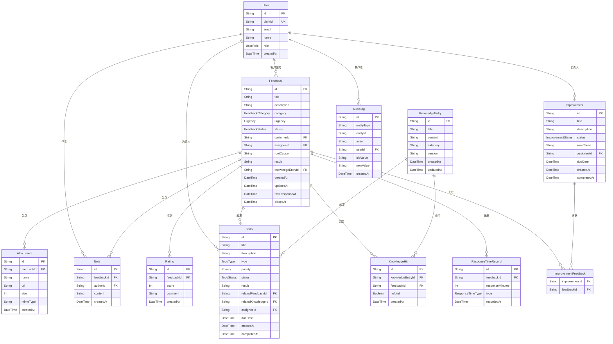

## 1. 架构设计

```mermaid
graph TB
    subgraph "前端层"
        "Next.js App Router" --> "tRPC Client"
        "Next.js App Router" --> "Clerk Provider"
    end

    subgraph "API 层"
        "tRPC Router" --> "反馈路由"
        "tRPC Router" --> "待办路由"
        "tRPC Router" --> "知识库路由"
        "tRPC Router" --> "审计日志路由"
        "tRPC Router" --> "统计路由"
    end

    subgraph "数据层"
        "Prisma Client" --> "PostgreSQL"
    end

    "tRPC Client" --> "tRPC Router"
    "tRPC Router" --> "Prisma Client"
    "Clerk Provider" --> "认证中间件"
    "认证中间件" --> "tRPC Router"
```

## 2. 技术说明

- **前端**：Next.js 14 (App Router) + Tailwind CSS 3 + shadcn/ui
- **初始化工具**：create-next-app
- **API 层**：tRPC v11 + Next.js 集成
- **认证**：Clerk（提供用户管理、角色、组织）
- **数据库**：PostgreSQL + Prisma ORM
- **状态管理**：Zustand（客户端状态）+ tRPC（服务端状态）
- **图表**：Recharts
- **文件上传**：本地存储（开发阶段），可扩展至 S3

## 3. 路由定义

| 路由 | 用途 | 权限 |
|------|------|------|
| `/` | 首页/数据面板 | 主管 |
| `/feedback/submit` | 提交反馈 | 客户 |
| `/feedback/my` | 我的反馈 | 客户 |
| `/feedback/board` | 反馈工作台 | 客服/主管 |
| `/feedback/[id]` | 反馈详情 | 客服/主管 |
| `/attribution` | 问题归因与改进 | 主管 |
| `/todos` | 待办中心 | 客服/主管 |
| `/knowledge` | 知识命中统计 | 主管 |
| `/response-time` | 响应时长追踪 | 主管 |
| `/audit-log` | 审计日志 | 主管 |

## 4. API 定义

### 4.1 反馈路由 (feedback)

```typescript
type FeedbackCreateInput = {
  title: string;
  description: string;
  category: FeedbackCategory;
  urgency: Urgency;
  attachments: AttachmentInput[];
};

type FeedbackUpdateInput = {
  id: string;
  status?: FeedbackStatus;
  result?: string;
  notes?: NoteInput[];
  rootCause?: string;
  knowledgeEntryId?: string;
};

type AttachmentInput = {
  name: string;
  url: string;
  size: number;
  mimeType: string;
};

type NoteInput = {
  content: string;
};

type FeedbackStatus = "PENDING" | "IN_PROGRESS" | "PENDING_REVIEW" | "CLOSED";

type FeedbackCategory = "PRODUCT" | "SERVICE" | "BILLING" | "TECHNICAL" | "OTHER";

type Urgency = "LOW" | "MEDIUM" | "HIGH" | "CRITICAL";

// Procedures
feedback.create: { input: FeedbackCreateInput } => Feedback
feedback.list: { input: { status?, category?, urgency?, page?, limit? } } => PaginatedResult<Feedback>
feedback.getById: { input: { id: string } } => FeedbackDetail
feedback.update: { input: FeedbackUpdateInput } => Feedback
feedback.addNote: { input: { feedbackId: string, content: string } } => Note
feedback.rate: { input: { feedbackId: string, score: number, comment?: string } } => Rating
feedback.getMyFeedback: { input: { page?, limit? } } => PaginatedResult<Feedback>
```

### 4.2 待办路由 (todo)

```typescript
type TodoCreateInput = {
  title: string;
  type: TodoType;
  priority: Priority;
  relatedFeedbackId?: string;
  relatedKnowledgeId?: string;
  dueDate?: Date;
  description?: string;
};

type TodoType = "KNOWLEDGE_VERSION" | "UNCLOSED_FEEDBACK" | "LOW_RATING" | "IMPROVEMENT_DUE";

type Priority = "LOW" | "MEDIUM" | "HIGH" | "CRITICAL";

// Procedures
todo.list: { input: { type?, status?, priority?, page?, limit? } } => PaginatedResult<Todo>
todo.getById: { input: { id: string } } => TodoDetail
todo.create: { input: TodoCreateInput } => Todo
todo.update: { input: { id: string, status?, result?, notes? } } => Todo
todo.complete: { input: { id: string, result: string } } => Todo
```

### 4.3 知识库路由 (knowledge)

```typescript
type KnowledgeEntryInput = {
  title: string;
  content: string;
  category: string;
  version: string;
};

// Procedures
knowledge.list: { input: { page?, limit?, category? } } => PaginatedResult<KnowledgeEntry>
knowledge.getById: { input: { id: string } } => KnowledgeEntryDetail
knowledge.create: { input: KnowledgeEntryInput } => KnowledgeEntry
knowledge.updateVersion: { input: { id: string, version: string, content: string } } => KnowledgeEntry
knowledge.getHitStats: { input: { entryId?, startDate?, endDate? } } => HitStats
knowledge.recordHit: { input: { entryId: string, feedbackId: string, helpful: boolean } } => HitRecord
```

### 4.4 审计日志路由 (auditLog)

```typescript
// Procedures
auditLog.list: { input: { entityType?, entityId?, action?, startDate?, endDate?, page?, limit? } } => PaginatedResult<AuditLog>
auditLog.getById: { input: { id: string } } => AuditLogDetail
auditLog.getTimeline: { input: { entityId: string, entityType: string } } => AuditLog[]
```

### 4.5 改进动作路由 (improvement)

```typescript
type ImprovementCreateInput = {
  title: string;
  description: string;
  rootCauseId: string;
  assigneeId: string;
  dueDate: Date;
  relatedFeedbackIds: string[];
};

// Procedures
improvement.list: { input: { status?, assigneeId?, page?, limit? } } => PaginatedResult<Improvement>
improvement.create: { input: ImprovementCreateInput } => Improvement
improvement.update: { input: { id: string, status?, result? } } => Improvement
```

### 4.6 统计路由 (stats)

```typescript
// Procedures
stats.getDashboard: {} => DashboardStats
stats.getResponseTimeHistory: { input: { startDate?, endDate?, groupBy? } } => ResponseTimeData[]
stats.getClosureRate: { input: { startDate?, endDate? } } => ClosureRateData
stats.getKnowledgeHitRate: { input: { startDate?, endDate? } } => HitRateData
```

## 5. 服务端架构图

```mermaid
graph LR
    "Next.js API Route" --> "tRPC Procedure"
    "tRPC Procedure" --> "Clerk Auth Middleware"
    "Clerk Auth Middleware" --> "Service Layer"
    "Service Layer" --> "Prisma Client"
    "Service Layer" --> "Audit Logger"
    "Audit Logger" --> "Prisma Client"
    "Prisma Client" --> "PostgreSQL"
```

## 6. 数据模型

### 6.1 数据模型定义



### 6.2 数据定义语言

```sql
CREATE TABLE "User" (
  "id" TEXT PRIMARY KEY DEFAULT gen_random_uuid(),
  "clerkId" TEXT UNIQUE NOT NULL,
  "email" TEXT NOT NULL,
  "name" TEXT NOT NULL,
  "role" TEXT NOT NULL DEFAULT 'CUSTOMER',
  "createdAt" TIMESTAMP NOT NULL DEFAULT NOW()
);

CREATE TABLE "Feedback" (
  "id" TEXT PRIMARY KEY DEFAULT gen_random_uuid(),
  "title" TEXT NOT NULL,
  "description" TEXT NOT NULL,
  "category" TEXT NOT NULL DEFAULT 'OTHER',
  "urgency" TEXT NOT NULL DEFAULT 'MEDIUM',
  "status" TEXT NOT NULL DEFAULT 'PENDING',
  "customerId" TEXT NOT NULL REFERENCES "User"("id"),
  "assigneeId" TEXT REFERENCES "User"("id"),
  "rootCause" TEXT,
  "result" TEXT,
  "knowledgeEntryId" TEXT REFERENCES "KnowledgeEntry"("id"),
  "createdAt" TIMESTAMP NOT NULL DEFAULT NOW(),
  "updatedAt" TIMESTAMP NOT NULL DEFAULT NOW(),
  "firstResponseAt" TIMESTAMP,
  "closedAt" TIMESTAMP
);

CREATE TABLE "Attachment" (
  "id" TEXT PRIMARY KEY DEFAULT gen_random_uuid(),
  "feedbackId" TEXT NOT NULL REFERENCES "Feedback"("id") ON DELETE CASCADE,
  "name" TEXT NOT NULL,
  "url" TEXT NOT NULL,
  "size" INTEGER NOT NULL,
  "mimeType" TEXT NOT NULL,
  "createdAt" TIMESTAMP NOT NULL DEFAULT NOW()
);

CREATE TABLE "Note" (
  "id" TEXT PRIMARY KEY DEFAULT gen_random_uuid(),
  "feedbackId" TEXT NOT NULL REFERENCES "Feedback"("id") ON DELETE CASCADE,
  "authorId" TEXT NOT NULL REFERENCES "User"("id"),
  "content" TEXT NOT NULL,
  "createdAt" TIMESTAMP NOT NULL DEFAULT NOW()
);

CREATE TABLE "Rating" (
  "id" TEXT PRIMARY KEY DEFAULT gen_random_uuid(),
  "feedbackId" TEXT NOT NULL REFERENCES "Feedback"("id") ON DELETE CASCADE,
  "score" INTEGER NOT NULL CHECK ("score" >= 1 AND "score" <= 5),
  "comment" TEXT,
  "createdAt" TIMESTAMP NOT NULL DEFAULT NOW()
);

CREATE TABLE "Todo" (
  "id" TEXT PRIMARY KEY DEFAULT gen_random_uuid(),
  "title" TEXT NOT NULL,
  "description" TEXT,
  "type" TEXT NOT NULL,
  "priority" TEXT NOT NULL DEFAULT 'MEDIUM',
  "status" TEXT NOT NULL DEFAULT 'PENDING',
  "result" TEXT,
  "relatedFeedbackId" TEXT REFERENCES "Feedback"("id"),
  "relatedKnowledgeId" TEXT REFERENCES "KnowledgeEntry"("id"),
  "assigneeId" TEXT REFERENCES "User"("id"),
  "dueDate" TIMESTAMP,
  "createdAt" TIMESTAMP NOT NULL DEFAULT NOW(),
  "completedAt" TIMESTAMP
);

CREATE TABLE "KnowledgeEntry" (
  "id" TEXT PRIMARY KEY DEFAULT gen_random_uuid(),
  "title" TEXT NOT NULL,
  "content" TEXT NOT NULL,
  "category" TEXT NOT NULL,
  "version" TEXT NOT NULL DEFAULT '1.0',
  "createdAt" TIMESTAMP NOT NULL DEFAULT NOW(),
  "updatedAt" TIMESTAMP NOT NULL DEFAULT NOW()
);

CREATE TABLE "KnowledgeHit" (
  "id" TEXT PRIMARY KEY DEFAULT gen_random_uuid(),
  "knowledgeEntryId" TEXT NOT NULL REFERENCES "KnowledgeEntry"("id") ON DELETE CASCADE,
  "feedbackId" TEXT NOT NULL REFERENCES "Feedback"("id"),
  "helpful" BOOLEAN NOT NULL DEFAULT true,
  "createdAt" TIMESTAMP NOT NULL DEFAULT NOW()
);

CREATE TABLE "Improvement" (
  "id" TEXT PRIMARY KEY DEFAULT gen_random_uuid(),
  "title" TEXT NOT NULL,
  "description" TEXT NOT NULL,
  "status" TEXT NOT NULL DEFAULT 'PENDING',
  "rootCause" TEXT,
  "assigneeId" TEXT NOT NULL REFERENCES "User"("id"),
  "dueDate" TIMESTAMP NOT NULL,
  "createdAt" TIMESTAMP NOT NULL DEFAULT NOW(),
  "completedAt" TIMESTAMP
);

CREATE TABLE "ImprovementFeedback" (
  "improvementId" TEXT NOT NULL REFERENCES "Improvement"("id") ON DELETE CASCADE,
  "feedbackId" TEXT NOT NULL REFERENCES "Feedback"("id") ON DELETE CASCADE,
  PRIMARY KEY ("improvementId", "feedbackId")
);

CREATE TABLE "ResponseTimeRecord" (
  "id" TEXT PRIMARY KEY DEFAULT gen_random_uuid(),
  "feedbackId" TEXT NOT NULL REFERENCES "Feedback"("id") ON DELETE CASCADE,
  "responseMinutes" INTEGER NOT NULL,
  "type" TEXT NOT NULL DEFAULT 'FIRST_RESPONSE',
  "recordedAt" TIMESTAMP NOT NULL DEFAULT NOW()
);

CREATE TABLE "AuditLog" (
  "id" TEXT PRIMARY KEY DEFAULT gen_random_uuid(),
  "entityType" TEXT NOT NULL,
  "entityId" TEXT NOT NULL,
  "action" TEXT NOT NULL,
  "userId" TEXT NOT NULL REFERENCES "User"("id"),
  "oldValue" TEXT,
  "newValue" TEXT,
  "createdAt" TIMESTAMP NOT NULL DEFAULT NOW()
);

CREATE INDEX idx_feedback_customer ON "Feedback"("customerId");
CREATE INDEX idx_feedback_assignee ON "Feedback"("assigneeId");
CREATE INDEX idx_feedback_status ON "Feedback"("status");
CREATE INDEX idx_feedback_category ON "Feedback"("category");
CREATE INDEX idx_todo_assignee ON "Todo"("assigneeId");
CREATE INDEX idx_todo_status ON "Todo"("status");
CREATE INDEX idx_todo_type ON "Todo"("type");
CREATE INDEX idx_knowledge_category ON "KnowledgeEntry"("category");
CREATE INDEX idx_knowledgehit_entry ON "KnowledgeHit"("knowledgeEntryId");
CREATE INDEX idx_auditlog_entity ON "AuditLog"("entityType", "entityId");
CREATE INDEX idx_auditlog_created ON "AuditLog"("createdAt");
CREATE INDEX idx_responsetime_feedback ON "ResponseTimeRecord"("feedbackId");
CREATE INDEX idx_note_feedback ON "Note"("feedbackId");
CREATE INDEX idx_rating_feedback ON "Rating"("feedbackId");
```
