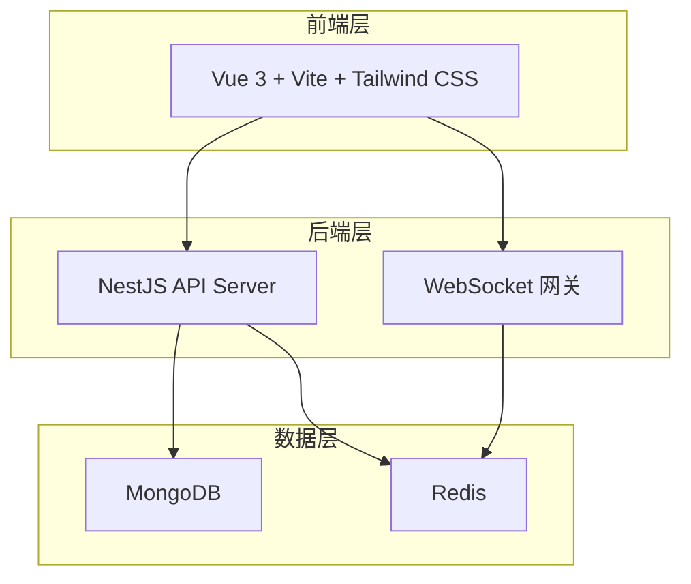
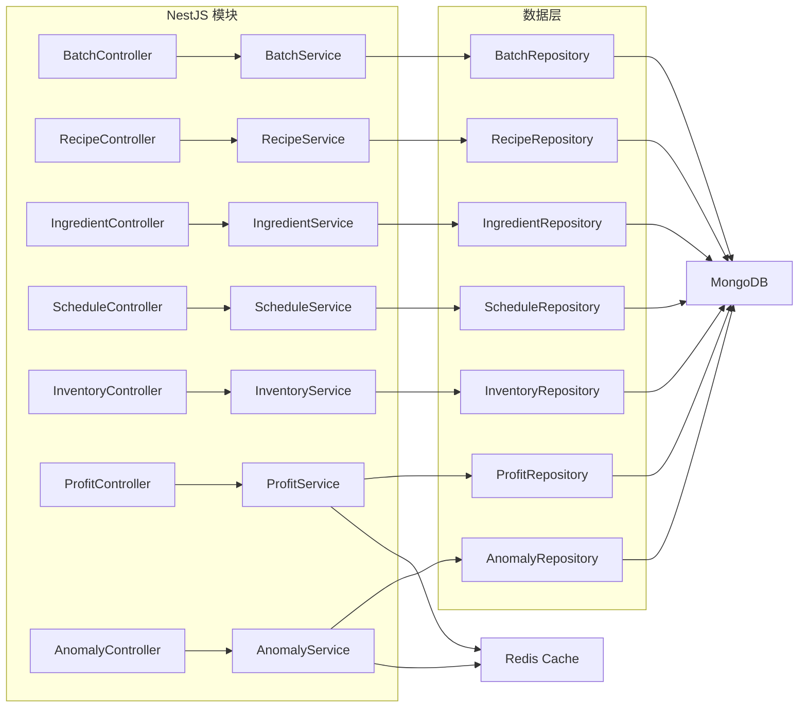
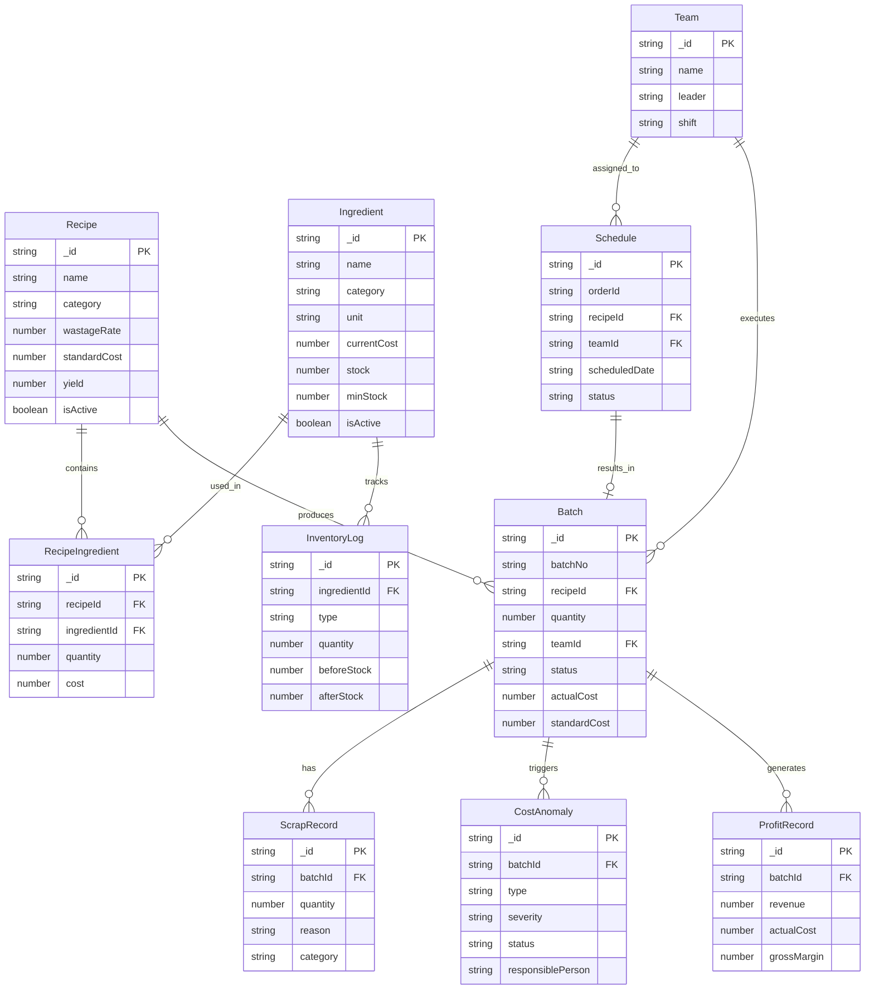

## 1. 架构设计



## 2. 技术说明

- **前端**：Vue 3 + Vite + Tailwind CSS + Vue Router + Pinia
- **初始化工具**：vite-init（vue-express-ts 模板，后端替换为 NestJS）
- **后端**：NestJS + TypeScript（ESM）
- **数据库**：MongoDB（主存储）+ Redis（缓存 & 会话）
- **图表库**：ECharts（毛利走势、成本趋势）
- **图标库**：Lucide Vue Next

## 3. 路由定义

| 路由 | 用途 |
|------|------|
| `/` | 仪表盘 - 关键指标概览 |
| `/batches` | 批次管理 - 列表与筛选 |
| `/batches/:id` | 批次详情 - 附件、备注、修改历史 |
| `/recipes` | 配方管理 - 列表与搜索 |
| `/recipes/:id` | 配方详情 - 原料配比、标准成本 |
| `/ingredients` | 原料管理 - 列表与成本 |
| `/scheduling` | 订单排产 - 日历与任务 |
| `/inventory` | 库存管理 - 实时库存与流水 |
| `/profit` | 毛利分析 - 报表与图表 |
| `/anomalies` | 成本异常 - 异常列表 |
| `/anomalies/:id` | 异常详情 - 影响范围、处理计划 |

## 4. API 定义

### 4.1 批次模块

```typescript
interface Batch {
  _id: string
  batchNo: string
  recipeId: string
  recipeName: string
  quantity: number
  unit: string
  teamId: string
  teamName: string
  status: 'planned' | 'producing' | 'completed' | 'picked_up' | 'scrapped' | 'rework'
  plannedDate: string
  completedDate?: string
  actualCost?: number
  standardCost?: number
  costVariance?: number
  attachments: Attachment[]
  notes: Note[]
  history: HistoryEntry[]
  createdAt: string
  updatedAt: string
}

interface Attachment {
  id: string
  filename: string
  url: string
  uploadedAt: string
  uploadedBy: string
}

interface Note {
  id: string
  content: string
  createdBy: string
  createdAt: string
}

interface HistoryEntry {
  id: string
  field: string
  oldValue: any
  newValue: any
  changedBy: string
  changedAt: string
}
```

### 4.2 配方模块

```typescript
interface Recipe {
  _id: string
  name: string
  category: string
  ingredients: RecipeIngredient[]
  steps: string[]
  wastageRate: number
  standardCost: number
  yield: number
  unit: string
  isActive: boolean
  createdAt: string
  updatedAt: string
}

interface RecipeIngredient {
  ingredientId: string
  ingredientName: string
  quantity: number
  unit: string
  cost: number
}
```

### 4.3 原料模块

```typescript
interface Ingredient {
  _id: string
  name: string
  category: string
  unit: string
  currentCost: number
  supplier: string
  stock: number
  minStock: number
  costHistory: CostEntry[]
  isActive: boolean
  createdAt: string
  updatedAt: string
}

interface CostEntry {
  date: string
  cost: number
  note?: string
}
```

### 4.4 排产模块

```typescript
interface Schedule {
  _id: string
  orderId: string
  orderNo: string
  recipeId: string
  recipeName: string
  quantity: number
  teamId: string
  teamName: string
  scheduledDate: string
  status: 'pending' | 'in_progress' | 'completed' | 'cancelled'
  priority: 'normal' | 'urgent'
  notes?: string
  createdAt: string
  updatedAt: string
}
```

### 4.5 库存模块

```typescript
interface InventoryLog {
  _id: string
  ingredientId: string
  ingredientName: string
  type: 'inbound' | 'outbound' | 'scrap' | 'adjustment'
  quantity: number
  beforeStock: number
  afterStock: number
  relatedBatchId?: string
  note?: string
  operator: string
  createdAt: string
}

interface ScrapRecord {
  _id: string
  batchId: string
  batchNo: string
  quantity: number
  reason: string
  category: 'expired' | 'damaged' | 'quality' | 'other'
  attachments: Attachment[]
  operator: string
  createdAt: string
}
```

### 4.6 毛利模块

```typescript
interface ProfitRecord {
  _id: string
  batchId: string
  batchNo: string
  recipeName: string
  revenue: number
  standardCost: number
  actualCost: number
  grossProfit: number
  grossMargin: number
  consumableCost: number
  reworkCost: number
  period: string
  createdAt: string
}
```

### 4.7 成本异常模块

```typescript
interface CostAnomaly {
  _id: string
  batchId: string
  batchNo: string
  type: 'over_cost' | 'frequent_rework' | 'high_scrap' | 'budget_exceeded'
  severity: 'low' | 'medium' | 'high'
  description: string
  impactScope: string
  responsiblePerson: string
  handlingPlan: string
  status: 'open' | 'in_progress' | 'resolved' | 'closed'
  relatedRecords: string[]
  createdAt: string
  updatedAt: string
  resolvedAt?: string
}
```

### 4.8 班组模块

```typescript
interface Team {
  _id: string
  name: string
  leader: string
  members: string[]
  shift: 'morning' | 'afternoon' | 'night'
  isActive: boolean
}
```

## 5. 服务端架构图



## 6. 数据模型

### 6.1 数据模型定义



### 6.2 MongoDB 索引设计

```javascript
db.batches.createIndex({ batchNo: 1 }, { unique: true })
db.batches.createIndex({ status: 1, plannedDate: -1 })
db.batches.createIndex({ recipeId: 1, teamId: 1 })
db.batches.createIndex({ "history.changedAt": -1 })

db.recipes.createIndex({ name: 1 }, { unique: true })
db.recipes.createIndex({ category: 1, isActive: 1 })

db.ingredients.createIndex({ name: 1 })
db.ingredients.createIndex({ category: 1, isActive: 1 })
db.ingredients.createIndex({ stock: 1 }, { partialFilterExpression: { stock: { $lte: minStock } } })

db.schedules.createIndex({ scheduledDate: 1, teamId: 1 })
db.schedules.createIndex({ status: 1 })

db.inventorylogs.createIndex({ ingredientId: 1, createdAt: -1 })
db.inventorylogs.createIndex({ type: 1, createdAt: -1 })

db.scraprecords.createIndex({ batchId: 1, createdAt: -1 })
db.scraprecords.createIndex({ category: 1 })

db.profitrecords.createIndex({ batchId: 1 })
db.profitrecords.createIndex({ period: -1 })

db.costanomalies.createIndex({ status: 1, severity: 1 })
db.costanomalies.createIndex({ batchId: 1 })
db.costanomalies.createIndex({ type: 1, createdAt: -1 })

db.teams.createIndex({ name: 1 }, { unique: true })
db.teams.createIndex({ shift: 1, isActive: 1 })
```

## 7. 演示数据策略

- 演示数据标记 `isSandbox: true`，存于同一数据库但通过字段过滤
- 正式报表查询默认过滤 `isSandbox: { $ne: true }`，仅展示生产记录
- 仪表盘提供「沙箱/正式」模式切换开关
