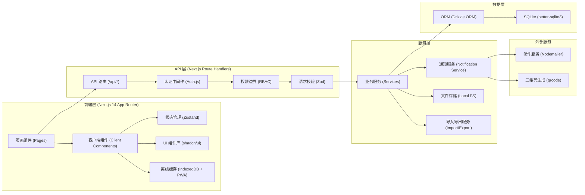
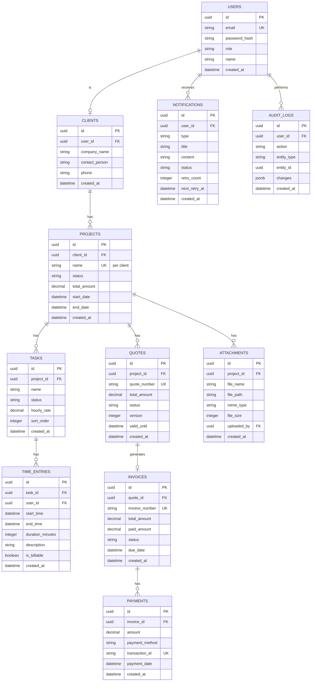

## 1. 架构设计



## 2. 技术栈说明

| 层级 | 技术选择 | 版本 | 说明 |
|------|----------|------|------|
| 前端框架 | Next.js | 14.x | App Router，支持 SSR/SSG/ISR |
| 前端语言 | TypeScript | 5.x | 全栈类型安全 |
| 状态管理 | Zustand | 4.x | 轻量级状态管理，支持持久化 |
| UI 组件 | shadcn/ui + Tailwind CSS | 3.x | 原子化 CSS + 高质量组件 |
| 表单校验 | Zod + React Hook Form | 7.x | 运行时类型校验 |
| 离线存储 | IndexedDB (idb) | 7.x | 移动端离线数据缓存 |
| 认证方案 | Auth.js (NextAuth) | 5.x | 支持邮箱/凭证登录 |
| 数据库 | SQLite (better-sqlite3) | 9.x | 嵌入式数据库，零配置 |
| ORM | Drizzle ORM | 0.30.x | 类型安全的 SQL 查询构建器 |
| 文件处理 | multer + sharp | 0.x | 文件上传与图片处理 |
| 邮件发送 | Nodemailer | 6.x | 发票和提醒邮件发送 |
| 图表 | Recharts | 2.x | 数据可视化图表 |
| 拖拽 | @dnd-kit/core | 6.x | 看板拖拽功能 |
| 测试 | Vitest + Testing Library | 1.x | 单元测试和组件测试 |

## 3. 前端状态管理设计

### 3.1 状态分层

```typescript
// stores/useAuthStore.ts - 认证状态
interface AuthState {
  user: User | null;
  session: Session | null;
  isLoading: boolean;
  login: (credentials: LoginCredentials) => Promise<void>;
  logout: () => Promise<void>;
}

// stores/useProjectStore.ts - 项目状态
interface ProjectState {
  projects: Project[];
  currentProject: Project | null;
  filters: ProjectFilters;
  isLoading: boolean;
  fetchProjects: () => Promise<void>;
  updateProjectStatus: (id: string, status: string) => Promise<void>;
  setFilters: (filters: Partial<ProjectFilters>) => void;
}

// stores/useTimeEntryStore.ts - 工时状态
interface TimeEntryState {
  entries: TimeEntry[];
  activeTimer: TimeEntry | null;
  offlineQueue: TimeEntry[];
  startTimer: (projectId: string, taskId?: string) => void;
  stopTimer: () => Promise<void>;
  syncOfflineEntries: () => Promise<void>;
}
```

### 3.2 状态持久化策略
- 认证状态：`localStorage` 持久化 + session 校验
- 项目列表：`sessionStorage` 缓存，5 分钟过期
- 工时记录：`IndexedDB` 存储离线数据，支持网络恢复后批量同步
- UI 偏好：`localStorage` 持久化（主题、侧边栏状态等）

## 4. API 权限边界设计

### 4.1 角色权限矩阵

| 资源 | 管理员 | 客户 | 说明 |
|------|--------|------|------|
| 项目列表 | 全部 | 仅自己 | 客户通过 `client_id` 过滤 |
| 项目详情 | 全部字段 | 排除成本字段 | 工时成本、内部备注对客户隐藏 |
| 工时记录 | CRUD | 无 | 客户不可访问工时 API |
| 报价单 | CRUD | 只读(自己的) | 客户只能确认/拒绝 |
| 发票 | CRUD | 只读(自己的) | 客户只能查看和下载 |
| 收款记录 | CRUD | 只读(自己的) | 客户只能查看付款状态 |
| 客户管理 | CRUD | 无 | 客户不可访问 |
| 系统设置 | 全部 | 无 | 客户不可访问 |

### 4.2 权限中间件实现

```typescript
// middleware/auth.ts
export async function withAuth(
  request: Request,
  requiredRole?: 'admin' | 'client'
) {
  const session = await getServerSession(authOptions);
  if (!session) {
    return new Response(JSON.stringify({ error: 'Unauthorized' }), { status: 401 });
  }
  
  if (requiredRole && session.user.role !== requiredRole) {
    return new Response(JSON.stringify({ error: 'Forbidden' }), { status: 403 });
  }
  
  return session;
}

// 资源级权限校验
export async function checkProjectAccess(
  projectId: string,
  userId: string,
  userRole: string
) {
  if (userRole === 'admin') return true;
  
  const project = await db.query.projects.findFirst({
    where: eq(projects.id, projectId),
  });
  
  return project?.clientId === userId;
}
```

### 4.3 数据脱敏策略
- API 响应层根据角色动态过滤字段
- 使用 Drizzle 的 `select` 方法精确控制返回字段
- 敏感字段（如 `internal_cost`, `private_notes`）默认排除

## 5. 数据库设计与唯一约束

### 5.1 ER 图



### 5.2 数据库唯一约束

```sql
-- 用户邮箱唯一
CREATE UNIQUE INDEX idx_users_email ON users(email);

-- 报价单号全局唯一
CREATE UNIQUE INDEX idx_quotes_quote_number ON quotes(quote_number);

-- 发票号全局唯一
CREATE UNIQUE INDEX idx_invoices_invoice_number ON invoices(invoice_number);

-- 交易号唯一
CREATE UNIQUE INDEX idx_payments_transaction_id ON payments(transaction_id);

-- 同一客户下项目名唯一
CREATE UNIQUE INDEX idx_projects_client_name ON projects(client_id, name);

-- 通知幂等键
CREATE UNIQUE INDEX idx_notifications_idempotency_key ON notifications(idempotency_key);
```

### 5.3 审计日志设计
- 所有创建、更新、删除操作自动记录
- 记录 `entity_type`, `entity_id`, `action`, `changes` (JSON 格式)
- 记录操作人 `user_id` 和时间戳
- 不可删除，仅追加写入

## 6. 导入导出任务设计

### 6.1 支持格式
- **导入**：CSV, Excel (.xlsx)
- **导出**：CSV, Excel, PDF

### 6.2 支持导入的实体
| 实体 | 导入字段 | 校验规则 |
|------|----------|----------|
| 客户 | 公司名, 联系人, 邮箱, 电话 | 邮箱格式，去重 |
| 项目 | 项目名, 客户, 开始日期, 金额 | 关联客户存在性检查 |
| 工时 | 日期, 项目, 任务, 时长, 描述 | 时长为正整数，日期格式 |

### 6.3 异步任务处理流程

```typescript
// lib/import-export/service.ts
interface ImportTask {
  id: string;
  type: 'import' | 'export';
  entity: string;
  status: 'pending' | 'processing' | 'completed' | 'failed';
  file_path: string;
  result_summary: {
    total: number;
    success: number;
    failed: number;
    errors: string[];
  };
  created_by: string;
  created_at: Date;
}

// 导出流程
// 1. 创建导出任务记录
// 2. 后台 worker 处理：查询数据 -> 生成文件 -> 上传存储
// 3. 更新任务状态，发送通知
// 4. 用户下载文件（24小时后自动清理）

// 导入流程
// 1. 上传文件，创建导入任务
// 2. 解析文件，逐行校验
// 3. 批量插入数据库（事务包裹）
// 4. 返回成功/失败明细，支持下载错误报告
```

### 6.4 回滚策略
- 导入采用事务：单批次全部成功或全部失败
- 导入完成后生成可回滚快照
- 提供导入历史列表，支持一键撤销最近 N 次导入
- 导出无状态，不影响数据库

## 7. 通知重试与回滚策略

### 7.1 通知类型
- 报价单发送/确认提醒
- 发票开具/付款提醒
- 项目状态变更通知
- 尾款逾期催收
- 导入导出任务完成通知

### 7.2 重试策略

| 重试次数 | 间隔时间 | 触发条件 |
|----------|----------|----------|
| 第 1 次 | 立即 | 首次发送失败 |
| 第 2 次 | 15 分钟后 | 第 1 次重试失败 |
| 第 3 次 | 1 小时后 | 第 2 次重试失败 |
| 放弃 | - | 3 次重试均失败 |

```typescript
// lib/notifications/service.ts
export async function processNotificationQueue() {
  const pendingNotifications = await db.query.notifications.findMany({
    where: and(
      inArray(notifications.status, ['pending', 'retrying']),
      lte(notifications.nextRetryAt, new Date())
    ),
    orderBy: asc(notifications.createdAt),
    limit: 10,
  });

  for (const notification of pendingNotifications) {
    try {
      await sendNotification(notification);
      await db.update(notifications)
        .set({ status: 'sent', sentAt: new Date() })
        .where(eq(notifications.id, notification.id));
    } catch (error) {
      const newRetryCount = notification.retryCount + 1;
      const nextRetryAt = calculateNextRetry(newRetryCount);
      
      if (newRetryCount >= MAX_RETRIES) {
        await db.update(notifications)
          .set({ status: 'failed', errorMessage: error.message })
          .where(eq(notifications.id, notification.id));
      } else {
        await db.update(notifications)
          .set({
            status: 'retrying',
            retryCount: newRetryCount,
            nextRetryAt,
            errorMessage: error.message,
          })
          .where(eq(notifications.id, notification.id));
      }
    }
  }
}
```

### 7.3 回滚机制
- **幂等保证**：每个通知有唯一 `idempotency_key`，防止重复发送
- **事务发送**：数据库状态更新与邮件发送在同一事务中
- **补偿机制**：定期对账任务扫描状态不一致的通知
- **死信队列**：超过最大重试次数的通知进入人工处理队列

## 8. 路由定义

| 路由 | 权限 | 说明 |
|------|------|------|
| `/login` | 公开 | 登录页面 |
| `/register` | 公开 | 注册页面（客户邀请） |
| `/dashboard` | 管理员 | 仪表盘 |
| `/projects` | 管理员/客户 | 项目列表（客户只看自己的） |
| `/projects/[id]` | 管理员/客户 | 项目详情（字段脱敏） |
| `/projects/[id]/kanban` | 管理员 | 项目看板 |
| `/time-tracker` | 管理员 | 工时记录 |
| `/quotes` | 管理员 | 报价单列表 |
| `/quotes/[id]` | 管理员/客户 | 报价单详情 |
| `/invoices` | 管理员 | 发票列表 |
| `/invoices/[id]` | 管理员/客户 | 发票详情 |
| `/payments` | 管理员 | 收款记录 |
| `/reports` | 管理员 | 收入统计 |
| `/clients` | 管理员 | 客户管理 |
| `/portal` | 客户 | 客户门户首页 |
| `/settings` | 管理员 | 系统设置 |

## 9. API 定义

### 9.1 认证 API
```typescript
// POST /api/auth/login
interface LoginRequest {
  email: string;
  password: string;
}

// POST /api/auth/register (client invitation)
interface RegisterClientRequest {
  email: string;
  password: string;
  invitationToken: string;
}
```

### 9.2 项目 API
```typescript
// GET /api/projects?status=active&clientId=xxx
interface ProjectListResponse {
  data: Project[];
  total: number;
  page: number;
  pageSize: number;
}

// POST /api/projects
interface CreateProjectRequest {
  name: string;
  clientId: string;
  startDate: string;
  endDate?: string;
  totalAmount: number;
}

// PATCH /api/projects/[id]
interface UpdateProjectRequest {
  name?: string;
  status?: 'draft' | 'active' | 'completed' | 'archived';
  totalAmount?: number;
}
```

### 9.3 工时 API
```typescript
// POST /api/time-entries
interface CreateTimeEntryRequest {
  taskId: string;
  startTime: string;
  endTime?: string;
  description?: string;
  isBillable?: boolean;
}

// POST /api/time-entries/batch-sync
interface BatchSyncRequest {
  entries: Omit<CreateTimeEntryRequest, 'userId'>[];
  clientTimestamps: number[];
}
```

## 10. 测试样例设计

### 10.1 通知功能测试
```typescript
// tests/notifications/service.test.ts
describe('Notification Service', () => {
  test('发送报价确认通知给客户', async () => {
    const quote = await createTestQuote({ status: 'sent' });
    await sendQuoteNotification(quote.id, 'quote_sent');
    
    const notifications = await getNotificationsByUserId(quote.clientId);
    expect(notifications).toHaveLength(1);
    expect(notifications[0].type).toBe('quote_sent');
  });

  test('付款提醒到期自动发送', async () => {
    const invoice = await createTestInvoice({ 
      dueDate: addDays(new Date(), -1),
      status: 'unpaid'
    });
    
    await processPaymentReminders();
    
    const notifications = await getNotificationsByUserId(invoice.clientId);
    expect(notifications.some(n => n.type === 'payment_due')).toBe(true);
  });

  test('通知发送失败自动重试', async () => {
    mockSendEmail.mockRejectedValueOnce(new Error('Network error'));
    const notification = await createTestNotification({ status: 'pending' });
    
    await processNotificationQueue();
    
    const updated = await getNotificationById(notification.id);
    expect(updated.retryCount).toBe(1);
    expect(updated.status).toBe('retrying');
  });

  test('超过最大重试次数标记为失败', async () => {
    mockSendEmail.mockRejectedValue(new Error('Permanent error'));
    const notification = await createTestNotification({ 
      status: 'retrying',
      retryCount: 2
    });
    
    await processNotificationQueue();
    
    const updated = await getNotificationById(notification.id);
    expect(updated.status).toBe('failed');
  });
});
```

### 10.2 附件功能测试
```typescript
// tests/attachments/service.test.ts
describe('Attachment Service', () => {
  test('上传项目附件并记录上传人', async () => {
    const project = await createTestProject();
    const file = createTestFile('design.pdf', 'application/pdf', 1024000);
    
    const attachment = await uploadAttachment(project.id, file, adminUser.id);
    
    expect(attachment.projectId).toBe(project.id);
    expect(attachment.uploadedBy).toBe(adminUser.id);
    expect(attachment.fileName).toBe('design.pdf');
  });

  test('客户只能下载自己项目的附件', async () => {
    const project = await createTestProject({ clientId: clientUser.id });
    const attachment = await createTestAttachment({ projectId: project.id });
    
    const canAccess = await checkAttachmentAccess(attachment.id, clientUser.id, 'client');
    expect(canAccess).toBe(true);
  });

  test('客户不能访问其他客户项目的附件', async () => {
    const otherProject = await createTestProject({ clientId: otherClient.id });
    const attachment = await createTestAttachment({ projectId: otherProject.id });
    
    const canAccess = await checkAttachmentAccess(attachment.id, clientUser.id, 'client');
    expect(canAccess).toBe(false);
  });

  test('图片附件自动生成缩略图', async () => {
    const project = await createTestProject();
    const imageFile = createTestFile('photo.jpg', 'image/jpeg', 5000000);
    
    const attachment = await uploadAttachment(project.id, imageFile, adminUser.id);
    
    expect(attachment.thumbnailPath).toBeDefined();
  });
});
```

### 10.3 历史追踪测试
```typescript
// tests/audit-logs/service.test.ts
describe('Audit Log & History Tracking', () => {
  test('创建项目自动记录审计日志', async () => {
    const projectData = { name: '新网站设计', clientId: client.id, totalAmount: 50000 };
    
    const project = await createProject(projectData, adminUser.id);
    
    const logs = await getAuditLogsByEntity('project', project.id);
    expect(logs).toHaveLength(1);
    expect(logs[0].action).toBe('create');
    expect(logs[0].userId).toBe(adminUser.id);
    expect(logs[0].changes.name).toBe('新网站设计');
  });

  test('更新项目状态记录变更前后', async () => {
    const project = await createTestProject({ status: 'draft' });
    
    await updateProject(project.id, { status: 'active' }, adminUser.id);
    
    const logs = await getAuditLogsByEntity('project', project.id);
    const updateLog = logs.find(l => l.action === 'update');
    expect(updateLog.changes.status.before).toBe('draft');
    expect(updateLog.changes.status.after).toBe('active');
  });

  test('报价单版本历史可追溯', async () => {
    const quote = await createTestQuote({ version: 1, totalAmount: 10000 });
    
    const updatedQuote = await updateQuote(quote.id, { totalAmount: 12000 }, adminUser.id);
    
    expect(updatedQuote.version).toBe(2);
    const history = await getQuoteVersionHistory(quote.id);
    expect(history).toHaveLength(2);
    expect(history[0].totalAmount).toBe(10000);
    expect(history[1].totalAmount).toBe(12000);
  });

  test('工时记录删除保留操作日志', async () => {
    const timeEntry = await createTestTimeEntry({ duration: 120 });
    
    await deleteTimeEntry(timeEntry.id, adminUser.id);
    
    const logs = await getAuditLogsByEntity('time_entry', timeEntry.id);
    expect(logs.some(l => l.action === 'delete')).toBe(true);
  });
});
```
