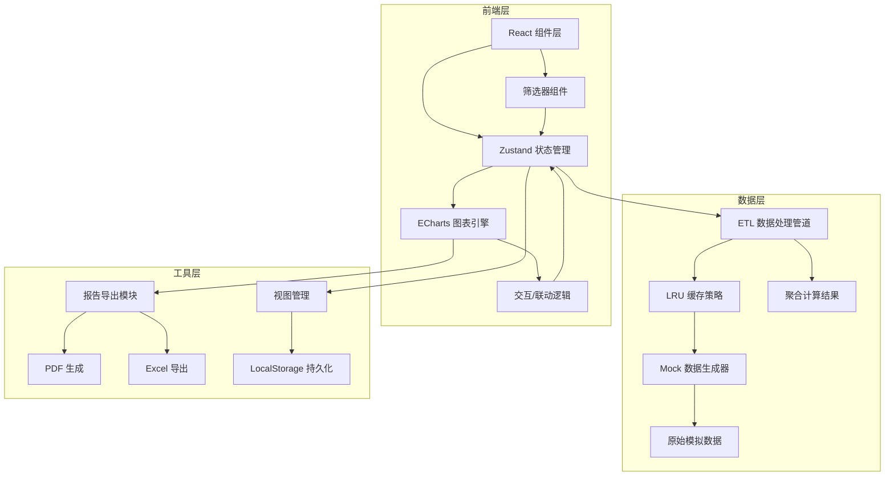

## 1. 架构设计



## 2. 技术描述

- **前端框架**: React@18 + TypeScript@5
- **构建工具**: Vite@5
- **样式方案**: TailwindCSS@3
- **状态管理**: Zustand@4
- **图表引擎**: ECharts@5 + echarts-for-react
- **图标库**: Lucide React
- **数据处理**: 自定义 ETL 管道 + 内存计算
- **缓存策略**: LRU 缓存 + LocalStorage 持久化
- **导出功能**: jsPDF + SheetJS (xlsx)
- **无后端**: 纯前端架构，所有数据通过 Mock 生成器在前端模拟

## 3. 目录结构

```
src/
├── components/
│   ├── filters/          # 筛选器组件
│   │   ├── StoreFilter.tsx
│   │   ├── CategoryFilter.tsx
│   │   ├── TimeRangeFilter.tsx
│   │   ├── WeatherFilter.tsx
│   │   └── CampaignFilter.tsx
│   ├── charts/           # 图表组件
│   │   ├── SalesTrendChart.tsx
│   │   ├── StoreHeatmap.tsx
│   │   ├── StoreRanking.tsx
│   │   ├── WeatherImpactChart.tsx
│   │   ├── HourlyHeatmap.tsx
│   │   └── CampaignComparison.tsx
│   ├── common/           # 通用组件
│   │   ├── KPICard.tsx
│   │   ├── ChartCard.tsx
│   │   ├── DetailDrawer.tsx
│   │   ├── EmptyState.tsx
│   │   └── LoadingSkeleton.tsx
│   └── layout/           # 布局组件
│       ├── DashboardHeader.tsx
│       └── ViewToolbar.tsx
├── store/                # 状态管理
│   ├── useFilterStore.ts
│   ├── useDataStore.ts
│   └── useViewStore.ts
├── data/                 # 数据层
│   ├── mock/             # Mock 数据生成
│   │   ├── generator.ts
│   │   └── seedData.ts
│   ├── etl/              # ETL 管道
│   │   ├── transformer.ts
│   │   ├── aggregator.ts
│   │   └── anomalyDetector.ts
│   └── cache/            # 缓存模块
│       └── dataCache.ts
├── hooks/                # 自定义 Hooks
│   ├── useChartData.ts
│   ├── useFilterSync.ts
│   └── useExport.ts
├── utils/                # 工具函数
│   ├── formatters.ts
│   ├── dateUtils.ts
│   └── exportUtils.ts
├── types/                # TypeScript 类型
│   ├── data.ts
│   ├── filter.ts
│   └── view.ts
└── pages/
    └── Dashboard.tsx     # 主仪表盘页面
```

## 4. 核心数据模型

### 4.1 类型定义

```typescript
// 筛选状态
interface FilterState {
  storeIds: string[];
  categories: string[];
  timeRange: { start: Date; end: Date };
  timeWindow: 'day' | 'week' | 'month';
  weatherTypes: string[];
  campaignId: string | null;
}

// 门店销售数据
interface StoreSalesData {
  storeId: string;
  storeName: string;
  date: string;
  salesAmount: number;
  orderCount: number;
  avgOrderValue: number;
  couponUsage: number;
  inventoryLoss: number;
  weatherType: string;
  temperature: number;
  isHoliday: boolean;
  campaignId?: string;
}

// KPI 指标
interface KPIData {
  totalSales: number;
  avgOrderValue: number;
  totalOrders: number;
  inventoryLossRate: number;
  salesWoW: number;
  aovWoW: number;
  ordersWoW: number;
  lossRateWoW: number;
  sampleSize: number;
}

// 视图配置
interface SavedView {
  id: string;
  name: string;
  filters: FilterState;
  createdAt: number;
  updatedAt: number;
}

// 异常点
interface AnomalyPoint {
  id: string;
  type: 'low_sales' | 'high_loss' | 'weather_abnormal';
  storeId: string;
  date: string;
  value: number;
  expected: number;
  severity: 'warning' | 'critical';
}
```

### 4.2 ETL 数据管道

```
原始数据 → 筛选过滤 → 时间对齐 → 缺失值填充 → 异常检测 → 指标聚合 → 缓存输出
```

- **筛选过滤**: 应用所有筛选条件，减少计算数据集
- **时间对齐**: 按时间窗口（日/周/月）对齐数据点
- **缺失值填充**: 使用线性插值或前值填充处理空数据
- **异常检测**: 基于 3-sigma 原则识别销售和损耗异常
- **指标聚合**: 计算销售额、客单价、环比等衍生指标
- **LRU缓存**: 对常用筛选组合的结果进行缓存

## 5. 状态管理设计

### 5.1 Filter Store (筛选状态)
- 存储当前所有筛选器的选中值
- 提供 updateFilter、resetFilters 等 action
- 筛选变更时自动触发数据重新计算
- 支持与 URL 参数双向同步（可选）

### 5.2 Data Store (数据状态)
- 存储原始 Mock 数据和聚合计算结果
- 管理加载状态、错误状态、空数据状态
- 集成 LRU 缓存，避免重复计算
- 提供按维度下钻的数据查询方法

### 5.3 View Store (视图状态)
- 管理已保存的视图列表
- 支持保存、加载、删除视图
- 视图数据持久化到 LocalStorage
- 导出时携带当前筛选状态元数据

## 6. 关键交互实现

### 6.1 图表联动机制
1. 每个图表组件订阅 Filter Store
2. 用户点击图表元素（如某个门店点）
3. 触发 `onDrillDown` 事件，更新筛选状态
4. 所有订阅筛选状态的图表自动刷新
5. 被点击元素保持高亮，其他图表相关元素闪烁提示

### 6.2 活动前后对比
1. 用户选择活动批次
2. 自动计算活动前（-14天）、活动中、活动后（+7天）三个时间窗口
3. 对三个窗口的数据分别进行同口径聚合
4. 展示对比柱状图和提升率指标
5. 支持切换基准期（活动前/去年同期）

### 6.3 缓存策略
- 缓存 Key: 筛选条件序列化后的哈希值
- 缓存容量: 最多保留 20 条记录，LRU 淘汰
- 缓存失效: 数据刷新按钮、视图切换时清理相关缓存
- 持久化: 高频视图结果可持久化到 LocalStorage

### 6.4 空值与异常处理
- 加载中: 骨架屏 + 进度条 + 样本量估算提示
- 空数据: 插画 + "当前筛选条件无数据" + 重置按钮
- 计算异常: 全局错误边界 + 降级显示原始数据表格
- 样本量不足: 黄色警告条，提示"样本量<30，结论仅供参考"

## 7. 导出功能

### 7.1 PDF 报告
- 包含当前筛选条件摘要
- 嵌入所有图表的高清截图
- 包含核心KPI指标和异常点列表
- 页眉带品牌Logo，页脚带导出时间

### 7.2 Excel 导出
- 多个 Sheet: 概览、明细数据、门店排名、活动对比
- 明细数据可追溯到原始粒度
- 自动套用表格样式和条件格式
- 包含筛选条件说明 Sheet
