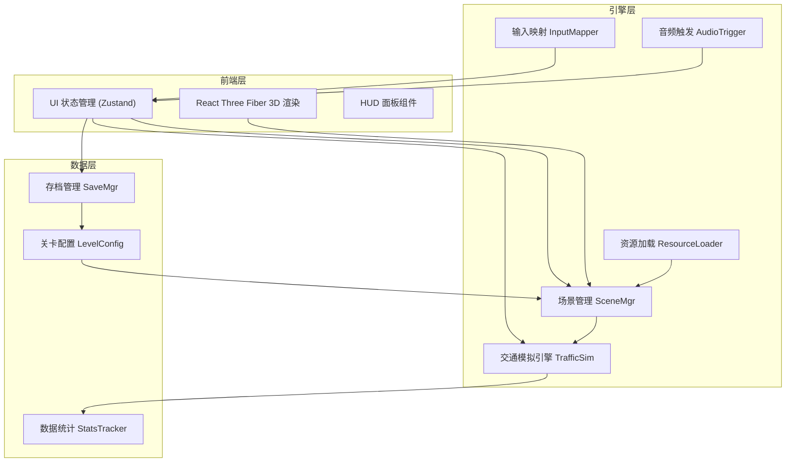
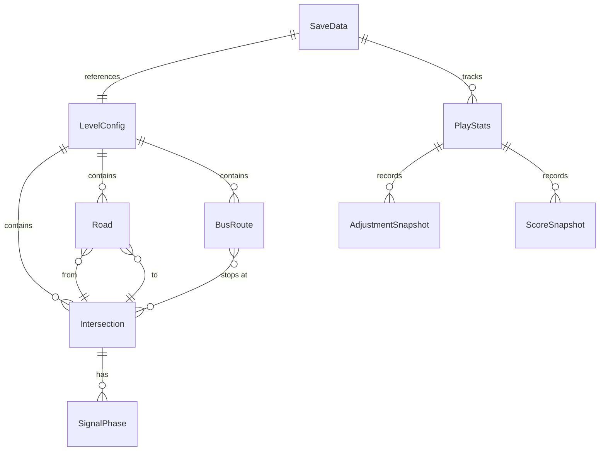

## 1. 架构设计



## 2. 技术说明

- **前端**：React@18 + TypeScript + Tailwind CSS@3 + Vite
- **3D 渲染**：Three.js + @react-three/fiber + @react-three/drei + @react-three/postprocessing
- **状态管理**：Zustand（UI 状态 + 游戏状态）
- **初始化工具**：vite-init (react-ts 模板)
- **后端**：无（纯前端，存档使用 localStorage）
- **数据持久化**：localStorage + JSON 导出

## 3. 路由定义

| 路由 | 用途 |
|------|------|
| `/` | 主界面：关卡选择、沙盒入口、设置入口 |
| `/game/:levelId` | 游戏界面：3D 场景 + HUD |
| `/sandbox` | 沙盒模式 |
| `/editor` | 关卡编辑/配置 |
| `/settings` | 设置页面 |

## 4. 模块架构详情

### 4.1 场景管理 (SceneMgr)

负责管理 3D 场景中的所有对象：道路、路口、信号灯、车辆、公交。

- 管理场景对象生命周期（创建、更新、销毁）
- 处理摄像机控制（轨道、缩放、视角切换）
- 协调交通模拟引擎的渲染同步

### 4.2 交通模拟引擎 (TrafficSim)

核心模拟逻辑，独立于渲染层，可独立运行和回放。

- **道路网络图**：节点（路口）+ 边（道路段），有向图结构
- **车辆代理**：基于简化 car-following 模型，含加速度、最大速度、跟车距离
- **信号灯逻辑**：周期计时器、相位切换、公交优先检测
- **车流生成器**：基于时间表的车辆生成，含高峰曲线
- **拥堵计算**：基于路段平均速度与密度的拥堵评分

### 4.3 输入映射 (InputMapper)

统一处理键盘、鼠标、UI 面板的输入事件，映射为游戏动作。

- 快捷键映射（空格=暂停、1/2/3=加速、R=重开）
- 鼠标点击拾取（Raycaster 选中信号灯/道路）
- UI 面板交互转换为状态变更

### 4.4 资源加载 (ResourceLoader)

管理 3D 模型、纹理、音频的异步加载与缓存。

- 车辆模型（程序化生成几何体）
- 道路纹理（程序化 Canvas 纹理）
- 音频文件（引擎声、信号灯切换声、环境音）

### 4.5 音频触发 (AudioTrigger)

基于游戏事件触发音效播放。

- 信号灯切换提示音
- 车辆喇叭声（拥堵时触发）
- 背景环境音
- UI 交互音效

### 4.6 存档管理 (SaveMgr)

管理游戏存档的读写。

- 存档数据结构：当前关卡、信号灯配置、游戏时间、统计数据
- 3 个存档槽位
- localStorage 持久化
- JSON 导出/导入

### 4.7 关卡配置 (LevelConfig)

关卡数据的定义与加载。

```typescript
interface LevelConfig {
  id: string;
  name: string;
  description: string;
  intersections: IntersectionConfig[];
  roads: RoadConfig[];
  busRoutes: BusRouteConfig[];
  trafficSchedule: TrafficScheduleConfig[];
  targetScore: number;
  timeLimit?: number;
}

interface IntersectionConfig {
  id: string;
  position: [number, number];
  type: "cross" | "t-junction" | "complex";
  signalPhases: SignalPhaseConfig[];
}

interface SignalPhaseConfig {
  direction: "north" | "south" | "east" | "west";
  greenDuration: number;
  defaultCycle: number;
  busPriority: boolean;
}

interface RoadConfig {
  from: string;
  to: string;
  lanes: number;
  speedLimit: number;
}

interface BusRouteConfig {
  id: string;
  stops: string[];
  frequency: number;
  color: string;
}

interface TrafficScheduleConfig {
  timeRange: [number, number];
  densityMultiplier: number;
  peakType: "morning" | "evening" | "both";
}
```

### 4.8 数据统计 (StatsTracker)

记录试玩过程数据。

```typescript
interface PlayStats {
  levelId: string;
  playTimeSeconds: number;
  failureCount: number;
  adjustments: AdjustmentSnapshot[];
  scoreHistory: ScoreSnapshot[];
}

interface AdjustmentSnapshot {
  timestamp: number;
  intersectionId: string;
  before: SignalPhaseConfig[];
  after: SignalPhaseConfig[];
}

interface ScoreSnapshot {
  timestamp: number;
  congestionScore: number;
  throughput: number;
  avgWaitTime: number;
}
```

## 5. 核心数据模型

### 5.1 数据模型定义



## 6. 项目目录结构

```
src/
├── components/
│   ├── ui/                    # UI 面板组件
│   │   ├── SignalPanel.tsx    # 信号灯控制面板
│   │   ├── CongestionDash.tsx # 拥堵仪表盘
│   │   ├── TimeControl.tsx    # 时间控制栏
│   │   ├── ReplayPanel.tsx    # 回放对比面板
│   │   ├── SaveSlots.tsx      # 存档槽位
│   │   └── SettingsPanel.tsx  # 设置面板
│   ├── scene/                 # 3D 场景组件
│   │   ├── GameScene.tsx      # 主 3D 场景
│   │   ├── RoadMesh.tsx       # 道路网格
│   │   ├── IntersectionMesh.tsx # 路口网格
│   │   ├── VehicleMesh.tsx    # 车辆网格
│   │   ├── TrafficLightMesh.tsx # 信号灯网格
│   │   ├── BusMesh.tsx        # 公交车网格
│   │   └── Environment.tsx    # 环境光照/后处理
│   └── layout/                # 布局组件
│       ├── GameLayout.tsx     # 游戏界面布局
│       └── MainMenu.tsx       # 主界面
├── engine/                    # 游戏引擎层
│   ├── TrafficSim.ts          # 交通模拟引擎
│   ├── SceneMgr.ts            # 场景管理
│   ├── InputMapper.ts         # 输入映射
│   ├── ResourceLoader.ts      # 资源加载
│   ├── AudioTrigger.ts        # 音频触发
│   └── CongestionCalc.ts      # 拥堵计算
├── store/                     # Zustand 状态
│   ├── useGameStore.ts        # 游戏主状态
│   ├── useUIStore.ts          # UI 状态
│   └── useSettingsStore.ts    # 设置状态
├── systems/                   # 功能系统
│   ├── SaveMgr.ts             # 存档管理
│   ├── StatsTracker.ts        # 数据统计
│   └── LevelConfig.ts         # 关卡配置
├── data/                      # 关卡数据
│   ├── levels/
│   │   ├── level-1.json       # 十字路口
│   │   ├── level-2.json       # 早高峰
│   │   ├── level-3.json       # 双路口联动
│   │   ├── level-4.json       # 复杂枢纽
│   │   └── level-5.json       # 终极挑战
│   └── sandbox-default.json   # 沙盒默认配置
├── hooks/                     # 自定义 Hooks
│   ├── useSimulation.ts       # 模拟循环 Hook
│   ├── useReplay.ts           # 回放 Hook
│   └── useAudio.ts            # 音频 Hook
├── pages/                     # 页面路由
│   ├── HomePage.tsx
│   ├── GamePage.tsx
│   ├── SandboxPage.tsx
│   ├── EditorPage.tsx
│   └── SettingsPage.tsx
├── types/                     # 类型定义
│   └── index.ts
├── App.tsx
└── main.tsx
```

## 7. 关键技术决策

| 决策 | 选择 | 理由 |
|------|------|------|
| 3D 渲染方案 | @react-three/fiber | 与 React 生态深度集成，声明式 3D 开发 |
| 车辆模型 | 程序化几何体 | 避免外部模型依赖，减小包体积 |
| 模拟引擎 | 独立 TypeScript 类 | 可脱离渲染独立运行，便于回放和测试 |
| 状态管理 | Zustand | 轻量、与 React 深度集成、支持中间件 |
| 存档方案 | localStorage | 纯前端无需后端，满足 Demo 需求 |
| 回放系统 | 快照 + 重放 | 记录关键帧快照，回放时重放快照序列 |
| 音频 | Web Audio API | 浏览器原生支持，无需外部库 |
