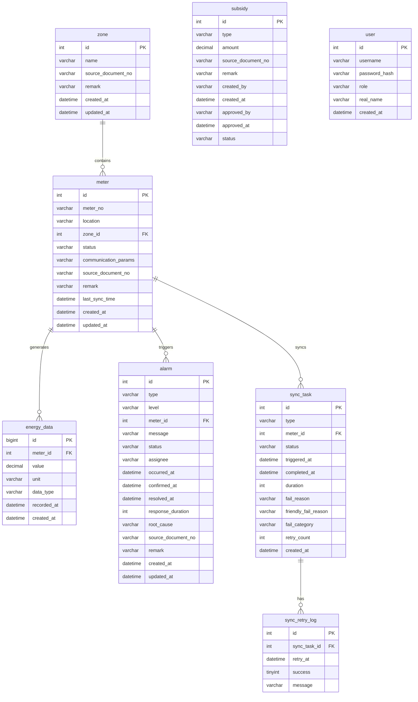

## 1. 架构设计

```mermaid
graph TB
    subgraph "前端层"
        "Vue 3 + Element Plus" --- "ECharts图表"
        "Vue 3 + Element Plus" --- "Vue Router"
        "Vue 3 + Element Plus" --- "Pinia状态管理"
    end
    subgraph "后端层"
        "Spring Boot 3" --- "Spring Security"
        "Spring Boot 3" --- "Spring Data Redis"
        "Spring Boot 3" --- "MyBatis-Plus"
    end
    subgraph "数据层"
        "MySQL 8" --- "能耗数据"
        "MySQL 8" --- "告警记录"
        "MySQL 8" --- "补贴记录"
        "Redis" --- "会话缓存"
        "Redis" --- "实时能耗缓存"
        "Redis" --- "同步任务锁"
    end
    "Vue 3 + Element Plus" -->|"Axios/REST"| "Spring Boot 3"
    "Spring Boot 3" -->|"JDBC"| "MySQL 8"
    "Spring Boot 3" -->|"Lettuce"| "Redis"
```

## 2. 技术说明

- 前端：Vue 3.4 + Element Plus 2.5 + ECharts 5 + Vite 5 + TypeScript + Pinia + Vue Router
- 初始化工具：Vite (vue-ts template)
- 后端：Spring Boot 3.2 + Spring Security + MyBatis-Plus + Spring Data Redis
- 数据库：MySQL 8.0 + Redis 7
- 前后端通信：RESTful API + JSON

## 3. 路由定义

| 路由 | 用途 |
|------|------|
| /dashboard | 能耗看板主页，展示总览卡片和能耗曲线 |
| /dashboard/zone/:id | 分区能耗下钻详情 |
| /meters | 表计管理列表页 |
| /meters/add | 新增表计接入页 |
| /meters/:id | 表计详情页 |
| /zones | 分区管理列表页 |
| /zones/:id | 分区详情页 |
| /alarms | 告警管理列表页 |
| /alarms/:id | 告警详情页（含关联单据和补充说明） |
| /alarms/review | 月度告警复盘页 |
| /subsidies | 补贴记录列表页 |
| /subsidies/:id | 补贴详情页（含来源单据） |
| /data-query | 数据查询与下载页 |
| /sync | 同步任务管理页 |
| /sync/:id | 同步任务详情页（含失败原因和重试结果） |
| /login | 登录页 |

## 4. API定义

### 4.1 能耗数据

```typescript
interface EnergyOverview {
  todayUsage: number
  monthUsage: number
  yesterdayUsage: number
  lastMonthUsage: number
  peakUsage: number
  peakRatio: number
}

interface EnergyCurvePoint {
  time: string
  value: number
  isPeak: boolean
}

interface ZoneEnergyComparison {
  zoneId: number
  zoneName: string
  usage: number
  percentage: number
}

// GET /api/energy/overview
// GET /api/energy/curve?period=day|week|month&zoneId=?
// GET /api/energy/zone-comparison
```

### 4.2 表计管理

```typescript
interface Meter {
  id: number
  meterNo: string
  location: string
  zoneId: number
  zoneName: string
  status: 'online' | 'offline' | 'fault'
  lastSyncTime: string
  lastSyncStatus: 'success' | 'failed' | 'pending'
  sourceDocumentNo: string
  remark: string
  createdAt: string
}

// GET /api/meters?page=1&size=20&keyword=&zoneId=&status=
// GET /api/meters/:id
// POST /api/meters
// PUT /api/meters/:id
```

### 4.3 分区管理

```typescript
interface Zone {
  id: number
  name: string
  meterCount: number
  totalUsage: number
  createdAt: string
  sourceDocumentNo: string
  remark: string
}

// GET /api/zones
// GET /api/zones/:id
// POST /api/zones
// PUT /api/zones/:id
// GET /api/zones/:id/meters
// GET /api/zones/:id/energy
```

### 4.4 告警管理

```typescript
interface Alarm {
  id: number
  type: 'peak_anomaly' | 'device_fault' | 'data_anomaly' | 'communication_loss'
  level: 'critical' | 'warning' | 'info'
  meterId: number
  meterNo: string
  zoneName: string
  message: string
  status: 'pending' | 'confirmed' | 'processing' | 'resolved'
  assignee: string
  occurredAt: string
  confirmedAt: string | null
  resolvedAt: string | null
  responseDuration: number | null
  rootCause: string
  sourceDocumentNo: string
  remark: string
}

interface AlarmReview {
  month: string
  totalAlarms: number
  resolvedAlarms: number
  avgResponseMinutes: number
  topCauses: Array<{ cause: string; count: number }>
  assigneeStats: Array<{ assignee: string; count: number; avgResponse: number }>
  levelDistribution: Record<string, number>
}

// GET /api/alarms?page=1&size=20&type=&level=&status=&startTime=&endTime=
// GET /api/alarms/:id
// PUT /api/alarms/:id/confirm
// PUT /api/alarms/:id/resolve
// GET /api/alarms/review?month=2026-06
```

### 4.5 补贴记录

```typescript
interface Subsidy {
  id: number
  type: string
  amount: number
  sourceDocumentNo: string
  sourceDocumentUrl: string
  remark: string
  createdBy: string
  createdAt: string
  approvedBy: string | null
  approvedAt: string | null
  status: 'pending' | 'approved' | 'rejected'
}

// GET /api/subsidies?page=1&size=20&type=&status=&startTime=&endTime=
// GET /api/subsidies/:id
// POST /api/subsidies
// PUT /api/subsidies/:id/approve
```

### 4.6 数据查询下载

```typescript
interface DataQueryParams {
  startTime: string
  endTime: string
  zoneId?: number
  meterId?: number
  dataType: 'usage' | 'peak' | 'demand'
  granularity: 'hour' | 'day' | 'month'
}

interface DataQueryResult {
  total: number
  items: Array<{
    time: string
    meterNo: string
    zoneName: string
    value: number
    unit: string
  }>
}

// POST /api/data/query
// POST /api/data/export  (returns file download)
```

### 4.7 同步管理

```typescript
interface SyncTask {
  id: number
  type: 'meter_reading' | 'meter_config' | 'alarm_sync'
  meterId: number
  meterNo: string
  status: 'pending' | 'running' | 'success' | 'failed'
  triggeredAt: string
  completedAt: string | null
  duration: number | null
  failReason: string | null
  friendlyFailReason: string | null
  failCategory: 'network' | 'data' | 'config' | 'unknown' | null
  retryCount: number
  retryResults: Array<{
    retryAt: string
    success: boolean
    message: string
  }>
}

// GET /api/sync/tasks?page=1&size=20&status=&meterId=
// GET /api/sync/tasks/:id
// POST /api/sync/tasks/:id/retry
```

## 5. 服务端架构图

```mermaid
graph LR
    subgraph "Controller层"
        "EnergyController"
        "MeterController"
        "ZoneController"
        "AlarmController"
        "SubsidyController"
        "DataQueryController"
        "SyncController"
    end
    subgraph "Service层"
        "EnergyService"
        "MeterService"
        "ZoneService"
        "AlarmService"
        "SubsidyService"
        "DataQueryService"
        "SyncService"
    end
    subgraph "Repository层"
        "MeterRepository"
        "ZoneRepository"
        "AlarmRepository"
        "SubsidyRepository"
        "EnergyDataRepository"
        "SyncTaskRepository"
    end
    "EnergyController" --> "EnergyService"
    "MeterController" --> "MeterService"
    "ZoneController" --> "ZoneService"
    "AlarmController" --> "AlarmService"
    "SubsidyController" --> "SubsidyService"
    "DataQueryController" --> "DataQueryService"
    "SyncController" --> "SyncService"
    "EnergyService" --> "EnergyDataRepository"
    "EnergyService" --> "Redis缓存"
    "MeterService" --> "MeterRepository"
    "ZoneService" --> "ZoneRepository"
    "AlarmService" --> "AlarmRepository"
    "SubsidyService" --> "SubsidyRepository"
    "DataQueryService" --> "EnergyDataRepository"
    "SyncService" --> "SyncTaskRepository"
    "SyncService" --> "Redis分布式锁"
    "MeterRepository" --> "MySQL"
    "ZoneRepository" --> "MySQL"
    "AlarmRepository" --> "MySQL"
    "SubsidyRepository" --> "MySQL"
    "EnergyDataRepository" --> "MySQL"
    "SyncTaskRepository" --> "MySQL"
```

## 6. 数据模型

### 6.1 数据模型定义



### 6.2 数据定义语言

```sql
CREATE TABLE `user` (
  `id` INT AUTO_INCREMENT PRIMARY KEY,
  `username` VARCHAR(64) NOT NULL UNIQUE,
  `password_hash` VARCHAR(256) NOT NULL,
  `role` ENUM('admin','manager','operator') NOT NULL DEFAULT 'operator',
  `real_name` VARCHAR(64) NOT NULL,
  `created_at` DATETIME NOT NULL DEFAULT CURRENT_TIMESTAMP
);

CREATE TABLE `zone` (
  `id` INT AUTO_INCREMENT PRIMARY KEY,
  `name` VARCHAR(128) NOT NULL,
  `source_document_no` VARCHAR(64) DEFAULT NULL,
  `remark` VARCHAR(512) DEFAULT NULL,
  `created_at` DATETIME NOT NULL DEFAULT CURRENT_TIMESTAMP,
  `updated_at` DATETIME NOT NULL DEFAULT CURRENT_TIMESTAMP ON UPDATE CURRENT_TIMESTAMP
);

CREATE TABLE `meter` (
  `id` INT AUTO_INCREMENT PRIMARY KEY,
  `meter_no` VARCHAR(64) NOT NULL UNIQUE,
  `location` VARCHAR(256) NOT NULL,
  `zone_id` INT NOT NULL,
  `status` ENUM('online','offline','fault') NOT NULL DEFAULT 'offline',
  `communication_params` VARCHAR(512) DEFAULT NULL,
  `source_document_no` VARCHAR(64) DEFAULT NULL,
  `remark` VARCHAR(512) DEFAULT NULL,
  `last_sync_time` DATETIME DEFAULT NULL,
  `created_at` DATETIME NOT NULL DEFAULT CURRENT_TIMESTAMP,
  `updated_at` DATETIME NOT NULL DEFAULT CURRENT_TIMESTAMP ON UPDATE CURRENT_TIMESTAMP,
  INDEX `idx_zone_id` (`zone_id`),
  INDEX `idx_status` (`status`),
  CONSTRAINT `fk_meter_zone` FOREIGN KEY (`zone_id`) REFERENCES `zone`(`id`)
);

CREATE TABLE `energy_data` (
  `id` BIGINT AUTO_INCREMENT PRIMARY KEY,
  `meter_id` INT NOT NULL,
  `value` DECIMAL(12,2) NOT NULL,
  `unit` VARCHAR(16) NOT NULL DEFAULT 'kWh',
  `data_type` ENUM('usage','peak','demand') NOT NULL DEFAULT 'usage',
  `recorded_at` DATETIME NOT NULL,
  `created_at` DATETIME NOT NULL DEFAULT CURRENT_TIMESTAMP,
  INDEX `idx_meter_recorded` (`meter_id`, `recorded_at`),
  INDEX `idx_data_type_recorded` (`data_type`, `recorded_at`),
  CONSTRAINT `fk_energy_meter` FOREIGN KEY (`meter_id`) REFERENCES `meter`(`id`)
);

CREATE TABLE `alarm` (
  `id` INT AUTO_INCREMENT PRIMARY KEY,
  `type` ENUM('peak_anomaly','device_fault','data_anomaly','communication_loss') NOT NULL,
  `level` ENUM('critical','warning','info') NOT NULL,
  `meter_id` INT NOT NULL,
  `message` VARCHAR(512) NOT NULL,
  `status` ENUM('pending','confirmed','processing','resolved') NOT NULL DEFAULT 'pending',
  `assignee` VARCHAR(64) DEFAULT NULL,
  `occurred_at` DATETIME NOT NULL,
  `confirmed_at` DATETIME DEFAULT NULL,
  `resolved_at` DATETIME DEFAULT NULL,
  `response_duration` INT DEFAULT NULL COMMENT '响应时长(分钟)',
  `root_cause` VARCHAR(512) DEFAULT NULL,
  `source_document_no` VARCHAR(64) DEFAULT NULL,
  `remark` VARCHAR(512) DEFAULT NULL,
  `created_at` DATETIME NOT NULL DEFAULT CURRENT_TIMESTAMP,
  `updated_at` DATETIME NOT NULL DEFAULT CURRENT_TIMESTAMP ON UPDATE CURRENT_TIMESTAMP,
  INDEX `idx_alarm_status` (`status`),
  INDEX `idx_alarm_type_level` (`type`, `level`),
  INDEX `idx_alarm_occurred` (`occurred_at`),
  INDEX `idx_alarm_assignee` (`assignee`),
  CONSTRAINT `fk_alarm_meter` FOREIGN KEY (`meter_id`) REFERENCES `meter`(`id`)
);

CREATE TABLE `subsidy` (
  `id` INT AUTO_INCREMENT PRIMARY KEY,
  `type` VARCHAR(64) NOT NULL,
  `amount` DECIMAL(12,2) NOT NULL,
  `source_document_no` VARCHAR(64) DEFAULT NULL,
  `remark` VARCHAR(512) DEFAULT NULL,
  `created_by` VARCHAR(64) NOT NULL,
  `created_at` DATETIME NOT NULL DEFAULT CURRENT_TIMESTAMP,
  `approved_by` VARCHAR(64) DEFAULT NULL,
  `approved_at` DATETIME DEFAULT NULL,
  `status` ENUM('pending','approved','rejected') NOT NULL DEFAULT 'pending',
  INDEX `idx_subsidy_status` (`status`),
  INDEX `idx_subsidy_created` (`created_at`)
);

CREATE TABLE `sync_task` (
  `id` INT AUTO_INCREMENT PRIMARY KEY,
  `type` ENUM('meter_reading','meter_config','alarm_sync') NOT NULL,
  `meter_id` INT NOT NULL,
  `status` ENUM('pending','running','success','failed') NOT NULL DEFAULT 'pending',
  `triggered_at` DATETIME NOT NULL DEFAULT CURRENT_TIMESTAMP,
  `completed_at` DATETIME DEFAULT NULL,
  `duration` INT DEFAULT NULL COMMENT '执行耗时(毫秒)',
  `fail_reason` TEXT DEFAULT NULL COMMENT '原始错误信息',
  `friendly_fail_reason` VARCHAR(256) DEFAULT NULL COMMENT '友好错误描述',
  `fail_category` ENUM('network','data','config','unknown') DEFAULT NULL,
  `retry_count` INT NOT NULL DEFAULT 0,
  `created_at` DATETIME NOT NULL DEFAULT CURRENT_TIMESTAMP,
  INDEX `idx_sync_status` (`status`),
  INDEX `idx_sync_meter` (`meter_id`),
  CONSTRAINT `fk_sync_meter` FOREIGN KEY (`meter_id`) REFERENCES `meter`(`id`)
);

CREATE TABLE `sync_retry_log` (
  `id` INT AUTO_INCREMENT PRIMARY KEY,
  `sync_task_id` INT NOT NULL,
  `retry_at` DATETIME NOT NULL DEFAULT CURRENT_TIMESTAMP,
  `success` TINYINT(1) NOT NULL,
  `message` VARCHAR(256) DEFAULT NULL,
  CONSTRAINT `fk_retry_sync_task` FOREIGN KEY (`sync_task_id`) REFERENCES `sync_task`(`id`)
);
```
