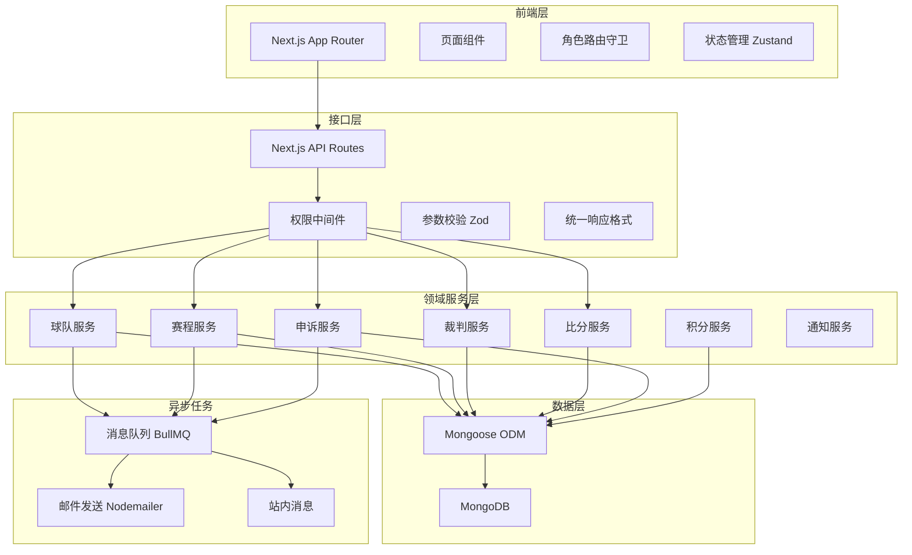
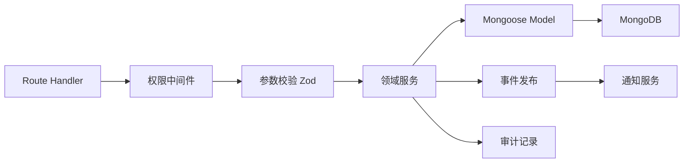
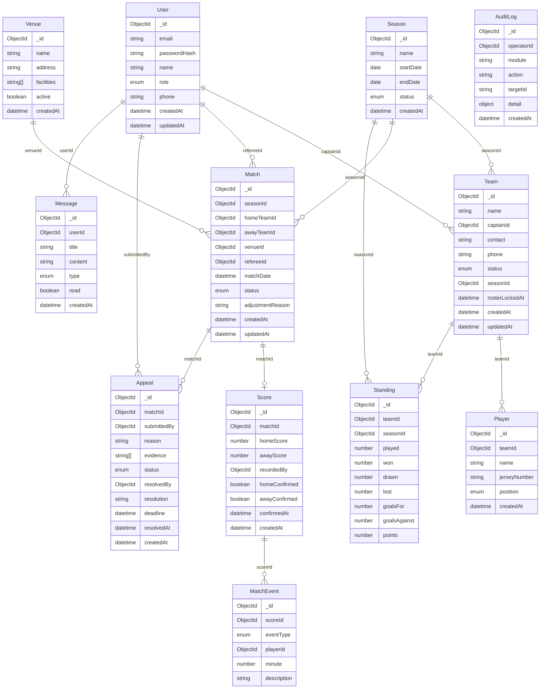

## 1. 架构设计



## 2. 技术说明

- 前端：Next.js 14 (App Router) + TailwindCSS 3 + Zustand
- 初始化工具：create-next-app
- 后端：Next.js API Routes (Route Handlers)
- 数据库：MongoDB + Mongoose ODM
- 参数校验：Zod
- 认证：next-auth (JWT策略)
- 异步任务：BullMQ + Redis (或内存队列降级)
- 邮件：Nodemailer
- UI组件：shadcn/ui + Lucide Icons

## 3. 路由定义

| 路由 | 用途 | 权限 |
|------|------|------|
| /login | 登录页面 | 公开 |
| /admin | 管理员首页 | admin |
| /admin/teams | 球队管理 | admin |
| /admin/teams/review | 报名审核 | admin |
| /admin/schedule | 赛程管理 | admin |
| /admin/schedule/generate | 赛程生成 | admin |
| /admin/referees | 裁判管理 | admin |
| /admin/appeals | 申诉管理 | admin |
| /admin/venues | 场馆管理 | admin |
| /admin/audit | 审计日志 | admin |
| /captain | 领队首页 | captain |
| /captain/team | 我的球队 | captain |
| /captain/team/register | 球队报名 | captain |
| /captain/team/roster | 队员管理 | captain |
| /captain/schedule | 赛程查看 | captain |
| /captain/scores | 比分确认 | captain |
| /captain/appeals | 我的申诉 | captain |
| /referee | 裁判首页 | referee |
| /referee/schedule | 我的赛程 | referee |
| /referee/scores | 比分录入 | referee |
| /standings | 积分榜 | 公开 |
| /schedule | 公开赛程 | 公开 |
| /messages | 消息中心 | 登录用户 |

## 4. API 定义

### 4.1 认证相关

```typescript
POST /api/auth/register
Body: { email: string; password: string; name: string; role: "captain" }
Response: { user: User; token: string }

POST /api/auth/login
Body: { email: string; password: string }
Response: { user: User; token: string }
```

### 4.2 球队管理

```typescript
GET    /api/teams?page=1&limit=10&status=pending&search=
Response: { data: Team[]; total: number; page: number }

POST   /api/teams
Body: { name: string; contact: string; phone: string; players: PlayerInput[] }
Response: { team: Team }

PUT    /api/teams/:id/review
Body: { action: "approve" | "reject"; comment: string }
Response: { team: Team }

PUT    /api/teams/:id/roster
Body: { players: PlayerInput[] }
Response: { team: Team }

PUT    /api/teams/:id/lock-roster
Response: { team: Team }
```

### 4.3 赛程管理

```typescript
GET    /api/schedules?date=2024-01-01&venue=&team=&status=&referee=
Response: { data: Match[]; total: number }

POST   /api/schedules/generate
Body: { seasonId: string; startDate: string; interval: number; venueIds: string[] }
Response: { matches: Match[] }

PUT    /api/schedules/:id
Body: { date?: string; venueId?: string; refereeId?: string; reason: string }
Response: { match: Match }

PUT    /api/schedules/:id/referee
Body: { refereeId: string }
Response: { match: Match }
```

### 4.4 比分管理

```typescript
POST   /api/scores
Body: { matchId: string; homeScore: number; awayScore: number; events: MatchEvent[] }
Response: { score: Score }

PUT    /api/scores/:id/confirm
Body: { confirmed: boolean }
Response: { score: Score }

GET    /api/scores/pending?teamId=
Response: { data: Score[] }
```

### 4.5 积分榜

```typescript
GET    /api/standings?seasonId=
Response: { standings: StandingEntry[] }

interface StandingEntry {
  teamId: string; teamName: string; played: number;
  won: number; drawn: number; lost: number;
  goalsFor: number; goalsAgainst: number;
  points: number; rank: number;
}
```

### 4.6 申诉管理

```typescript
POST   /api/appeals
Body: { matchId: string; reason: string; evidence?: string[] }
Response: { appeal: Appeal }

GET    /api/appeals?status=&matchId=&page=&limit=
Response: { data: Appeal[]; total: number }

PUT    /api/appeals/:id/resolve
Body: { action: "uphold" | "reject"; comment: string; scoreChange?: boolean }
Response: { appeal: Appeal }
```

### 4.7 消息通知

```typescript
GET    /api/messages?page=&limit=&read=
Response: { data: Message[]; total: number; unreadCount: number }

PUT    /api/messages/:id/read
Response: { message: Message }
```

### 4.8 审计日志

```typescript
GET    /api/audit?module=&action=&operator=&startDate=&endDate=&page=&limit=
Response: { data: AuditLog[]; total: number }
```

## 5. 服务端架构图



## 6. 数据模型

### 6.1 数据模型定义



### 6.2 Mongoose Schema 定义

#### User Schema
```javascript
{
  email: { type: String, required: true, unique: true },
  passwordHash: { type: String, required: true },
  name: { type: String, required: true },
  role: { type: String, enum: ["admin", "captain", "referee", "viewer"], required: true },
  phone: String,
  createdAt: { type: Date, default: Date.now },
  updatedAt: { type: Date, default: Date.now }
}
// Indexes: { email: 1 (unique) }, { role: 1 }
```

#### Team Schema
```javascript
{
  name: { type: String, required: true, unique: true },
  captainId: { type: ObjectId, ref: "User", required: true },
  contact: String,
  phone: String,
  status: { type: String, enum: ["pending", "approved", "rejected", "withdrawn"], default: "pending" },
  seasonId: { type: ObjectId, ref: "Season" },
  rosterLockedAt: Date,
  reviewComment: String,
  reviewedBy: { type: ObjectId, ref: "User" },
  reviewedAt: Date,
  createdAt: { type: Date, default: Date.now },
  updatedAt: { type: Date, default: Date.now }
}
// Indexes: { status: 1 }, { captainId: 1 }, { seasonId: 1 }
```

#### Player Schema
```javascript
{
  teamId: { type: ObjectId, ref: "Team", required: true },
  name: { type: String, required: true },
  jerseyNumber: String,
  position: { type: String, enum: ["GK", "DEF", "MID", "FWD", "OTHER"] },
  createdAt: { type: Date, default: Date.now }
}
// Indexes: { teamId: 1 }
```

#### Season Schema
```javascript
{
  name: { type: String, required: true },
  startDate: { type: Date, required: true },
  endDate: { type: Date, required: true },
  status: { type: String, enum: ["upcoming", "active", "completed"], default: "upcoming" },
  appealDeadlineHours: { type: Number, default: 48 },
  createdAt: { type: Date, default: Date.now }
}
```

#### Venue Schema
```javascript
{
  name: { type: String, required: true },
  address: String,
  facilities: [String],
  active: { type: Boolean, default: true },
  createdAt: { type: Date, default: Date.now }
}
```

#### Match Schema
```javascript
{
  seasonId: { type: ObjectId, ref: "Season", required: true },
  homeTeamId: { type: ObjectId, ref: "Team", required: true },
  awayTeamId: { type: ObjectId, ref: "Team", required: true },
  venueId: { type: ObjectId, ref: "Venue" },
  refereeId: { type: ObjectId, ref: "User" },
  matchDate: { type: Date, required: true },
  status: { type: String, enum: ["scheduled", "adjusting", "confirmed", "in_progress", "completed", "postponed", "cancelled"], default: "scheduled" },
  round: Number,
  adjustmentReason: String,
  adjustedBy: { type: ObjectId, ref: "User" },
  createdAt: { type: Date, default: Date.now },
  updatedAt: { type: Date, default: Date.now }
}
// Indexes: { seasonId: 1, matchDate: 1 }, { homeTeamId: 1 }, { awayTeamId: 1 }, { refereeId: 1 }, { status: 1 }
```

#### Score Schema
```javascript
{
  matchId: { type: ObjectId, ref: "Match", required: true, unique: true },
  homeScore: { type: Number, required: true, min: 0 },
  awayScore: { type: Number, required: true, min: 0 },
  recordedBy: { type: ObjectId, ref: "User", required: true },
  homeConfirmed: { type: Boolean, default: false },
  awayConfirmed: { type: Boolean, default: false },
  confirmedAt: Date,
  createdAt: { type: Date, default: Date.now }
}
// Indexes: { matchId: 1 (unique) }
```

#### Appeal Schema
```javascript
{
  matchId: { type: ObjectId, ref: "Match", required: true },
  submittedBy: { type: ObjectId, ref: "User", required: true },
  reason: { type: String, required: true },
  evidence: [String],
  status: { type: String, enum: ["pending", "upheld", "rejected", "expired"], default: "pending" },
  resolvedBy: { type: ObjectId, ref: "User" },
  resolution: String,
  deadline: { type: Date, required: true },
  resolvedAt: Date,
  createdAt: { type: Date, default: Date.now }
}
// Indexes: { status: 1 }, { matchId: 1 }, { submittedBy: 1 }, { deadline: 1 }
```

#### Standing Schema
```javascript
{
  teamId: { type: ObjectId, ref: "Team", required: true },
  seasonId: { type: ObjectId, ref: "Season", required: true },
  played: { type: Number, default: 0 },
  won: { type: Number, default: 0 },
  drawn: { type: Number, default: 0 },
  lost: { type: Number, default: 0 },
  goalsFor: { type: Number, default: 0 },
  goalsAgainst: { type: Number, default: 0 },
  points: { type: Number, default: 0 }
}
// Indexes: { seasonId: 1, points: -1 }, { teamId: 1, seasonId: 1 (unique) }
```

#### Message Schema
```javascript
{
  userId: { type: ObjectId, ref: "User", required: true },
  title: { type: String, required: true },
  content: { type: String, required: true },
  type: { type: String, enum: ["system", "review", "schedule", "score", "appeal"] },
  relatedId: String,
  read: { type: Boolean, default: false },
  createdAt: { type: Date, default: Date.now }
}
// Indexes: { userId: 1, read: 1 }, { userId: 1, createdAt: -1 }
```

#### AuditLog Schema
```javascript
{
  operatorId: { type: ObjectId, ref: "User", required: true },
  module: { type: String, enum: ["team", "schedule", "referee", "score", "appeal", "venue", "user"], required: true },
  action: { type: String, required: true },
  targetId: String,
  detail: Schema.Types.Mixed,
  createdAt: { type: Date, default: Date.now }
}
// Indexes: { module: 1, action: 1 }, { operatorId: 1 }, { createdAt: -1 }
```
