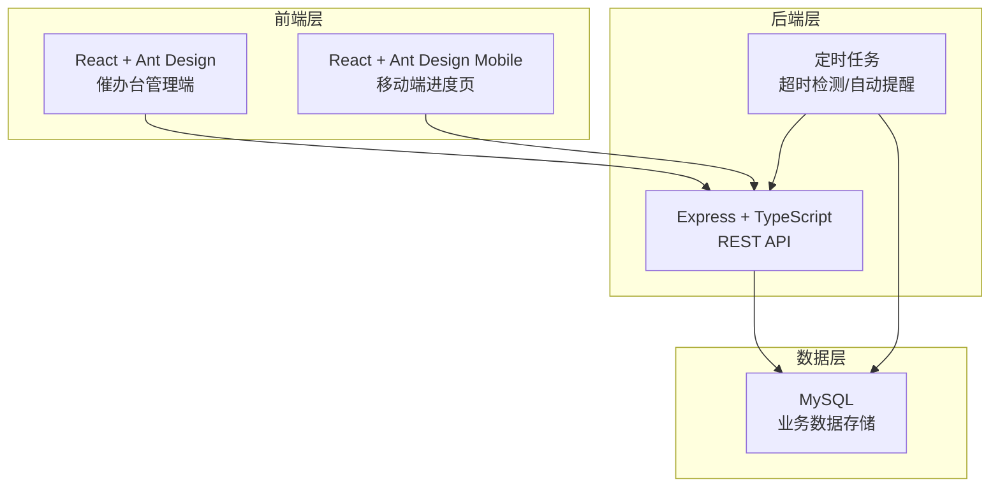
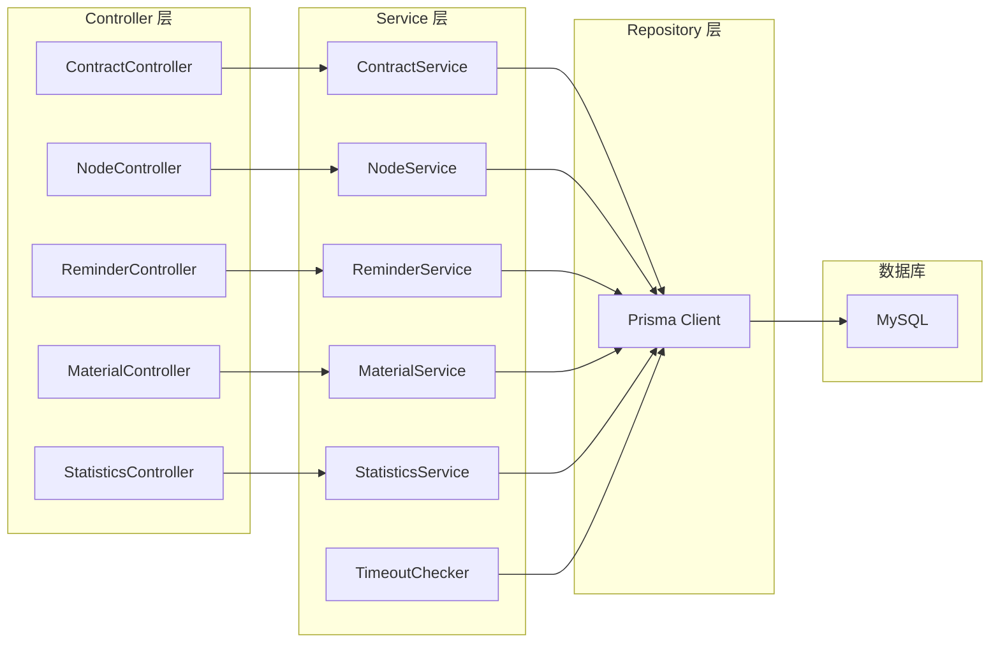
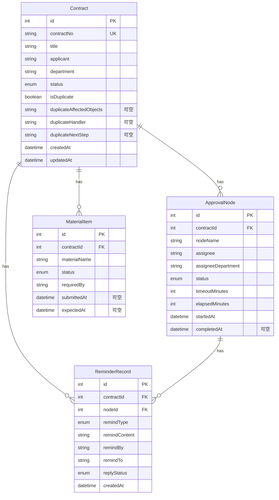

## 1. 架构设计



## 2. 技术说明

- 前端：React@18 + Ant Design@5 + Tailwind CSS@3 + Vite + Zustand
- 初始化工具：vite-init
- 后端：Express@4 + TypeScript（ESM 格式）
- 数据库：MySQL + Prisma ORM
- 认证：JWT Token 简易认证
- 定时任务：node-cron

## 3. 路由定义

| 路由 | 用途 |
|------|------|
| `/` | 催办台总览页（卡住节点、超时预警、统计摘要） |
| `/contract/:id` | 审批流程详情页（节点时间线、催办记录、材料清单、重复申请） |
| `/materials` | 材料清单管理页（缺失总表、补齐追踪） |
| `/statistics` | 数据统计面板（耗时分析、催办频次、超时排行） |
| `/m/progress/:contractNo` | 移动端审批进度页 |

## 4. API 定义

### 审批合同

```typescript
interface Contract {
  id: number
  contractNo: string
  title: string
  applicant: string
  department: string
  status: ContractStatus
  isDuplicate: boolean
  duplicateDetail: DuplicateDetail | null
  createdAt: string
  updatedAt: string
}

type ContractStatus = "PENDING" | "IN_PROGRESS" | "COMPLETED" | "ABNORMAL_CLOSED"

interface DuplicateDetail {
  affectedObjects: string
  handler: string
  nextStep: string
}
```

### 审批节点

```typescript
interface ApprovalNode {
  id: number
  contractId: number
  nodeName: string
  assignee: string
  assigneeDepartment: string
  status: NodeStatus
  timeoutMinutes: number
  elapsedMinutes: number
  startedAt: string
  completedAt: string | null
}

type NodeStatus = "PENDING" | "PROCESSING" | "COMPLETED" | "TIMEOUT"
```

### 催办记录

```typescript
interface ReminderRecord {
  id: number
  contractId: number
  nodeId: number
  remindType: "SMS" | "EMAIL" | "SYSTEM"
  remindContent: string
  remindBy: string
  remindTo: string
  replyStatus: "PENDING" | "REPLIED" | "IGNORED"
  createdAt: string
}
```

### 材料清单

```typescript
interface MaterialItem {
  id: number
  contractId: number
  materialName: string
  status: MaterialStatus
  requiredBy: string
  submittedAt: string | null
  expectedAt: string | null
}

type MaterialStatus = "MISSING" | "SUBMITTED" | "SUPPLEMENTING"
```

### API 端点

| 方法 | 路径 | 描述 |
|------|------|------|
| GET | `/api/contracts` | 获取合同列表（支持筛选状态） |
| GET | `/api/contracts/:id` | 获取合同详情（含节点、材料、催办） |
| POST | `/api/contracts` | 创建合同 |
| PATCH | `/api/contracts/:id/status` | 更新合同状态 |
| GET | `/api/contracts/stuck` | 获取卡住节点列表 |
| GET | `/api/nodes/:id` | 获取节点详情 |
| PATCH | `/api/nodes/:id/status` | 更新节点状态 |
| POST | `/api/reminders` | 发起催办 |
| GET | `/api/reminders?contractId=` | 获取催办记录 |
| PATCH | `/api/reminders/:id/reply` | 更新催办回复状态 |
| GET | `/api/materials?contractId=` | 获取材料清单 |
| PATCH | `/api/materials/:id/status` | 更新材料状态 |
| POST | `/api/materials/batch-remind` | 批量催补材料 |
| GET | `/api/statistics/completeness` | 材料完整率统计 |
| GET | `/api/statistics/duration` | 流程耗时分析 |
| GET | `/api/statistics/reminders` | 催办频次统计 |
| GET | `/api/statistics/timeout-rank` | 节点超时排行 |
| GET | `/api/progress/:contractNo` | 移动端获取审批进度 |

## 5. 服务端架构图



## 6. 数据模型

### 6.1 数据模型定义



### 6.2 数据定义语言

```sql
CREATE TABLE Contract (
  id INT AUTO_INCREMENT PRIMARY KEY,
  contractNo VARCHAR(64) NOT NULL UNIQUE,
  title VARCHAR(255) NOT NULL,
  applicant VARCHAR(64) NOT NULL,
  department VARCHAR(64) NOT NULL,
  status ENUM('PENDING','IN_PROGRESS','COMPLETED','ABNORMAL_CLOSED') NOT NULL DEFAULT 'PENDING',
  isDuplicate BOOLEAN NOT NULL DEFAULT FALSE,
  duplicateAffectedObjects TEXT,
  duplicateHandler VARCHAR(64),
  duplicateNextStep TEXT,
  createdAt DATETIME NOT NULL DEFAULT CURRENT_TIMESTAMP,
  updatedAt DATETIME NOT NULL DEFAULT CURRENT_TIMESTAMP ON UPDATE CURRENT_TIMESTAMP
);

CREATE TABLE ApprovalNode (
  id INT AUTO_INCREMENT PRIMARY KEY,
  contractId INT NOT NULL,
  nodeName VARCHAR(128) NOT NULL,
  assignee VARCHAR(64) NOT NULL,
  assigneeDepartment VARCHAR(64) NOT NULL,
  status ENUM('PENDING','PROCESSING','COMPLETED','TIMEOUT') NOT NULL DEFAULT 'PENDING',
  timeoutMinutes INT NOT NULL DEFAULT 60,
  elapsedMinutes INT NOT NULL DEFAULT 0,
  startedAt DATETIME NOT NULL DEFAULT CURRENT_TIMESTAMP,
  completedAt DATETIME NULL,
  FOREIGN KEY (contractId) REFERENCES Contract(id) ON DELETE CASCADE,
  INDEX idx_contract_status (contractId, status)
);

CREATE TABLE ReminderRecord (
  id INT AUTO_INCREMENT PRIMARY KEY,
  contractId INT NOT NULL,
  nodeId INT NOT NULL,
  remindType ENUM('SMS','EMAIL','SYSTEM') NOT NULL,
  remindContent TEXT NOT NULL,
  remindBy VARCHAR(64) NOT NULL,
  remindTo VARCHAR(64) NOT NULL,
  replyStatus ENUM('PENDING','REPLIED','IGNORED') NOT NULL DEFAULT 'PENDING',
  createdAt DATETIME NOT NULL DEFAULT CURRENT_TIMESTAMP,
  FOREIGN KEY (contractId) REFERENCES Contract(id) ON DELETE CASCADE,
  FOREIGN KEY (nodeId) REFERENCES ApprovalNode(id) ON DELETE CASCADE,
  INDEX idx_contract_node (contractId, nodeId)
);

CREATE TABLE MaterialItem (
  id INT AUTO_INCREMENT PRIMARY KEY,
  contractId INT NOT NULL,
  materialName VARCHAR(255) NOT NULL,
  status ENUM('MISSING','SUBMITTED','SUPPLEMENTING') NOT NULL DEFAULT 'MISSING',
  requiredBy VARCHAR(64) NOT NULL,
  submittedAt DATETIME NULL,
  expectedAt DATETIME NULL,
  FOREIGN KEY (contractId) REFERENCES Contract(id) ON DELETE CASCADE,
  INDEX idx_contract_status (contractId, status)
);
```
