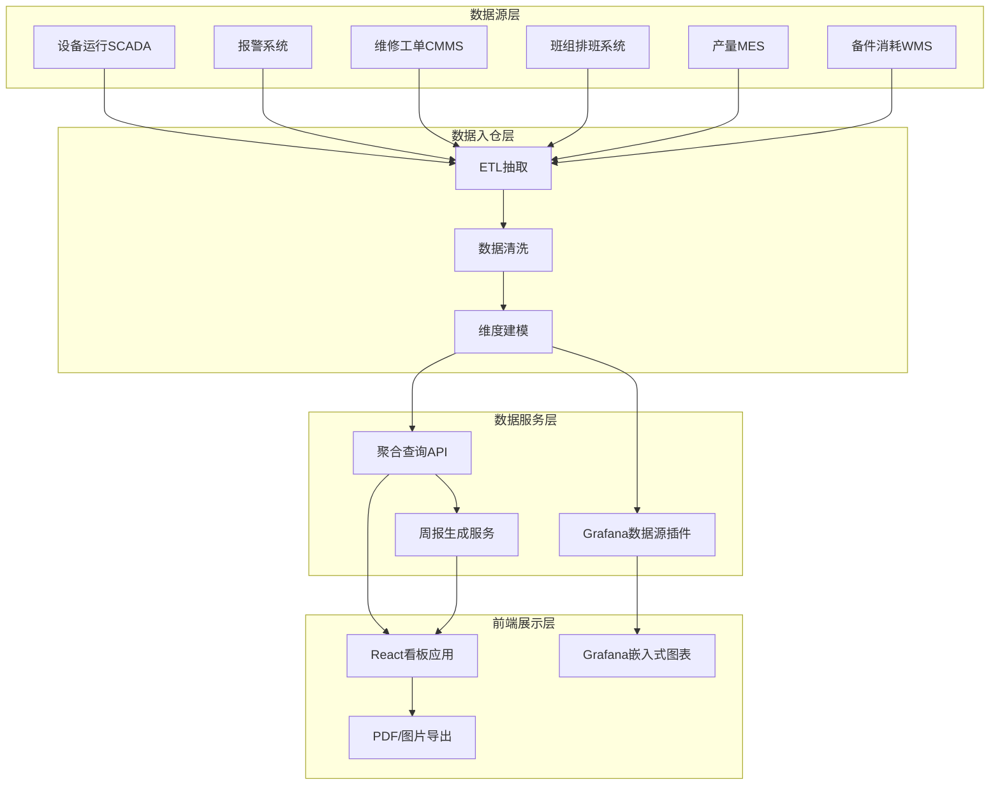
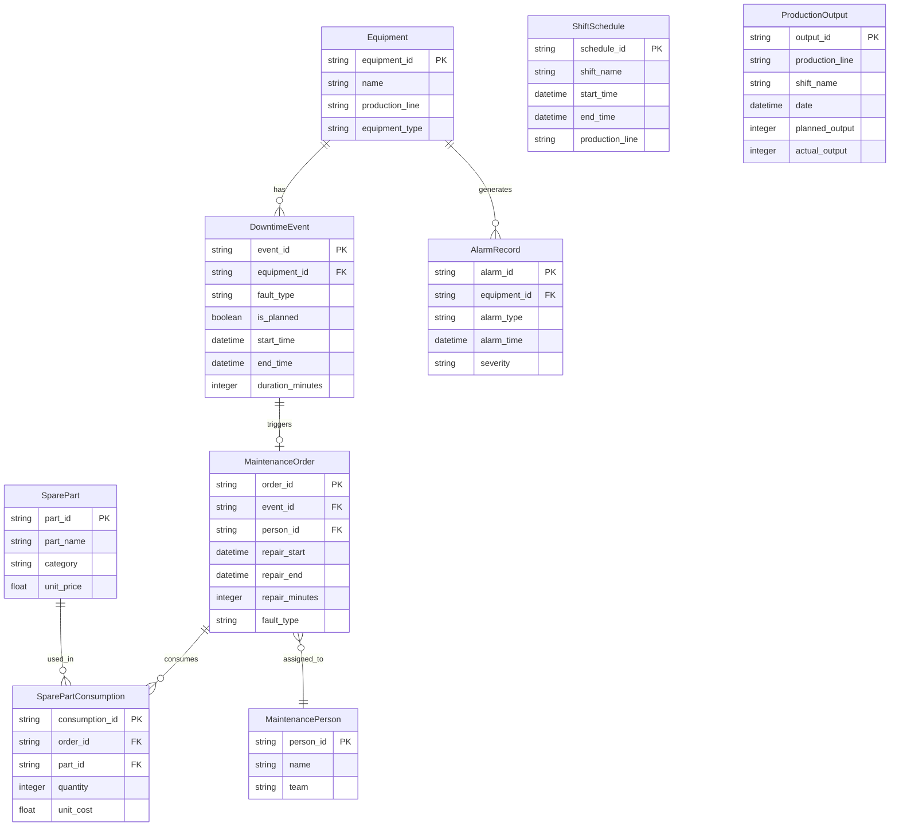

## 1. 架构设计



## 2. 技术说明

- 前端：React@18 + TailwindCSS@3 + Vite
- 图表库：ECharts@5（通过 echarts-for-react 封装）— 用于 Pareto、产线对比、维修时长、备件关联
- 数据服务：前端 Mock 数据层（模拟 Grafana 数据源），生产环境可替换为 Grafana API
- 状态管理：Zustand — 轻量全局筛选状态，支持跨组件联动
- 导出：html2canvas + jsPDF — 将 DOM 渲染为图片/PDF，保留筛选条件水印
- 初始化工具：Vite

## 3. 路由定义

| 路由 | 用途 |
|------|------|
| / | 看板主页面：筛选栏 + KPI 卡片 + 四大图表 |
| /report | 周报生成页面：周报预览 + 同比环比 + 异常点 + 导出 |
| /data-governance | 数据治理说明面板：入库流程 + 聚合规则 + 脏数据处理策略 |

## 4. API 定义

### 4.1 数据查询接口

```typescript
interface FilterState {
  equipmentIds: string[]
  productionLines: string[]
  shifts: ('早班' | '中班' | '夜班')[]
  faultTypes: string[]
  maintenancePersonIds: string[]
  downtimeMode: 'all' | 'planned' | 'unplanned'
  dateRange: [string, string]
}

interface DowntimeRecord {
  id: string
  equipmentId: string
  equipmentName: string
  productionLine: string
  shift: '早班' | '中班' | '夜班'
  faultType: string
  downtimeStart: string
  downtimeEnd: string
  downtimeMinutes: number
  isPlanned: boolean
  maintenancePersonId: string
  maintenancePersonName: string
  repairStart: string
  repairEnd: string
  repairMinutes: number
  spareParts: SparePartConsumption[]
}

interface SparePartConsumption {
  partId: string
  partName: string
  quantity: number
  unitCost: number
}

interface KPISummary {
  totalDowntimeMinutes: number
  plannedDowntimeMinutes: number
  unplannedDowntimeMinutes: number
  plannedRatio: number
  avgRepairResponseMinutes: number
  equipmentAvailabilityRate: number
  weekOverWeekChange: number
  yearOverYearChange: number
}

interface ParetoItem {
  faultType: string
  plannedMinutes: number
  unplannedMinutes: number
  cumulativePercentage: number
}

interface ProductionLineComparison {
  productionLine: string
  plannedMinutes: number
  unplannedMinutes: number
  breakdownByShift: Record<string, number>
  breakdownByFaultType: Record<string, number>
}

interface RepairDurationDistribution {
  faultType: string
  maintenancePerson: string
  durations: number[]
  median: number
  p75: number
  p95: number
  outliers: number[]
}

interface SparePartCorrelation {
  faultType: string
  partName: string
  downtimeMinutes: number
  consumptionQuantity: number
  frequency: number
  totalCost: number
}

interface WeeklyReport {
  weekLabel: string
  generatedAt: string
  filterSnapshot: FilterState
  kpiSummary: KPISummary
  keyChanges: string[]
  anomalies: AnomalyItem[]
  paretoTop5: ParetoItem[]
  productionLineSummary: ProductionLineComparison[]
}

interface AnomalyItem {
  date: string
  equipmentName: string
  metric: string
  expectedValue: number
  actualValue: number
  deviation: number
  severity: 'warning' | 'critical'
}
```

### 4.2 请求/响应

| 接口 | 方法 | 请求 | 响应 |
|------|------|------|------|
| /api/kpi | POST | FilterState | KPISummary |
| /api/downtime/pareto | POST | FilterState | ParetoItem[] |
| /api/downtime/production-line | POST | FilterState | ProductionLineComparison[] |
| /api/downtime/repair-duration | POST | FilterState | RepairDurationDistribution[] |
| /api/downtime/spare-part-correlation | POST | FilterState | SparePartCorrelation[] |
| /api/report/weekly | POST | FilterState | WeeklyReport |

## 5. 数据模型

### 5.1 数据模型定义



### 5.2 数据入库与处理策略

#### 原始数据入库流程
1. **SCADA 设备运行数据**：每分钟采集，通过 MQTT → 时序数据库 → ETL 抽取停机事件
2. **报警系统数据**：实时推送，通过 Kafka → 报警表，关联设备 ID 和时间戳
3. **维修工单**：人工录入 CMMS 系统，每日同步至数据仓库
4. **班组排班**：每周从排班系统导入，建立班次-时间段映射
5. **产量数据**：MES 系统每小时聚合，每日批量同步
6. **备件消耗**：WMS 系统出库即同步，关联维修工单号

#### 数据聚合规则
- **停机时长**：按 `end_time - start_time` 计算分钟数，排除跨班重叠
- **计划检修标识**：CMMS 工单类型字段为"计划检修"的标记 `is_planned = true`
- **班次归属**：按 `start_time` 落入排班时间段确定班次
- **同比环比**：同比取去年同期周数据，环比取上周数据
- **异常检测**：Z-score > 2 标记为 warning，> 3 标记为 critical

#### 脏数据处理策略
| 问题类型 | 识别规则 | 处理策略 |
|----------|----------|----------|
| 停机时长为 0 | `duration_minutes ≤ 0` | 排除，标记为数据异常 |
| 结束时间早于开始时间 | `end_time < start_time` | 取反修正，标记为疑似录入错误 |
| 缺失维修工单 | 停机事件无关联工单 | 归入"未记录维修"类别，不影响计划/突发统计 |
| 备件消耗无工单关联 | `order_id` 为空 | 单独统计，不纳入停机关联分析 |
| 重复停机事件 | 同设备同时间窗口 | 去重保留最早记录 |
| 产量缺失 | 某小时无产量记录 | 用前一小时数据插值，标记为估算 |
| 报警无对应停机 | 报警未触发停机 | 保留在报警分析中，不纳入停机统计 |

#### 导出时筛选条件保留
- 导出 PDF/图片时，在页面底部或水印区域嵌入当前筛选条件的文本摘要
- 筛选条件编码为 URL 参数格式，支持通过 URL 还原筛选状态
- 周报中"筛选口径"板块完整记录生成时的 FilterState JSON 快照
