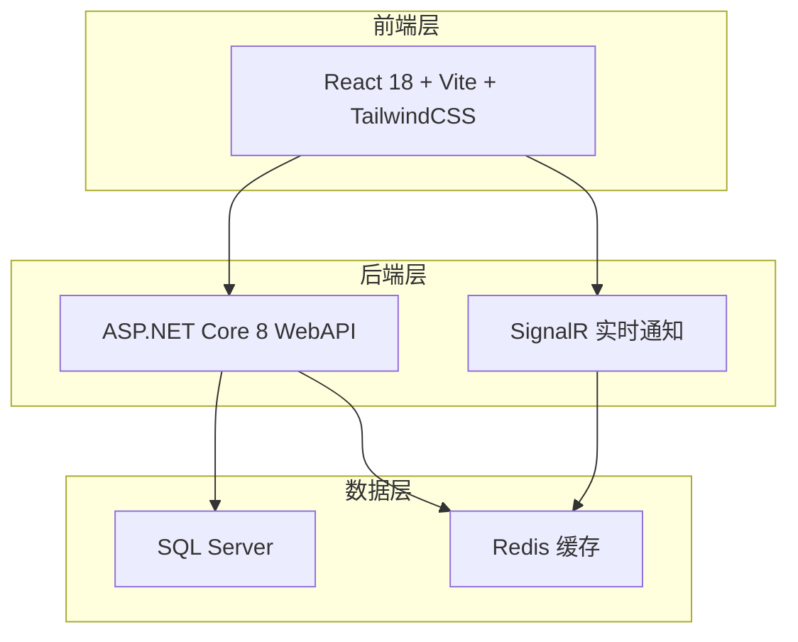
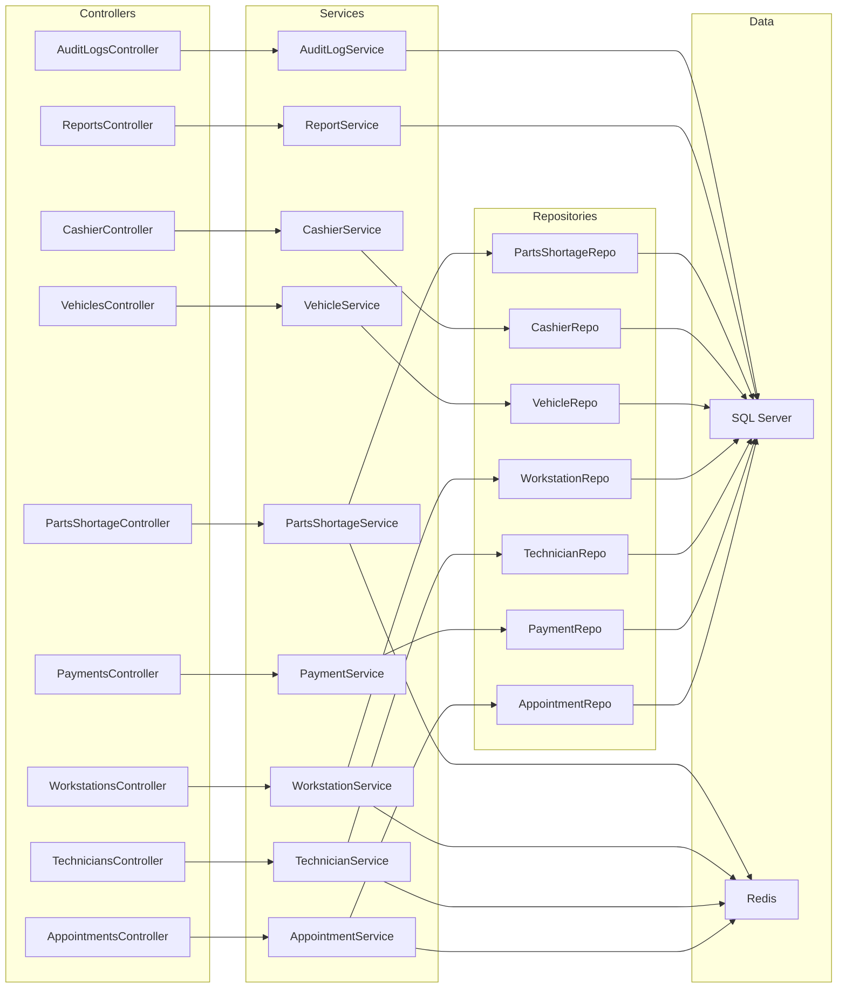
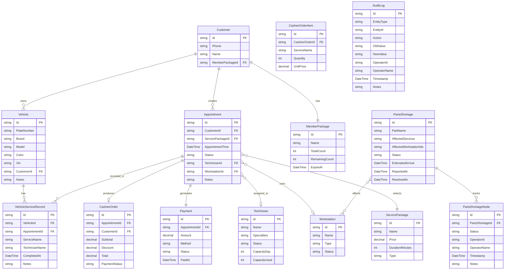

## 1. 架构设计



## 2. 技术说明

- 前端：React@18 + TailwindCSS@3 + Vite + TypeScript
- 初始化工具：Vite
- 后端：ASP.NET Core 8 WebAPI
- 数据库：SQL Server (Entity Framework Core)
- 缓存：Redis (StackExchange.Redis)
- 实时通信：SignalR（状态变更推送）

## 3. 路由定义

| 路由 | 用途 |
|------|------|
| / | 顾客预约首页（套餐浏览+时段选择） |
| /booking/pay | 顾客支付页 |
| /booking/order/:id | 顾客订单跟踪页 |
| /dashboard | 门店仪表盘（值班人员主页） |
| /dispatch | 技师工位调度看板 |
| /vehicles | 车辆档案管理 |
| /vehicles/:id | 车辆详情+历史记录 |
| /cashier | 收银单管理列表 |
| /cashier/:id | 收银单详情 |
| /parts-shortage | 配件缺货处理 |
| /reports | 到店转化报表 |
| /audit-logs | 状态变更日志 |

## 4. API 定义

### 4.1 预约相关

```typescript
interface Appointment {
  id: string;
  customerId: string;
  servicePackageId: string;
  appointmentTime: string;
  status: "pending" | "confirmed" | "arrived" | "in_service" | "completed" | "cancelled";
  technicianId?: string;
  workstationId?: string;
  notes?: string;
  createdAt: string;
  updatedAt: string;
}

interface CreateAppointmentRequest {
  customerId: string;
  servicePackageId: string;
  appointmentTime: string;
  notes?: string;
}

interface AppointmentResponse {
  appointment: Appointment;
  paymentUrl: string;
}
```

### 4.2 支付相关

```typescript
interface Payment {
  id: string;
  appointmentId: string;
  amount: number;
  method: "wechat" | "alipay";
  status: "pending" | "paid" | "refunded";
  paidAt?: string;
  createdAt: string;
}
```

### 4.3 技师与工位

```typescript
interface Technician {
  id: string;
  name: string;
  specialties: string[];
  status: "available" | "busy" | "off_duty";
  currentWorkstationId?: string;
  capacityDay: number;
  capacityUsed: number;
}

interface Workstation {
  id: string;
  name: string;
  type: "wash" | "detail" | "repair";
  status: "idle" | "occupied" | "maintenance";
  currentAppointmentId?: string;
  currentTechnicianId?: string;
}
```

### 4.4 车辆档案

```typescript
interface Vehicle {
  id: string;
  plateNumber: string;
  brand: string;
  model: string;
  color: string;
  vin?: string;
  customerId: string;
  notes?: string;
  tags: string[];
  createdAt: string;
}

interface VehicleServiceRecord {
  id: string;
  vehicleId: string;
  appointmentId: string;
  serviceName: string;
  technicianName: string;
  completedAt: string;
  notes?: string;
}
```

### 4.5 收银单

```typescript
interface CashierOrder {
  id: string;
  appointmentId: string;
  customerId: string;
  items: CashierOrderItem[];
  subtotal: number;
  discount: number;
  total: number;
  paymentMethod: string;
  paymentStatus: "pending" | "paid" | "refunded";
  createdAt: string;
}

interface CashierOrderItem {
  serviceName: string;
  quantity: number;
  unitPrice: number;
  partsUsed?: string[];
}
```

### 4.6 配件缺货

```typescript
interface PartsShortage {
  id: string;
  partName: string;
  affectedServices: string[];
  affectedWorkstationIds: string[];
  status: "reported" | "ordered" | "in_transit" | "arrived" | "restocked";
  estimatedArrival?: string;
  reportedAt: string;
  resolvedAt?: string;
  nodes: PartsShortageNode[];
}

interface PartsShortageNode {
  status: string;
  operatorId: string;
  operatorName: string;
  timestamp: string;
  notes?: string;
}
```

### 4.7 状态变更日志

```typescript
interface AuditLog {
  id: string;
  entityType: "appointment" | "payment" | "technician" | "workstation" | "parts_shortage" | "cashier_order";
  entityId: string;
  action: string;
  oldValue?: string;
  newValue?: string;
  operatorId: string;
  operatorName: string;
  timestamp: string;
  notes?: string;
}
```

### 4.8 报表

```typescript
interface ConversionReport {
  period: string;
  totalAppointments: number;
  arrivedCount: number;
  arrivalRate: number;
  completedCount: number;
  completionRate: number;
  avgRevenue: number;
}

interface TechnicianPerformance {
  technicianId: string;
  technicianName: string;
  serviceCount: number;
  revenue: number;
  rating: number;
}
```

## 5. 服务端架构图



## 6. 数据模型

### 6.1 数据模型定义



### 6.2 数据定义语言

```sql
CREATE TABLE Customers (
    Id UNIQUEIDENTIFIER PRIMARY KEY DEFAULT NEWID(),
    Phone NVARCHAR(20) NOT NULL,
    Name NVARCHAR(50) NOT NULL,
    MemberPackageId UNIQUEIDENTIFIER NULL,
    CreatedAt DATETIME2 NOT NULL DEFAULT GETUTCDATE(),
    UpdatedAt DATETIME2 NOT NULL DEFAULT GETUTCDATE()
);

CREATE TABLE Vehicles (
    Id UNIQUEIDENTIFIER PRIMARY KEY DEFAULT NEWID(),
    PlateNumber NVARCHAR(20) NOT NULL,
    Brand NVARCHAR(50) NOT NULL,
    Model NVARCHAR(50) NOT NULL,
    Color NVARCHAR(30) NOT NULL,
    Vin NVARCHAR(50) NULL,
    CustomerId UNIQUEIDENTIFIER NOT NULL FOREIGN KEY REFERENCES Customers(Id),
    Notes NVARCHAR(500) NULL,
    Tags NVARCHAR(500) NULL,
    CreatedAt DATETIME2 NOT NULL DEFAULT GETUTCDATE()
);

CREATE TABLE ServicePackages (
    Id UNIQUEIDENTIFIER PRIMARY KEY DEFAULT NEWID(),
    Name NVARCHAR(100) NOT NULL,
    Price DECIMAL(10,2) NOT NULL,
    DurationMinutes INT NOT NULL,
    Type NVARCHAR(30) NOT NULL,
    Description NVARCHAR(500) NULL,
    IsActive BIT NOT NULL DEFAULT 1
);

CREATE TABLE MemberPackages (
    Id UNIQUEIDENTIFIER PRIMARY KEY DEFAULT NEWID(),
    CustomerId UNIQUEIDENTIFIER NOT NULL FOREIGN KEY REFERENCES Customers(Id),
    Name NVARCHAR(100) NOT NULL,
    TotalCount INT NOT NULL,
    RemainingCount INT NOT NULL,
    ExpireAt DATETIME2 NOT NULL,
    CreatedAt DATETIME2 NOT NULL DEFAULT GETUTCDATE()
);

CREATE TABLE Technicians (
    Id UNIQUEIDENTIFIER PRIMARY KEY DEFAULT NEWID(),
    Name NVARCHAR(50) NOT NULL,
    Specialties NVARCHAR(200) NOT NULL,
    Status NVARCHAR(20) NOT NULL DEFAULT 'available',
    CurrentWorkstationId UNIQUEIDENTIFIER NULL,
    CapacityDay INT NOT NULL DEFAULT 8,
    CapacityUsed INT NOT NULL DEFAULT 0
);

CREATE TABLE Workstations (
    Id UNIQUEIDENTIFIER PRIMARY KEY DEFAULT NEWID(),
    Name NVARCHAR(50) NOT NULL,
    Type NVARCHAR(30) NOT NULL,
    Status NVARCHAR(20) NOT NULL DEFAULT 'idle',
    CurrentAppointmentId UNIQUEIDENTIFIER NULL,
    CurrentTechnicianId UNIQUEIDENTIFIER NULL
);

CREATE TABLE Appointments (
    Id UNIQUEIDENTIFIER PRIMARY KEY DEFAULT NEWID(),
    CustomerId UNIQUEIDENTIFIER NOT NULL FOREIGN KEY REFERENCES Customers(Id),
    ServicePackageId UNIQUEIDENTIFIER NOT NULL FOREIGN KEY REFERENCES ServicePackages(Id),
    AppointmentTime DATETIME2 NOT NULL,
    Status NVARCHAR(20) NOT NULL DEFAULT 'pending',
    TechnicianId UNIQUEIDENTIFIER NULL FOREIGN KEY REFERENCES Technicians(Id),
    WorkstationId UNIQUEIDENTIFIER NULL FOREIGN KEY REFERENCES Workstations(Id),
    Notes NVARCHAR(500) NULL,
    CreatedAt DATETIME2 NOT NULL DEFAULT GETUTCDATE(),
    UpdatedAt DATETIME2 NOT NULL DEFAULT GETUTCDATE()
);

CREATE TABLE Payments (
    Id UNIQUEIDENTIFIER PRIMARY KEY DEFAULT NEWID(),
    AppointmentId UNIQUEIDENTIFIER NOT NULL FOREIGN KEY REFERENCES Appointments(Id),
    Amount DECIMAL(10,2) NOT NULL,
    Method NVARCHAR(20) NOT NULL,
    Status NVARCHAR(20) NOT NULL DEFAULT 'pending',
    PaidAt DATETIME2 NULL,
    CreatedAt DATETIME2 NOT NULL DEFAULT GETUTCDATE()
);

CREATE TABLE CashierOrders (
    Id UNIQUEIDENTIFIER PRIMARY KEY DEFAULT NEWID(),
    AppointmentId UNIQUEIDENTIFIER NOT NULL FOREIGN KEY REFERENCES Appointments(Id),
    CustomerId UNIQUEIDENTIFIER NOT NULL FOREIGN KEY REFERENCES Customers(Id),
    Subtotal DECIMAL(10,2) NOT NULL,
    Discount DECIMAL(10,2) NOT NULL DEFAULT 0,
    Total DECIMAL(10,2) NOT NULL,
    PaymentMethod NVARCHAR(20) NOT NULL,
    PaymentStatus NVARCHAR(20) NOT NULL DEFAULT 'pending',
    CreatedAt DATETIME2 NOT NULL DEFAULT GETUTCDATE()
);

CREATE TABLE CashierOrderItems (
    Id UNIQUEIDENTIFIER PRIMARY KEY DEFAULT NEWID(),
    CashierOrderId UNIQUEIDENTIFIER NOT NULL FOREIGN KEY REFERENCES CashierOrders(Id),
    ServiceName NVARCHAR(100) NOT NULL,
    Quantity INT NOT NULL DEFAULT 1,
    UnitPrice DECIMAL(10,2) NOT NULL,
    PartsUsed NVARCHAR(500) NULL
);

CREATE TABLE VehicleServiceRecords (
    Id UNIQUEIDENTIFIER PRIMARY KEY DEFAULT NEWID(),
    VehicleId UNIQUEIDENTIFIER NOT NULL FOREIGN KEY REFERENCES Vehicles(Id),
    AppointmentId UNIQUEIDENTIFIER NOT NULL FOREIGN KEY REFERENCES Appointments(Id),
    ServiceName NVARCHAR(100) NOT NULL,
    TechnicianName NVARCHAR(50) NOT NULL,
    CompletedAt DATETIME2 NOT NULL,
    Notes NVARCHAR(500) NULL
);

CREATE TABLE PartsShortages (
    Id UNIQUEIDENTIFIER PRIMARY KEY DEFAULT NEWID(),
    PartName NVARCHAR(100) NOT NULL,
    AffectedServices NVARCHAR(500) NULL,
    AffectedWorkstationIds NVARCHAR(500) NULL,
    Status NVARCHAR(20) NOT NULL DEFAULT 'reported',
    EstimatedArrival DATETIME2 NULL,
    ReportedAt DATETIME2 NOT NULL DEFAULT GETUTCDATE(),
    ResolvedAt DATETIME2 NULL
);

CREATE TABLE PartsShortageNodes (
    Id UNIQUEIDENTIFIER PRIMARY KEY DEFAULT NEWID(),
    PartsShortageId UNIQUEIDENTIFIER NOT NULL FOREIGN KEY REFERENCES PartsShortages(Id),
    Status NVARCHAR(30) NOT NULL,
    OperatorId UNIQUEIDENTIFIER NOT NULL,
    OperatorName NVARCHAR(50) NOT NULL,
    Timestamp DATETIME2 NOT NULL DEFAULT GETUTCDATE(),
    Notes NVARCHAR(500) NULL
);

CREATE TABLE AuditLogs (
    Id UNIQUEIDENTIFIER PRIMARY KEY DEFAULT NEWID(),
    EntityType NVARCHAR(30) NOT NULL,
    EntityId UNIQUEIDENTIFIER NOT NULL,
    Action NVARCHAR(50) NOT NULL,
    OldValue NVARCHAR(MAX) NULL,
    NewValue NVARCHAR(MAX) NULL,
    OperatorId UNIQUEIDENTIFIER NOT NULL,
    OperatorName NVARCHAR(50) NOT NULL,
    Timestamp DATETIME2 NOT NULL DEFAULT GETUTCDATE(),
    Notes NVARCHAR(500) NULL
);

CREATE INDEX IX_Appointments_CustomerId ON Appointments(CustomerId);
CREATE INDEX IX_Appointments_Status ON Appointments(Status);
CREATE INDEX IX_Appointments_AppointmentTime ON Appointments(AppointmentTime);
CREATE INDEX IX_Payments_AppointmentId ON Payments(AppointmentId);
CREATE INDEX IX_CashierOrders_AppointmentId ON CashierOrders(AppointmentId);
CREATE INDEX IX_Vehicles_CustomerId ON Vehicles(CustomerId);
CREATE INDEX IX_Vehicles_PlateNumber ON Vehicles(PlateNumber);
CREATE INDEX IX_VehicleServiceRecords_VehicleId ON VehicleServiceRecords(VehicleId);
CREATE INDEX IX_PartsShortages_Status ON PartsShortages(Status);
CREATE INDEX IX_AuditLogs_EntityType_EntityId ON AuditLogs(EntityType, EntityId);
CREATE INDEX IX_AuditLogs_Timestamp ON AuditLogs(Timestamp);
CREATE INDEX IX_Technicians_Status ON Technicians(Status);
CREATE INDEX IX_Workstations_Status ON Workstations(Status);
```

## 7. Redis 缓存策略

| 缓存键 | 数据内容 | 过期时间 | 用途 |
|--------|----------|----------|------|
| technician:status:{id} | 技师实时状态 | 5 分钟 | 仪表盘快速查询 |
| workstation:status:{id} | 工位实时状态 | 5 分钟 | 仪表盘快速查询 |
| dashboard:today | 今日仪表盘聚合数据 | 1 分钟 | 仪表盘首页加载 |
| parts:shortage:active | 当前活跃缺货列表 | 10 分钟 | 配件缺货处理页 |
| appointment:slots:{date} | 某日可用时段 | 30 分钟 | 顾客预约时段查询 |
| capacity:technician:{id}:{date} | 技师某日产能 | 10 分钟 | 产能报表 |
