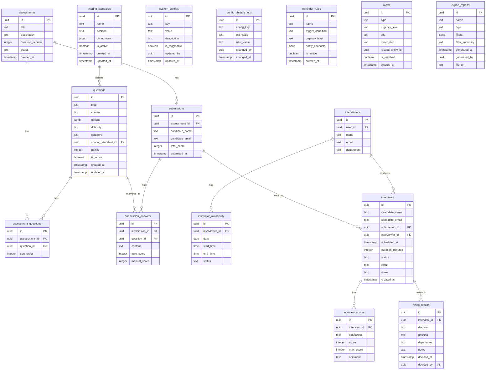

## 1. 架构设计

```mermaid
graph TB
    subgraph "前端层"
        "Next.js App Router" --> "候选人端页面"
        "Next.js App Router" --> "管理后台页面"
        "Next.js App Router" --> "看板页面"
    end

    subgraph "数据层"
        "Supabase Auth" --> "用户认证"
        "Supabase PostgreSQL" --> "业务数据存储"
        "Supabase Realtime" --> "实时提醒推送"
        "Supabase Storage" --> "附件存储"
    end

    subgraph "服务层"
        "Next.js API Routes" --> "业务逻辑处理"
        "Next.js API Routes" --> "数据校验"
        "Next.js API Routes" --> "报表生成"
    end

    "前端层" --> "服务层"
    "服务层" --> "数据层"
```

## 2. 技术说明

- **前端框架**：Next.js 14 (App Router) + TypeScript
- **UI 框架**：Tailwind CSS + shadcn/ui
- **状态管理**：Zustand
- **数据库**：Supabase (PostgreSQL)
- **认证**：Supabase Auth
- **实时通信**：Supabase Realtime
- **图表**：Recharts
- **图标**：Lucide React
- **表单**：React Hook Form + Zod
- **日期处理**：date-fns
- **导出**：xlsx (SheetJS)

## 3. 路由定义

| 路由 | 用途 |
|------|------|
| `/` | 前台首页/测评入口 |
| `/assessment/[id]` | 候选人测评页面 |
| `/assessment/[id]/result` | 测评结果页面 |
| `/booking` | 预约面试页面 |
| `/admin` | 后台首页/数据概览 |
| `/admin/questions` | 题库管理 |
| `/admin/questions/new` | 新增题目 |
| `/admin/questions/[id]/edit` | 编辑题目 |
| `/admin/scoring` | 评分标准管理 |
| `/admin/interviews` | 面试安排（日历视图） |
| `/admin/instructors` | 讲师档期管理 |
| `/admin/results` | 录用结果管理 |
| `/admin/dashboard` | 面试质量看板 |
| `/admin/dashboard/alerts` | 预警中心 |
| `/admin/dashboard/export` | 报表导出 |
| `/admin/settings` | 系统设置 |
| `/admin/settings/history` | 修改记录 |
| `/admin/settings/reminders` | 提醒规则 |

## 4. API 定义

### 4.1 测评相关

```typescript
interface Assessment {
  id: string
  title: string
  description: string
  duration_minutes: number
  questions: Question[]
  status: 'draft' | 'active' | 'archived'
  created_at: string
}

interface Question {
  id: string
  type: 'single_choice' | 'multiple_choice' | 'coding' | 'short_answer'
  content: string
  options?: string[]
  difficulty: 'easy' | 'medium' | 'hard'
  category: string
  scoring_standard_id: string
  points: number
}

interface AssessmentSubmission {
  id: string
  assessment_id: string
  candidate_name: string
  candidate_email: string
  answers: Answer[]
  score: number
  submitted_at: string
}

interface Answer {
  question_id: string
  content: string
  auto_score?: number
  manual_score?: number
}
```

### 4.2 面试相关

```typescript
interface Interview {
  id: string
  candidate_name: string
  candidate_email: string
  assessment_submission_id?: string
  interviewer_id: string
  scheduled_at: string
  duration_minutes: number
  status: 'scheduled' | 'in_progress' | 'completed' | 'cancelled'
  scores: InterviewScore[]
  result?: 'pass' | 'fail' | 'pending'
  notes?: string
}

interface InterviewScore {
  dimension: string
  score: number
  max_score: number
  comment?: string
}

interface InstructorAvailability {
  id: string
  instructor_id: string
  date: string
  start_time: string
  end_time: string
  status: 'available' | 'busy' | 'leave'
}
```

### 4.3 评分标准

```typescript
interface ScoringStandard {
  id: string
  name: string
  position: string
  dimensions: ScoringDimension[]
  is_active: boolean
  created_at: string
  updated_at: string
}

interface ScoringDimension {
  name: string
  weight: number
  levels: ScoringLevel[]
}

interface ScoringLevel {
  level: string
  min_score: number
  max_score: number
  description: string
}
```

### 4.4 配置与提醒

```typescript
interface SystemConfig {
  id: string
  key: string
  value: boolean | string | number
  description: string
  is_toggleable: boolean
  updated_by: string
  updated_at: string
}

interface ConfigChangeLog {
  id: string
  config_key: string
  old_value: string
  new_value: string
  changed_by: string
  changed_at: string
}

interface ReminderRule {
  id: string
  name: string
  trigger_condition: string
  urgency_level: 'low' | 'medium' | 'high' | 'critical'
  notify_channels: ('email' | 'in_app' | 'sms')[]
  is_active: boolean
}

interface Alert {
  id: string
  type: 'conflict' | 'score_anomaly' | 'overdue' | 'custom'
  urgency_level: 'low' | 'medium' | 'high' | 'critical'
  title: string
  description: string
  related_entity_id: string
  is_resolved: boolean
  created_at: string
}
```

### 4.5 导出报表

```typescript
interface ExportReport {
  id: string
  name: string
  type: 'interview_summary' | 'scoring_analysis' | 'hiring_result' | 'quality_metrics'
  filters: Record<string, unknown>
  filter_summary: string
  generated_at: string
  generated_by: string
  file_url: string
}
```

## 5. 服务端架构图

```mermaid
graph LR
    "Next.js API Routes" --> "Service Layer"
    "Service Layer" --> "Supabase Client"
    "Supabase Client" --> "PostgreSQL"
    
    subgraph "API Routes"
        "assessment/route.ts"
        "interviews/route.ts"
        "questions/route.ts"
        "scoring/route.ts"
        "instructors/route.ts"
        "results/route.ts"
        "dashboard/route.ts"
        "settings/route.ts"
        "export/route.ts"
    end

    subgraph "Service Layer"
        "AssessmentService"
        "InterviewService"
        "QuestionService"
        "ScoringService"
        "AlertService"
        "ExportService"
        "ConfigService"
    end
```

## 6. 数据模型

### 6.1 数据模型定义



### 6.2 数据定义语言

```sql
-- 评分标准
CREATE TABLE scoring_standards (
    id UUID PRIMARY KEY DEFAULT gen_random_uuid(),
    name TEXT NOT NULL,
    position TEXT NOT NULL,
    dimensions JSONB NOT NULL DEFAULT '[]',
    is_active BOOLEAN DEFAULT true,
    created_at TIMESTAMPTZ DEFAULT now(),
    updated_at TIMESTAMPTZ DEFAULT now()
);

-- 题目
CREATE TABLE questions (
    id UUID PRIMARY KEY DEFAULT gen_random_uuid(),
    type TEXT NOT NULL CHECK (type IN ('single_choice', 'multiple_choice', 'coding', 'short_answer')),
    content TEXT NOT NULL,
    options JSONB,
    difficulty TEXT NOT NULL CHECK (difficulty IN ('easy', 'medium', 'hard')),
    category TEXT NOT NULL,
    scoring_standard_id UUID REFERENCES scoring_standards(id),
    points INTEGER NOT NULL DEFAULT 1,
    is_active BOOLEAN DEFAULT true,
    created_at TIMESTAMPTZ DEFAULT now(),
    updated_at TIMESTAMPTZ DEFAULT now()
);

-- 测评
CREATE TABLE assessments (
    id UUID PRIMARY KEY DEFAULT gen_random_uuid(),
    title TEXT NOT NULL,
    description TEXT,
    duration_minutes INTEGER NOT NULL DEFAULT 60,
    status TEXT NOT NULL DEFAULT 'draft' CHECK (status IN ('draft', 'active', 'archived')),
    created_at TIMESTAMPTZ DEFAULT now()
);

-- 测评-题目关联
CREATE TABLE assessment_questions (
    id UUID PRIMARY KEY DEFAULT gen_random_uuid(),
    assessment_id UUID NOT NULL REFERENCES assessments(id) ON DELETE CASCADE,
    question_id UUID NOT NULL REFERENCES questions(id),
    sort_order INTEGER NOT NULL DEFAULT 0
);

-- 提交记录
CREATE TABLE submissions (
    id UUID PRIMARY KEY DEFAULT gen_random_uuid(),
    assessment_id UUID NOT NULL REFERENCES assessments(id),
    candidate_name TEXT NOT NULL,
    candidate_email TEXT NOT NULL,
    total_score INTEGER,
    submitted_at TIMESTAMPTZ DEFAULT now()
);

-- 提交答案
CREATE TABLE submission_answers (
    id UUID PRIMARY KEY DEFAULT gen_random_uuid(),
    submission_id UUID NOT NULL REFERENCES submissions(id) ON DELETE CASCADE,
    question_id UUID NOT NULL REFERENCES questions(id),
    content TEXT NOT NULL,
    auto_score INTEGER,
    manual_score INTEGER
);

-- 面试官
CREATE TABLE interviewers (
    id UUID PRIMARY KEY DEFAULT gen_random_uuid(),
    user_id UUID,
    name TEXT NOT NULL,
    email TEXT NOT NULL UNIQUE,
    department TEXT
);

-- 讲师档期
CREATE TABLE instructor_availability (
    id UUID PRIMARY KEY DEFAULT gen_random_uuid(),
    interviewer_id UUID NOT NULL REFERENCES interviewers(id) ON DELETE CASCADE,
    date DATE NOT NULL,
    start_time TIME NOT NULL,
    end_time TIME NOT NULL,
    status TEXT NOT NULL DEFAULT 'available' CHECK (status IN ('available', 'busy', 'leave'))
);

-- 面试
CREATE TABLE interviews (
    id UUID PRIMARY KEY DEFAULT gen_random_uuid(),
    candidate_name TEXT NOT NULL,
    candidate_email TEXT NOT NULL,
    submission_id UUID REFERENCES submissions(id),
    interviewer_id UUID NOT NULL REFERENCES interviewers(id),
    scheduled_at TIMESTAMPTZ NOT NULL,
    duration_minutes INTEGER NOT NULL DEFAULT 60,
    status TEXT NOT NULL DEFAULT 'scheduled' CHECK (status IN ('scheduled', 'in_progress', 'completed', 'cancelled')),
    result TEXT CHECK (result IN ('pass', 'fail', 'pending')),
    notes TEXT,
    created_at TIMESTAMPTZ DEFAULT now()
);

-- 面试评分
CREATE TABLE interview_scores (
    id UUID PRIMARY KEY DEFAULT gen_random_uuid(),
    interview_id UUID NOT NULL REFERENCES interviews(id) ON DELETE CASCADE,
    dimension TEXT NOT NULL,
    score INTEGER NOT NULL,
    max_score INTEGER NOT NULL,
    comment TEXT
);

-- 录用结果
CREATE TABLE hiring_results (
    id UUID PRIMARY KEY DEFAULT gen_random_uuid(),
    interview_id UUID NOT NULL REFERENCES interviews(id),
    decision TEXT NOT NULL CHECK (decision IN ('hired', 'rejected', 'pending')),
    position TEXT NOT NULL,
    department TEXT NOT NULL,
    notes TEXT,
    decided_at TIMESTAMPTZ DEFAULT now(),
    decided_by UUID REFERENCES interviewers(id)
);

-- 系统配置
CREATE TABLE system_configs (
    id UUID PRIMARY KEY DEFAULT gen_random_uuid(),
    key TEXT NOT NULL UNIQUE,
    value TEXT NOT NULL,
    description TEXT,
    is_toggleable BOOLEAN DEFAULT true,
    updated_by UUID,
    updated_at TIMESTAMPTZ DEFAULT now()
);

-- 配置变更日志
CREATE TABLE config_change_logs (
    id UUID PRIMARY KEY DEFAULT gen_random_uuid(),
    config_key TEXT NOT NULL,
    old_value TEXT,
    new_value TEXT,
    changed_by UUID,
    changed_at TIMESTAMPTZ DEFAULT now()
);

-- 提醒规则
CREATE TABLE reminder_rules (
    id UUID PRIMARY KEY DEFAULT gen_random_uuid(),
    name TEXT NOT NULL,
    trigger_condition TEXT NOT NULL,
    urgency_level TEXT NOT NULL CHECK (urgency_level IN ('low', 'medium', 'high', 'critical')),
    notify_channels JSONB NOT NULL DEFAULT '["in_app"]',
    is_active BOOLEAN DEFAULT true,
    created_at TIMESTAMPTZ DEFAULT now()
);

-- 预警
CREATE TABLE alerts (
    id UUID PRIMARY KEY DEFAULT gen_random_uuid(),
    type TEXT NOT NULL CHECK (type IN ('conflict', 'score_anomaly', 'overdue', 'custom')),
    urgency_level TEXT NOT NULL CHECK (urgency_level IN ('low', 'medium', 'high', 'critical')),
    title TEXT NOT NULL,
    description TEXT,
    related_entity_id UUID,
    is_resolved BOOLEAN DEFAULT false,
    created_at TIMESTAMPTZ DEFAULT now()
);

-- 导出报表
CREATE TABLE export_reports (
    id UUID PRIMARY KEY DEFAULT gen_random_uuid(),
    name TEXT NOT NULL,
    type TEXT NOT NULL CHECK (type IN ('interview_summary', 'scoring_analysis', 'hiring_result', 'quality_metrics')),
    filters JSONB NOT NULL DEFAULT '{}',
    filter_summary TEXT NOT NULL,
    generated_at TIMESTAMPTZ DEFAULT now(),
    generated_by UUID REFERENCES interviewers(id),
    file_url TEXT
);

-- 索引
CREATE INDEX idx_questions_category ON questions(category);
CREATE INDEX idx_questions_difficulty ON questions(difficulty);
CREATE INDEX idx_questions_active ON questions(is_active);
CREATE INDEX idx_submissions_assessment ON submissions(assessment_id);
CREATE INDEX idx_submissions_email ON submissions(candidate_email);
CREATE INDEX idx_interviews_interviewer ON interviews(interviewer_id);
CREATE INDEX idx_interviews_scheduled ON interviews(scheduled_at);
CREATE INDEX idx_interviews_status ON interviews(status);
CREATE INDEX idx_instructor_availability_date ON instructor_availability(date);
CREATE INDEX idx_instructor_availability_interviewer ON instructor_availability(interviewer_id);
CREATE INDEX idx_alerts_resolved ON alerts(is_resolved);
CREATE INDEX idx_alerts_urgency ON alerts(urgency_level);
CREATE INDEX idx_config_change_logs_key ON config_change_logs(config_key);
CREATE INDEX idx_config_change_logs_time ON config_change_logs(changed_at);

-- 初始配置数据
INSERT INTO system_configs (key, value, description, is_toggleable) VALUES
    ('module_instructor_availability', 'true', '讲师档期模块', true),
    ('module_hiring_results', 'true', '录用结果模块', true),
    ('module_interview_scheduling', 'true', '面试安排模块', true),
    ('module_scoring_standards', 'true', '评分标准模块', true),
    ('reminder_conflict_detection', 'true', '面试冲突检测提醒', true),
    ('reminder_score_anomaly', 'true', '评分异常提醒', true),
    ('reminder_overdue_scoring', 'true', '超时未评分提醒', true);

-- 初始提醒规则
INSERT INTO reminder_rules (name, trigger_condition, urgency_level, notify_channels) VALUES
    ('面试时间冲突', '同一面试官同一时段有多场面试', 'critical', '["email", "in_app", "sms"]'),
    ('评分严重偏差', '面试官评分与平均分偏差超过30%', 'high', '["email", "in_app"]'),
    ('超时未评分', '面试完成后24小时未提交评分', 'medium', '["email", "in_app"]'),
    ('面试即将开始', '面试开始前30分钟', 'low', '["in_app"]');
```
