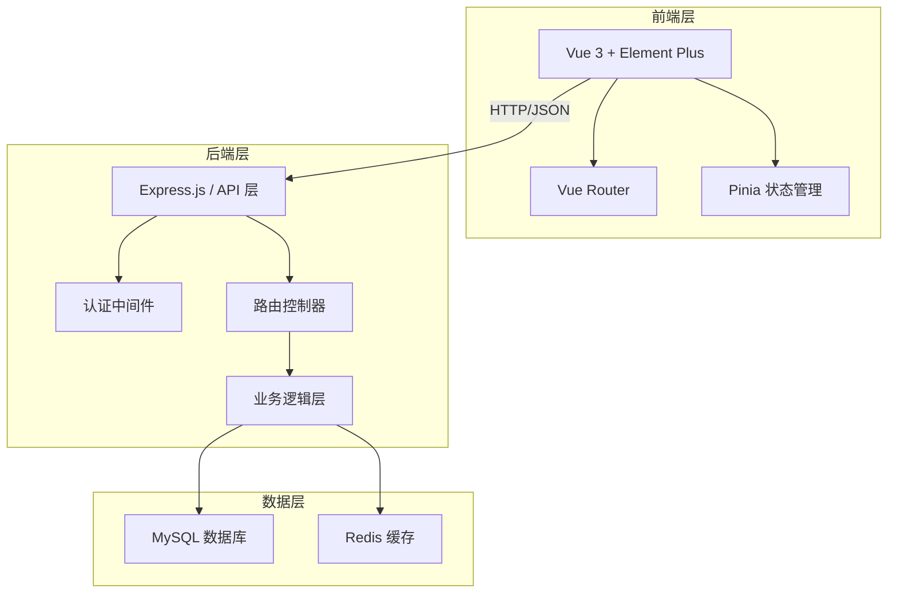
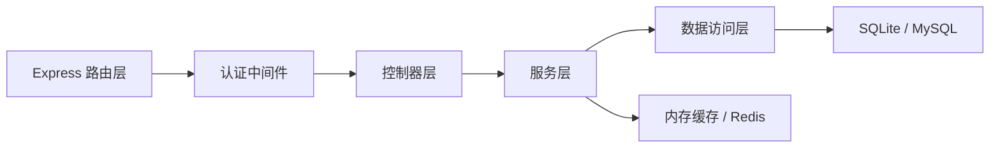
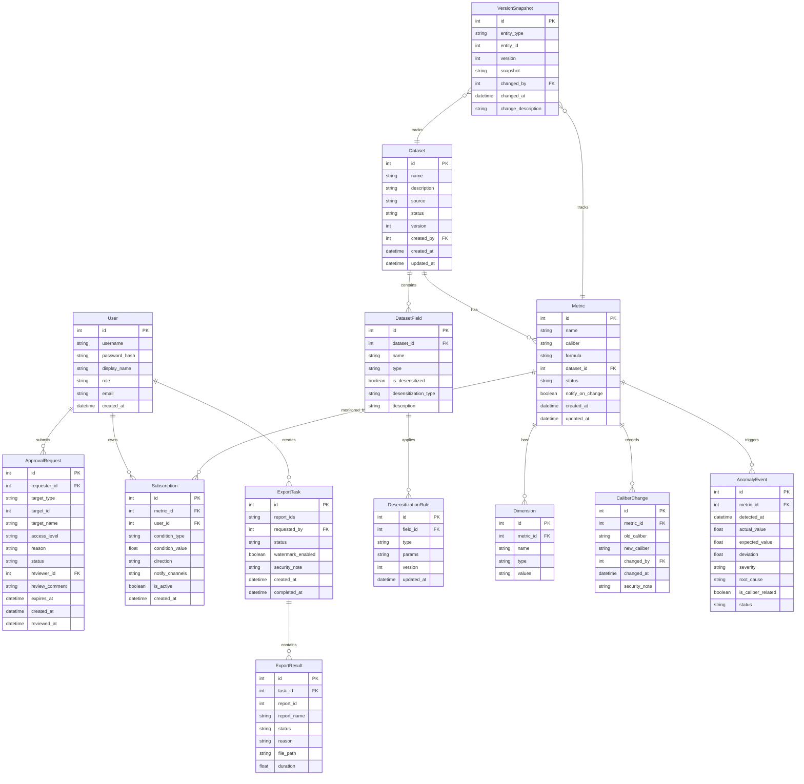

## 1. 架构设计



## 2. 技术说明

- 前端：Vue 3 + Element Plus + Vue Router + Pinia + Tailwind CSS + Vite
- 初始化工具：vite-init
- 后端：Express.js（模拟 Spring Boot 接口风格，RESTful API）
- 数据库：MySQL（DDL 定义，开发阶段使用 SQLite 通过 better-sqlite3 驱动）
- 缓存：Redis（开发阶段使用内存缓存模拟）

## 3. 路由定义

| 路由 | 用途 |
|------|------|
| / | 运营仪表盘，核心指标概览与异常告警 |
| /datasets | 数据集管理，CRUD与版本管理 |
| /datasets/:id | 数据集编辑，字段配置与脱敏规则 |
| /metrics | 指标维度管理，指标列表与口径配置 |
| /approvals | 权限审批中心，申请列表与审批处理 |
| /subscriptions | 异常波动订阅，规则配置与事件查看 |
| /exports | 报表导出中心，导出任务与批量处理 |
| /history | 历史版本对比，脱敏/口径/订阅变更对比 |
| /login | 登录页面 |

## 4. API 定义

### 4.1 认证 API

```typescript
interface LoginRequest {
  username: string
  password: string
}

interface LoginResponse {
  token: string
  user: {
    id: number
    username: string
    role: 'admin' | 'ops_lead' | 'supply_chain' | 'analyst'
    displayName: string
  }
}
```

### 4.2 数据集 API

```typescript
interface Dataset {
  id: number
  name: string
  description: string
  source: string
  fields: DatasetField[]
  desensitizationRules: DesensitizationRule[]
  status: 'active' | 'draft' | 'archived'
  version: number
  createdBy: string
  createdAt: string
  updatedAt: string
}

interface DatasetField {
  id: number
  name: string
  type: 'string' | 'number' | 'date' | 'boolean'
  isDesensitized: boolean
  desensitizationType?: 'mask' | 'hash' | 'truncate' | 'replace'
  description: string
}

interface DesensitizationRule {
  id: number
  fieldId: number
  type: 'mask' | 'hash' | 'truncate' | 'replace'
  params: Record<string, string>
  version: number
  updatedAt: string
}
```

### 4.3 指标维度 API

```typescript
interface Metric {
  id: number
  name: string
  caliber: string
  formula: string
  datasetId: number
  dimensions: Dimension[]
  changeHistory: CaliberChange[]
  status: 'normal' | 'changed' | 'deprecated'
  notifyOnCaliberChange: boolean
  notifyTargets: string[]
  createdAt: string
  updatedAt: string
}

interface Dimension {
  id: number
  name: string
  type: 'enum' | 'range' | 'date' | 'custom'
  values: string[]
}

interface CaliberChange {
  id: number
  metricId: number
  oldCaliber: string
  newCaliber: string
  changedBy: string
  changedAt: string
  notifiedTargets: string[]
  securityNote: string
}
```

### 4.4 权限审批 API

```typescript
interface ApprovalRequest {
  id: number
  requesterId: number
  requesterName: string
  targetType: 'dataset' | 'metric' | 'report'
  targetId: number
  targetName: string
  accessLevel: 'view' | 'edit' | 'export'
  reason: string
  status: 'pending' | 'approved' | 'rejected'
  reviewerId?: number
  reviewerName?: string
  reviewComment?: string
  expiresAt?: string
  createdAt: string
  reviewedAt?: string
}
```

### 4.5 异常波动订阅 API

```typescript
interface Subscription {
  id: number
  metricId: number
  metricName: string
  userId: number
  userName: string
  condition: {
    type: 'threshold' | 'percentage' | 'std_deviation'
    value: number
    direction: 'up' | 'down' | 'both'
  }
  notifyChannels: ('email' | 'sms' | 'in_app')[]
  isActive: boolean
  createdAt: string
}

interface AnomalyEvent {
  id: number
  metricId: number
  metricName: string
  detectedAt: string
  value: number
  expectedValue: number
  deviation: number
  severity: 'low' | 'medium' | 'high'
  rootCause: string
  isCaliberRelated: boolean
  status: 'new' | 'acknowledged' | 'resolved'
}
```

### 4.6 报表导出 API

```typescript
interface ExportTask {
  id: number
  reportIds: number[]
  requestedBy: string
  status: 'processing' | 'completed' | 'failed' | 'partial'
  results: ExportResult[]
  watermarkEnabled: boolean
  securityNote: string
  createdAt: string
  completedAt?: string
}

interface ExportResult {
  reportId: number
  reportName: string
  status: 'success' | 'failed' | 'skipped'
  reason?: string
  filePath?: string
  duration?: number
}

interface BatchSummary {
  total: number
  success: number
  failed: number
  skipped: number
}
```

### 4.7 历史版本 API

```typescript
interface VersionSnapshot {
  id: number
  entityType: 'desensitization' | 'caliber' | 'subscription'
  entityId: number
  version: number
  snapshot: Record<string, unknown>
  changedBy: string
  changedAt: string
  changeDescription: string
}

interface VersionDiff {
  baseline: VersionSnapshot
  comparison: VersionSnapshot
  differences: {
    field: string
    oldValue: unknown
    newValue: unknown
    changeType: 'added' | 'removed' | 'modified'
  }[]
}
```

## 5. 服务器架构图



## 6. 数据模型

### 6.1 数据模型定义



### 6.2 数据定义语言

```sql
CREATE TABLE user (
    id INTEGER PRIMARY KEY AUTOINCREMENT,
    username VARCHAR(50) NOT NULL UNIQUE,
    password_hash VARCHAR(255) NOT NULL,
    display_name VARCHAR(100) NOT NULL,
    role ENUM('admin', 'ops_lead', 'supply_chain', 'analyst') NOT NULL DEFAULT 'analyst',
    email VARCHAR(100),
    created_at DATETIME NOT NULL DEFAULT CURRENT_TIMESTAMP
);

CREATE TABLE dataset (
    id INTEGER PRIMARY KEY AUTOINCREMENT,
    name VARCHAR(200) NOT NULL,
    description TEXT,
    source VARCHAR(200),
    status ENUM('active', 'draft', 'archived') NOT NULL DEFAULT 'draft',
    version INTEGER NOT NULL DEFAULT 1,
    created_by INTEGER NOT NULL,
    created_at DATETIME NOT NULL DEFAULT CURRENT_TIMESTAMP,
    updated_at DATETIME NOT NULL DEFAULT CURRENT_TIMESTAMP,
    FOREIGN KEY (created_by) REFERENCES user(id)
);

CREATE TABLE dataset_field (
    id INTEGER PRIMARY KEY AUTOINCREMENT,
    dataset_id INTEGER NOT NULL,
    name VARCHAR(100) NOT NULL,
    type ENUM('string', 'number', 'date', 'boolean') NOT NULL DEFAULT 'string',
    is_desensitized BOOLEAN NOT NULL DEFAULT FALSE,
    desensitization_type ENUM('mask', 'hash', 'truncate', 'replace'),
    description TEXT,
    FOREIGN KEY (dataset_id) REFERENCES dataset(id) ON DELETE CASCADE
);

CREATE TABLE desensitization_rule (
    id INTEGER PRIMARY KEY AUTOINCREMENT,
    field_id INTEGER NOT NULL,
    type ENUM('mask', 'hash', 'truncate', 'replace') NOT NULL,
    params TEXT,
    version INTEGER NOT NULL DEFAULT 1,
    updated_at DATETIME NOT NULL DEFAULT CURRENT_TIMESTAMP,
    FOREIGN KEY (field_id) REFERENCES dataset_field(id) ON DELETE CASCADE
);

CREATE TABLE metric (
    id INTEGER PRIMARY KEY AUTOINCREMENT,
    name VARCHAR(200) NOT NULL,
    caliber TEXT NOT NULL,
    formula TEXT,
    dataset_id INTEGER NOT NULL,
    status ENUM('normal', 'changed', 'deprecated') NOT NULL DEFAULT 'normal',
    notify_on_change BOOLEAN NOT NULL DEFAULT FALSE,
    created_at DATETIME NOT NULL DEFAULT CURRENT_TIMESTAMP,
    updated_at DATETIME NOT NULL DEFAULT CURRENT_TIMESTAMP,
    FOREIGN KEY (dataset_id) REFERENCES dataset(id)
);

CREATE TABLE dimension (
    id INTEGER PRIMARY KEY AUTOINCREMENT,
    metric_id INTEGER NOT NULL,
    name VARCHAR(100) NOT NULL,
    type ENUM('enum', 'range', 'date', 'custom') NOT NULL DEFAULT 'enum',
    values TEXT,
    FOREIGN KEY (metric_id) REFERENCES metric(id) ON DELETE CASCADE
);

CREATE TABLE caliber_change (
    id INTEGER PRIMARY KEY AUTOINCREMENT,
    metric_id INTEGER NOT NULL,
    old_caliber TEXT NOT NULL,
    new_caliber TEXT NOT NULL,
    changed_by INTEGER NOT NULL,
    changed_at DATETIME NOT NULL DEFAULT CURRENT_TIMESTAMP,
    security_note TEXT,
    FOREIGN KEY (metric_id) REFERENCES metric(id),
    FOREIGN KEY (changed_by) REFERENCES user(id)
);

CREATE TABLE approval_request (
    id INTEGER PRIMARY KEY AUTOINCREMENT,
    requester_id INTEGER NOT NULL,
    target_type ENUM('dataset', 'metric', 'report') NOT NULL,
    target_id INTEGER NOT NULL,
    target_name VARCHAR(200) NOT NULL,
    access_level ENUM('view', 'edit', 'export') NOT NULL DEFAULT 'view',
    reason TEXT,
    status ENUM('pending', 'approved', 'rejected') NOT NULL DEFAULT 'pending',
    reviewer_id INTEGER,
    review_comment TEXT,
    expires_at DATETIME,
    created_at DATETIME NOT NULL DEFAULT CURRENT_TIMESTAMP,
    reviewed_at DATETIME,
    FOREIGN KEY (requester_id) REFERENCES user(id),
    FOREIGN KEY (reviewer_id) REFERENCES user(id)
);

CREATE TABLE subscription (
    id INTEGER PRIMARY KEY AUTOINCREMENT,
    metric_id INTEGER NOT NULL,
    user_id INTEGER NOT NULL,
    condition_type ENUM('threshold', 'percentage', 'std_deviation') NOT NULL DEFAULT 'threshold',
    condition_value FLOAT NOT NULL,
    direction ENUM('up', 'down', 'both') NOT NULL DEFAULT 'both',
    notify_channels VARCHAR(100) NOT NULL DEFAULT 'in_app',
    is_active BOOLEAN NOT NULL DEFAULT TRUE,
    created_at DATETIME NOT NULL DEFAULT CURRENT_TIMESTAMP,
    FOREIGN KEY (metric_id) REFERENCES metric(id),
    FOREIGN KEY (user_id) REFERENCES user(id)
);

CREATE TABLE anomaly_event (
    id INTEGER PRIMARY KEY AUTOINCREMENT,
    metric_id INTEGER NOT NULL,
    detected_at DATETIME NOT NULL DEFAULT CURRENT_TIMESTAMP,
    actual_value FLOAT NOT NULL,
    expected_value FLOAT NOT NULL,
    deviation FLOAT NOT NULL,
    severity ENUM('low', 'medium', 'high') NOT NULL DEFAULT 'medium',
    root_cause TEXT,
    is_caliber_related BOOLEAN NOT NULL DEFAULT FALSE,
    status ENUM('new', 'acknowledged', 'resolved') NOT NULL DEFAULT 'new',
    FOREIGN KEY (metric_id) REFERENCES metric(id)
);

CREATE TABLE export_task (
    id INTEGER PRIMARY KEY AUTOINCREMENT,
    report_ids TEXT NOT NULL,
    requested_by INTEGER NOT NULL,
    status ENUM('processing', 'completed', 'failed', 'partial') NOT NULL DEFAULT 'processing',
    watermark_enabled BOOLEAN NOT NULL DEFAULT TRUE,
    security_note TEXT,
    created_at DATETIME NOT NULL DEFAULT CURRENT_TIMESTAMP,
    completed_at DATETIME,
    FOREIGN KEY (requested_by) REFERENCES user(id)
);

CREATE TABLE export_result (
    id INTEGER PRIMARY KEY AUTOINCREMENT,
    task_id INTEGER NOT NULL,
    report_id INTEGER NOT NULL,
    report_name VARCHAR(200) NOT NULL,
    status ENUM('success', 'failed', 'skipped') NOT NULL,
    reason TEXT,
    file_path VARCHAR(500),
    duration FLOAT,
    FOREIGN KEY (task_id) REFERENCES export_task(id) ON DELETE CASCADE
);

CREATE TABLE version_snapshot (
    id INTEGER PRIMARY KEY AUTOINCREMENT,
    entity_type ENUM('desensitization', 'caliber', 'subscription') NOT NULL,
    entity_id INTEGER NOT NULL,
    version INTEGER NOT NULL,
    snapshot TEXT NOT NULL,
    changed_by INTEGER NOT NULL,
    changed_at DATETIME NOT NULL DEFAULT CURRENT_TIMESTAMP,
    change_description TEXT,
    FOREIGN KEY (changed_by) REFERENCES user(id)
);

-- 初始数据
INSERT INTO user (username, password_hash, display_name, role, email) VALUES
('admin', '$2a$10$mockhash', '系统管理员', 'admin', 'admin@example.com'),
('ops_lead', '$2a$10$mockhash', '运营负责人', 'ops_lead', 'ops@example.com'),
('supply_chain', '$2a$10$mockhash', '供应链经理', 'supply_chain', 'sc@example.com'),
('analyst', '$2a$10$mockhash', '数据分析师', 'analyst', 'analyst@example.com');
```
