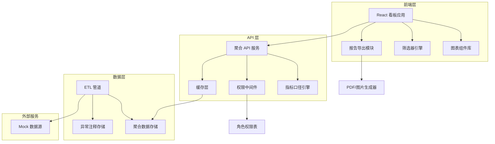
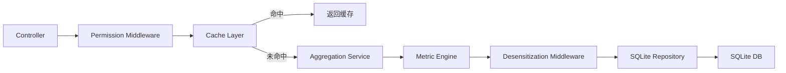
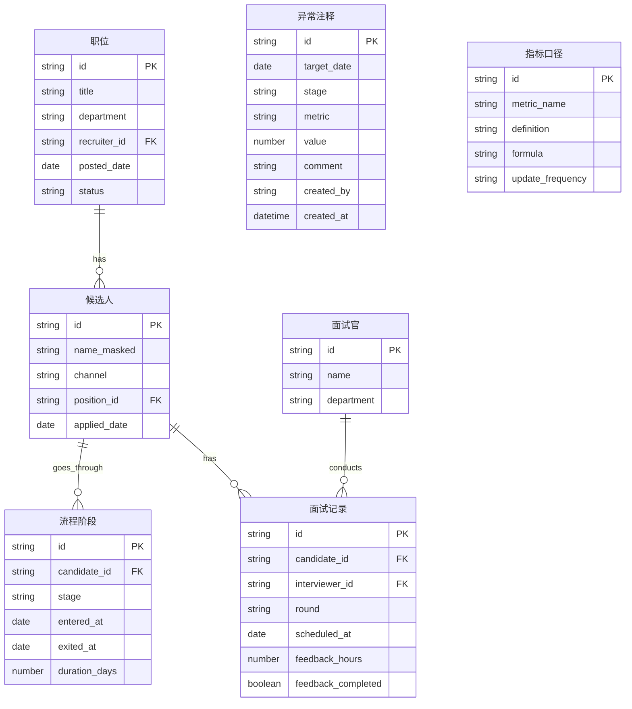

## 1. 架构设计



## 2. 技术说明

- **前端**：React@18 + TypeScript + Tailwind CSS@3 + Vite
- **图表库**：Recharts（漏斗图、柱状图、折线图、热力图）+ 自定义 SVG 组件
- **初始化工具**：Vite (react-ts template)
- **后端**：Express@4 + TypeScript（聚合 API 服务）
- **数据库**：SQLite（轻量级本地存储，聚合数据 + 注释 + 权限）
- **缓存**：内存缓存 (LRU) + 文件缓存兜底，TTL 按筛选维度组合哈希
- **报告导出**：html2canvas + jsPDF 生成 PDF/图片
- **脱敏**：API 层统一脱敏中间件，导出时二次校验
- **Mock 数据**：内置种子数据生成器，模拟完整招聘流程数据

## 3. 路由定义

| 路由 | 用途 |
|------|------|
| / | 重定向至 /dashboard |
| /dashboard | 流程总览仪表盘（漏斗图 + 阶段耗时 + 指标卡片） |
| /channels | 渠道质量分析 |
| /workload | 面试官负载看板 |
| /report | 周报配置与导出 |

## 4. API 定义

### 4.1 聚合数据接口

```typescript
interface FilterParams {
  positions?: string[];
  departments?: string[];
  recruiters?: string[];
  channels?: string[];
  stages?: string[];
  dateRange: { start: string; end: string };
}

interface FunnelData {
  stage: "posted" | "applied" | "screened" | "interviewed" | "offered" | "hired";
  count: number;
  conversionRate: number;
  avgDaysInStage: number;
  medianDaysInStage: number;
  p90DaysInStage: number;
}

interface ChannelMetrics {
  channel: string;
  totalApplied: number;
  conversionRate: number;
  avgTimeToHire: number;
  costPerHire: number;
  stageTimings: Record<string, number>;
}

interface InterviewerLoad {
  interviewerId: string;
  interviewerName: string;
  totalSessions: number;
  weeklySessions: number[];
  avgFeedbackHours: number;
  feedbackCompletionRate: number;
}

interface AnomalyAnnotation {
  id: string;
  date: string;
  stage: string;
  metric: string;
  value: number;
  comment: string;
  createdBy: string;
  createdAt: string;
}

type ApiResponse<T> = {
  data: T;
  meta: {
    filters: FilterParams;
    generatedAt: string;
    cacheHit: boolean;
  };
};

// GET /api/funnel - 获取漏斗数据
// GET /api/stage-duration - 获取阶段耗时数据
// GET /api/channels - 获取渠道质量数据
// GET /api/workload - 获取面试官负载数据（聚合）
// GET /api/annotations - 获取异常注释
// POST /api/annotations - 添加异常注释
// GET /api/filters/options - 获取筛选器选项列表
// GET /api/metrics/definitions - 获取指标口径定义
// POST /api/report/export - 导出报告（返回 PDF 或图片）
```

### 4.2 权限中间件

```typescript
type UserRole = "hr_admin" | "recruiting_manager" | "interviewer";

interface PermissionContext {
  role: UserRole;
  department?: string;
  recruiterIds?: string[];
}
```

## 5. 服务架构图



## 6. 数据模型

### 6.1 数据模型定义



### 6.2 数据定义语言

```sql
CREATE TABLE positions (
  id TEXT PRIMARY KEY,
  title TEXT NOT NULL,
  department TEXT NOT NULL,
  recruiter_id TEXT NOT NULL,
  posted_date TEXT NOT NULL,
  status TEXT NOT NULL DEFAULT 'open'
);

CREATE TABLE candidates (
  id TEXT PRIMARY KEY,
  name_masked TEXT NOT NULL,
  channel TEXT NOT NULL,
  position_id TEXT NOT NULL REFERENCES positions(id),
  applied_date TEXT NOT NULL
);

CREATE TABLE pipeline_stages (
  id TEXT PRIMARY KEY,
  candidate_id TEXT NOT NULL REFERENCES candidates(id),
  stage TEXT NOT NULL,
  entered_at TEXT NOT NULL,
  exited_at TEXT,
  duration_days REAL
);

CREATE TABLE interviews (
  id TEXT PRIMARY KEY,
  candidate_id TEXT NOT NULL REFERENCES candidates(id),
  interviewer_id TEXT NOT NULL REFERENCES interviewers(id),
  round TEXT NOT NULL,
  scheduled_at TEXT NOT NULL,
  feedback_hours REAL,
  feedback_completed INTEGER NOT NULL DEFAULT 0
);

CREATE TABLE interviewers (
  id TEXT PRIMARY KEY,
  name TEXT NOT NULL,
  department TEXT NOT NULL
);

CREATE TABLE annotations (
  id TEXT PRIMARY KEY,
  target_date TEXT NOT NULL,
  stage TEXT NOT NULL,
  metric TEXT NOT NULL,
  value REAL NOT NULL,
  comment TEXT NOT NULL,
  created_by TEXT NOT NULL,
  created_at TEXT NOT NULL DEFAULT (datetime('now'))
);

CREATE TABLE metric_definitions (
  id TEXT PRIMARY KEY,
  metric_name TEXT NOT NULL UNIQUE,
  definition TEXT NOT NULL,
  formula TEXT NOT NULL,
  update_frequency TEXT NOT NULL DEFAULT 'daily'
);

CREATE INDEX idx_candidates_position ON candidates(position_id);
CREATE INDEX idx_candidates_channel ON candidates(channel);
CREATE INDEX idx_pipeline_candidate ON pipeline_stages(candidate_id);
CREATE INDEX idx_pipeline_stage ON pipeline_stages(stage);
CREATE INDEX idx_interviews_interviewer ON interviews(interviewer_id);
CREATE INDEX idx_annotations_date ON annotations(target_date);
```
