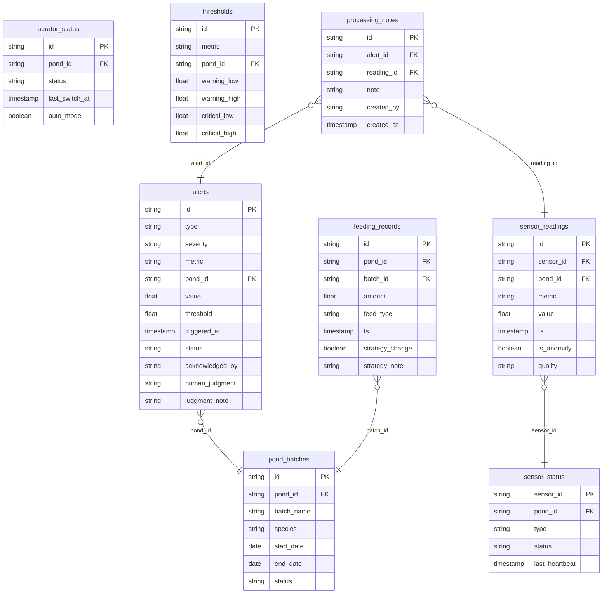

## 1. 架构设计

```mermaid
graph TB
    subgraph "前端层"
        "Vue 3 + Vite 看板应用"
    end
    subgraph "数据服务层"
        "Express API 服务"
        "TimescaleDB 时序数据库"
        "阈值引擎"
    end
    subgraph "数据采集层"
        "传感器数据接入"
        "设备心跳检测"
    end
    subgraph "外部集成"
        "Grafana 可视化(可选)"
    end

    "传感器数据接入" --> "TimescaleDB 时序数据库"
    "设备心跳检测" --> "TimescaleDB 时序数据库"
    "TimescaleDB 时序数据库" --> "Express API 服务"
    "阈值引擎" --> "TimescaleDB 时序数据库"
    "Express API 服务" --> "Vue 3 + Vite 看板应用"
    "Express API 服务" --> "Grafana 可视化(可选)"
```

## 2. 技术说明

- 前端：Vue 3 + Vite + ECharts（时序图表）+ Pinia（状态管理）+ Vue Router
- 初始化工具：create-vue
- 后端：Express 4 + node-postgres
- 数据库：TimescaleDB（PostgreSQL 扩展），本项目使用 mock 数据模拟
- 图表库：ECharts 5（支持大数据量时序渲染、注释标记、断线处理）
- 报表导出：html2canvas + jsPDF（前端导出 PDF）
- 样式：Tailwind CSS 3

## 3. 路由定义

| 路由 | 用途 |
|------|------|
| / | 实时监控看板（默认页），含实时曲线、告警横幅、设备状态 |
| /alerts | 告警中心，告警列表与人工判断确认 |
| /feeding | 投喂影响分析，投喂-水质关联图与策略注释 |
| /comparison | 批次对比，跨批次指标叠加对比 |
| /drilldown/:pointId | 异常下钻详情，原始采样记录与处理备注链 |
| /reports | 报表导出，时段选择与报表生成 |

## 4. API 定义

### 4.1 传感器数据

```typescript
interface SensorReading {
  id: string
  sensorId: string
  pondId: string
  metric: 'dissolved_oxygen' | 'temperature' | 'ph'
  value: number
  timestamp: string
  isAnomaly: boolean
  quality: 'good' | 'suspect' | 'offline'
}

interface SensorStatus {
  sensorId: string
  pondId: string
  type: string
  status: 'online' | 'offline'
  lastHeartbeat: string
  lastReading: number | null
}
```

### 4.2 告警

```typescript
interface Alert {
  id: string
  type: 'threshold' | 'offline'
  severity: 'warning' | 'critical'
  metric: string
  pondId: string
  value: number
  threshold: number
  triggeredAt: string
  status: 'pending' | 'acknowledged' | 'resolved'
  acknowledgedBy: string | null
  acknowledgedAt: string | null
  humanJudgment: 'false_alarm' | 'real_anomaly' | 'needs_onsite' | null
  judgmentNote: string | null
}

interface AcknowledgePayload {
  alertId: string
  judgment: 'false_alarm' | 'real_anomaly' | 'needs_onsite'
  note?: string
}
```

### 4.3 投喂记录

```typescript
interface FeedingRecord {
  id: string
  pondId: string
  batchId: string
  amount: number
  feedType: string
  timestamp: string
  strategyChange: boolean
  strategyNote: string | null
}
```

### 4.4 批次

```typescript
interface PondBatch {
  id: string
  pondId: string
  batchName: string
  species: string
  startDate: string
  endDate: string | null
  status: 'active' | 'harvested'
}
```

### 4.5 增氧机

```typescript
interface AeratorStatus {
  id: string
  pondId: string
  status: 'running' | 'stopped' | 'fault'
  lastSwitchAt: string
  autoMode: boolean
}
```

## 5. 服务端架构图

```mermaid
graph LR
    "Router" --> "SensorController"
    "Router" --> "AlertController"
    "Router" --> "FeedingController"
    "Router" --> "BatchController"
    "Router" --> "ReportController"

    "SensorController" --> "SensorService"
    "AlertController" --> "AlertService"
    "FeedingController" --> "FeedingService"
    "BatchController" --> "BatchService"
    "ReportController" --> "ReportService"

    "SensorService" --> "TimescaleDB"
    "AlertService" --> "TimescaleDB"
    "FeedingService" --> "TimescaleDB"
    "BatchService" --> "TimescaleDB"
    "ReportService" --> "TimescaleDB"
```

## 6. 数据模型

### 6.1 数据模型定义



### 6.2 数据定义语言（DDL）

```sql
-- 传感器读数表（TimescaleDB 超级表）
CREATE TABLE sensor_readings (
    id UUID DEFAULT gen_random_uuid() PRIMARY KEY,
    sensor_id VARCHAR(32) NOT NULL,
    pond_id VARCHAR(32) NOT NULL,
    metric VARCHAR(32) NOT NULL,
    value DOUBLE PRECISION NOT NULL,
    ts TIMESTAMPTZ NOT NULL,
    is_anomaly BOOLEAN DEFAULT FALSE,
    quality VARCHAR(16) DEFAULT 'good'
);
SELECT create_hypertable('sensor_readings', 'ts');

-- 传感器状态表
CREATE TABLE sensor_status (
    sensor_id VARCHAR(32) PRIMARY KEY,
    pond_id VARCHAR(32) NOT NULL,
    type VARCHAR(32) NOT NULL,
    status VARCHAR(16) DEFAULT 'online',
    last_heartbeat TIMESTAMPTZ
);

-- 告警表
CREATE TABLE alerts (
    id UUID DEFAULT gen_random_uuid() PRIMARY KEY,
    type VARCHAR(16) NOT NULL,
    severity VARCHAR(16) NOT NULL,
    metric VARCHAR(32) NOT NULL,
    pond_id VARCHAR(32) NOT NULL,
    value DOUBLE PRECISION,
    threshold DOUBLE PRECISION,
    triggered_at TIMESTAMPTZ NOT NULL,
    status VARCHAR(16) DEFAULT 'pending',
    acknowledged_by VARCHAR(64),
    acknowledged_at TIMESTAMPTZ,
    human_judgment VARCHAR(32),
    judgment_note TEXT
);

-- 投喂记录表
CREATE TABLE feeding_records (
    id UUID DEFAULT gen_random_uuid() PRIMARY KEY,
    pond_id VARCHAR(32) NOT NULL,
    batch_id VARCHAR(32) NOT NULL,
    amount DOUBLE PRECISION NOT NULL,
    feed_type VARCHAR(32),
    ts TIMESTAMPTZ NOT NULL,
    strategy_change BOOLEAN DEFAULT FALSE,
    strategy_note TEXT
);

-- 鱼塘批次表
CREATE TABLE pond_batches (
    id UUID DEFAULT gen_random_uuid() PRIMARY KEY,
    pond_id VARCHAR(32) NOT NULL,
    batch_name VARCHAR(64) NOT NULL,
    species VARCHAR(64),
    start_date DATE NOT NULL,
    end_date DATE,
    status VARCHAR(16) DEFAULT 'active'
);

-- 增氧机状态表
CREATE TABLE aerator_status (
    id UUID DEFAULT gen_random_uuid() PRIMARY KEY,
    pond_id VARCHAR(32) NOT NULL,
    status VARCHAR(16) DEFAULT 'stopped',
    last_switch_at TIMESTAMPTZ,
    auto_mode BOOLEAN DEFAULT TRUE
);

-- 阈值配置表
CREATE TABLE thresholds (
    id UUID DEFAULT gen_random_uuid() PRIMARY KEY,
    metric VARCHAR(32) NOT NULL,
    pond_id VARCHAR(32) NOT NULL,
    warning_low DOUBLE PRECISION,
    warning_high DOUBLE PRECISION,
    critical_low DOUBLE PRECISION,
    critical_high DOUBLE PRECISION,
    UNIQUE(metric, pond_id)
);

-- 处理备注表
CREATE TABLE processing_notes (
    id UUID DEFAULT gen_random_uuid() PRIMARY KEY,
    alert_id UUID REFERENCES alerts(id),
    reading_id UUID REFERENCES sensor_readings(id),
    note TEXT NOT NULL,
    created_by VARCHAR(64) NOT NULL,
    created_at TIMESTAMPTZ DEFAULT NOW()
);

-- 索引
CREATE INDEX idx_sensor_readings_pond_ts ON sensor_readings (pond_id, ts DESC);
CREATE INDEX idx_sensor_readings_metric_ts ON sensor_readings (metric, ts DESC);
CREATE INDEX idx_alerts_status ON alerts (status, triggered_at DESC);
CREATE INDEX idx_alerts_pond ON alerts (pond_id, triggered_at DESC);
CREATE INDEX idx_feeding_pond_ts ON feeding_records (pond_id, ts DESC);
CREATE INDEX idx_processing_alert ON processing_notes (alert_id);
CREATE INDEX idx_processing_reading ON processing_notes (reading_id);
```

## 7. 关键技术约束

1. **传感器离线处理**：前端渲染曲线时，对 quality='offline' 的数据点执行断线处理（ECharts connectNulls=false），禁止插值填充，离线区间显示灰色底纹与"设备离线"标签
2. **异常点溯源**：每个数据点保留 is_anomaly 标记和 quality 字段，点击异常点时通过 reading_id 关联 processing_notes 表获取完整处理链
3. **投喂注释**：feeding_records 中 strategy_change=true 的记录，在曲线渲染时作为 ECharts markLine 注入
4. **告警人工判断**：alerts 表的 human_judgment 字段为必填枚举，acknowledged_by 和 acknowledged_at 自动记录
5. **筛选器上下文**：使用 Pinia store 统一管理筛选状态（时间范围、选中鱼塘、选中指标），路由切换时保留 store 状态
