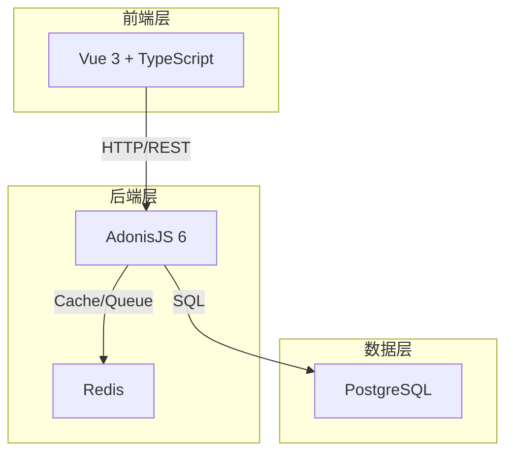
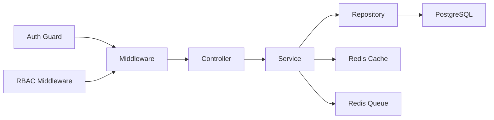
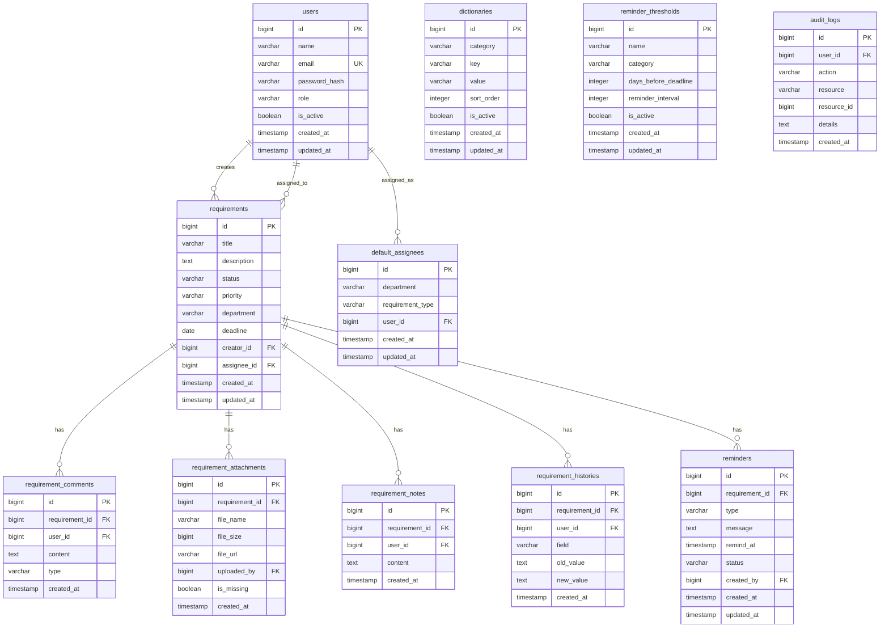

## 1. 架构设计



## 2. 技术说明
- 前端：Vue 3 + TypeScript + Vue Router + TailwindCSS + Vite
- 初始化工具：vite-init (vue-ts template)
- 后端：AdonisJS 6 + TypeScript
- 数据库：PostgreSQL 15+
- 缓存/队列：Redis 7+
- 认证：AdonisJS Auth (session-based) + RBAC 中间件

## 3. 路由定义
| 路由 | 用途 |
|------|------|
| /login | 登录页 |
| /requirements | 需求列表页 |
| /requirements/:id | 需求详情页 |
| /requirements/new | 需求提交页 |
| /reminders | 提醒管理页 |
| /dashboard | 值班看板页 |
| /admin | 后台管理页 |
| /admin/dictionaries | 字典管理 |
| /admin/thresholds | 提醒阈值 |
| /admin/default-assignees | 默认负责人 |
| /admin/users | 用户管理 |
| /logs | 操作日志页 |

## 4. API 定义

### 4.1 认证相关
```typescript
interface LoginRequest {
  email: string
  password: string
}

interface LoginResponse {
  token: string
  user: {
    id: number
    name: string
    email: string
    role: 'duty_staff' | 'project_pm' | 'admin'
  }
}
```

### 4.2 需求相关
```typescript
interface Requirement {
  id: number
  title: string
  description: string
  status: 'draft' | 'pending' | 'in_progress' | 'overdue' | 'completed' | 'closed'
  priority: 'low' | 'medium' | 'high' | 'urgent'
  department: string
  deadline: string
  creatorId: number
  assigneeId: number | null
  createdAt: string
  updatedAt: string
}

interface CreateRequirementRequest {
  title: string
  description: string
  priority: 'low' | 'medium' | 'high' | 'urgent'
  department: string
  deadline: string
  assigneeId?: number
  attachments?: File[]
}

interface RequirementComment {
  id: number
  requirementId: number
  userId: number
  content: string
  type: 'comment' | 'meeting_minute' | 'delay_reason'
  createdAt: string
}

interface RequirementAttachment {
  id: number
  requirementId: number
  fileName: string
  fileSize: number
  fileUrl: string
  uploadedBy: number
  isMissing: boolean
  createdAt: string
}

interface RequirementNote {
  id: number
  requirementId: number
  userId: number
  content: string
  createdAt: string
}

interface RequirementHistory {
  id: number
  requirementId: number
  userId: number
  field: string
  oldValue: string | null
  newValue: string | null
  createdAt: string
}
```

### 4.3 提醒相关
```typescript
interface Reminder {
  id: number
  requirementId: number
  type: 'urgent' | 'schedule' | 'auto_overdue'
  message: string
  remindAt: string
  status: 'pending' | 'sent' | 'acknowledged'
  createdBy: number
  createdAt: string
}

interface CreateReminderRequest {
  requirementId: number
  type: 'urgent' | 'schedule'
  message: string
  remindAt: string
}
```

### 4.4 后台管理相关
```typescript
interface Dictionary {
  id: number
  category: string
  key: string
  value: string
  sortOrder: number
  isActive: boolean
}

interface ReminderThreshold {
  id: number
  name: string
  category: string
  daysBeforeDeadline: number
  reminderInterval: number
  isActive: boolean
}

interface DefaultAssignee {
  id: number
  department: string
  requirementType: string
  userId: number
}

interface AuditLog {
  id: number
  userId: number
  action: string
  resource: string
  resourceId: number
  details: string
  createdAt: string
}
```

## 5. 服务端架构图



## 6. 数据模型

### 6.1 数据模型定义



### 6.2 数据定义语言

```sql
CREATE TABLE users (
  id BIGSERIAL PRIMARY KEY,
  name VARCHAR(100) NOT NULL,
  email VARCHAR(255) NOT NULL UNIQUE,
  password_hash VARCHAR(255) NOT NULL,
  role VARCHAR(20) NOT NULL DEFAULT 'duty_staff' CHECK (role IN ('duty_staff', 'project_pm', 'admin')),
  is_active BOOLEAN NOT NULL DEFAULT true,
  created_at TIMESTAMP NOT NULL DEFAULT NOW(),
  updated_at TIMESTAMP NOT NULL DEFAULT NOW()
);

CREATE TABLE requirements (
  id BIGSERIAL PRIMARY KEY,
  title VARCHAR(255) NOT NULL,
  description TEXT,
  status VARCHAR(20) NOT NULL DEFAULT 'draft' CHECK (status IN ('draft', 'pending', 'in_progress', 'overdue', 'completed', 'closed')),
  priority VARCHAR(20) NOT NULL DEFAULT 'medium' CHECK (priority IN ('low', 'medium', 'high', 'urgent')),
  department VARCHAR(100) NOT NULL,
  deadline DATE,
  creator_id BIGINT NOT NULL REFERENCES users(id),
  assignee_id BIGINT REFERENCES users(id),
  created_at TIMESTAMP NOT NULL DEFAULT NOW(),
  updated_at TIMESTAMP NOT NULL DEFAULT NOW()
);

CREATE INDEX idx_requirements_status ON requirements(status);
CREATE INDEX idx_requirements_assignee ON requirements(assignee_id);
CREATE INDEX idx_requirements_creator ON requirements(creator_id);
CREATE INDEX idx_requirements_deadline ON requirements(deadline);
CREATE INDEX idx_requirements_department ON requirements(department);

CREATE TABLE requirement_comments (
  id BIGSERIAL PRIMARY KEY,
  requirement_id BIGINT NOT NULL REFERENCES requirements(id) ON DELETE CASCADE,
  user_id BIGINT NOT NULL REFERENCES users(id),
  content TEXT NOT NULL,
  type VARCHAR(20) NOT NULL DEFAULT 'comment' CHECK (type IN ('comment', 'meeting_minute', 'delay_reason')),
  created_at TIMESTAMP NOT NULL DEFAULT NOW()
);

CREATE INDEX idx_comments_requirement ON requirement_comments(requirement_id);
CREATE INDEX idx_comments_type ON requirement_comments(type);

CREATE TABLE requirement_attachments (
  id BIGSERIAL PRIMARY KEY,
  requirement_id BIGINT NOT NULL REFERENCES requirements(id) ON DELETE CASCADE,
  file_name VARCHAR(255) NOT NULL,
  file_size BIGINT NOT NULL DEFAULT 0,
  file_url VARCHAR(500) NOT NULL,
  uploaded_by BIGINT NOT NULL REFERENCES users(id),
  is_missing BOOLEAN NOT NULL DEFAULT false,
  created_at TIMESTAMP NOT NULL DEFAULT NOW()
);

CREATE INDEX idx_attachments_requirement ON requirement_attachments(requirement_id);
CREATE INDEX idx_attachments_missing ON requirement_attachments(is_missing) WHERE is_missing = true;

CREATE TABLE requirement_notes (
  id BIGSERIAL PRIMARY KEY,
  requirement_id BIGINT NOT NULL REFERENCES requirements(id) ON DELETE CASCADE,
  user_id BIGINT NOT NULL REFERENCES users(id),
  content TEXT NOT NULL,
  created_at TIMESTAMP NOT NULL DEFAULT NOW()
);

CREATE INDEX idx_notes_requirement ON requirement_notes(requirement_id);

CREATE TABLE requirement_histories (
  id BIGSERIAL PRIMARY KEY,
  requirement_id BIGINT NOT NULL REFERENCES requirements(id) ON DELETE CASCADE,
  user_id BIGINT NOT NULL REFERENCES users(id),
  field VARCHAR(100) NOT NULL,
  old_value TEXT,
  new_value TEXT,
  created_at TIMESTAMP NOT NULL DEFAULT NOW()
);

CREATE INDEX idx_histories_requirement ON requirement_histories(requirement_id);

CREATE TABLE reminders (
  id BIGSERIAL PRIMARY KEY,
  requirement_id BIGINT NOT NULL REFERENCES requirements(id) ON DELETE CASCADE,
  type VARCHAR(20) NOT NULL DEFAULT 'schedule' CHECK (type IN ('urgent', 'schedule', 'auto_overdue')),
  message TEXT,
  remind_at TIMESTAMP NOT NULL,
  status VARCHAR(20) NOT NULL DEFAULT 'pending' CHECK (status IN ('pending', 'sent', 'acknowledged')),
  created_by BIGINT NOT NULL REFERENCES users(id),
  created_at TIMESTAMP NOT NULL DEFAULT NOW(),
  updated_at TIMESTAMP NOT NULL DEFAULT NOW()
);

CREATE INDEX idx_reminders_requirement ON reminders(requirement_id);
CREATE INDEX idx_reminders_status ON reminders(status);
CREATE INDEX idx_reminders_remind_at ON reminders(remind_at);

CREATE TABLE dictionaries (
  id BIGSERIAL PRIMARY KEY,
  category VARCHAR(100) NOT NULL,
  key VARCHAR(100) NOT NULL,
  value VARCHAR(255) NOT NULL,
  sort_order INTEGER NOT NULL DEFAULT 0,
  is_active BOOLEAN NOT NULL DEFAULT true,
  created_at TIMESTAMP NOT NULL DEFAULT NOW(),
  updated_at TIMESTAMP NOT NULL DEFAULT NOW(),
  UNIQUE(category, key)
);

CREATE INDEX idx_dictionaries_category ON dictionaries(category);

CREATE TABLE reminder_thresholds (
  id BIGSERIAL PRIMARY KEY,
  name VARCHAR(100) NOT NULL,
  category VARCHAR(100) NOT NULL,
  days_before_deadline INTEGER NOT NULL DEFAULT 3,
  reminder_interval INTEGER NOT NULL DEFAULT 24,
  is_active BOOLEAN NOT NULL DEFAULT true,
  created_at TIMESTAMP NOT NULL DEFAULT NOW(),
  updated_at TIMESTAMP NOT NULL DEFAULT NOW()
);

CREATE TABLE default_assignees (
  id BIGSERIAL PRIMARY KEY,
  department VARCHAR(100) NOT NULL,
  requirement_type VARCHAR(100) NOT NULL,
  user_id BIGINT NOT NULL REFERENCES users(id),
  created_at TIMESTAMP NOT NULL DEFAULT NOW(),
  updated_at TIMESTAMP NOT NULL DEFAULT NOW(),
  UNIQUE(department, requirement_type)
);

CREATE TABLE audit_logs (
  id BIGSERIAL PRIMARY KEY,
  user_id BIGINT REFERENCES users(id),
  action VARCHAR(100) NOT NULL,
  resource VARCHAR(100) NOT NULL,
  resource_id BIGINT,
  details TEXT,
  created_at TIMESTAMP NOT NULL DEFAULT NOW()
);

CREATE INDEX idx_audit_logs_action ON audit_logs(action);
CREATE INDEX idx_audit_logs_resource ON audit_logs(resource, resource_id);
CREATE INDEX idx_audit_logs_created_at ON audit_logs(created_at);
CREATE INDEX idx_audit_logs_user ON audit_logs(user_id);

-- 初始数据：管理员账号 (密码: admin123)
INSERT INTO users (name, email, password_hash, role) VALUES
  ('系统管理员', 'admin@remindhub.com', '$2a$10$placeholder_hash_for_admin', 'admin');

-- 初始字典数据
INSERT INTO dictionaries (category, key, value, sort_order) VALUES
  ('department', 'tech', '技术部', 1),
  ('department', 'product', '产品部', 2),
  ('department', 'design', '设计部', 3),
  ('department', 'marketing', '市场部', 4),
  ('requirement_type', 'feature', '新功能', 1),
  ('requirement_type', 'bugfix', '缺陷修复', 2),
  ('requirement_type', 'optimization', '优化改进', 3),
  ('requirement_type', 'support', '技术支持', 4);

-- 初始提醒阈值
INSERT INTO reminder_thresholds (name, category, days_before_deadline, reminder_interval) VALUES
  ('普通需求超期预警', 'normal', 3, 24),
  ('紧急需求超期预警', 'urgent', 1, 12),
  ('高优需求超期预警', 'high', 2, 24);
```
