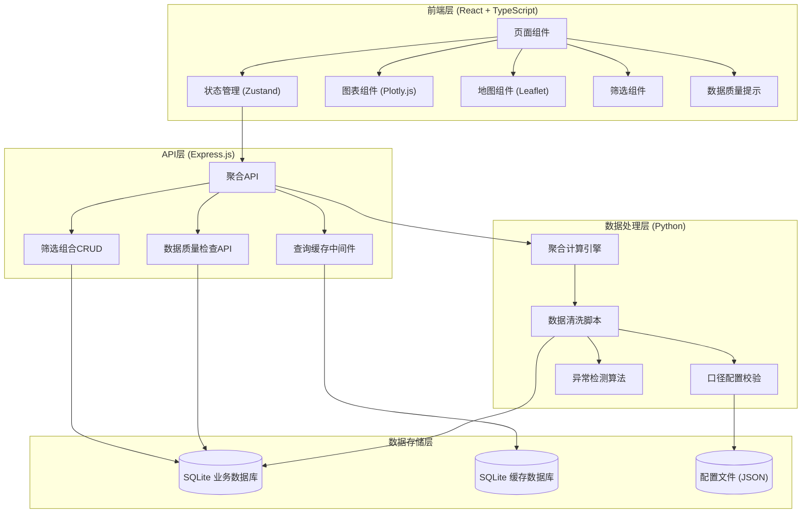
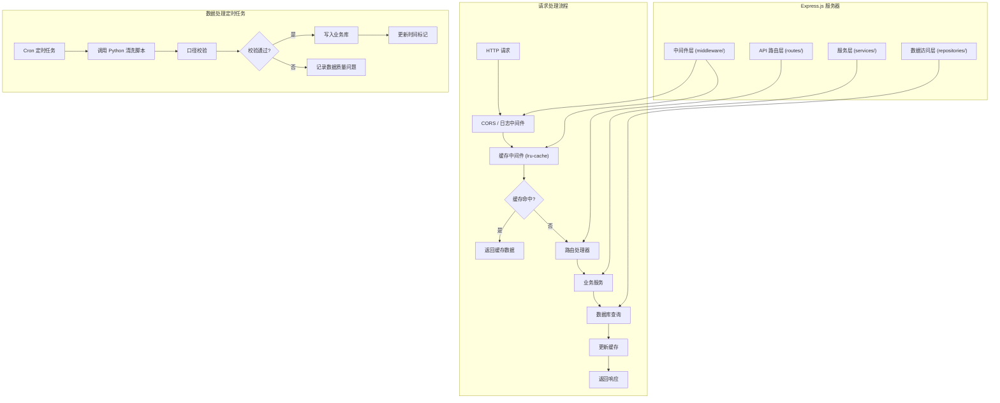
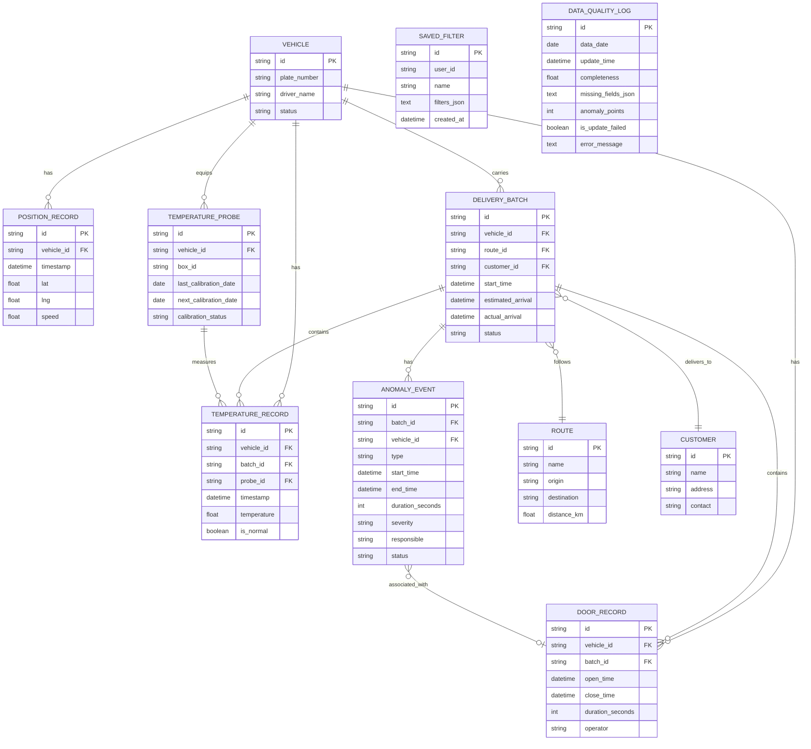

# 冷链物流温控追踪分析系统 - 技术架构文档

## 1. 架构设计



## 2. 技术选型说明

### 2.1 整体技术栈

| 层级 | 技术选型 | 版本 | 选型理由 |
|------|----------|------|----------|
| 前端框架 | React | 18.x | 组件化开发，生态丰富，适合复杂仪表盘交互 |
| 前端语言 | TypeScript | 5.x | 类型安全，减少运行时错误，提升可维护性 |
| 构建工具 | Vite | 5.x | 极速开发体验，热更新快，构建优化 |
| 样式方案 | Tailwind CSS | 3.x | 原子化CSS，快速构建统一风格UI |
| 状态管理 | Zustand | 4.x | 轻量级，API简洁，适合跨组件状态共享 |
| 图表库 | Plotly.js (react-plotly.js) | 2.x | 交互式图表丰富，支持科学计算可视化，满足温控分析需求 |
| 地图库 | Leaflet (react-leaflet) | 4.x | 轻量级地图组件，支持自定义轨迹绘制 |
| 后端框架 | Express.js | 4.x | Node.js生态成熟，适合构建RESTful API |
| 后端语言 | TypeScript | 5.x | 前后端语言统一，类型共享 |
| 数据处理 | Python | 3.11+ | 数据清洗、统计分析生态强大 (pandas, numpy) |
| 数据库 | SQLite | 3.x | 轻量级，无需额外部署，适合数据分析场景 |
| 缓存 | lru-cache + SQLite | 最新 | 内存缓存+持久化缓存双层策略，提升查询性能 |
| 图标库 | lucide-react | 最新 | 线性图标，风格统一，体积小 |

### 2.2 项目初始化

- **初始化工具**: `vite-init`
- **模板**: `react-express-ts` (React + TypeScript + Express 全栈)

## 3. 路由定义

| 路由路径 | 页面名称 | 功能说明 |
|----------|----------|----------|
| `/` | 综合驾驶舱 | KPI概览、异常告警、数据质量状态 |
| `/temperature` | 温度监控分析 | 温度曲线、异常统计、探头状态 |
| `/route` | 路线轨迹回放 | 地图轨迹、温度热力带、事件标记 |
| `/exception` | 异常追溯分析 | 异常列表、责任段定位、开门记录 |
| `/compare` | 多维对比分析 | 多维度选择、对比图表组 |
| `/data-quality` | 数据质量管理 | 缺失值检查、异常点检测、样本量验证 |
| `/api/*` | API接口 | 后端RESTful API路由前缀 |

## 4. API 定义

### 4.1 TypeScript 类型定义

```typescript
// 共享类型定义 (shared/types.ts)

export interface Vehicle {
  id: string;
  plateNumber: string;
  driverName: string;
  status: 'running' | 'idle' | 'maintenance';
}

export interface TemperatureRecord {
  id: string;
  vehicleId: string;
  batchId: string;
  timestamp: number;
  temperature: number;
  probeId: string;
  isNormal: boolean;
}

export interface PositionRecord {
  id: string;
  vehicleId: string;
  timestamp: number;
  lat: number;
  lng: number;
  speed: number;
}

export interface DoorRecord {
  id: string;
  vehicleId: string;
  batchId: string;
  openTime: number;
  closeTime: number;
  duration: number;
  operator: string;
}

export interface DeliveryBatch {
  id: string;
  vehicleId: string;
  routeId: string;
  customerId: string;
  startTime: number;
  estimatedArrival: number;
  actualArrival: number | null;
  status: 'pending' | 'in_transit' | 'delivered' | 'exception';
}

export interface TemperatureProbe {
  id: string;
  vehicleId: string;
  boxId: string;
  lastCalibrationDate: number;
  nextCalibrationDate: number;
  calibrationStatus: 'valid' | 'expiring' | 'expired';
}

export interface AnomalyEvent {
  id: string;
  batchId: string;
  vehicleId: string;
  type: 'temp_high' | 'temp_low' | 'door_open' | 'delay';
  startTime: number;
  endTime: number | null;
  duration: number;
  severity: 'low' | 'medium' | 'high';
  responsible: string;
  status: 'pending' | 'processing' | 'resolved';
}

export interface DataQualityReport {
  updateTime: number;
  completeness: number;
  missingFields: { field: string; missingCount: number }[];
  anomalyPoints: number;
  sampleSize: { dimension: string; count: number }[];
  isUpdateFailed: boolean;
  errorMessage?: string;
}

export interface SavedFilter {
  id: string;
  name: string;
  userId: string;
  filters: Record<string, any>;
  createdAt: number;
}
```

### 4.2 API 接口列表

| 方法 | 路径 | 功能说明 | 请求参数 | 返回数据 |
|------|------|----------|----------|----------|
| GET | `/api/kpi/overview` | 获取综合驾驶舱KPI | `dateRange`, `vehicleIds?` | KPI指标对象 |
| GET | `/api/temperature/trend` | 获取温度趋势数据 | `vehicleId`, `batchId?`, `timeRange` | 温度记录数组 |
| GET | `/api/temperature/anomaly-statistics` | 温度异常统计 | `dimension`, `timeRange` | 统计数据数组 |
| GET | `/api/probe/status` | 获取探头校准状态 | `vehicleIds?` | 探头状态数组 |
| GET | `/api/route/track` | 获取路线轨迹 | `vehicleId`, `batchId` | 位置记录数组 |
| GET | `/api/exception/list` | 获取异常事件列表 | `page`, `pageSize`, `filters` | 分页异常列表 |
| GET | `/api/exception/detail` | 异常详情与责任段 | `exceptionId` | 异常详情对象 |
| GET | `/api/compare/metrics` | 多维度对比数据 | `dimension`, `ids`, `metrics` | 对比数据对象 |
| GET | `/api/data-quality/report` | 数据质量报告 | `date` | 数据质量报告对象 |
| POST | `/api/filters/save` | 保存筛选组合 | `name`, `filters` | 保存成功的筛选对象 |
| GET | `/api/filters/list` | 获取已保存筛选 |  | 筛选组合数组 |
| DELETE | `/api/filters/:id` | 删除筛选组合 | `id` | 删除结果 |
| GET | `/api/meta/vehicles` | 获取车辆列表 |  | 车辆数组 |
| GET | `/api/meta/routes` | 获取路线列表 |  | 路线数组 |
| GET | `/api/meta/batches` | 获取批次列表 | `filters?` | 批次数组 |
| GET | `/api/meta/customers` | 获取客户列表 |  | 客户数组 |

## 5. 服务器架构图



## 6. 数据模型

### 6.1 ER 图



### 6.2 DDL 语句 (SQLite)

```sql
-- 车辆表
CREATE TABLE IF NOT EXISTS vehicles (
    id TEXT PRIMARY KEY,
    plate_number TEXT NOT NULL UNIQUE,
    driver_name TEXT NOT NULL,
    status TEXT NOT NULL CHECK (status IN ('running', 'idle', 'maintenance'))
);

-- 路线表
CREATE TABLE IF NOT EXISTS routes (
    id TEXT PRIMARY KEY,
    name TEXT NOT NULL,
    origin TEXT NOT NULL,
    destination TEXT NOT NULL,
    distance_km REAL NOT NULL
);

-- 客户表
CREATE TABLE IF NOT EXISTS customers (
    id TEXT PRIMARY KEY,
    name TEXT NOT NULL,
    address TEXT NOT NULL,
    contact TEXT
);

-- 配送批次表
CREATE TABLE IF NOT EXISTS delivery_batches (
    id TEXT PRIMARY KEY,
    vehicle_id TEXT NOT NULL,
    route_id TEXT NOT NULL,
    customer_id TEXT NOT NULL,
    start_time DATETIME NOT NULL,
    estimated_arrival DATETIME NOT NULL,
    actual_arrival DATETIME,
    status TEXT NOT NULL CHECK (status IN ('pending', 'in_transit', 'delivered', 'exception')),
    FOREIGN KEY (vehicle_id) REFERENCES vehicles(id),
    FOREIGN KEY (route_id) REFERENCES routes(id),
    FOREIGN KEY (customer_id) REFERENCES customers(id)
);

-- 温度探头表
CREATE TABLE IF NOT EXISTS temperature_probes (
    id TEXT PRIMARY KEY,
    vehicle_id TEXT NOT NULL,
    box_id TEXT NOT NULL,
    last_calibration_date DATE NOT NULL,
    next_calibration_date DATE NOT NULL,
    calibration_status TEXT NOT NULL CHECK (calibration_status IN ('valid', 'expiring', 'expired')),
    FOREIGN KEY (vehicle_id) REFERENCES vehicles(id)
);

-- 温度记录表
CREATE TABLE IF NOT EXISTS temperature_records (
    id TEXT PRIMARY KEY,
    vehicle_id TEXT NOT NULL,
    batch_id TEXT NOT NULL,
    probe_id TEXT NOT NULL,
    timestamp DATETIME NOT NULL,
    temperature REAL NOT NULL,
    is_normal BOOLEAN NOT NULL DEFAULT 1,
    FOREIGN KEY (vehicle_id) REFERENCES vehicles(id),
    FOREIGN KEY (batch_id) REFERENCES delivery_batches(id),
    FOREIGN KEY (probe_id) REFERENCES temperature_probes(id)
);
CREATE INDEX IF NOT EXISTS idx_temp_vehicle_time ON temperature_records(vehicle_id, timestamp);
CREATE INDEX IF NOT EXISTS idx_temp_batch ON temperature_records(batch_id);

-- 位置记录表
CREATE TABLE IF NOT EXISTS position_records (
    id TEXT PRIMARY KEY,
    vehicle_id TEXT NOT NULL,
    timestamp DATETIME NOT NULL,
    lat REAL NOT NULL,
    lng REAL NOT NULL,
    speed REAL NOT NULL,
    FOREIGN KEY (vehicle_id) REFERENCES vehicles(id)
);
CREATE INDEX IF NOT EXISTS idx_pos_vehicle_time ON position_records(vehicle_id, timestamp);

-- 开门记录表
CREATE TABLE IF NOT EXISTS door_records (
    id TEXT PRIMARY KEY,
    vehicle_id TEXT NOT NULL,
    batch_id TEXT,
    open_time DATETIME NOT NULL,
    close_time DATETIME,
    duration_seconds INTEGER,
    operator TEXT,
    FOREIGN KEY (vehicle_id) REFERENCES vehicles(id),
    FOREIGN KEY (batch_id) REFERENCES delivery_batches(id)
);

-- 异常事件表
CREATE TABLE IF NOT EXISTS anomaly_events (
    id TEXT PRIMARY KEY,
    batch_id TEXT NOT NULL,
    vehicle_id TEXT NOT NULL,
    type TEXT NOT NULL CHECK (type IN ('temp_high', 'temp_low', 'door_open', 'delay')),
    start_time DATETIME NOT NULL,
    end_time DATETIME,
    duration_seconds INTEGER,
    severity TEXT NOT NULL CHECK (severity IN ('low', 'medium', 'high')),
    responsible TEXT,
    status TEXT NOT NULL DEFAULT 'pending' CHECK (status IN ('pending', 'processing', 'resolved')),
    FOREIGN KEY (batch_id) REFERENCES delivery_batches(id),
    FOREIGN KEY (vehicle_id) REFERENCES vehicles(id)
);

-- 保存筛选表
CREATE TABLE IF NOT EXISTS saved_filters (
    id TEXT PRIMARY KEY,
    user_id TEXT NOT NULL,
    name TEXT NOT NULL,
    filters_json TEXT NOT NULL,
    created_at DATETIME NOT NULL DEFAULT CURRENT_TIMESTAMP
);

-- 数据质量日志表
CREATE TABLE IF NOT EXISTS data_quality_logs (
    id TEXT PRIMARY KEY,
    data_date DATE NOT NULL UNIQUE,
    update_time DATETIME NOT NULL,
    completeness REAL NOT NULL,
    missing_fields_json TEXT,
    anomaly_points INTEGER NOT NULL DEFAULT 0,
    is_update_failed BOOLEAN NOT NULL DEFAULT 0,
    error_message TEXT
);
```

## 7. 目录结构

```
project-root/
├── .trae/
│   └── documents/           # 文档目录
│       ├── PRD.md
│       └── tech-architecture.md
├── api/                      # Express 后端
│   ├── src/
│   │   ├── routes/          # API 路由
│   │   ├── middleware/      # 中间件 (缓存、日志等)
│   │   ├── services/        # 业务服务
│   │   ├── repositories/    # 数据访问
│   │   ├── db/              # 数据库连接与初始化
│   │   ├── config/          # 配置文件
│   │   └── index.ts         # 入口文件
│   └── tsconfig.json
├── data/                     # 数据处理 (Python)
│   ├── cleaning/            # 数据清洗脚本
│   ├── config/              # 口径配置 (JSON)
│   ├── aggregation/         # 聚合计算
│   └── mock/                # Mock 数据生成
├── src/                      # React 前端
│   ├── components/          # 通用组件
│   │   ├── charts/          # Plotly 图表组件
│   │   ├── maps/            # Leaflet 地图组件
│   │   ├── filters/         # 筛选组件
│   │   ├── layout/          # 布局组件
│   │   └── ui/              # 基础 UI 组件
│   ├── pages/               # 页面组件
│   ├── hooks/               # 自定义 Hooks
│   ├── store/               # Zustand 状态管理
│   ├── services/            # API 服务
│   ├── types/               # TypeScript 类型
│   ├── utils/               # 工具函数
│   ├── App.tsx
│   └── main.tsx
├── shared/                   # 前后端共享类型
│   └── types.ts
├── vite.config.ts
├── tailwind.config.js
├── tsconfig.json
├── package.json
└── README.md
```
