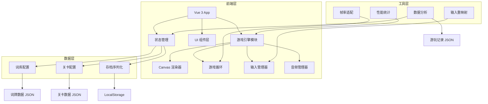

## 1. 架构设计



## 2. 技术说明

- 前端框架：Vue 3 + TypeScript + Canvas 2D
- 构建工具：Vite
- 样式方案：Tailwind CSS
- 初始化工具：vite-init (vue-ts 模板)
- 后端：无（纯前端，数据通过 JSON 配置 + LocalStorage 存储）
- 数据存储：LocalStorage 序列化存档 + JSON 可编辑配置文件

## 3. 路由定义

| 路由 | 用途 |
|------|------|
| `/` | 主界面，游戏标题和菜单 |
| `/levels` | 关卡选择页，词牌章节地图 |
| `/game/:chapterId/:levelId` | 游戏页面，Canvas 拼接交互 |
| `/result/:chapterId/:levelId` | 结算页面，评分和统计 |
| `/cards` | 学习卡集页面 |
| `/cards/:cardId` | 学习卡详情页面 |
| `/settings` | 设置页面 |

## 4. 数据模型

### 4.1 词牌数据模型

```typescript
interface CiPai {
  id: string
  name: string
  alias?: string
  description: string
  origin: string
  metricalPattern: MetricalPattern
  representativeWorks: Poem[]
  imagery: string[]
}

interface MetricalPattern {
  upperTune: TonePattern[]
  lowerTune: TonePattern[]
  rhymeScheme: string
  totalLines: number
  lineLengths: number[]
}

interface TonePattern {
  tone: 'ping' | 'ze' | 'any'
  expected: string
}

interface Poem {
  id: string
  title: string
  author: string
  dynasty: string
  lines: PoemLine[]
  imagery: string[]
  difficulty: number
}

interface PoemLine {
  text: string
  characters: CharacterUnit[]
  tonePattern: TonePattern[]
  rhymeGroup?: string
}

interface CharacterUnit {
  char: string
  tone: 'ping' | 'ze' | 'any'
  isRhyme: boolean
  isKeyword: boolean
  imagery?: string
}
```

### 4.2 关卡配置模型

```typescript
interface ChapterConfig {
  id: string
  ciPaiId: string
  name: string
  description: string
  unlockRequirement: string
  rules: RuleConfig
  levels: LevelConfig[]
}

interface LevelConfig {
  id: string
  poemId: string
  difficulty: number
  timeLimit: number
  hintPoints: number
  rules: Partial<RuleConfig>
  unlockCondition: string
}

interface RuleConfig {
  showToneHint: boolean
  showImageryHint: boolean
  requireRhymeMatch: boolean
  requireAntithesis: boolean
  allowSwapAdjacent: boolean
  showPositionHint: boolean
  maxErrors: number
  scoreMultiplier: number
}
```

### 4.3 存档模型

```typescript
interface SaveData {
  version: string
  timestamp: number
  progress: ChapterProgress[]
  stats: PlayStats
  settings: GameSettings
  unlockedCards: string[]
  analytics: AnalyticsData
}

interface ChapterProgress {
  chapterId: string
  levels: LevelProgress[]
}

interface LevelProgress {
  levelId: string
  stars: number
  bestTime: number
  completed: boolean
  attempts: number
}

interface PlayStats {
  totalPlayTime: number
  totalLevels: number
  totalStars: number
  perfectClears: number
}

interface GameSettings {
  musicVolume: number
  sfxVolume: number
  showFps: boolean
  frameRateMode: 'auto' | '30' | '60'
  inputMapping: Record<string, string>
}

interface AnalyticsData {
  sessions: SessionRecord[]
}

interface SessionRecord {
  levelId: string
  chapterId: string
  startTime: number
  endTime: number
  duration: number
  failureCount: number
  hintsUsed: number
  keyChoices: ChoiceRecord[]
  result: 'success' | 'quit'
  score: number
  stars: number
}

interface ChoiceRecord {
  timestamp: number
  type: 'place' | 'swap' | 'remove' | 'hint'
  detail: string
  correct: boolean
}
```

## 5. 项目目录结构

```
src/
├── assets/              # 静态资源
│   ├── textures/        # Canvas 纹理（宣纸、墨迹等）
│   └── audio/           # 音效文件
├── components/          # Vue 通用组件
│   ├── GameCanvas.vue   # Canvas 游戏画布
│   ├── HintPanel.vue    # 提示面板
│   ├── ScoreBoard.vue   # 计分板
│   ├── StarRating.vue   # 星级评定
│   └── TutorialOverlay.vue  # 教程浮层
├── composables/         # Vue 组合式函数
│   ├── useGameLoop.ts   # 游戏循环
│   ├── useAudio.ts      # 音频管理
│   ├── useSaveData.ts   # 存档管理
│   ├── useAnalytics.ts  # 数据分析
│   └── usePerformance.ts # 性能统计
├── config/              # 可编辑配置
│   ├── chapters.json    # 章节配置
│   ├── cipai.json       # 词牌词库
│   ├── levels.json      # 关卡配置
│   └── settings.json    # 默认设置
├── engine/              # 游戏引擎核心
│   ├── renderer.ts      # Canvas 渲染器
│   ├── input.ts         # 输入管理器（含重映射）
│   ├── animation.ts     # 动画系统
│   ├── timer.ts         # 帧率适配计时器
│   └── perf.ts          # 性能统计
├── game/                # 游戏逻辑
│   ├── PuzzleEngine.ts  # 拼字引擎
│   ├── ToneChecker.ts   # 平仄校验
│   ├── ImageryMatcher.ts # 意象匹配
│   ├── ScoreCalculator.ts # 评分计算
│   ├── HintSystem.ts    # 提示系统
│   └── RuleManager.ts   # 规则管理器
├── pages/               # 页面组件
│   ├── HomePage.vue
│   ├── LevelSelectPage.vue
│   ├── GamePage.vue
│   ├── ResultPage.vue
│   ├── CardCollectionPage.vue
│   ├── CardDetailPage.vue
│   └── SettingsPage.vue
├── router/
│   └── index.ts
├── stores/              # Pinia 状态管理
│   ├── gameStore.ts
│   ├── progressStore.ts
│   └── settingsStore.ts
├── types/
│   └── index.ts         # TypeScript 类型定义
├── App.vue
└── main.ts
```

## 6. 关键技术方案

### 6.1 Canvas 渲染与 Vue 协同

- Vue 负责页面路由、UI 覆盖层（提示面板、教程浮层、结算弹窗）
- Canvas 负责游戏核心渲染（字卡绘制、拖拽交互、动画效果）
- 通过 ref 获取 Canvas 元素，在 Vue 组合式函数中管理渲染循环
- Canvas 交互事件通过 input manager 统一处理，支持鼠标和触控

### 6.2 帧率适配方案

- `requestAnimationFrame` 为基础循环
- 可选 30fps / 60fps / auto 模式
- auto 模式根据设备性能自动降帧
- deltaTime 计算确保动画速度与帧率解耦

### 6.3 输入重映射方案

- 输入映射表存储在 settings 中
- 支持鼠标/触控/键盘三种输入方式
- 键盘映射：方向键移动选中、空格确认、Z 撤销、H 提示
- 自定义映射通过设置页面修改

### 6.4 存档序列化方案

- 基于 LocalStorage 的 JSON 序列化
- 版本号管理，支持存档迁移
- 导出/导入功能，生成 JSON 文件下载
- 自动存档：关卡完成时、设置修改时

### 6.5 性能统计方案

- FPS 实时统计（可选显示）
- 帧耗时分布（min/avg/max）
- 内存使用监控
- 渲染批次计数
