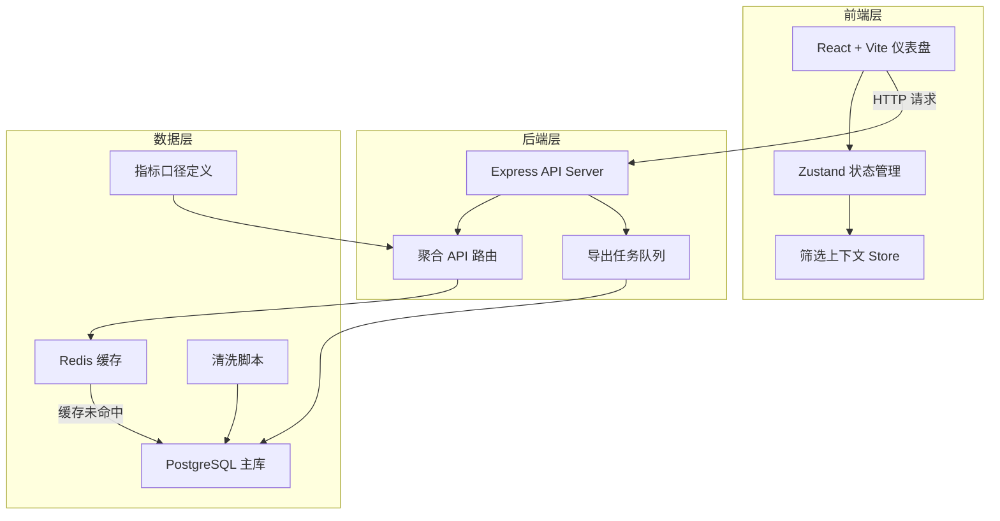
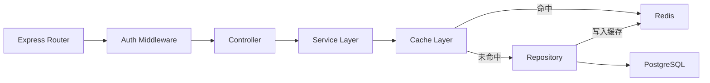
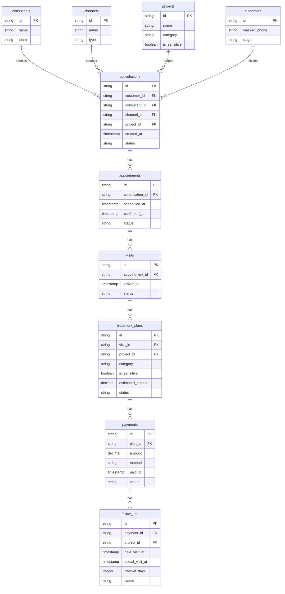

## 1. 架构设计



## 2. 技术说明

- 前端：React@18 + TailwindCSS@3 + Vite + Zustand + Recharts
- 初始化工具：vite-init（react-express-ts 模板）
- 后端：Express@4 + TypeScript (ESM)
- 数据库：PostgreSQL（主存储），Redis（缓存层）
- 图表库：Recharts（筛选上下文保持）
- 数据管道：Node.js 清洗脚本 + 聚合 SQL + Redis TTL 缓存策略

## 3. 路由定义

| 路由 | 用途 |
|------|------|
| `/` | 仪表盘首页（异常摘要 + 视角切换 + 四大核心视图） |
| `/export` | 导出中心（任务列表 + 下载） |

## 4. API 定义

### 4.1 聚合数据 API

```typescript
interface FilterParams {
  projectIds?: string[];
  consultantIds?: string[];
  channelIds?: string[];
  customerStage?: string;
  months?: string[];
}

interface FunnelResponse {
  stages: {
    name: string;
    count: number;
    rate: number;
    prevRate: number;
  }[];
}

interface ChannelQualityResponse {
  channels: {
    id: string;
    name: string;
    conversionRate: number;
    visitRate: number;
    dealRate: number;
    rank: number;
    prevRank: number;
  }[];
}

interface ConsultantLoadResponse {
  consultants: {
    id: string;
    name: string;
    totalCustomers: number;
    stageDistribution: Record<string, number>;
    conversionRate: number;
  }[];
}

interface FollowUpTrendResponse {
  monthly: {
    month: string;
    followUpRate: number;
    avgIntervalDays: number;
  }[];
  intervalDistribution: {
    range: string;
    count: number;
  }[];
  categoryBreakdown: {
    category: string;
    followUpRate: number;
    patientCount: number;
  }[];
}

interface AnomalySummaryResponse {
  anomalies: {
    id: string;
    level: "critical" | "warning" | "info";
    title: string;
    description: string;
    metric: string;
    currentValue: number;
    expectedValue: number;
    relatedView: string;
    relatedFilter: FilterParams;
  }[];
}
```

### 4.2 导出 API

```typescript
interface ExportRequest {
  viewType: string;
  filters: FilterParams;
  format: "csv" | "xlsx";
}

interface ExportTask {
  id: string;
  status: "queued" | "processing" | "completed" | "failed";
  createdAt: string;
  completedAt?: string;
  downloadUrl?: string;
}
```

### 4.3 API 路由表

| 方法 | 路径 | 说明 |
|------|------|------|
| GET | `/api/anomalies` | 获取异常摘要 |
| GET | `/api/funnel` | 转化漏斗数据 |
| GET | `/api/channel-quality` | 渠道质量数据 |
| GET | `/api/consultant-load` | 顾问负载数据 |
| GET | `/api/follow-up-trend` | 复诊趋势数据 |
| GET | `/api/filters/options` | 筛选器选项数据 |
| POST | `/api/exports` | 提交导出任务 |
| GET | `/api/exports` | 导出任务列表 |
| GET | `/api/exports/:id/download` | 下载导出文件 |

## 5. 服务器架构图



## 6. 数据模型

### 6.1 数据模型定义



### 6.2 数据定义语言

```sql
CREATE TABLE customers (
  id UUID PRIMARY KEY DEFAULT gen_random_uuid(),
  masked_phone VARCHAR(20) NOT NULL,
  stage VARCHAR(30) NOT NULL DEFAULT 'lead',
  created_at TIMESTAMPTZ DEFAULT NOW()
);

CREATE TABLE consultants (
  id UUID PRIMARY KEY DEFAULT gen_random_uuid(),
  name VARCHAR(100) NOT NULL,
  team VARCHAR(100)
);

CREATE TABLE channels (
  id UUID PRIMARY KEY DEFAULT gen_random_uuid(),
  name VARCHAR(100) NOT NULL,
  type VARCHAR(50)
);

CREATE TABLE projects (
  id UUID PRIMARY KEY DEFAULT gen_random_uuid(),
  name VARCHAR(200) NOT NULL,
  category VARCHAR(100) NOT NULL,
  is_sensitive BOOLEAN DEFAULT FALSE
);

CREATE TABLE consultations (
  id UUID PRIMARY KEY DEFAULT gen_random_uuid(),
  customer_id UUID NOT NULL REFERENCES customers(id),
  consultant_id UUID NOT NULL REFERENCES consultants(id),
  channel_id UUID NOT NULL REFERENCES channels(id),
  project_id UUID NOT NULL REFERENCES projects(id),
  created_at TIMESTAMPTZ DEFAULT NOW(),
  status VARCHAR(30) DEFAULT 'active'
);

CREATE TABLE appointments (
  id UUID PRIMARY KEY DEFAULT gen_random_uuid(),
  consultation_id UUID NOT NULL REFERENCES consultations(id),
  scheduled_at TIMESTAMPTZ NOT NULL,
  confirmed_at TIMESTAMPTZ,
  status VARCHAR(30) DEFAULT 'pending'
);

CREATE TABLE visits (
  id UUID PRIMARY KEY DEFAULT gen_random_uuid(),
  appointment_id UUID NOT NULL REFERENCES appointments(id),
  arrived_at TIMESTAMPTZ NOT NULL,
  status VARCHAR(30) DEFAULT 'completed'
);

CREATE TABLE treatment_plans (
  id UUID PRIMARY KEY DEFAULT gen_random_uuid(),
  visit_id UUID NOT NULL REFERENCES visits(id),
  project_id UUID NOT NULL REFERENCES projects(id),
  category VARCHAR(100) NOT NULL,
  is_sensitive BOOLEAN DEFAULT FALSE,
  estimated_amount DECIMAL(12,2),
  status VARCHAR(30) DEFAULT 'proposed'
);

CREATE TABLE payments (
  id UUID PRIMARY KEY DEFAULT gen_random_uuid(),
  plan_id UUID NOT NULL REFERENCES treatment_plans(id),
  amount DECIMAL(12,2) NOT NULL,
  method VARCHAR(50),
  paid_at TIMESTAMPTZ DEFAULT NOW(),
  status VARCHAR(30) DEFAULT 'completed'
);

CREATE TABLE follow_ups (
  id UUID PRIMARY KEY DEFAULT gen_random_uuid(),
  payment_id UUID NOT NULL REFERENCES payments(id),
  project_id UUID NOT NULL REFERENCES projects(id),
  next_visit_at TIMESTAMPTZ,
  actual_visit_at TIMESTAMPTZ,
  interval_days INTEGER,
  status VARCHAR(30) DEFAULT 'scheduled'
);

CREATE INDEX idx_consultations_customer ON consultations(customer_id);
CREATE INDEX idx_consultations_consultant ON consultations(consultant_id);
CREATE INDEX idx_consultations_channel ON consultations(channel_id);
CREATE INDEX idx_consultations_project ON consultations(project_id);
CREATE INDEX idx_consultations_created ON consultations(created_at);
CREATE INDEX idx_appointments_consultation ON appointments(consultation_id);
CREATE INDEX idx_visits_appointment ON visits(appointment_id);
CREATE INDEX idx_plans_visit ON treatment_plans(visit_id);
CREATE INDEX idx_payments_plan ON payments(plan_id);
CREATE INDEX idx_followups_payment ON follow_ups(payment_id);
CREATE INDEX idx_followups_project ON follow_ups(project_id);
```

## 7. 缓存策略

| 数据类型 | Redis Key 格式 | TTL | 刷新策略 |
|----------|----------------|-----|----------|
| 异常摘要 | `anomalies:{filter_hash}` | 5 分钟 | 写入时主动刷新 |
| 转化漏斗 | `funnel:{filter_hash}` | 10 分钟 | 写入时主动刷新 |
| 渠道质量 | `channel:{filter_hash}` | 15 分钟 | 定时刷新 |
| 顾问负载 | `consultant:{filter_hash}` | 10 分钟 | 写入时主动刷新 |
| 复诊趋势 | `followup:{filter_hash}` | 30 分钟 | 定时刷新 |
| 筛选选项 | `filter_options` | 1 小时 | 数据变更时刷新 |

## 8. 指标口径定义

| 指标名称 | 计算公式 | 说明 |
|----------|----------|------|
| 咨询→预约转化率 | 已预约咨询数 / 总咨询数 × 100% | 预约状态为 confirmed 或之后 |
| 预约→到店转化率 | 已到店预约数 / 已确认预约数 × 100% | arrived_at 不为空 |
| 到店→方案转化率 | 有方案的到店数 / 总到店数 × 100% | 至少一条 treatment_plan |
| 方案→付款转化率 | 已付款方案数 / 总方案数 × 100% | payment 状态为 completed |
| 付款→复诊转化率 | 已复诊付款数 / 总付款数 × 100% | actual_visit_at 不为空 |
| 整体转化率 | 最终复诊数 / 总咨询数 × 100% | 全链路 |
| 复诊率 | 已复诊数 / 应复诊数 × 100% | next_visit_at 已过且有 actual_visit_at |
| 顾问负载 | 顾问在管各阶段客户数 | 当前 status 非 completed 的客户数 |
| 渠道成本效率 | 该渠道成单金额 / 渠道投入成本 | 需外部成本数据 |

## 9. 数据清洗脚本

- **去重**：同一客户同一项目24小时内重复咨询合并为一条
- **状态修复**：跳过阶段的记录标记为异常（如直接从咨询到付款）
- **敏感标记**：is_sensitive=true 的项目在查询时仅返回 category，不返回 name 和明细
- **时间对齐**：所有时间戳统一为 UTC+8，按月聚合时使用自然月
