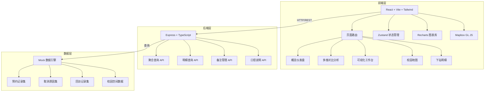
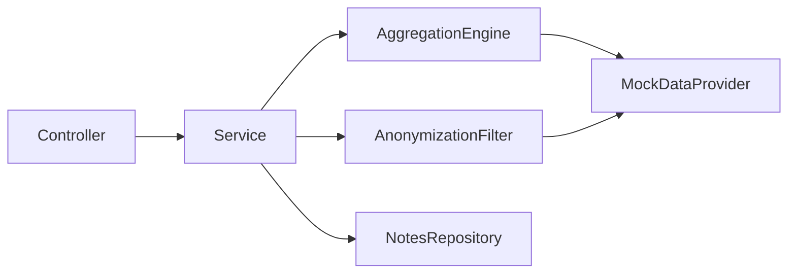
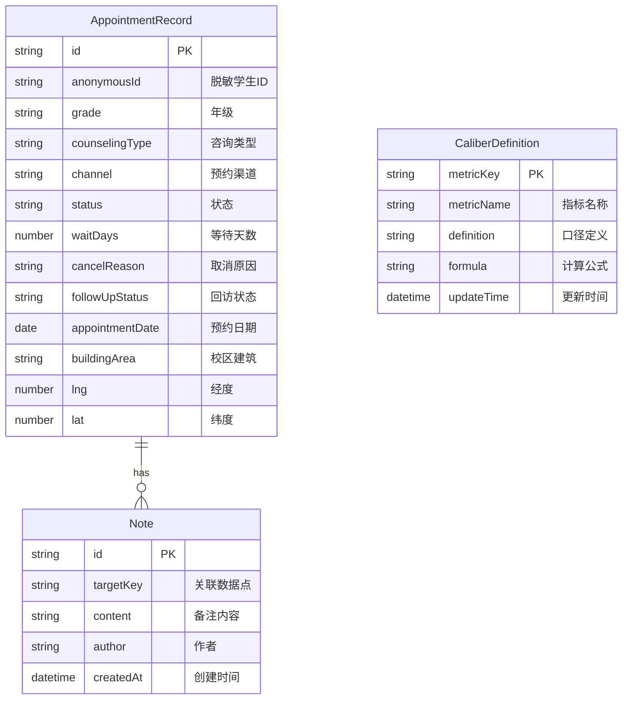

## 1. 架构设计



## 2. 技术说明

- **前端**：React@18 + TailwindCSS@3 + Vite，使用 Recharts 绑定可视化，Mapbox GL JS 渲染校园地图
- **初始化工具**：vite-init（react-express-ts 模板）
- **后端**：Express@4 + TypeScript（ESM 格式）
- **数据库**：Mock 数据引擎（模拟 PostGIS 空间查询能力），生产环境可替换为 PostgreSQL + PostGIS
- **图表库**：Recharts（轻量 React 图表，支持自定义和交互）
- **地图**：Mapbox GL JS（需要用户配置 access token）
- **状态管理**：Zustand

## 3. 路由定义

| 路由 | 用途 |
|------|------|
| `/` | 概览仪表盘，展示核心 KPI 和趋势 |
| `/compare` | 多维对比分析页，按维度交叉对比 |
| `/visualization` | 可视化工作台，等待分布/取消原因/渠道趋势/回访漏斗 |
| `/campus-map` | 校园地图，Mapbox 热力图展示预约空间分布 |
| `/detail` | 下钻明细页，脱敏预约记录明细表 |
| `/notes` | 人工备注管理页（也支持在其它页面通过抽屉调用） |

## 4. API 定义

### 4.1 聚合查询 API

```typescript
interface AggregationQuery {
  dimensions: ('grade' | 'counselingType' | 'timePeriod' | 'channel' | 'status')[]
  metrics: ('appointmentCount' | 'cancelRate' | 'avgWaitDays' | 'followUpRate')[]
  timeRange: { start: string; end: string }
  filters?: Record<string, string[]>
}

interface AggregationResponse {
  data: Array<Record<string, string | number>>
  caliberNotes: Array<{ metric: string; definition: string; formula: string }>
}
```

### 4.2 明细查询 API

```typescript
interface DetailQuery {
  filters: Record<string, string | string[]>
  page: number
  pageSize: number
  sortBy?: string
  sortOrder?: 'asc' | 'desc'
}

interface DetailResponse {
  records: Array<{
    id: string
    anonymousId: string
    grade: string
    counselingType: string
    channel: string
    status: 'appointed' | 'completed' | 'cancelled' | 'noShow'
    waitDays: number
    cancelReason?: string
    followUpStatus: 'pending' | 'completed' | 'overdue'
    appointmentDate: string
    buildingArea: string
  }>
  total: number
  page: number
  caliberNote: string
}
```

### 4.3 备注 API

```typescript
interface Note {
  id: string
  targetKey: string
  content: string
  author: string
  createdAt: string
}

interface NoteCreateRequest {
  targetKey: string
  content: string
}
```

### 4.4 口径说明 API

```typescript
interface CaliberDefinition {
  metricKey: string
  metricName: string
  definition: string
  formula: string
  updateTime: string
}
```

## 5. 服务架构图



## 6. 数据模型

### 6.1 数据模型定义



### 6.2 数据定义语言

```sql
CREATE TABLE appointment_records (
  id TEXT PRIMARY KEY,
  anonymous_id TEXT NOT NULL,
  grade TEXT NOT NULL,
  counseling_type TEXT NOT NULL,
  channel TEXT NOT NULL,
  status TEXT NOT NULL CHECK(status IN ('appointed','completed','cancelled','no_show')),
  wait_days REAL NOT NULL,
  cancel_reason TEXT,
  follow_up_status TEXT NOT NULL CHECK(follow_up_status IN ('pending','completed','overdue')),
  appointment_date DATE NOT NULL,
  building_area TEXT NOT NULL,
  lng REAL NOT NULL,
  lat REAL NOT NULL
);

CREATE TABLE notes (
  id TEXT PRIMARY KEY,
  target_key TEXT NOT NULL,
  content TEXT NOT NULL,
  author TEXT NOT NULL,
  created_at DATETIME DEFAULT CURRENT_TIMESTAMP
);

CREATE TABLE caliber_definitions (
  metric_key TEXT PRIMARY KEY,
  metric_name TEXT NOT NULL,
  definition TEXT NOT NULL,
  formula TEXT NOT NULL,
  update_time DATETIME DEFAULT CURRENT_TIMESTAMP
);

CREATE INDEX idx_appointment_grade ON appointment_records(grade);
CREATE INDEX idx_appointment_type ON appointment_records(counseling_type);
CREATE INDEX idx_appointment_date ON appointment_records(appointment_date);
CREATE INDEX idx_appointment_status ON appointment_records(status);
CREATE INDEX idx_notes_target ON notes(target_key);
```
