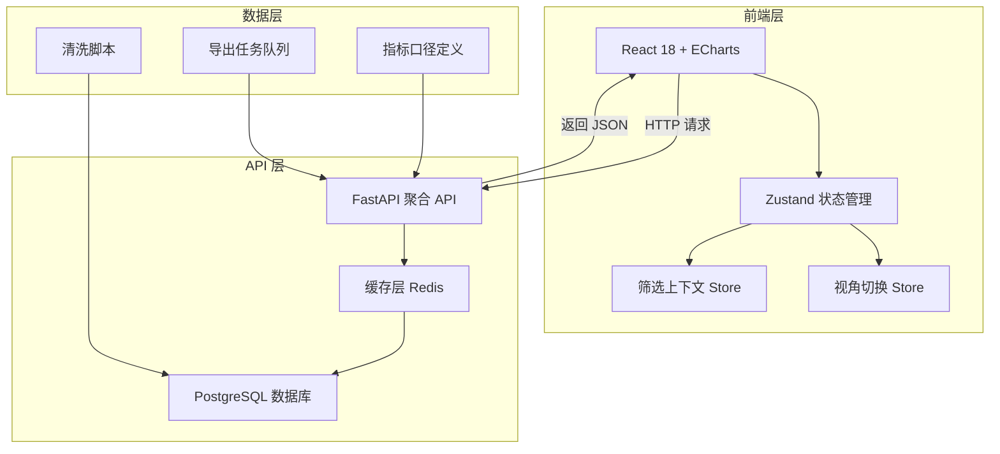
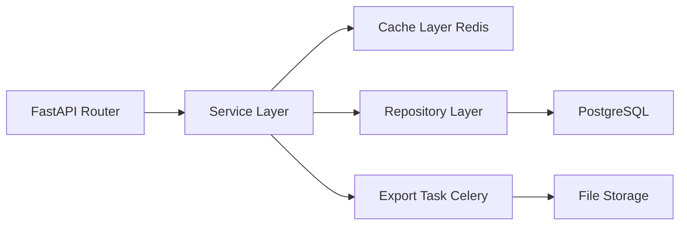
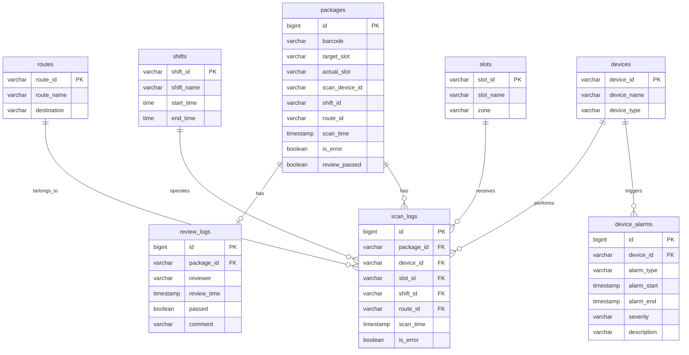

## 1. 架构设计



## 2. 技术说明

- 前端：React@18 + ECharts@5 + TailwindCSS@3 + Zustand + Vite
- 初始化工具：vite-init
- 后端：FastAPI + Uvicorn（Python 3.11+）
- 数据库：PostgreSQL 15 + Redis（缓存）
- 数据层：Python 清洗脚本 + 指标口径 YAML + Celery 导出任务

## 3. 路由定义

| 路由 | 用途 |
|------|------|
| / | 分析主页面（异常摘要 + 图表区） |

## 4. API 定义

### 4.1 聚合查询 API

```typescript
interface SummaryRequest {
  date_start: string;
  date_end: string;
  shift?: string;
  slot?: string;
  route?: string;
  device?: string;
}

interface SummaryResponse {
  total_packages: number;
  total_sorted: number;
  total_errors: number;
  error_rate: number;
  alarm_count: number;
  review_failed: number;
  error_rate_change: number;
  alarm_count_change: number;
}

interface TrendRequest {
  date_start: string;
  date_end: string;
  granularity: "hour" | "shift" | "day";
  shift?: string;
  slot?: string;
  route?: string;
  device?: string;
}

interface TrendResponse {
  timestamps: string[];
  error_counts: number[];
  error_rates: number[];
  total_counts: number[];
  alarm_periods: Array<{
    start: string;
    end: string;
    device_id: string;
    alarm_type: string;
  }>;
}

interface HeatmapRequest {
  date_start: string;
  date_end: string;
  shift?: string;
}

interface HeatmapResponse {
  slots: string[];
  time_periods: string[];
  values: number[][];
}

interface ShiftRankRequest {
  date_start: string;
  date_end: string;
  order_by?: "error_rate" | "error_count";
}

interface ShiftRankResponse {
  shifts: Array<{
    shift_name: string;
    total_sorted: number;
    error_count: number;
    error_rate: number;
    alarm_affected: boolean;
  }>;
}

interface AlarmCorrelationRequest {
  date_start: string;
  date_end: string;
}

interface AlarmCorrelationResponse {
  nodes: Array<{
    id: string;
    name: string;
    type: "alarm" | "scan_error" | "mis_sort" | "review_failed";
    value: number;
  }>;
  links: Array<{
    source: string;
    target: string;
    value: number;
  }>;
}

interface MetricDefinitionResponse {
  metrics: Array<{
    name: string;
    key: string;
    formula: string;
    description: string;
  }>;
}

interface ExportRequest {
  date_start: string;
  date_end: string;
  shift?: string;
  slot?: string;
  route?: string;
  device?: string;
  format: "csv" | "xlsx";
}
```

### 4.2 API 端点

| 端点 | 方法 | 用途 |
|------|------|------|
| /api/summary | POST | 异常摘要聚合数据 |
| /api/trend | POST | 错分趋势数据 |
| /api/heatmap | POST | 格口热力图数据 |
| /api/shift-rank | POST | 班组排行数据 |
| /api/alarm-correlation | POST | 报警关联数据 |
| /api/metrics | GET | 指标口径定义 |
| /api/export | POST | 导出任务创建 |
| /api/export/{task_id} | GET | 导出任务状态查询 |

## 5. 服务端架构图



## 6. 数据模型

### 6.1 数据模型定义



### 6.2 数据定义语言

```sql
CREATE TABLE slots (
    slot_id VARCHAR(32) PRIMARY KEY,
    slot_name VARCHAR(64) NOT NULL,
    zone VARCHAR(32)
);

CREATE TABLE shifts (
    shift_id VARCHAR(32) PRIMARY KEY,
    shift_name VARCHAR(64) NOT NULL,
    start_time TIME NOT NULL,
    end_time TIME NOT NULL
);

CREATE TABLE devices (
    device_id VARCHAR(32) PRIMARY KEY,
    device_name VARCHAR(64) NOT NULL,
    device_type VARCHAR(32) NOT NULL
);

CREATE TABLE routes (
    route_id VARCHAR(32) PRIMARY KEY,
    route_name VARCHAR(64) NOT NULL,
    destination VARCHAR(128)
);

CREATE TABLE device_alarms (
    id BIGSERIAL PRIMARY KEY,
    device_id VARCHAR(32) REFERENCES devices(device_id),
    alarm_type VARCHAR(64) NOT NULL,
    alarm_start TIMESTAMP NOT NULL,
    alarm_end TIMESTAMP,
    severity VARCHAR(16) NOT NULL DEFAULT 'warning',
    description TEXT
);

CREATE TABLE packages (
    id BIGSERIAL PRIMARY KEY,
    barcode VARCHAR(128) NOT NULL,
    target_slot VARCHAR(32) REFERENCES slots(slot_id),
    actual_slot VARCHAR(32) REFERENCES slots(slot_id),
    scan_device_id VARCHAR(32) REFERENCES devices(device_id),
    shift_id VARCHAR(32) REFERENCES shifts(shift_id),
    route_id VARCHAR(32) REFERENCES routes(route_id),
    scan_time TIMESTAMP NOT NULL,
    is_error BOOLEAN NOT NULL DEFAULT FALSE,
    review_passed BOOLEAN
);

CREATE TABLE scan_logs (
    id BIGSERIAL PRIMARY KEY,
    package_id BIGINT REFERENCES packages(id),
    device_id VARCHAR(32) REFERENCES devices(device_id),
    slot_id VARCHAR(32) REFERENCES slots(slot_id),
    shift_id VARCHAR(32) REFERENCES shifts(shift_id),
    route_id VARCHAR(32) REFERENCES routes(route_id),
    scan_time TIMESTAMP NOT NULL,
    is_error BOOLEAN NOT NULL DEFAULT FALSE
);

CREATE TABLE review_logs (
    id BIGSERIAL PRIMARY KEY,
    package_id BIGINT REFERENCES packages(id),
    reviewer VARCHAR(64),
    review_time TIMESTAMP NOT NULL,
    passed BOOLEAN NOT NULL,
    comment TEXT
);

CREATE INDEX idx_packages_scan_time ON packages(scan_time);
CREATE INDEX idx_packages_is_error ON packages(is_error);
CREATE INDEX idx_packages_shift_id ON packages(shift_id);
CREATE INDEX idx_packages_target_slot ON packages(target_slot);
CREATE INDEX idx_packages_route_id ON packages(route_id);
CREATE INDEX idx_packages_scan_device_id ON packages(scan_device_id);
CREATE INDEX idx_device_alarms_alarm_start ON device_alarms(alarm_start);
CREATE INDEX idx_device_alarms_device_id ON device_alarms(device_id);
CREATE INDEX idx_scan_logs_scan_time ON scan_logs(scan_time);
```

## 7. 缓存策略

- 聚合查询结果按筛选参数哈希作为缓存键，TTL 5 分钟
- 异常摘要数据优先读取缓存，缓存未命中时查询数据库后回填
- 导出任务结果文件缓存 1 小时
- 视角切换时，已查询过的维度数据保留在缓存中，避免重复查询

## 8. 数据清洗脚本

- 输入：原始扫描日志（CSV/数据库）
- 处理步骤：去重 → 时间校准 → 格口编码标准化 → 班组归属校验 → 报警时段标记
- 输出：清洗后的 packages + scan_logs 数据写入 PostgreSQL

## 9. 指标口径定义

| 指标名 | 键名 | 公式 | 说明 |
|--------|------|------|------|
| 错分率 | error_rate | 错分包裹数 / 总分拣包裹数 × 100% | 核心指标 |
| 复核未通过率 | review_failed_rate | 复核未通过数 / 复核总数 × 100% | 反映复核质量 |
| 报警影响占比 | alarm_affected_ratio | 报警时段内错分数 / 总错分数 × 100% | 设备报警对错分的影响程度 |
| 格口错分强度 | slot_error_intensity | 该格口错分数 / 该格口总包裹数 × 100% | 按格口维度 |
| 班组错分率 | shift_error_rate | 该班组错分数 / 该班组总分拣数 × 100% | 按班组维度 |
