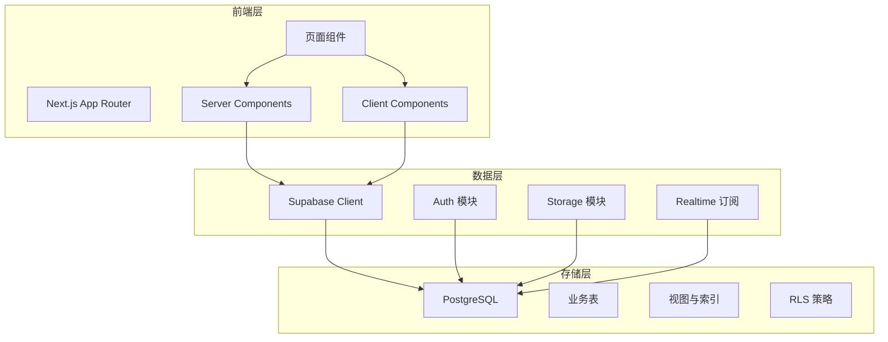
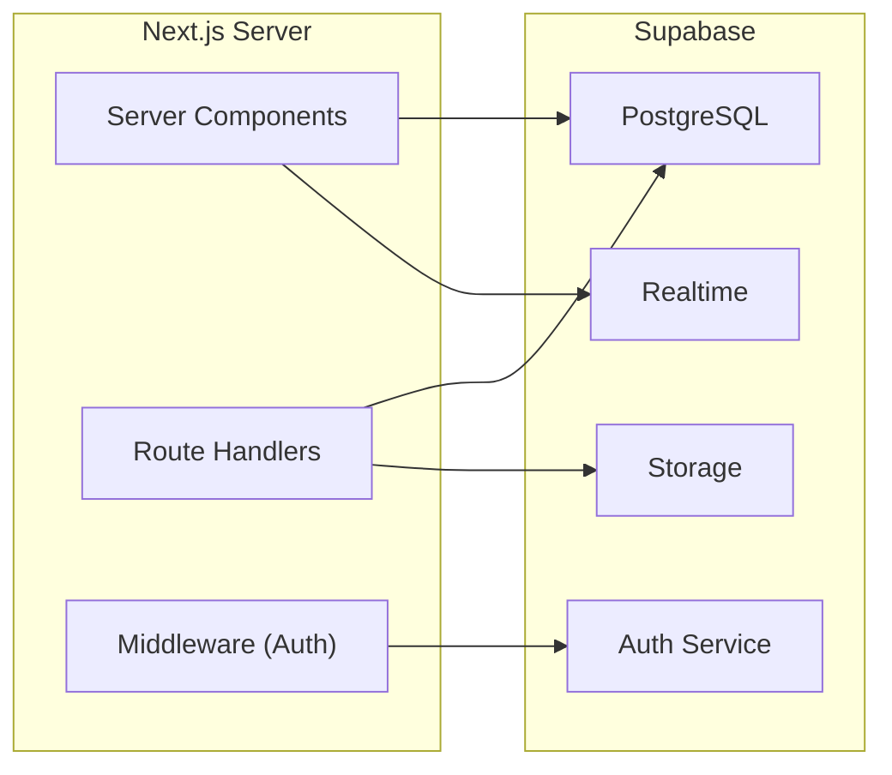
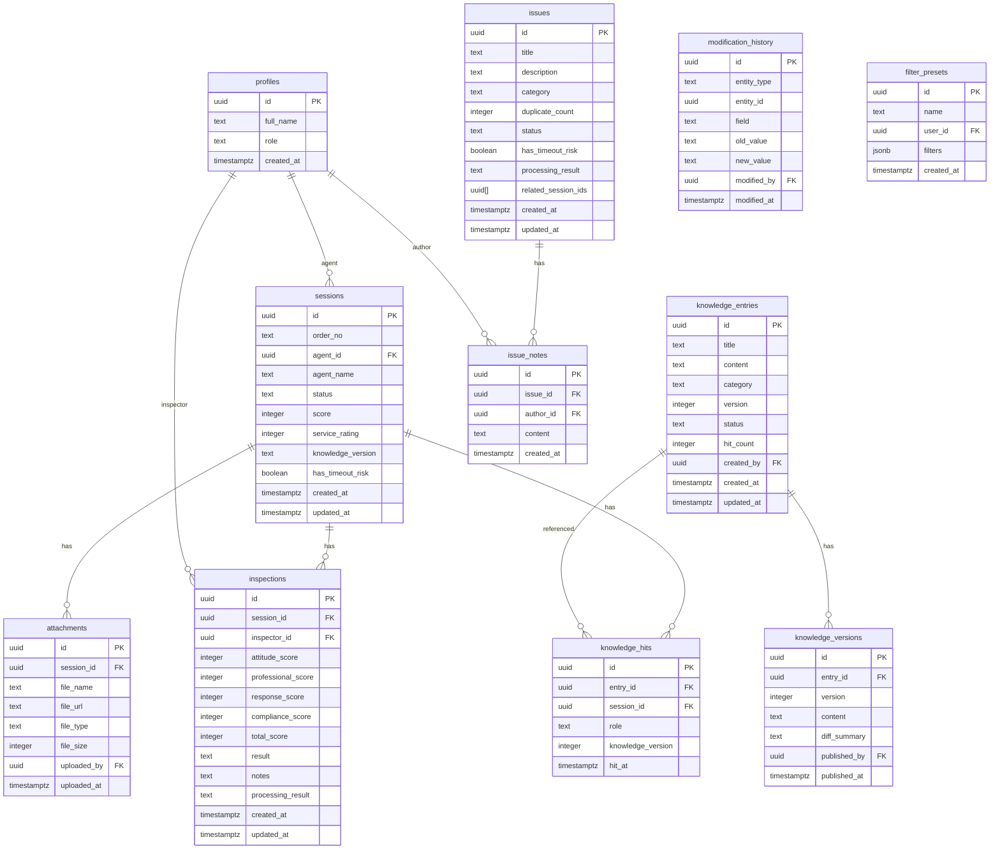

## 1. 架构设计



## 2. 技术说明

- 前端：Next.js 14 (App Router) + Tailwind CSS 3 + shadcn/ui
- 初始化工具：create-next-app
- 后端：Supabase（BaaS，提供 Auth、REST API、Realtime、Storage）
- 数据库：PostgreSQL（Supabase 托管）
- 图表：Recharts
- 图标：Lucide React
- 状态管理：React Context + URL Search Params（筛选状态持久化）
- 表单：React Hook Form + Zod 校验

## 3. 路由定义

| 路由 | 用途 |
|------|------|
| `/` | 重定向至 `/dashboard` |
| `/dashboard` | 质检看板：指标总览、超时风险、待处理任务、趋势图 |
| `/sessions` | 会话质检列表：筛选、搜索、分页、常用组合 |
| `/sessions/[id]` | 质检详情：会话记录、知识命中、附件、备注、修改历史 |
| `/knowledge` | 知识库：搜索答案教程、条目列表、版本历史 |
| `/issues` | 问题追踪：去重列表、备注处理、超时风险统计 |

## 4. API 定义

### 4.1 数据类型

```typescript
interface Session {
  id: string
  order_no: string
  customer_id: string
  agent_id: string
  agent_name: string
  status: "pending" | "inspecting" | "completed" | "appealed"
  score: number | null
  service_rating: 1 | 2 | 3 | 4 | 5 | null
  knowledge_version: string | null
  has_timeout_risk: boolean
  created_at: string
  updated_at: string
}

interface Inspection {
  id: string
  session_id: string
  inspector_id: string
  attitude_score: number
  professional_score: number
  response_score: number
  compliance_score: number
  total_score: number
  result: "pass" | "fail" | "warning"
  notes: string
  processing_result: "resolved" | "escalated" | "pending" | "dismissed"
  created_at: string
  updated_at: string
}

interface KnowledgeEntry {
  id: string
  title: string
  content: string
  category: "answer" | "tutorial"
  version: number
  status: "draft" | "published" | "archived"
  hit_count: number
  created_by: string
  created_at: string
  updated_at: string
}

interface KnowledgeHit {
  id: string
  entry_id: string
  session_id: string
  role: "agent" | "customer" | "system"
  knowledge_version: number
  hit_at: string
}

interface KnowledgeVersion {
  id: string
  entry_id: string
  version: number
  content: string
  diff_summary: string
  published_by: string
  published_at: string
}

interface Issue {
  id: string
  title: string
  description: string
  category: string
  duplicate_count: number
  status: "open" | "processing" | "resolved" | "closed"
  has_timeout_risk: boolean
  processing_result: "resolved" | "escalated" | "pending" | "dismissed"
  related_session_ids: string[]
  created_at: string
  updated_at: string
}

interface IssueNote {
  id: string
  issue_id: string
  author_id: string
  content: string
  created_at: string
}

interface Attachment {
  id: string
  session_id: string
  file_name: string
  file_url: string
  file_type: string
  file_size: number
  uploaded_by: string
  uploaded_at: string
}

interface ModificationHistory {
  id: string
  entity_type: "inspection" | "issue" | "knowledge"
  entity_id: string
  field: string
  old_value: string
  new_value: string
  modified_by: string
  modified_at: string
}

type FilterPreset = {
  id: string
  name: string
  user_id: string
  filters: {
    status?: string[]
    service_rating?: number[]
    knowledge_version?: string[]
    has_timeout_risk?: boolean
    date_from?: string
    date_to?: string
    query?: string
  }
}
```

### 4.2 Supabase RPC / 视图

| 名称 | 类型 | 用途 |
|------|------|------|
| `session_list` | 视图 | 会话列表含评分、状态、超时标记聚合 |
| `inspection_with_modifications` | 视图 | 质检记录含最新修改历史 |
| `issue_with_stats` | 视图 | 问题含去重计数和超时标记 |
| `knowledge_entry_with_hits` | 视图 | 知识条目含命中次数和角色分布 |
| `dashboard_metrics` | RPC | 看板指标聚合查询 |
| `timeout_risk_distribution` | RPC | 超时风险分布统计 |
| `check_issue_duplicate` | RPC | 新建问题时自动检测重复 |

## 5. 服务端架构



## 6. 数据模型

### 6.1 数据模型定义



### 6.2 数据定义语言

```sql
CREATE TABLE profiles (
  id UUID PRIMARY KEY REFERENCES auth.users(id),
  full_name TEXT,
  role TEXT NOT NULL DEFAULT 'inspector' CHECK (role IN ('admin', 'supervisor', 'inspector', 'kb_manager')),
  created_at TIMESTAMPTZ NOT NULL DEFAULT now()
);

CREATE TABLE sessions (
  id UUID PRIMARY KEY DEFAULT gen_random_uuid(),
  order_no TEXT NOT NULL,
  agent_id UUID REFERENCES profiles(id),
  agent_name TEXT NOT NULL,
  status TEXT NOT NULL DEFAULT 'pending' CHECK (status IN ('pending', 'inspecting', 'completed', 'appealed')),
  score INTEGER CHECK (score >= 0 AND score <= 100),
  service_rating INTEGER CHECK (service_rating >= 1 AND service_rating <= 5),
  knowledge_version TEXT,
  has_timeout_risk BOOLEAN NOT NULL DEFAULT false,
  created_at TIMESTAMPTZ NOT NULL DEFAULT now(),
  updated_at TIMESTAMPTZ NOT NULL DEFAULT now()
);

CREATE TABLE inspections (
  id UUID PRIMARY KEY DEFAULT gen_random_uuid(),
  session_id UUID NOT NULL REFERENCES sessions(id) ON DELETE CASCADE,
  inspector_id UUID NOT NULL REFERENCES profiles(id),
  attitude_score INTEGER NOT NULL CHECK (attitude_score >= 0 AND attitude_score <= 25),
  professional_score INTEGER NOT NULL CHECK (professional_score >= 0 AND professional_score <= 25),
  response_score INTEGER NOT NULL CHECK (response_score >= 0 AND response_score <= 25),
  compliance_score INTEGER NOT NULL CHECK (compliance_score >= 0 AND compliance_score <= 25),
  total_score INTEGER NOT NULL CHECK (total_score >= 0 AND total_score <= 100),
  result TEXT NOT NULL CHECK (result IN ('pass', 'fail', 'warning')),
  notes TEXT DEFAULT '',
  processing_result TEXT NOT NULL DEFAULT 'pending' CHECK (processing_result IN ('resolved', 'escalated', 'pending', 'dismissed')),
  created_at TIMESTAMPTZ NOT NULL DEFAULT now(),
  updated_at TIMESTAMPTZ NOT NULL DEFAULT now()
);

CREATE TABLE knowledge_entries (
  id UUID PRIMARY KEY DEFAULT gen_random_uuid(),
  title TEXT NOT NULL,
  content TEXT NOT NULL,
  category TEXT NOT NULL CHECK (category IN ('answer', 'tutorial')),
  version INTEGER NOT NULL DEFAULT 1,
  status TEXT NOT NULL DEFAULT 'draft' CHECK (status IN ('draft', 'published', 'archived')),
  hit_count INTEGER NOT NULL DEFAULT 0,
  created_by UUID REFERENCES profiles(id),
  created_at TIMESTAMPTZ NOT NULL DEFAULT now(),
  updated_at TIMESTAMPTZ NOT NULL DEFAULT now()
);

CREATE TABLE knowledge_versions (
  id UUID PRIMARY KEY DEFAULT gen_random_uuid(),
  entry_id UUID NOT NULL REFERENCES knowledge_entries(id) ON DELETE CASCADE,
  version INTEGER NOT NULL,
  content TEXT NOT NULL,
  diff_summary TEXT DEFAULT '',
  published_by UUID REFERENCES profiles(id),
  published_at TIMESTAMPTZ NOT NULL DEFAULT now()
);

CREATE TABLE knowledge_hits (
  id UUID PRIMARY KEY DEFAULT gen_random_uuid(),
  entry_id UUID NOT NULL REFERENCES knowledge_entries(id),
  session_id UUID NOT NULL REFERENCES sessions(id),
  role TEXT NOT NULL CHECK (role IN ('agent', 'customer', 'system')),
  knowledge_version INTEGER NOT NULL,
  hit_at TIMESTAMPTZ NOT NULL DEFAULT now()
);

CREATE TABLE issues (
  id UUID PRIMARY KEY DEFAULT gen_random_uuid(),
  title TEXT NOT NULL,
  description TEXT DEFAULT '',
  category TEXT NOT NULL,
  duplicate_count INTEGER NOT NULL DEFAULT 1,
  status TEXT NOT NULL DEFAULT 'open' CHECK (status IN ('open', 'processing', 'resolved', 'closed')),
  has_timeout_risk BOOLEAN NOT NULL DEFAULT false,
  processing_result TEXT NOT NULL DEFAULT 'pending' CHECK (processing_result IN ('resolved', 'escalated', 'pending', 'dismissed')),
  related_session_ids UUID[] DEFAULT '{}',
  created_at TIMESTAMPTZ NOT NULL DEFAULT now(),
  updated_at TIMESTAMPTZ NOT NULL DEFAULT now()
);

CREATE TABLE issue_notes (
  id UUID PRIMARY KEY DEFAULT gen_random_uuid(),
  issue_id UUID NOT NULL REFERENCES issues(id) ON DELETE CASCADE,
  author_id UUID NOT NULL REFERENCES profiles(id),
  content TEXT NOT NULL,
  created_at TIMESTAMPTZ NOT NULL DEFAULT now()
);

CREATE TABLE attachments (
  id UUID PRIMARY KEY DEFAULT gen_random_uuid(),
  session_id UUID NOT NULL REFERENCES sessions(id) ON DELETE CASCADE,
  file_name TEXT NOT NULL,
  file_url TEXT NOT NULL,
  file_type TEXT NOT NULL,
  file_size INTEGER NOT NULL,
  uploaded_by UUID REFERENCES profiles(id),
  uploaded_at TIMESTAMPTZ NOT NULL DEFAULT now()
);

CREATE TABLE modification_history (
  id UUID PRIMARY KEY DEFAULT gen_random_uuid(),
  entity_type TEXT NOT NULL CHECK (entity_type IN ('inspection', 'issue', 'knowledge')),
  entity_id UUID NOT NULL,
  field TEXT NOT NULL,
  old_value TEXT DEFAULT '',
  new_value TEXT DEFAULT '',
  modified_by UUID NOT NULL REFERENCES profiles(id),
  modified_at TIMESTAMPTZ NOT NULL DEFAULT now()
);

CREATE TABLE filter_presets (
  id UUID PRIMARY KEY DEFAULT gen_random_uuid(),
  name TEXT NOT NULL,
  user_id UUID NOT NULL REFERENCES profiles(id),
  filters JSONB NOT NULL DEFAULT '{}',
  created_at TIMESTAMPTZ NOT NULL DEFAULT now()
);

CREATE INDEX idx_sessions_status ON sessions(status);
CREATE INDEX idx_sessions_agent ON sessions(agent_id);
CREATE INDEX idx_sessions_created ON sessions(created_at DESC);
CREATE INDEX idx_sessions_timeout ON sessions(has_timeout_risk) WHERE has_timeout_risk = true;
CREATE INDEX idx_sessions_order_no ON sessions(order_no);
CREATE INDEX idx_inspections_session ON inspections(session_id);
CREATE INDEX idx_knowledge_hits_entry ON knowledge_hits(entry_id);
CREATE INDEX idx_knowledge_hits_session ON knowledge_hits(session_id);
CREATE INDEX idx_knowledge_entries_category ON knowledge_entries(category);
CREATE INDEX idx_knowledge_entries_status ON knowledge_entries(status);
CREATE INDEX idx_issues_status ON issues(status);
CREATE INDEX idx_issues_timeout ON issues(has_timeout_risk) WHERE has_timeout_risk = true;
CREATE INDEX idx_issues_category ON issues(category);
CREATE INDEX idx_modification_entity ON modification_history(entity_type, entity_id);
CREATE INDEX idx_filter_presets_user ON filter_presets(user_id);

ALTER TABLE sessions ENABLE ROW LEVEL SECURITY;
ALTER TABLE inspections ENABLE ROW LEVEL SECURITY;
ALTER TABLE knowledge_entries ENABLE ROW LEVEL SECURITY;
ALTER TABLE knowledge_versions ENABLE ROW LEVEL SECURITY;
ALTER TABLE knowledge_hits ENABLE ROW LEVEL SECURITY;
ALTER TABLE issues ENABLE ROW LEVEL SECURITY;
ALTER TABLE issue_notes ENABLE ROW LEVEL SECURITY;
ALTER TABLE attachments ENABLE ROW LEVEL SECURITY;
ALTER TABLE modification_history ENABLE ROW LEVEL SECURITY;
ALTER TABLE filter_presets ENABLE ROW LEVEL SECURITY;
```
