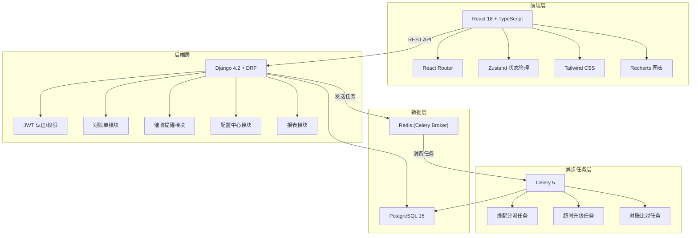
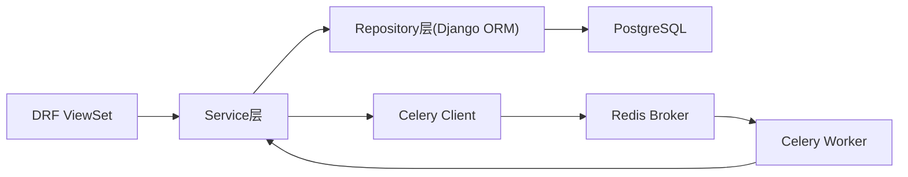
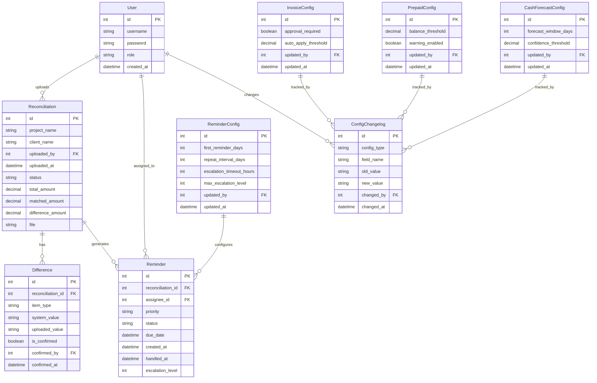

## 1. 架构设计



## 2. 技术说明
- 前端：React@18 + TypeScript + Vite + Tailwind CSS@3 + Zustand + Recharts
- 后端：Django@4.2 + Django REST Framework + PostgreSQL@15
- 异步任务：Celery@5 + Redis (Broker)
- 认证：JWT (djangorestframework-simplejwt)
- 文件处理：openpyxl (Excel解析)
- 初始化工具：Vite (前端), django-admin startproject (后端)

## 3. 路由定义
| 路由 | 用途 |
|------|------|
| / | 对账台首页 - 逾期概览 |
| /reconciliation | 对账单管理 - 上传与差异确认 |
| /reconciliation/upload | 对账单上传页 |
| /reconciliation/:id | 差异对比详情页 |
| /reminders | 催收管理 - 提醒分派与升级 |
| /reminders/config | 催收节奏配置页 |
| /config | 配置中心 - 发票/预存/现金预测 |
| /config/changelog | 变更日志页 |
| /reports | 明细报表 - 逾期/不匹配/处理记录 |
| /login | 登录页 |

## 4. API定义

### 4.1 认证
```
POST /api/auth/login/          → { access, refresh }
POST /api/auth/refresh/        → { access }
GET  /api/auth/me/             → { id, username, role }
```

### 4.2 对账单
```
GET    /api/reconciliations/              → 对账单列表(分页)
POST   /api/reconciliations/              → 创建对账单(含文件上传)
GET    /api/reconciliations/{id}/          → 对账单详情含差异
POST   /api/reconciliations/{id}/confirm/  → 确认差异
POST   /api/reconciliations/{id}/reject/   → 驳回差异
GET    /api/reconciliations/{id}/differences/ → 差异明细
```

### 4.3 催收提醒
```
GET    /api/reminders/                     → 提醒列表(可按负责人筛选)
GET    /api/reminders/{id}/                → 提醒详情
POST   /api/reminders/{id}/handle/         → 处理提醒
GET    /api/reminders/escalations/         → 升级记录
GET    /api/reminders/config/              → 催收节奏配置
PUT    /api/reminders/config/              → 更新催收节奏
```

### 4.4 配置中心
```
GET    /api/configs/invoice/               → 发票申请配置
PUT    /api/configs/invoice/               → 更新发票配置
GET    /api/configs/prepaid/               → 预存余额配置
PUT    /api/configs/prepaid/               → 更新预存配置
GET    /api/configs/cash-forecast/         → 现金预测配置
PUT    /api/configs/cash-forecast/         → 更新现金预测配置
GET    /api/configs/changelog/             → 变更日志(分页)
```

### 4.5 报表
```
GET    /api/reports/overdue/               → 逾期金额明细
GET    /api/reports/mismatches/            → 流水不匹配记录
GET    /api/reports/last-actions/          → 最后处理记录
GET    /api/reports/overdue/export/        → 导出逾期明细Excel
GET    /api/reports/mismatches/export/     → 导出不匹配记录Excel
```

### 4.6 TypeScript类型定义
```typescript
interface User {
  id: number;
  username: string;
  role: 'admin' | 'project_manager' | 'finance';
}

interface Reconciliation {
  id: number;
  project_name: string;
  client_name: string;
  uploaded_by: number;
  uploaded_at: string;
  status: 'pending' | 'compared' | 'confirmed' | 'rejected';
  total_amount: number;
  matched_amount: number;
  difference_amount: number;
  file: string;
}

interface Difference {
  id: number;
  reconciliation: number;
  item_type: 'amount' | 'date' | 'missing';
  system_value: string;
  uploaded_value: string;
  is_confirmed: boolean | null;
  confirmed_by: number | null;
  confirmed_at: string | null;
}

interface Reminder {
  id: number;
  reconciliation: number;
  assignee: number;
  assignee_name: string;
  priority: 'high' | 'medium' | 'low';
  status: 'pending' | 'handled' | 'escalated';
  due_date: string;
  created_at: string;
  handled_at: string | null;
  escalation_level: number;
}

interface ReminderConfig {
  id: number;
  first_reminder_days: number;
  repeat_interval_days: number;
  escalation_timeout_hours: number;
  max_escalation_level: number;
}

interface ConfigBase {
  id: number;
  updated_by: number;
  updated_by_name: string;
  updated_at: string;
}

interface InvoiceConfig extends ConfigBase {
  approval_required: boolean;
  auto_apply_threshold: number;
}

interface PrepaidConfig extends ConfigBase {
  balance_threshold: number;
  warning_enabled: boolean;
}

interface CashForecastConfig extends ConfigBase {
  forecast_window_days: number;
  confidence_threshold: number;
}

interface ConfigChangelog {
  id: number;
  config_type: string;
  field_name: string;
  old_value: string;
  new_value: string;
  changed_by: number;
  changed_by_name: string;
  changed_at: string;
}

interface OverdueDetail {
  id: number;
  project_name: string;
  client_name: string;
  overdue_amount: number;
  overdue_days: number;
  assignee_name: string;
  last_action: string;
  last_action_at: string;
}

interface MismatchRecord {
  id: number;
  reconciliation_id: number;
  project_name: string;
  item_type: string;
  system_value: string;
  actual_value: string;
  difference: number;
}

interface DashboardStats {
  total_overdue_amount: number;
  pending_reminders_count: number;
  monthly_recovery_rate: number;
  escalation_count: number;
  overdue_trend: Array<{ date: string; amount: number }>;
}
```

## 5. 服务架构图



## 6. 数据模型

### 6.1 数据模型定义



### 6.2 数据定义语言

```sql
CREATE TABLE auth_user (
    id SERIAL PRIMARY KEY,
    username VARCHAR(150) UNIQUE NOT NULL,
    password VARCHAR(128) NOT NULL,
    role VARCHAR(20) NOT NULL DEFAULT 'project_manager',
    is_active BOOLEAN DEFAULT TRUE,
    created_at TIMESTAMP WITH TIME ZONE DEFAULT NOW()
);

CREATE TABLE reconciliations (
    id SERIAL PRIMARY KEY,
    project_name VARCHAR(200) NOT NULL,
    client_name VARCHAR(200) NOT NULL,
    uploaded_by_id INTEGER REFERENCES auth_user(id),
    uploaded_at TIMESTAMP WITH TIME ZONE DEFAULT NOW(),
    status VARCHAR(20) NOT NULL DEFAULT 'pending',
    total_amount DECIMAL(14,2) DEFAULT 0,
    matched_amount DECIMAL(14,2) DEFAULT 0,
    difference_amount DECIMAL(14,2) DEFAULT 0,
    file VARCHAR(500)
);

CREATE TABLE differences (
    id SERIAL PRIMARY KEY,
    reconciliation_id INTEGER REFERENCES reconciliations(id) ON DELETE CASCADE,
    item_type VARCHAR(20) NOT NULL,
    system_value TEXT NOT NULL,
    uploaded_value TEXT NOT NULL,
    is_confirmed BOOLEAN DEFAULT NULL,
    confirmed_by_id INTEGER REFERENCES auth_user(id),
    confirmed_at TIMESTAMP WITH TIME ZONE
);

CREATE TABLE reminders (
    id SERIAL PRIMARY KEY,
    reconciliation_id INTEGER REFERENCES reconciliations(id),
    assignee_id INTEGER REFERENCES auth_user(id),
    priority VARCHAR(10) NOT NULL DEFAULT 'medium',
    status VARCHAR(20) NOT NULL DEFAULT 'pending',
    due_date TIMESTAMP WITH TIME ZONE NOT NULL,
    created_at TIMESTAMP WITH TIME ZONE DEFAULT NOW(),
    handled_at TIMESTAMP WITH TIME ZONE,
    escalation_level INTEGER DEFAULT 0
);

CREATE TABLE reminder_configs (
    id SERIAL PRIMARY KEY,
    first_reminder_days INTEGER NOT NULL DEFAULT 3,
    repeat_interval_days INTEGER NOT NULL DEFAULT 7,
    escalation_timeout_hours INTEGER NOT NULL DEFAULT 48,
    max_escalation_level INTEGER NOT NULL DEFAULT 3,
    updated_by_id INTEGER REFERENCES auth_user(id),
    updated_at TIMESTAMP WITH TIME ZONE DEFAULT NOW()
);

CREATE TABLE invoice_configs (
    id SERIAL PRIMARY KEY,
    approval_required BOOLEAN DEFAULT TRUE,
    auto_apply_threshold DECIMAL(14,2) DEFAULT 10000,
    updated_by_id INTEGER REFERENCES auth_user(id),
    updated_at TIMESTAMP WITH TIME ZONE DEFAULT NOW()
);

CREATE TABLE prepaid_configs (
    id SERIAL PRIMARY KEY,
    balance_threshold DECIMAL(14,2) DEFAULT 50000,
    warning_enabled BOOLEAN DEFAULT TRUE,
    updated_by_id INTEGER REFERENCES auth_user(id),
    updated_at TIMESTAMP WITH TIME ZONE DEFAULT NOW()
);

CREATE TABLE cash_forecast_configs (
    id SERIAL PRIMARY KEY,
    forecast_window_days INTEGER DEFAULT 30,
    confidence_threshold DECIMAL(5,4) DEFAULT 0.8000,
    updated_by_id INTEGER REFERENCES auth_user(id),
    updated_at TIMESTAMP WITH TIME ZONE DEFAULT NOW()
);

CREATE TABLE config_changelogs (
    id SERIAL PRIMARY KEY,
    config_type VARCHAR(50) NOT NULL,
    field_name VARCHAR(100) NOT NULL,
    old_value TEXT,
    new_value TEXT,
    changed_by_id INTEGER REFERENCES auth_user(id),
    changed_at TIMESTAMP WITH TIME ZONE DEFAULT NOW()
);

CREATE INDEX idx_reconciliations_status ON reconciliations(status);
CREATE INDEX idx_reconciliations_uploaded_by ON reconciliations(uploaded_by_id);
CREATE INDEX idx_differences_reconciliation ON differences(reconciliation_id);
CREATE INDEX idx_reminders_assignee ON reminders(assignee_id);
CREATE INDEX idx_reminders_status ON reminders(status);
CREATE INDEX idx_reminders_due_date ON reminders(due_date);
CREATE INDEX idx_config_changelogs_config_type ON config_changelogs(config_type);
CREATE INDEX idx_config_changelogs_changed_at ON config_changelogs(changed_at);
```
