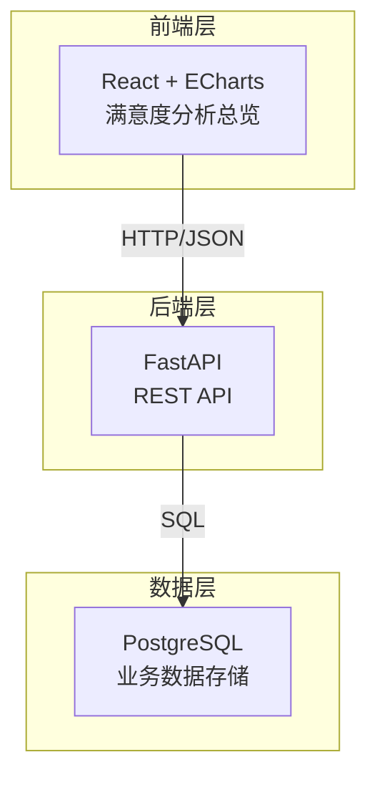
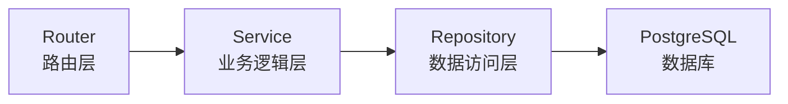
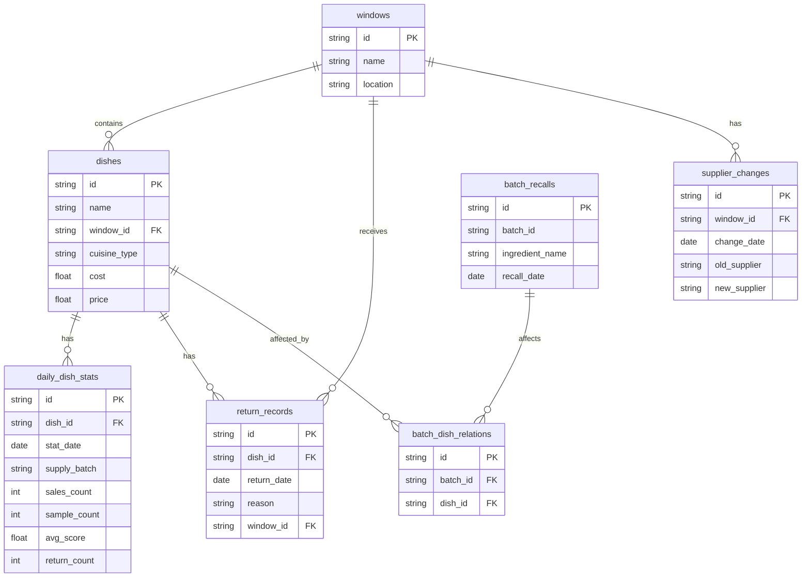

## 1. 架构设计



## 2. 技术说明
- 前端：React@18 + ECharts@5 + TailwindCSS@3 + Vite + Zustand
- 初始化工具：vite-init
- 后端：FastAPI + SQLAlchemy + Alembic + Uvicorn
- 数据库：PostgreSQL（开发阶段使用 SQLite 模拟）
- 前后端通过 REST API 通信，前端 Vite 代理转发 API 请求

## 3. 路由定义
| 路由 | 用途 |
|------|------|
| / | 满意度分析总览页（含所有图表和筛选） |

## 4. API 定义

### 4.1 数据查询接口

```typescript
interface FilterParams {
  window_id?: string;
  cuisine_type?: string;
  time_period?: string;
  cost_min?: number;
  cost_max?: number;
  supply_batch?: string;
  date_from?: string;
  date_to?: string;
}

interface DishSatisfaction {
  dish_id: string;
  dish_name: string;
  window_name: string;
  cuisine_type: string;
  avg_score: number;
  total_sales: number;
  sample_count: number;
  return_count: number;
  return_rate: number;
  cost: number;
  profit_rate: number;
  supplier_changed: boolean;
  batch_recalled: boolean;
}

interface ReturnReason {
  reason: string;
  count: number;
  ratio: number;
  details: ReturnDetail[];
}

interface ReturnDetail {
  dish_name: string;
  window_name: string;
  date: string;
  reason: string;
  count: number;
}

interface CostProfit {
  dish_id: string;
  dish_name: string;
  cost: number;
  profit_rate: number;
  sales: number;
}

interface AbnormalDish {
  dish_id: string;
  dish_name: string;
  window_name: string;
  cuisine_type: string;
  avg_score: number;
  sample_count: number;
  return_rate: number;
  cost: number;
  profit_rate: number;
  abnormal_type: string[];
  supplier_changed: boolean;
  batch_recalled: boolean;
  recall_batch_id?: string;
  supplier_change_date?: string;
}

interface SupplierChangeEvent {
  id: string;
  window_id: string;
  window_name: string;
  change_date: string;
  old_supplier: string;
  new_supplier: string;
}

interface BatchRecallEvent {
  id: string;
  batch_id: string;
  ingredient_name: string;
  recall_date: string;
  affected_dishes: string[];
}

interface ScoreTrend {
  dish_id: string;
  dish_name: string;
  dates: string[];
  scores: number[];
  supplier_change_dates: string[];
  recall_dates: string[];
}
```

### 4.2 API 端点

| 方法 | 路径 | 描述 |
|------|------|------|
| GET | /api/dishes/satisfaction | 获取菜品满意度矩阵数据 |
| GET | /api/returns/reasons | 获取退餐原因分布 |
| GET | /api/returns/details | 获取退餐原因明细（可下钻到窗口） |
| GET | /api/costs/profits | 获取成本毛利数据 |
| GET | /api/dishes/abnormal | 获取异常菜品列表 |
| GET | /api/supplier-changes | 获取供应商更换事件 |
| GET | /api/batch-recalls | 获取食材批次召回事件 |
| GET | /api/dishes/trend | 获取菜品评分趋势（含特殊标记） |
| GET | /api/filters/options | 获取筛选器选项（窗口、菜系等） |
| POST | /api/supplier-changes | 标记供应商更换 |
| POST | /api/batch-recalls | 标记食材批次召回 |
| GET | /api/reports/export | 导出报表（CSV/Excel） |

## 5. 服务端架构图



## 6. 数据模型

### 6.1 数据模型定义



### 6.2 数据定义语言

```sql
CREATE TABLE windows (
    id SERIAL PRIMARY KEY,
    name VARCHAR(100) NOT NULL,
    location VARCHAR(200)
);

CREATE TABLE dishes (
    id SERIAL PRIMARY KEY,
    name VARCHAR(200) NOT NULL,
    window_id INTEGER REFERENCES windows(id),
    cuisine_type VARCHAR(50) NOT NULL,
    cost DECIMAL(10,2) NOT NULL,
    price DECIMAL(10,2) NOT NULL
);

CREATE TABLE daily_dish_stats (
    id SERIAL PRIMARY KEY,
    dish_id INTEGER REFERENCES dishes(id),
    stat_date DATE NOT NULL,
    supply_batch VARCHAR(100),
    sales_count INTEGER DEFAULT 0,
    sample_count INTEGER DEFAULT 0,
    avg_score DECIMAL(3,2),
    return_count INTEGER DEFAULT 0,
    UNIQUE(dish_id, stat_date)
);

CREATE TABLE return_records (
    id SERIAL PRIMARY KEY,
    dish_id INTEGER REFERENCES dishes(id),
    return_date DATE NOT NULL,
    reason VARCHAR(200) NOT NULL,
    window_id INTEGER REFERENCES windows(id)
);

CREATE TABLE supplier_changes (
    id SERIAL PRIMARY KEY,
    window_id INTEGER REFERENCES windows(id),
    change_date DATE NOT NULL,
    old_supplier VARCHAR(200),
    new_supplier VARCHAR(200)
);

CREATE TABLE batch_recalls (
    id SERIAL PRIMARY KEY,
    batch_id VARCHAR(100) NOT NULL,
    ingredient_name VARCHAR(200) NOT NULL,
    recall_date DATE NOT NULL
);

CREATE TABLE batch_dish_relations (
    id SERIAL PRIMARY KEY,
    batch_id VARCHAR(100) REFERENCES batch_recalls(batch_id),
    dish_id INTEGER REFERENCES dishes(id)
);

CREATE INDEX idx_dishes_window ON dishes(window_id);
CREATE INDEX idx_daily_stats_dish_date ON daily_dish_stats(dish_id, stat_date);
CREATE INDEX idx_return_records_dish ON return_records(dish_id);
CREATE INDEX idx_return_records_window_date ON return_records(window_id, return_date);
CREATE INDEX idx_supplier_changes_window ON supplier_changes(window_id);
CREATE INDEX idx_batch_dish_batch ON batch_dish_relations(batch_id);
```
