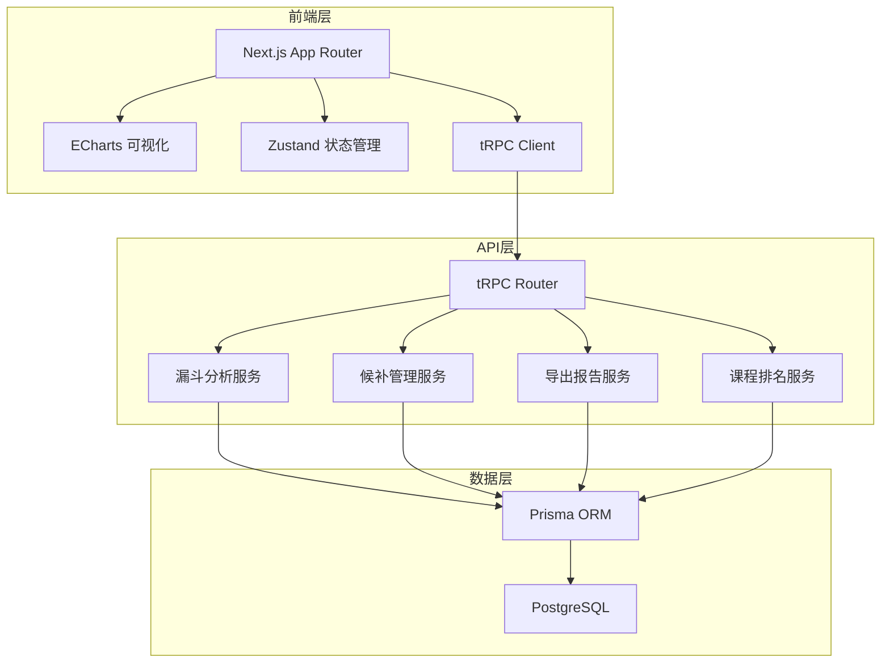
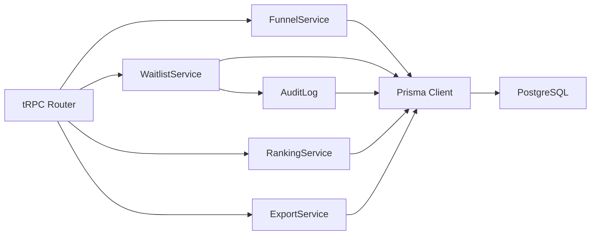

## 1. 架构设计



## 2. 技术说明

- 前端：Next.js 14 (App Router) + TailwindCSS + ECharts + Zustand
- API层：tRPC (Next.js API Routes 集成)
- 数据库：PostgreSQL + Prisma ORM
- 初始化工具：create-next-app
- 导出：xlsx 库生成 Excel 报告
- 认证：NextAuth.js (简易认证)

## 3. 路由定义

| 路由 | 用途 |
|------|------|
| / | 首页重定向到看板 |
| /dashboard | 漏斗看板主页 |
| /waitlist | 候补管理页面 |
| /ranking | 课程排名页面 |
| /export | 导出报告页面 |

## 4. API 定义

### 4.1 漏斗分析 API

```typescript
type FunnelStage = "browse" | "inquiry" | "enroll" | "waitlist" | "converted" | "refund"

type FunnelFilter = {
  campusIds?: string[]
  courseIds?: string[]
  ageGroups?: string[]
  channels?: string[]
  dateRange?: { start: Date; end: Date }
}

type FunnelData = {
  stage: FunnelStage
  label: string
  count: number
  rate: number
}

type FunnelResponse = {
  data: FunnelData[]
  drilldown: {
    dimension: "campus" | "course" | "ageGroup" | "channel"
    items: { key: string; label: string; data: FunnelData[] }[]
  }[]
}

// tRPC procedures
interface FunnelRouter {
  getFunnel: Procedure<{ input: FunnelFilter; output: FunnelResponse }>
  getTrend: Procedure<{ input: FunnelFilter & { granularity: "day" | "week" | "month" }; output: TrendData[] }>
  getMetrics: Procedure<{ input: FunnelFilter; output: MetricsData }>
}
```

### 4.2 候补管理 API

```typescript
type WaitlistEntry = {
  id: string
  studentId: string
  studentName: string
  isMinor: boolean
  courseId: string
  courseName: string
  originalEnrollTime: Date
  waitDays: number
  position: number
  status: "waiting" | "converted" | "cancelled"
  sourceChannel: string
  ageGroup: string
}

type AdjustRequest = {
  entryId: string
  newPosition: number
  reason: string
}

type AdjustRecord = {
  id: string
  entryId: string
  oldPosition: number
  newPosition: number
  reason: string
  operator: string
  createdAt: Date
}

interface WaitlistRouter {
  list: Procedure<{ input: { courseId: string; filters?: FunnelFilter }; output: WaitlistEntry[] }>
  adjust: Procedure<{ input: AdjustRequest; output: WaitlistEntry }>
  convert: Procedure<{ input: { entryId: string }; output: WaitlistEntry }>
  history: Procedure<{ input: { courseId: string }; output: AdjustRecord[] }>
}
```

### 4.3 课程排名 API

```typescript
type CourseRanking = {
  courseId: string
  courseName: string
  campusName: string
  waitlistCount: number
  convertedCount: number
  conversionRate: number
  avgWaitDays: number
  classCapacity: number
  suggestion: "urgent" | "recommended" | "normal"
  lowSample: boolean
}

interface RankingRouter {
  list: Procedure<{ input: FunnelFilter & { sortBy: "waitlist" | "conversionRate" | "waitDays" }; output: CourseRanking[] }>
}
```

### 4.4 导出 API

```typescript
type ExportConfig = {
  type: "funnel" | "waitlist" | "ranking" | "adjustHistory"
  filters: FunnelFilter
  includeAdjustDiff: boolean
  format: "xlsx" | "csv"
}

interface ExportRouter {
  generate: Procedure<{ input: ExportConfig; output: { downloadUrl: string } }>
}
```

## 5. 服务端架构图



## 6. 数据模型

### 6.1 数据模型定义

```mermaid
erDiagram
    Campus {
        String id PK
        String name
        String city
        DateTime createdAt
    }
    Course {
        String id PK
        String name
        String ageGroup
        Int capacity
        String campusId FK
        DateTime createdAt
    }
    Class {
        String id PK
        String name
        String courseId FK
        String campusId FK
        Int capacity
        Int enrolledCount
        String status
        DateTime startDate
    }
    Student {
        String id PK
        String name
        Boolean isMinor
        String ageGroup
        String phone
        DateTime birthDate
        DateTime createdAt
    }
    Enrollment {
        String id PK
        String studentId FK
        String courseId FK
        String classId FK
        String campusId FK
        String channel
        String status
        DateTime enrollTime
        DateTime convertedTime
        Boolean isDuplicate
        DateTime createdAt
    }
    WaitlistEntry {
        String id PK
        String studentId FK
        String courseId FK
        String campusId FK
        Int position
        String status
        String channel
        DateTime originalEnrollTime
        DateTime convertedTime
        Int waitDays
        DateTime createdAt
    }
    WaitlistAdjustLog {
        String id PK
        String entryId FK
        String operatorId FK
        Int oldPosition
        Int newPosition
        String reason
        DateTime createdAt
    }
    RefundRecord {
        String id PK
        String enrollmentId FK
        String studentId FK
        String courseId FK
        String reason
        String category
        Decimal amount
        DateTime refundTime
        DateTime createdAt
    }
    User {
        String id PK
        String name
        String email
        String role
        String campusId FK
        DateTime createdAt
    }
    Campus ||--o{ Course : "has"
    Campus ||--o{ Class : "has"
    Course ||--o{ Class : "has"
    Campus ||--o{ Enrollment : "has"
    Course ||--o{ Enrollment : "has"
    Class ||--o{ Enrollment : "has"
    Student ||--o{ Enrollment : "has"
    Student ||--o{ WaitlistEntry : "has"
    Course ||--o{ WaitlistEntry : "has"
    Campus ||--o{ WaitlistEntry : "has"
    WaitlistEntry ||--o{ WaitlistAdjustLog : "has"
    User ||--o{ WaitlistAdjustLog : "operates"
    Enrollment ||--o{ RefundRecord : "has"
    Student ||--o{ RefundRecord : "has"
    Course ||--o{ RefundRecord : "has"
```

### 6.2 数据定义语言

```sql
CREATE TABLE "Campus" (
  "id" TEXT PRIMARY KEY DEFAULT gen_random_uuid(),
  "name" TEXT NOT NULL,
  "city" TEXT NOT NULL,
  "createdAt" TIMESTAMP NOT NULL DEFAULT NOW()
);

CREATE TABLE "Course" (
  "id" TEXT PRIMARY KEY DEFAULT gen_random_uuid(),
  "name" TEXT NOT NULL,
  "ageGroup" TEXT NOT NULL,
  "capacity" INTEGER NOT NULL DEFAULT 20,
  "campusId" TEXT NOT NULL REFERENCES "Campus"("id"),
  "createdAt" TIMESTAMP NOT NULL DEFAULT NOW()
);

CREATE TABLE "Class" (
  "id" TEXT PRIMARY KEY DEFAULT gen_random_uuid(),
  "name" TEXT NOT NULL,
  "courseId" TEXT NOT NULL REFERENCES "Course"("id"),
  "campusId" TEXT NOT NULL REFERENCES "Campus"("id"),
  "capacity" INTEGER NOT NULL DEFAULT 20,
  "enrolledCount" INTEGER NOT NULL DEFAULT 0,
  "status" TEXT NOT NULL DEFAULT 'active',
  "startDate" TIMESTAMP,
  "createdAt" TIMESTAMP NOT NULL DEFAULT NOW()
);

CREATE TABLE "Student" (
  "id" TEXT PRIMARY KEY DEFAULT gen_random_uuid(),
  "name" TEXT NOT NULL,
  "isMinor" BOOLEAN NOT NULL DEFAULT false,
  "ageGroup" TEXT NOT NULL,
  "phone" TEXT,
  "birthDate" TIMESTAMP,
  "createdAt" TIMESTAMP NOT NULL DEFAULT NOW()
);

CREATE TABLE "Enrollment" (
  "id" TEXT PRIMARY KEY DEFAULT gen_random_uuid(),
  "studentId" TEXT NOT NULL REFERENCES "Student"("id"),
  "courseId" TEXT NOT NULL REFERENCES "Course"("id"),
  "classId" TEXT REFERENCES "Class"("id"),
  "campusId" TEXT NOT NULL REFERENCES "Campus"("id"),
  "channel" TEXT NOT NULL,
  "status" TEXT NOT NULL DEFAULT 'enrolled',
  "enrollTime" TIMESTAMP NOT NULL DEFAULT NOW(),
  "convertedTime" TIMESTAMP,
  "isDuplicate" BOOLEAN NOT NULL DEFAULT false,
  "createdAt" TIMESTAMP NOT NULL DEFAULT NOW()
);

CREATE TABLE "WaitlistEntry" (
  "id" TEXT PRIMARY KEY DEFAULT gen_random_uuid(),
  "studentId" TEXT NOT NULL REFERENCES "Student"("id"),
  "courseId" TEXT NOT NULL REFERENCES "Course"("id"),
  "campusId" TEXT NOT NULL REFERENCES "Campus"("id"),
  "position" INTEGER NOT NULL,
  "status" TEXT NOT NULL DEFAULT 'waiting',
  "channel" TEXT NOT NULL,
  "originalEnrollTime" TIMESTAMP NOT NULL,
  "convertedTime" TIMESTAMP,
  "waitDays" INTEGER,
  "createdAt" TIMESTAMP NOT NULL DEFAULT NOW()
);

CREATE TABLE "WaitlistAdjustLog" (
  "id" TEXT PRIMARY KEY DEFAULT gen_random_uuid(),
  "entryId" TEXT NOT NULL REFERENCES "WaitlistEntry"("id"),
  "operatorId" TEXT NOT NULL REFERENCES "User"("id"),
  "oldPosition" INTEGER NOT NULL,
  "newPosition" INTEGER NOT NULL,
  "reason" TEXT NOT NULL,
  "createdAt" TIMESTAMP NOT NULL DEFAULT NOW()
);

CREATE TABLE "RefundRecord" (
  "id" TEXT PRIMARY KEY DEFAULT gen_random_uuid(),
  "enrollmentId" TEXT NOT NULL REFERENCES "Enrollment"("id"),
  "studentId" TEXT NOT NULL REFERENCES "Student"("id"),
  "courseId" TEXT NOT NULL REFERENCES "Course"("id"),
  "reason" TEXT NOT NULL,
  "category" TEXT NOT NULL,
  "amount" DECIMAL(10,2) NOT NULL,
  "refundTime" TIMESTAMP NOT NULL DEFAULT NOW(),
  "createdAt" TIMESTAMP NOT NULL DEFAULT NOW()
);

CREATE TABLE "User" (
  "id" TEXT PRIMARY KEY DEFAULT gen_random_uuid(),
  "name" TEXT NOT NULL,
  "email" TEXT NOT NULL UNIQUE,
  "role" TEXT NOT NULL DEFAULT 'staff',
  "campusId" TEXT REFERENCES "Campus"("id"),
  "createdAt" TIMESTAMP NOT NULL DEFAULT NOW()
);

CREATE INDEX "idx_enrollment_course" ON "Enrollment"("courseId");
CREATE INDEX "idx_enrollment_campus" ON "Enrollment"("campusId");
CREATE INDEX "idx_enrollment_status" ON "Enrollment"("status");
CREATE INDEX "idx_enrollment_channel" ON "Enrollment"("channel");
CREATE INDEX "idx_enroll_time" ON "Enrollment"("enrollTime");
CREATE INDEX "idx_waitlist_course" ON "WaitlistEntry"("courseId");
CREATE INDEX "idx_waitlist_campus" ON "WaitlistEntry"("campusId");
CREATE INDEX "idx_waitlist_status" ON "WaitlistEntry"("status");
CREATE INDEX "idx_waitlist_position" ON "WaitlistEntry"("courseId", "position");
CREATE INDEX "idx_adjust_entry" ON "WaitlistAdjustLog"("entryId");
CREATE INDEX "idx_refund_enrollment" ON "RefundRecord"("enrollmentId");
CREATE INDEX "idx_student_minor" ON "Student"("isMinor");
```
