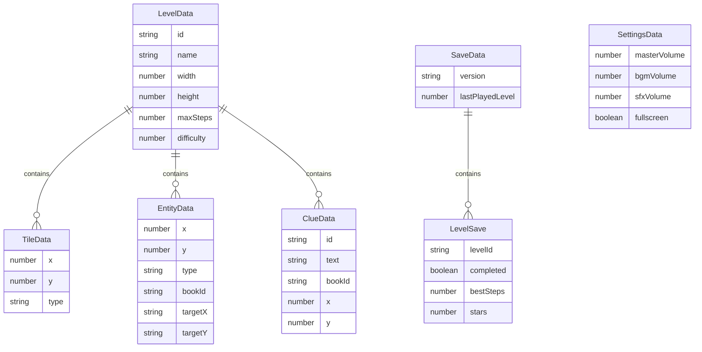

## 1. 架构设计

```mermaid
flowchart TB
    subgraph "前端 (Phaser 3 + TypeScript + Vite)"
        "场景管理器(Phaser Scene)" --> "主菜单场景"
        "场景管理器(Phaser Scene)" --> "教程场景"
        "场景管理器(Phaser Scene)" --> "关卡选择场景"
        "场景管理器(Phaser Scene)" --> "游戏主场景"
        "场景管理器(Phaser Scene)" --> "暂停场景(Overlay)"
        "场景管理器(Phaser Scene)" --> "设置场景"
        "场景管理器(Phaser Scene)" --> "结算场景"
        "场景管理器(Phaser Scene)" --> "关卡编辑器场景"
        "场景管理器(Phaser Scene)" --> "调试日志场景"
    end

    subgraph "系统层"
        "关卡数据系统" --> "JSON关卡文件"
        "存档系统" --> "localStorage"
        "音效系统" --> "Phaser Audio"
        "输入系统" --> "键盘 + 手柄(Phaser Input)"
    end

    "游戏主场景" --> "推箱子逻辑"
    "游戏主场景" --> "线索系统"
    "游戏主场景" --> "限步系统"
    "游戏主场景" --> "索引卡修复"
    "关卡编辑器场景" --> "关卡数据系统"
```

## 2. 技术说明

- **前端框架**: Phaser 3.80+ (2D游戏引擎)
- **开发语言**: TypeScript 5.x
- **构建工具**: Vite 5.x
- **状态管理**: 自定义全局 GameRegistry（基于 Phaser 的 Registry / DataManager）
- **存档**: localStorage（JSON序列化）
- **音效**: Phaser 内置 Audio 系统，Web Audio API
- **输入**: Phaser Input Plugin（键盘 + Gamepad API）
- **无后端**: 纯前端项目，关卡数据为 JSON 文件

## 3. 路由定义

本项目为游戏，使用 Phaser 场景(Scene)而非 URL 路由：

| 场景Key | 用途 |
|---------|------|
| BootScene | 资源预加载、初始化配置 |
| MainMenuScene | 主菜单界面 |
| TutorialScene | 教程引导与练习 |
| LevelSelectScene | 关卡选择列表 |
| GameScene | 核心游戏玩法 |
| PauseScene | 暂停覆盖层(并发运行) |
| SettingsScene | 音量/显示设置 |
| ResultScene | 关卡结算(成功/失败) |
| EditorScene | 关卡编辑器 |
| DebugScene | 调试日志查看 |

## 4. API定义

无后端API。数据交互通过以下方式：

- **关卡数据**: `src/data/levels/` 目录下 JSON 文件，Vite import
- **存档数据**: localStorage 读写，key: `nightbookstore_save`
- **编辑器导出**: JSON 文本输出到剪贴板

## 5. 服务器架构图

不适用（纯前端项目）

## 6. 数据模型

### 6.1 数据模型定义



### 6.2 数据定义

#### 关卡数据结构 (LevelData JSON)

```typescript
interface LevelData {
  id: string;
  name: string;
  width: number;
  height: number;
  maxSteps: number;
  difficulty: number;
  tiles: TileData[];
  entities: EntityData[];
  clues: ClueData[];
  playerStart: { x: number; y: number };
}

interface TileData {
  x: number;
  y: number;
  type: 'floor' | 'wall' | 'shelf_slot' | 'index_stand';
}

interface EntityData {
  x: number;
  y: number;
  type: 'bookshelf' | 'book' | 'index_card' | 'clue_item';
  bookId?: string;
  targetX?: number;
  targetY?: number;
  isMisplaced?: boolean;
}

interface ClueData {
  id: string;
  text: string;
  bookId: string;
  x: number;
  y: number;
}
```

#### 存档数据结构 (SaveData)

```typescript
interface SaveData {
  version: string;
  lastPlayedLevel: number;
  levels: Record<string, LevelSave>;
}

interface LevelSave {
  levelId: string;
  completed: boolean;
  bestSteps: number;
  stars: number;
}
```

#### 设置数据结构 (SettingsData)

```typescript
interface SettingsData {
  masterVolume: number;
  bgmVolume: number;
  sfxVolume: number;
  fullscreen: boolean;
}
```

#### 项目目录结构

```
src/
  scenes/           # Phaser场景
    BootScene.ts
    MainMenuScene.ts
    TutorialScene.ts
    LevelSelectScene.ts
    GameScene.ts
    PauseScene.ts
    SettingsScene.ts
    ResultScene.ts
    EditorScene.ts
    DebugScene.ts
  systems/          # 游戏系统
    GridSystem.ts
    PushSystem.ts
    ClueSystem.ts
    StepSystem.ts
    IndexCardSystem.ts
    SaveSystem.ts
    AudioSystem.ts
    InputSystem.ts
  data/             # 关卡数据
    levels/
      level_01.json
      level_02.json
      level_03.json
      tutorial_01.json
  config/
    GameConfig.ts
  types/
    index.ts
  main.ts           # 入口
public/
  assets/
    sprites/
    audio/
    ui/
```
