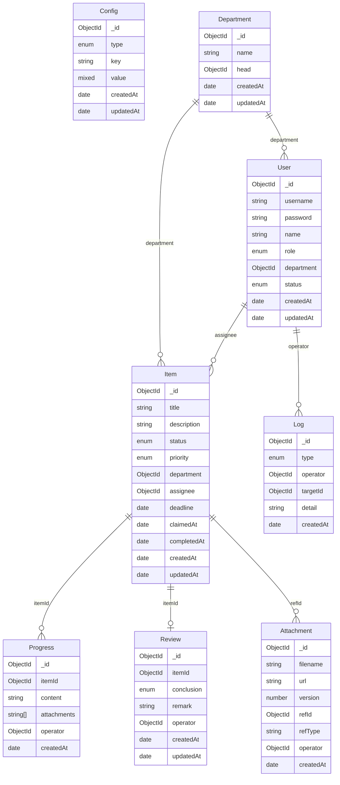

## 1. 架构设计

```mermaid
graph TB
    subgraph "前端层"
        "Vue 3 + Vite" --> "Vue Router"
        "Vue 3 + Vite" --> "Pinia"
        "Vue 3 + Vite" --> "Tailwind CSS"
    end
    subgraph "后端层"
        "NestJS" --> "AuthModule"
        "NestJS" --> "ItemModule"
        "NestJS" --> "ReviewModule"
        "NestJS" --> "ConfigModule"
        "NestJS" --> "UserModule"
        "NestJS" --> "LogModule"
    end
    subgraph "数据层"
        "MongoDB" --> "items"
        "MongoDB" --> "users"
        "MongoDB" --> "reviews"
        "MongoDB" --> "configs"
        "MongoDB" --> "logs"
        "MongoDB" --> "attachments"
        "Redis" --> "session"
        "Redis" --> "overdue_cache"
    end
    "Vue 3 + Vite" -->|"HTTP/REST"| "NestJS"
    "NestJS" --> "MongoDB"
    "NestJS" --> "Redis"
```

## 2. 技术说明

- 前端：Vue 3 + Vite + TypeScript + Tailwind CSS + Vue Router + Pinia
- 后端：NestJS + TypeScript（ESM 格式）
- 数据库：MongoDB（Mongoose ODM）
- 缓存：Redis（ioredis）
- 认证：JWT（access_token + refresh_token）
- 初始化工具：vite-init（vue-ts 模板）

## 3. 路由定义

| 路由 | 用途 | 权限 |
|------|------|------|
| /login | 登录页 | 公开 |
| / | 首页 - 待办看板与异常明细 | PM + 管理员 |
| /items | 事项管理 - 列表页 | PM + 管理员 |
| /items/:id | 事项详情页 | PM + 管理员 |
| /operations | 运营后台 - 复盘与统计 | 管理员 |
| /settings | 配置页 - 开关/模板/部门/附件 | 管理员 |
| /users | 用户管理 - 账号管理 | 管理员 |

## 4. API 定义

### 4.1 认证相关

```typescript
POST   /api/auth/login          { username, password } → { access_token, refresh_token, user }
POST   /api/auth/refresh        { refresh_token }      → { access_token }
GET    /api/auth/profile        -                      → { user }
```

### 4.2 事项相关

```typescript
GET    /api/items               ?status=&department=&assignee=&keyword=&page=&limit= → { list, total }
GET    /api/items/:id           -                      → { item, progressTimeline, attachments }
POST   /api/items               { title, description, department, deadline, priority } → { item }
PATCH  /api/items/:id           { title?, description?, department?, deadline?, priority?, status? } → { item }
POST   /api/items/:id/claim     -                      → { item }
POST   /api/items/:id/progress  { content, attachments? } → { progress }
```

### 4.3 复盘相关

```typescript
GET    /api/reviews             ?itemId=&conclusion=&page=&limit= → { list, total }
POST   /api/reviews             { itemId, conclusion, remark } → { review }
PATCH  /api/reviews/:id         { conclusion?, remark? } → { review }
GET    /api/reviews/statistics  ?department=&startDate=&endDate= → { departmentStats, overdueTrend }
```

### 4.4 配置相关

```typescript
GET    /api/configs             -                      → { switches, reviewTemplates, departments }
PATCH  /api/configs/switches    { key, value }         → { config }
POST   /api/configs/departments { name, head }         → { department }
PATCH  /api/configs/departments/:id { name?, head? }   → { department }
DELETE /api/configs/departments/:id -                   → { success }
GET    /api/configs/attachments ?refId=&refType=       → { list }
POST   /api/configs/attachments { file, refId, refType } → { attachment }
GET    /api/configs/changelog   ?page=&limit=          → { list, total }
```

### 4.5 用户管理

```typescript
GET    /api/users              ?role=&keyword=&page=&limit= → { list, total }
POST   /api/users              { username, password, name, role, department } → { user }
PATCH  /api/users/:id          { name?, role?, department?, status? } → { user }
DELETE /api/users/:id           -                       → { success }
```

### 4.6 操作日志

```typescript
GET    /api/logs               ?type=&operatorId=&itemId=&startDate=&endDate=&page=&limit= → { list, total }
```

## 5. 服务端架构图

```mermaid
graph LR
    "AuthController" --> "AuthService" --> "UserModel"
    "ItemController" --> "ItemService" --> "ItemModel"
    "ItemController" --> "ItemService" --> "LogService"
    "ReviewController" --> "ReviewService" --> "ReviewModel"
    "ConfigController" --> "ConfigService" --> "ConfigModel"
    "ConfigController" --> "ConfigService" --> "LogService"
    "UserController" --> "UserService" --> "UserModel"
    "LogController" --> "LogService" --> "LogModel"
```

## 6. 数据模型

### 6.1 数据模型定义



### 6.2 数据定义

#### User 集合
```javascript
{
  _id: ObjectId,
  username: String,       // 唯一索引
  password: String,       // bcrypt 加密
  name: String,
  role: { type: String, enum: ['pm', 'admin'] },
  department: { type: ObjectId, ref: 'Department' },
  status: { type: String, enum: ['active', 'disabled'], default: 'active' },
  createdAt: Date,
  updatedAt: Date
}
```

#### Item 集合
```javascript
{
  _id: ObjectId,
  title: String,
  description: String,
  status: { type: String, enum: ['pending', 'in_progress', 'completed', 'overdue', 'archived'], default: 'pending' },
  priority: { type: String, enum: ['low', 'medium', 'high', 'urgent'], default: 'medium' },
  department: { type: ObjectId, ref: 'Department' },
  assignee: { type: ObjectId, ref: 'User' },
  deadline: Date,
  claimedAt: Date,
  completedAt: Date,
  createdAt: Date,
  updatedAt: Date
}
// 索引：status, department, assignee, deadline, createdAt
```

#### Progress 集合
```javascript
{
  _id: ObjectId,
  itemId: { type: ObjectId, ref: 'Item', index: true },
  content: String,
  attachments: [String],
  operator: { type: ObjectId, ref: 'User' },
  createdAt: Date
}
```

#### Review 集合
```javascript
{
  _id: ObjectId,
  itemId: { type: ObjectId, ref: 'Item', unique: true },
  conclusion: { type: String, enum: ['completed', 'partial', 'incomplete', 'escalated'] },
  remark: String,
  operator: { type: ObjectId, ref: 'User' },
  createdAt: Date,
  updatedAt: Date
}
```

#### Config 集合
```javascript
{
  _id: ObjectId,
  type: { type: String, enum: ['switch', 'review_template', 'system'] },
  key: String,            // 唯一索引
  value: mongoose.Schema.Types.Mixed,
  createdAt: Date,
  updatedAt: Date
}
// 预置数据：overdue_alert(开关)、auto_remind(开关)、review_templates(结论模板)
```

#### Department 集合
```javascript
{
  _id: ObjectId,
  name: { type: String, unique: true },
  head: { type: ObjectId, ref: 'User' },
  createdAt: Date,
  updatedAt: Date
}
```

#### Attachment 集合
```javascript
{
  _id: ObjectId,
  filename: String,
  url: String,
  version: { type: Number, default: 1 },
  refId: ObjectId,
  refType: { type: String, enum: ['item', 'config'] },
  operator: { type: ObjectId, ref: 'User' },
  createdAt: Date
}
// 索引：refId + refType
```

#### Log 集合
```javascript
{
  _id: ObjectId,
  type: { type: String, enum: ['claim', 'progress', 'review', 'config_change', 'overdue_mark', 'user_action'] },
  operator: { type: ObjectId, ref: 'User' },
  targetId: ObjectId,
  detail: {
    field: String,
    oldValue: mongoose.Schema.Types.Mixed,
    newValue: mongoose.Schema.Types.Mixed
  },
  createdAt: Date
}
// 索引：type, operator, targetId, createdAt
```
