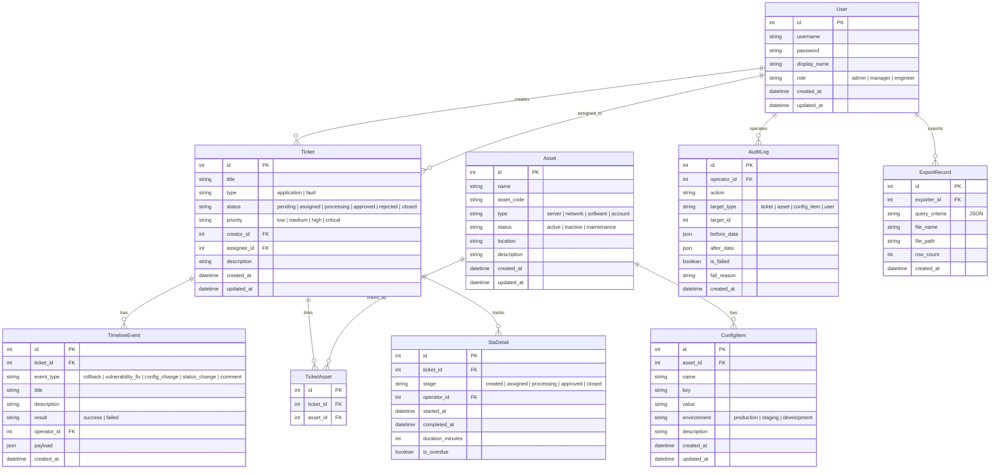

## 1. 架构设计

```mermaid
graph TB
    subgraph "前端层"
        "React + Vite + TailwindCSS"
        "Zustand 状态管理"
        "React Router 路由"
    end
    subgraph "后端层"
        "NestJS API 服务"
        "Guard 守卫 - 角色鉴权"
        "Interceptor 拦截器 - 日志记录"
        "Module 模块化架构"
    end
    subgraph "数据层"
        "PostgreSQL 数据库"
        "TypeORM ORM"
        "Migration 迁移"
    end
    "React + Vite + TailwindCSS" --> "NestJS API 服务"
    "NestJS API 服务" --> "PostgreSQL 数据库"
    "Guard 守卫 - 角色鉴权" --> "NestJS API 服务"
    "Interceptor 拦截器 - 日志记录" --> "NestJS API 服务"
```

## 2. 技术说明
- 前端：React@18 + TailwindCSS@3 + Vite + Zustand + React Router
- 初始化工具：Vite Init (react-express-ts 模板，后端替换为 NestJS)
- 后端：NestJS + TypeORM
- 数据库：PostgreSQL
- 认证：JWT Token
- 前后端共享类型：shared/ 目录

## 3. 路由定义
| 路由 | 用途 |
|------|------|
| /login | 登录页 |
| /dashboard | 工作台首页，展示待办工单和统计数据 |
| /tickets | 工单列表页 |
| /tickets/create | 提交工单页 |
| /tickets/:id | 工单详情页（含变更时间线） |
| /assets | 资产列表页 |
| /assets/:id | 资产详情页 |
| /config-items | 配置项管理页 |
| /users | 用户管理页（管理员） |
| /audit-logs | 审计日志页 |
| /sla | 处理时效明细页 |
| /exports | 导出中心页 |

## 4. API 定义

### 4.1 认证相关
```typescript
POST   /api/auth/login          { username, password } => { token, user }
GET    /api/auth/profile        {} => User
```

### 4.2 工单相关
```typescript
GET    /api/tickets             { type?, status?, assignee?, page, limit } => { items: Ticket[], total }
GET    /api/tickets/:id         {} => TicketDetail
POST   /api/tickets             CreateTicketDto => Ticket
PATCH  /api/tickets/:id         UpdateTicketDto => Ticket
POST   /api/tickets/:id/assign  { assigneeId } => Ticket
POST   /api/tickets/:id/approve { comment } => Ticket
POST   /api/tickets/:id/reject  { comment } => Ticket
```

### 4.3 资产相关
```typescript
GET    /api/assets              { keyword?, status?, type?, page, limit } => { items: Asset[], total }
GET    /api/assets/:id          {} => AssetDetail
POST   /api/assets              CreateAssetDto => Asset
PATCH  /api/assets/:id          UpdateAssetDto => Asset
DELETE /api/assets/:id          {} => void
```

### 4.4 配置项相关
```typescript
GET    /api/config-items        { assetId?, keyword?, page, limit } => { items: ConfigItem[], total }
GET    /api/config-items/:id    {} => ConfigItem
POST   /api/config-items        CreateConfigItemDto => ConfigItem
PATCH  /api/config-items/:id    UpdateConfigItemDto => ConfigItem
DELETE /api/config-items/:id    {} => void
```

### 4.5 变更时间线
```typescript
GET    /api/tickets/:id/timeline  {} => TimelineEvent[]
POST   /api/tickets/:id/timeline  CreateTimelineEventDto => TimelineEvent
```

### 4.6 审计日志
```typescript
GET    /api/audit-logs           { operatorId?, type?, startDate?, endDate?, page, limit } => { items: AuditLog[], total }
```

### 4.7 处理时效
```typescript
GET    /api/sla/stats            { startDate?, endDate? } => SlaStats
GET    /api/sla/details          { ticketId?, page, limit } => { items: SlaDetail[], total }
```

### 4.8 导出
```typescript
POST   /api/exports              ExportQueryDto => ExportRecord
GET    /api/exports              { page, limit } => { items: ExportRecord[], total }
GET    /api/exports/:id/download  {} => File
```

### 4.9 用户管理
```typescript
GET    /api/users               { keyword?, role?, page, limit } => { items: User[], total }
POST   /api/users               CreateUserDto => User
PATCH  /api/users/:id           UpdateUserDto => User
DELETE /api/users/:id           {} => void
```

## 5. 服务端架构图

```mermaid
graph LR
    "AuthController" --> "AuthService"
    "TicketController" --> "TicketService"
    "AssetController" --> "AssetService"
    "ConfigItemController" --> "ConfigItemService"
    "AuditLogController" --> "AuditLogService"
    "SlaController" --> "SlaService"
    "ExportController" --> "ExportService"
    "UserController" --> "UserService"
    "AuthService" --> "UserRepository"
    "TicketService" --> "TicketRepository"
    "TicketService" --> "TimelineEventRepository"
    "AssetService" --> "AssetRepository"
    "ConfigItemService" --> "ConfigItemRepository"
    "AuditLogService" --> "AuditLogRepository"
    "SlaService" --> "SlaDetailRepository"
    "ExportService" --> "ExportRecordRepository"
    "UserService" --> "UserRepository"
    "UserRepository" --> "PostgreSQL"
    "TicketRepository" --> "PostgreSQL"
    "TimelineEventRepository" --> "PostgreSQL"
    "AssetRepository" --> "PostgreSQL"
    "ConfigItemRepository" --> "PostgreSQL"
    "AuditLogRepository" --> "PostgreSQL"
    "SlaDetailRepository" --> "PostgreSQL"
    "ExportRecordRepository" --> "PostgreSQL"
```

## 6. 数据模型

### 6.1 数据模型定义



### 6.2 数据定义语言

```sql
CREATE TABLE "user" (
    id SERIAL PRIMARY KEY,
    username VARCHAR(100) NOT NULL UNIQUE,
    password VARCHAR(255) NOT NULL,
    display_name VARCHAR(100) NOT NULL,
    role VARCHAR(20) NOT NULL DEFAULT 'engineer',
    created_at TIMESTAMP DEFAULT CURRENT_TIMESTAMP,
    updated_at TIMESTAMP DEFAULT CURRENT_TIMESTAMP
);

CREATE TABLE ticket (
    id SERIAL PRIMARY KEY,
    title VARCHAR(255) NOT NULL,
    type VARCHAR(20) NOT NULL,
    status VARCHAR(20) NOT NULL DEFAULT 'pending',
    priority VARCHAR(20) NOT NULL DEFAULT 'medium',
    creator_id INTEGER REFERENCES "user"(id),
    assignee_id INTEGER REFERENCES "user"(id),
    description TEXT,
    created_at TIMESTAMP DEFAULT CURRENT_TIMESTAMP,
    updated_at TIMESTAMP DEFAULT CURRENT_TIMESTAMP
);

CREATE TABLE timeline_event (
    id SERIAL PRIMARY KEY,
    ticket_id INTEGER REFERENCES ticket(id) ON DELETE CASCADE,
    event_type VARCHAR(30) NOT NULL,
    title VARCHAR(255) NOT NULL,
    description TEXT,
    result VARCHAR(10) NOT NULL DEFAULT 'success',
    operator_id INTEGER REFERENCES "user"(id),
    payload JSONB,
    created_at TIMESTAMP DEFAULT CURRENT_TIMESTAMP
);

CREATE TABLE asset (
    id SERIAL PRIMARY KEY,
    name VARCHAR(255) NOT NULL,
    asset_code VARCHAR(100) NOT NULL UNIQUE,
    type VARCHAR(30) NOT NULL,
    status VARCHAR(20) NOT NULL DEFAULT 'active',
    location VARCHAR(255),
    description TEXT,
    created_at TIMESTAMP DEFAULT CURRENT_TIMESTAMP,
    updated_at TIMESTAMP DEFAULT CURRENT_TIMESTAMP
);

CREATE TABLE config_item (
    id SERIAL PRIMARY KEY,
    asset_id INTEGER REFERENCES asset(id) ON DELETE CASCADE,
    name VARCHAR(255) NOT NULL,
    key VARCHAR(255) NOT NULL,
    value TEXT,
    environment VARCHAR(20) NOT NULL DEFAULT 'production',
    description TEXT,
    created_at TIMESTAMP DEFAULT CURRENT_TIMESTAMP,
    updated_at TIMESTAMP DEFAULT CURRENT_TIMESTAMP
);

CREATE TABLE ticket_asset (
    id SERIAL PRIMARY KEY,
    ticket_id INTEGER REFERENCES ticket(id) ON DELETE CASCADE,
    asset_id INTEGER REFERENCES asset(id)
);

CREATE TABLE audit_log (
    id SERIAL PRIMARY KEY,
    operator_id INTEGER REFERENCES "user"(id),
    action VARCHAR(100) NOT NULL,
    target_type VARCHAR(30) NOT NULL,
    target_id INTEGER NOT NULL,
    before_data JSONB,
    after_data JSONB,
    is_failed BOOLEAN NOT NULL DEFAULT FALSE,
    fail_reason TEXT,
    created_at TIMESTAMP DEFAULT CURRENT_TIMESTAMP
);

CREATE TABLE sla_detail (
    id SERIAL PRIMARY KEY,
    ticket_id INTEGER REFERENCES ticket(id) ON DELETE CASCADE,
    stage VARCHAR(20) NOT NULL,
    operator_id INTEGER REFERENCES "user"(id),
    started_at TIMESTAMP NOT NULL,
    completed_at TIMESTAMP,
    duration_minutes INTEGER,
    is_overdue BOOLEAN NOT NULL DEFAULT FALSE
);

CREATE TABLE export_record (
    id SERIAL PRIMARY KEY,
    exporter_id INTEGER REFERENCES "user"(id),
    query_criteria JSONB NOT NULL,
    file_name VARCHAR(255) NOT NULL,
    file_path VARCHAR(500),
    row_count INTEGER,
    created_at TIMESTAMP DEFAULT CURRENT_TIMESTAMP
);

CREATE INDEX idx_ticket_status ON ticket(status);
CREATE INDEX idx_ticket_type ON ticket(type);
CREATE INDEX idx_ticket_creator ON ticket(creator_id);
CREATE INDEX idx_ticket_assignee ON ticket(assignee_id);
CREATE INDEX idx_timeline_ticket ON timeline_event(ticket_id);
CREATE INDEX idx_asset_code ON asset(asset_code);
CREATE INDEX idx_asset_type ON asset(type);
CREATE INDEX idx_config_item_asset ON config_item(asset_id);
CREATE INDEX idx_audit_log_operator ON audit_log(operator_id);
CREATE INDEX idx_audit_log_target ON audit_log(target_type, target_id);
CREATE INDEX idx_audit_log_failed ON audit_log(is_failed);
CREATE INDEX idx_sla_ticket ON sla_detail(ticket_id);
CREATE INDEX idx_export_exporter ON export_record(exporter_id);
```
