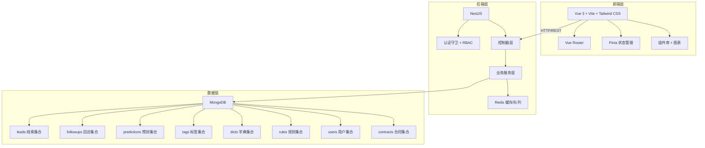
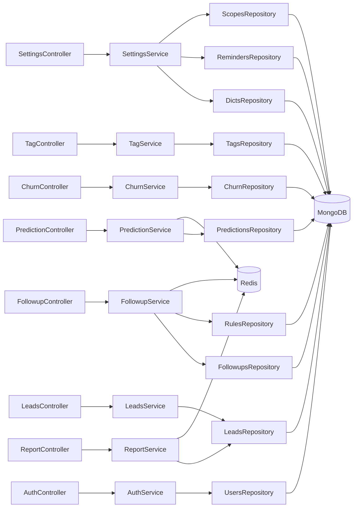
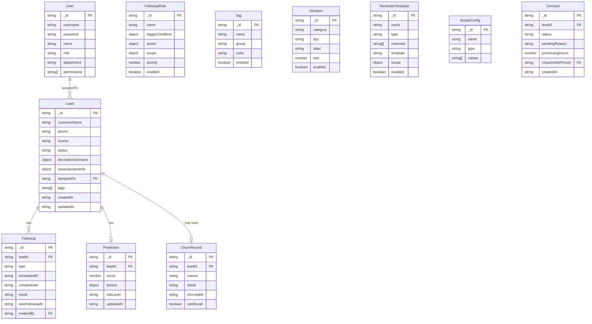

## 1. 架构设计



## 2. 技术说明

- **前端**：Vue 3 + Vite + Tailwind CSS + Pinia + Vue Router + ECharts
- **初始化工具**：vite-init (vue-ts 模板)
- **后端**：NestJS + TypeScript（ESM 模式）
- **数据库**：MongoDB（Mongoose ODM）+ Redis（ioredis）
- **认证**：JWT + RBAC 角色权限控制
- **图表库**：ECharts 5

## 3. 路由定义

| 路由 | 用途 |
|------|------|
| `/` | 重定向至线索看板 |
| `/leads` | 线索看板页 - 装修需求与量房信息总览 |
| `/leads/:id` | 线索详情 - 量房信息、状态时间线 |
| `/followup-rules` | 回访规则配置页 |
| `/predictions` | 成交预测明细页 |
| `/followup-plans` | 回访计划页（含日历视图） |
| `/churn-analysis` | 流失分析页 |
| `/tags` | 客户标签管理页 |
| `/reports` | 线索报表页 |
| `/settings/dicts` | 字典管理 |
| `/settings/reminders` | 提醒模板配置 |
| `/settings/scopes` | 生效范围配置 |
| `/settings/roles` | 角色权限管理 |

## 4. API 定义

### 4.1 线索模块 `/api/leads`

```typescript
interface Lead {
  _id: string
  customerName: string
  phone: string
  source: string
  status: 'new' | 'contacted' | 'measured' | 'quoted' | 'contracted' | 'lost'
  decorationDemand: {
    houseType: string
    area: number
    budgetRange: [number, number]
    style: string
    expectedStartDate: string
  }
  measurementInfo: {
    measuredAt: string
    measurer: string
    actualArea: number
    structureNote: string
    photos: string[]
  } | null
  assignedTo: string
  tags: string[]
  createdAt: string
  updatedAt: string
}

// GET /api/leads - 线索列表（支持筛选、排序、分页）
// GET /api/leads/:id - 线索详情
// POST /api/leads - 创建线索
// PATCH /api/leads/:id - 更新线索
// POST /api/leads/batch-tag - 批量打标
```

### 4.2 回访模块 `/api/followups`

```typescript
interface Followup {
  _id: string
  leadId: string
  type: 'phone' | 'wechat' | 'visit'
  scheduledAt: string
  completedAt: string | null
  result: string
  nextFollowupAt: string | null
  createdBy: string
}

interface FollowupRule {
  _id: string
  name: string
  triggerCondition: {
    event: 'status_change' | 'time_elapsed' | 'no_action'
    params: Record<string, any>
  }
  action: {
    remindHours: number
    remindMethod: ('sms' | 'system' | 'wechat')[]
    remindTarget: 'assignee' | 'manager'
  }
  scope: {
    departments: string[]
    roles: string[]
    leadSources: string[]
  }
  priority: number
  enabled: boolean
}

// GET /api/followups - 回访列表
// POST /api/followups - 创建回访记录
// PATCH /api/followups/:id - 更新回访结果
// GET /api/followups/calendar - 日历视图数据
// GET /api/followup-rules - 规则列表
// POST /api/followup-rules - 创建规则
// PATCH /api/followup-rules/:id - 更新规则
// PATCH /api/followup-rules/:id/toggle - 启用/禁用规则
```

### 4.3 成交预测模块 `/api/predictions`

```typescript
interface Prediction {
  _id: string
  leadId: string
  score: number
  factors: {
    name: string
    weight: number
    value: number
  }[]
  riskLevel: 'low' | 'medium' | 'high'
  updatedAt: string
}

// GET /api/predictions - 预测列表
// GET /api/predictions/funnel - 转化漏斗数据
// GET /api/predictions/risks - 风险线索列表
```

### 4.4 流失分析模块 `/api/churn`

```typescript
interface ChurnRecord {
  _id: string
  leadId: string
  reason: string
  detail: string
  churnedAt: string
  canRecall: boolean
}

// GET /api/churn/reasons - 流失原因统计
// GET /api/churn/trend - 流失趋势
// GET /api/churn/warnings - 流失预警列表
```

### 4.5 标签模块 `/api/tags`

```typescript
interface Tag {
  _id: string
  name: string
  group: string
  color: string
  enabled: boolean
}

// GET /api/tags - 标签列表
// POST /api/tags - 创建标签
// PATCH /api/tags/:id - 更新标签
// POST /api/tags/batch-query - 标签组合批量查询
// GET /api/tags/profile - 标签画像数据
```

### 4.6 报表模块 `/api/reports`

```typescript
interface LeadQualityReport {
  source: string
  totalCount: number
  validCount: number
  conversionRate: number
  avgScore: number
}

interface ContractPendingReason {
  reason: string
  count: number
  leads: { leadId: string; customerName: string; responsiblePerson: string }[]
}

interface ProcessingTimeReport {
  stage: string
  avgHours: number
  overtimeRate: number
  byPerson: { name: string; avgHours: number; count: number }[]
}

// GET /api/reports/lead-quality - 线索质量分析
// GET /api/reports/contract-pending - 合同待确认原因
// GET /api/reports/processing-time - 处理耗时分析
// GET /api/reports/responsible-person - 责任人绩效
```

### 4.7 配置模块 `/api/settings`

```typescript
interface DictItem {
  _id: string
  category: string
  key: string
  label: string
  sort: number
  enabled: boolean
}

interface ReminderTemplate {
  _id: string
  name: string
  type: string
  channels: ('sms' | 'system' | 'wechat')[]
  template: string
  scope: {
    departments: string[]
    roles: string[]
  }
  enabled: boolean
}

interface ScopeConfig {
  _id: string
  name: string
  type: 'department' | 'role' | 'source'
  values: string[]
}

// GET /api/settings/dicts - 字典列表
// POST /api/settings/dicts - 创建字典项
// PATCH /api/settings/dicts/:id - 更新字典项
// GET /api/settings/reminders - 提醒模板列表
// POST /api/settings/reminders - 创建提醒模板
// PATCH /api/settings/reminders/:id - 更新提醒模板
// GET /api/settings/scopes - 生效范围列表
// POST /api/settings/scopes - 创建生效范围
// GET /api/settings/roles - 角色列表
// POST /api/settings/roles - 创建角色
// PATCH /api/settings/roles/:id - 更新角色权限
```

### 4.8 认证模块 `/api/auth`

```typescript
// POST /api/auth/login - 登录
// POST /api/auth/logout - 登出
// GET /api/auth/profile - 获取当前用户信息
```

## 5. 服务端架构图



## 6. 数据模型

### 6.1 数据模型定义



### 6.2 集合定义语言（MongoDB）

```javascript
// leads 集合索引
db.leads.createIndex({ status: 1, assignedTo: 1 })
db.leads.createIndex({ source: 1, createdAt: -1 })
db.leads.createIndex({ tags: 1 })
db.leads.createIndex({ "decorationDemand.style": 1 })
db.leads.createIndex({ createdAt: -1 })

// followups 集合索引
db.followups.createIndex({ leadId: 1, scheduledAt: 1 })
db.followups.createIndex({ createdBy: 1, completedAt: -1 })
db.followups.createIndex({ scheduledAt: 1, completedAt: null })

// predictions 集合索引
db.predictions.createIndex({ leadId: 1 })
db.predictions.createIndex({ riskLevel: 1, score: -1 })

// churn_records 集合索引
db.churn_records.createIndex({ leadId: 1 })
db.churn_records.createIndex({ reason: 1, churnedAt: -1 })

// tags 集合索引
db.tags.createIndex({ group: 1, name: 1 }, { unique: true })

// dicts 集合索引
db.dicts.createIndex({ category: 1, key: 1 }, { unique: true })

// contracts 集合索引
db.contracts.createIndex({ leadId: 1 })
db.contracts.createIndex({ status: 1, responsiblePerson: 1 })

// users 集合索引
db.users.createIndex({ username: 1 }, { unique: true })
db.users.createIndex({ role: 1 })

// followup_rules 集合索引
db.followup_rules.createIndex({ enabled: 1, priority: 1 })
```
