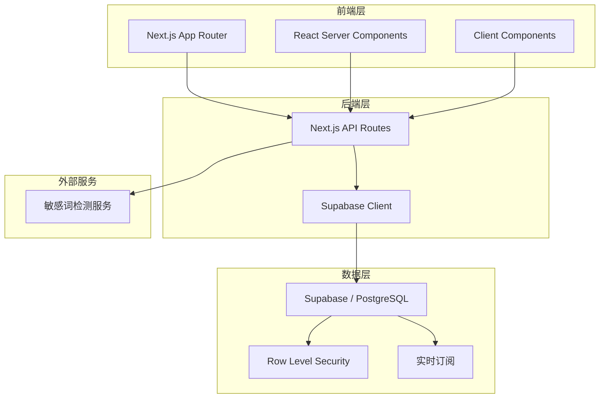
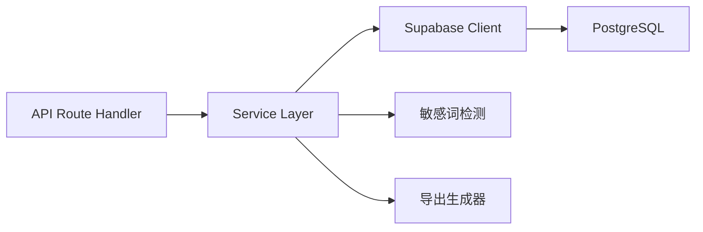
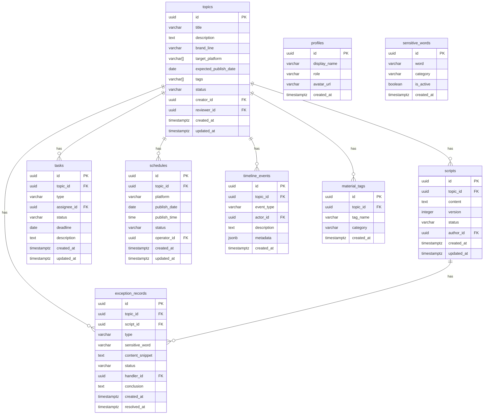

## 1. 架构设计



## 2. 技术说明

- 前端：Next.js 14 (App Router) + React 18 + Tailwind CSS 3
- 初始化工具：create-next-app
- 后端：Next.js API Routes + Supabase Client
- 数据库：Supabase 托管的 PostgreSQL
- 认证：Supabase Auth
- 实时：Supabase Realtime（任务状态变更推送）
- 导出：xlsx 库生成 Excel，PapaParse 生成 CSV
- 图表：Recharts
- 日期处理：date-fns
- 拖拽：@dnd-kit/core（任务看板拖拽、排期日历拖拽）
- 敏感词检测：前端内置敏感词库 + 服务端校验双保险

## 3. 路由定义

| 路由 | 用途 |
|------|------|
| / | 工作台首页，产能概览与待办 |
| /topics | 选题列表，筛选排序批量查询 |
| /topics/new | 新建选题 |
| /topics/[id] | 选题详情，时间轴 |
| /topics/[id]/script | 脚本编辑 |
| /tasks | 任务看板，拍摄剪辑任务 |
| /schedule | 发布排期，日历与列表 |
| /exceptions | 异常记录，敏感词拆分 |
| /exceptions/[id] | 异常详情与处理结论 |
| /reports | 报表中心，产能与漏斗 |

## 4. API定义

### 4.1 选题相关

```typescript
interface Topic {
  id: string
  title: string
  description: string
  brand_line: string
  target_platform: string[]
  expected_publish_date: string | null
  tags: string[]
  status: 'draft' | 'pending_review' | 'approved' | 'rejected' | 'in_script' | 'in_filming' | 'in_editing' | 'scheduled' | 'published'
  creator_id: string
  reviewer_id: string | null
  created_at: string
  updated_at: string
}

interface Script {
  id: string
  topic_id: string
  content: string
  version: number
  status: 'draft' | 'submitted' | 'approved' | 'revision_needed'
  author_id: string
  created_at: string
  updated_at: string
}
```

### 4.2 任务相关

```typescript
interface Task {
  id: string
  topic_id: string
  type: 'filming' | 'editing'
  assignee_id: string
  status: 'pending' | 'assigned' | 'in_progress' | 'completed' | 'overdue'
  deadline: string
  description: string
  created_at: string
  updated_at: string
}
```

### 4.3 排期相关

```typescript
interface Schedule {
  id: string
  topic_id: string
  platform: string
  publish_date: string
  publish_time: string
  status: 'scheduled' | 'published' | 'cancelled'
  operator_id: string
  created_at: string
  updated_at: string
}
```

### 4.4 异常相关

```typescript
interface ExceptionRecord {
  id: string
  topic_id: string | null
  script_id: string | null
  type: 'sensitive_word'
  sensitive_word: string
  content_snippet: string
  status: 'pending' | 'processing' | 'resolved'
  handler_id: string | null
  conclusion: string | null
  created_at: string
  resolved_at: string | null
}
```

### 4.5 时间轴事件

```typescript
interface TimelineEvent {
  id: string
  topic_id: string
  event_type: 'topic_created' | 'topic_approved' | 'topic_rejected' | 'script_submitted' | 'script_approved' | 'task_assigned' | 'task_completed' | 'exception_created' | 'exception_resolved' | 'schedule_created' | 'published'
  actor_id: string
  description: string
  metadata: Record<string, unknown>
  created_at: string
}
```

### 4.6 API端点

| 方法 | 路径 | 用途 |
|------|------|------|
| GET | /api/topics | 获取选题列表（支持过滤排序分页） |
| POST | /api/topics | 创建选题 |
| GET | /api/topics/[id] | 获取选题详情（含时间轴） |
| PATCH | /api/topics/[id] | 更新选题（审批/状态变更） |
| GET | /api/topics/[id]/scripts | 获取脚本列表 |
| POST | /api/topics/[id]/scripts | 创建/提交脚本 |
| GET | /api/tasks | 获取任务列表（支持过滤） |
| POST | /api/tasks | 创建/分派任务 |
| PATCH | /api/tasks/[id] | 更新任务状态 |
| GET | /api/schedules | 获取排期列表 |
| POST | /api/schedules | 创建排期 |
| PATCH | /api/schedules/[id] | 更新排期 |
| GET | /api/exceptions | 获取异常列表（按敏感词分组） |
| PATCH | /api/exceptions/[id] | 处理异常，录入结论 |
| GET | /api/reports/production | 获取产能报表数据 |
| GET | /api/reports/funnel | 获取漏斗数据 |
| POST | /api/export | 导出Excel/CSV |

## 5. 服务端架构图



## 6. 数据模型

### 6.1 数据模型定义



### 6.2 数据定义语言

```sql
-- 用户档案
CREATE TABLE profiles (
  id UUID PRIMARY KEY REFERENCES auth.users(id),
  display_name VARCHAR(100) NOT NULL,
  role VARCHAR(20) NOT NULL CHECK (role IN ('admin', 'director', 'cameraman', 'editor', 'operator')),
  avatar_url TEXT,
  created_at TIMESTAMPTZ DEFAULT NOW()
);

-- 敏感词库
CREATE TABLE sensitive_words (
  id UUID PRIMARY KEY DEFAULT gen_random_uuid(),
  word VARCHAR(100) NOT NULL UNIQUE,
  category VARCHAR(50),
  is_active BOOLEAN DEFAULT TRUE,
  created_at TIMESTAMPTZ DEFAULT NOW()
);

-- 选题
CREATE TABLE topics (
  id UUID PRIMARY KEY DEFAULT gen_random_uuid(),
  title VARCHAR(200) NOT NULL,
  description TEXT,
  brand_line VARCHAR(100),
  target_platform VARCHAR(20)[] DEFAULT '{}',
  expected_publish_date DATE,
  tags VARCHAR(50)[] DEFAULT '{}',
  status VARCHAR(20) NOT NULL DEFAULT 'draft' CHECK (status IN ('draft', 'pending_review', 'approved', 'rejected', 'in_script', 'in_filming', 'in_editing', 'scheduled', 'published')),
  creator_id UUID NOT NULL REFERENCES profiles(id),
  reviewer_id UUID REFERENCES profiles(id),
  created_at TIMESTAMPTZ DEFAULT NOW(),
  updated_at TIMESTAMPTZ DEFAULT NOW()
);

CREATE INDEX idx_topics_status ON topics(status);
CREATE INDEX idx_topics_creator ON topics(creator_id);
CREATE INDEX idx_topics_created_at ON topics(created_at DESC);
CREATE INDEX idx_topics_tags ON topics USING GIN(tags);

-- 脚本
CREATE TABLE scripts (
  id UUID PRIMARY KEY DEFAULT gen_random_uuid(),
  topic_id UUID NOT NULL REFERENCES topics(id) ON DELETE CASCADE,
  content TEXT NOT NULL,
  version INTEGER NOT NULL DEFAULT 1,
  status VARCHAR(20) NOT NULL DEFAULT 'draft' CHECK (status IN ('draft', 'submitted', 'approved', 'revision_needed')),
  author_id UUID NOT NULL REFERENCES profiles(id),
  created_at TIMESTAMPTZ DEFAULT NOW(),
  updated_at TIMESTAMPTZ DEFAULT NOW()
);

CREATE INDEX idx_scripts_topic ON scripts(topic_id);
CREATE INDEX idx_scripts_status ON scripts(status);

-- 任务
CREATE TABLE tasks (
  id UUID PRIMARY KEY DEFAULT gen_random_uuid(),
  topic_id UUID NOT NULL REFERENCES topics(id) ON DELETE CASCADE,
  type VARCHAR(20) NOT NULL CHECK (type IN ('filming', 'editing')),
  assignee_id UUID REFERENCES profiles(id),
  status VARCHAR(20) NOT NULL DEFAULT 'pending' CHECK (status IN ('pending', 'assigned', 'in_progress', 'completed', 'overdue')),
  deadline DATE,
  description TEXT,
  created_at TIMESTAMPTZ DEFAULT NOW(),
  updated_at TIMESTAMPTZ DEFAULT NOW()
);

CREATE INDEX idx_tasks_topic ON tasks(topic_id);
CREATE INDEX idx_tasks_assignee ON tasks(assignee_id);
CREATE INDEX idx_tasks_status ON tasks(status);
CREATE INDEX idx_tasks_type ON tasks(type);

-- 发布排期
CREATE TABLE schedules (
  id UUID PRIMARY KEY DEFAULT gen_random_uuid(),
  topic_id UUID NOT NULL REFERENCES topics(id) ON DELETE CASCADE,
  platform VARCHAR(50) NOT NULL,
  publish_date DATE NOT NULL,
  publish_time TIME,
  status VARCHAR(20) NOT NULL DEFAULT 'scheduled' CHECK (status IN ('scheduled', 'published', 'cancelled')),
  operator_id UUID NOT NULL REFERENCES profiles(id),
  created_at TIMESTAMPTZ DEFAULT NOW(),
  updated_at TIMESTAMPTZ DEFAULT NOW()
);

CREATE INDEX idx_schedules_topic ON schedules(topic_id);
CREATE INDEX idx_schedules_date ON schedules(publish_date);
CREATE INDEX idx_schedules_status ON schedules(status);

-- 异常记录
CREATE TABLE exception_records (
  id UUID PRIMARY KEY DEFAULT gen_random_uuid(),
  topic_id UUID REFERENCES topics(id) ON DELETE SET NULL,
  script_id UUID REFERENCES scripts(id) ON DELETE SET NULL,
  type VARCHAR(30) NOT NULL DEFAULT 'sensitive_word',
  sensitive_word VARCHAR(100),
  content_snippet TEXT,
  status VARCHAR(20) NOT NULL DEFAULT 'pending' CHECK (status IN ('pending', 'processing', 'resolved')),
  handler_id UUID REFERENCES profiles(id),
  conclusion TEXT,
  created_at TIMESTAMPTZ DEFAULT NOW(),
  resolved_at TIMESTAMPTZ
);

CREATE INDEX idx_exceptions_status ON exception_records(status);
CREATE INDEX idx_exceptions_sensitive_word ON exception_records(sensitive_word);
CREATE INDEX idx_exceptions_type ON exception_records(type);
CREATE INDEX idx_exceptions_created_at ON exception_records(created_at DESC);

-- 时间轴事件
CREATE TABLE timeline_events (
  id UUID PRIMARY KEY DEFAULT gen_random_uuid(),
  topic_id UUID NOT NULL REFERENCES topics(id) ON DELETE CASCADE,
  event_type VARCHAR(50) NOT NULL,
  actor_id UUID REFERENCES profiles(id),
  description TEXT NOT NULL,
  metadata JSONB DEFAULT '{}',
  created_at TIMESTAMPTZ DEFAULT NOW()
);

CREATE INDEX idx_timeline_topic ON timeline_events(topic_id);
CREATE INDEX idx_timeline_created_at ON timeline_events(created_at DESC);

-- 素材标签
CREATE TABLE material_tags (
  id UUID PRIMARY KEY DEFAULT gen_random_uuid(),
  topic_id UUID NOT NULL REFERENCES topics(id) ON DELETE CASCADE,
  tag_name VARCHAR(100) NOT NULL,
  category VARCHAR(50),
  created_at TIMESTAMPTZ DEFAULT NOW()
);

CREATE INDEX idx_material_tags_topic ON material_tags(topic_id);
CREATE INDEX idx_material_tags_name ON material_tags(tag_name);
CREATE INDEX idx_material_tags_category ON material_tags(category);

-- updated_at 自动更新触发器
CREATE OR REPLACE FUNCTION update_updated_at()
RETURNS TRIGGER AS $$
BEGIN
  NEW.updated_at = NOW();
  RETURN NEW;
END;
$$ LANGUAGE plpgsql;

CREATE TRIGGER topics_updated_at BEFORE UPDATE ON topics FOR EACH ROW EXECUTE FUNCTION update_updated_at();
CREATE TRIGGER scripts_updated_at BEFORE UPDATE ON scripts FOR EACH ROW EXECUTE FUNCTION update_updated_at();
CREATE TRIGGER tasks_updated_at BEFORE UPDATE ON tasks FOR EACH ROW EXECUTE FUNCTION update_updated_at();
CREATE TRIGGER schedules_updated_at BEFORE UPDATE ON schedules FOR EACH ROW EXECUTE FUNCTION update_updated_at();
```
