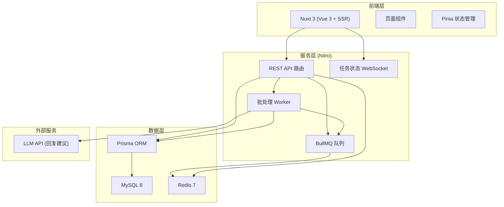
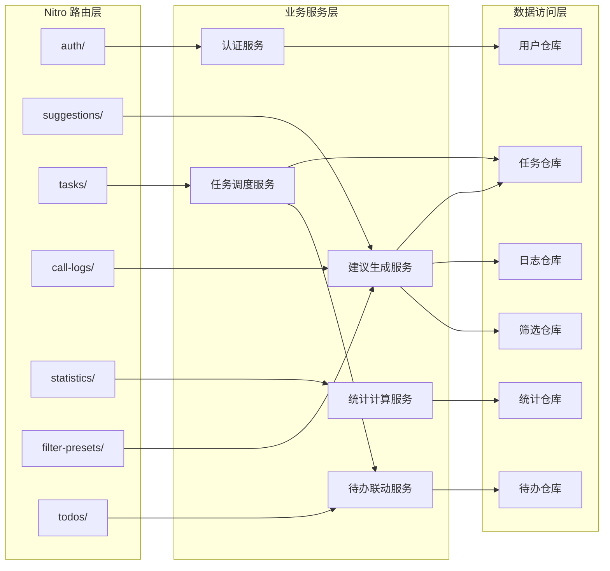
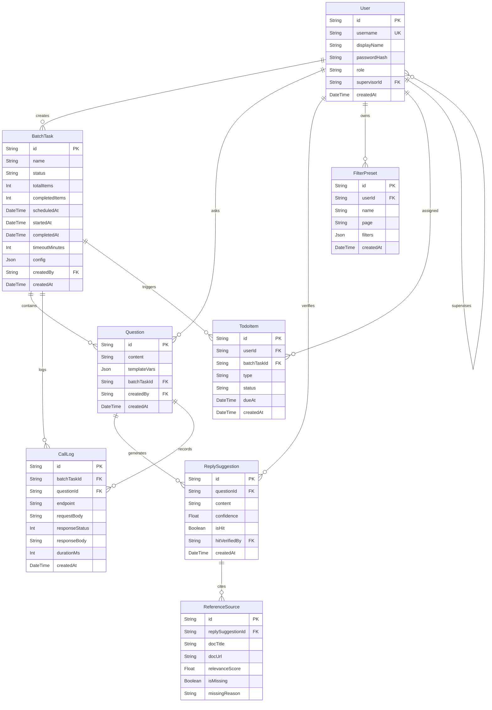

## 1. 架构设计



## 2. 技术说明

- **前端**: Nuxt 3 (Vue 3 + Composition API) + Tailwind CSS 3 + Pinia
- **服务端**: Nitro (Nuxt 3 内置服务引擎)
- **ORM**: Prisma 5 + @prisma/client
- **数据库**: MySQL 8.0
- **缓存与队列**: Redis 7 + BullMQ
- **图表**: Chart.js + vue-chartjs
- **图标**: Lucide Vue Next
- **项目初始化**: `npx nuxi init`

## 3. 路由定义

| 路由 | 用途 |
|------|------|
| `/` | 工作台首页 - 待办概览、超时提醒、命中率速览 |
| `/generator` | 会话生成器 - 输入问题获取回复建议、批量配置 |
| `/tasks` | 批处理任务 - 任务列表、新建任务、状态流转 |
| `/results` | 结果与筛选 - 调用日志/生成结果/引用来源、保存筛选 |
| `/statistics` | 统计分析 - 命中率多维拆解图表 |
| `/settings` | 设置 - 账号管理、角色配置 |

## 4. API 定义

### 4.1 认证与用户

```typescript
interface User {
  id: string
  username: string
  displayName: string
  role: "admin" | "supervisor" | "agent"
  supervisorId: string | null
  createdAt: string
}

// POST /api/auth/login    → { token, user }
// GET  /api/auth/me       → User
// GET  /api/users         → User[] (admin/supervisor)
// POST /api/users         → User (admin)
```

### 4.2 会话与回复建议

```typescript
interface Question {
  id: string
  content: string
  templateVars: Record<string, string>
  batchTaskId: string | null
  createdBy: string
  createdAt: string
}

interface ReplySuggestion {
  id: string
  questionId: string
  content: string
  confidence: number
  isHit: boolean
  hitVerifiedBy: string | null
  createdAt: string
}

interface ReferenceSource {
  id: string
  replySuggestionId: string
  docTitle: string
  docUrl: string
  relevanceScore: number
  isMissing: boolean
  missingReason: string | null
}

// POST /api/suggestions/generate  → ReplySuggestion (单条生成)
// POST /api/suggestions/:id/verify → ReplySuggestion (确认命中)
```

### 4.3 批处理任务

```typescript
interface BatchTask {
  id: string
  name: string
  status: "pending" | "scheduled" | "generating" | "completed" | "failed" | "timeout"
  totalItems: number
  completedItems: number
  scheduledAt: string | null
  startedAt: string | null
  completedAt: string | null
  timeoutMinutes: number
  config: BatchTaskConfig
  createdBy: string
  createdAt: string
}

interface BatchTaskConfig {
  questionSetId: string
  generateCount: number
  llmModel: string
  temperature: number
}

// GET    /api/tasks           → BatchTask[]
// POST   /api/tasks           → BatchTask
// GET    /api/tasks/:id       → BatchTask
// POST   /api/tasks/:id/rerun → BatchTask (重新调度)
// DELETE /api/tasks/:id       → void
```

### 4.4 调用日志

```typescript
interface CallLog {
  id: string
  batchTaskId: string | null
  questionId: string
  endpoint: string
  requestBody: string
  responseStatus: number
  responseBody: string
  durationMs: number
  createdAt: string
}

// GET /api/call-logs → CallLog[] (支持筛选)
```

### 4.5 筛选预设

```typescript
interface FilterPreset {
  id: string
  userId: string
  name: string
  page: "results" | "statistics"
  filters: Record<string, unknown>
  createdAt: string
}

// GET    /api/filter-presets        → FilterPreset[]
// POST   /api/filter-presets        → FilterPreset
// DELETE /api/filter-presets/:id    → void
```

### 4.6 统计

```typescript
interface HitRateStat {
  total: number
  hitCount: number
  hitRate: number
}

interface HitRateBySupervisor extends HitRateStat {
  supervisorId: string
  supervisorName: string
}

interface HitRateByDate extends HitRateStat {
  date: string
}

interface HitRateByMissingReason {
  missingReason: string
  count: number
  affectedHitRate: number
}

interface DashboardSummary {
  pendingTodoCount: number
  timeoutAlertCount: number
  todayHitRate: HitRateStat
  weekHitRate: HitRateStat
  recentTasks: BatchTask[]
}

// GET /api/statistics/dashboard      → DashboardSummary
// GET /api/statistics/hit-rate       → HitRateStat
// GET /api/statistics/hit-rate/by-supervisor → HitRateBySupervisor[]
// GET /api/statistics/hit-rate/by-date       → HitRateByDate[]
// GET /api/statistics/hit-rate/by-missing    → HitRateByMissingReason[]
```

### 4.7 待办与超时

```typescript
interface TodoItem {
  id: string
  userId: string
  batchTaskId: string | null
  type: "review" | "verify_hit" | "check_reference" | "rerun_timeout"
  status: "pending" | "done"
  dueAt: string
  createdAt: string
}

// GET  /api/todos        → TodoItem[]
// POST /api/todos/:id/done → TodoItem
```

## 5. 服务架构图



## 6. 数据模型

### 6.1 数据模型定义



### 6.2 数据定义语言

```sql
CREATE TABLE `User` (
  `id` VARCHAR(36) PRIMARY KEY,
  `username` VARCHAR(100) NOT NULL UNIQUE,
  `displayName` VARCHAR(200) NOT NULL,
  `passwordHash` VARCHAR(500) NOT NULL,
  `role` ENUM('admin', 'supervisor', 'agent') NOT NULL DEFAULT 'agent',
  `supervisorId` VARCHAR(36) NULL,
  `createdAt` DATETIME(3) NOT NULL DEFAULT CURRENT_TIMESTAMP(3),
  INDEX `idx_user_role` (`role`),
  INDEX `idx_user_supervisor` (`supervisorId`)
);

CREATE TABLE `BatchTask` (
  `id` VARCHAR(36) PRIMARY KEY,
  `name` VARCHAR(200) NOT NULL,
  `status` ENUM('pending', 'scheduled', 'generating', 'completed', 'failed', 'timeout') NOT NULL DEFAULT 'pending',
  `totalItems` INT NOT NULL DEFAULT 0,
  `completedItems` INT NOT NULL DEFAULT 0,
  `scheduledAt` DATETIME(3) NULL,
  `startedAt` DATETIME(3) NULL,
  `completedAt` DATETIME(3) NULL,
  `timeoutMinutes` INT NOT NULL DEFAULT 30,
  `config` JSON NOT NULL,
  `createdBy` VARCHAR(36) NOT NULL,
  `createdAt` DATETIME(3) NOT NULL DEFAULT CURRENT_TIMESTAMP(3),
  INDEX `idx_task_status` (`status`),
  INDEX `idx_task_creator` (`createdBy`),
  INDEX `idx_task_scheduled` (`scheduledAt`)
);

CREATE TABLE `Question` (
  `id` VARCHAR(36) PRIMARY KEY,
  `content` TEXT NOT NULL,
  `templateVars` JSON NULL,
  `batchTaskId` VARCHAR(36) NULL,
  `createdBy` VARCHAR(36) NOT NULL,
  `createdAt` DATETIME(3) NOT NULL DEFAULT CURRENT_TIMESTAMP(3),
  INDEX `idx_question_task` (`batchTaskId`),
  INDEX `idx_question_creator` (`createdBy`)
);

CREATE TABLE `ReplySuggestion` (
  `id` VARCHAR(36) PRIMARY KEY,
  `questionId` VARCHAR(36) NOT NULL,
  `content` TEXT NOT NULL,
  `confidence` FLOAT NOT NULL DEFAULT 0,
  `isHit` BOOLEAN NOT NULL DEFAULT FALSE,
  `hitVerifiedBy` VARCHAR(36) NULL,
  `createdAt` DATETIME(3) NOT NULL DEFAULT CURRENT_TIMESTAMP(3),
  INDEX `idx_suggestion_question` (`questionId`),
  INDEX `idx_suggestion_hit` (`isHit`),
  INDEX `idx_suggestion_verified` (`hitVerifiedBy`)
);

CREATE TABLE `ReferenceSource` (
  `id` VARCHAR(36) PRIMARY KEY,
  `replySuggestionId` VARCHAR(36) NOT NULL,
  `docTitle` VARCHAR(500) NOT NULL,
  `docUrl` VARCHAR(1000) NOT NULL DEFAULT '',
  `relevanceScore` FLOAT NOT NULL DEFAULT 0,
  `isMissing` BOOLEAN NOT NULL DEFAULT FALSE,
  `missingReason` VARCHAR(200) NULL,
  INDEX `idx_ref_suggestion` (`replySuggestionId`),
  INDEX `idx_ref_missing` (`isMissing`, `missingReason`)
);

CREATE TABLE `CallLog` (
  `id` VARCHAR(36) PRIMARY KEY,
  `batchTaskId` VARCHAR(36) NULL,
  `questionId` VARCHAR(36) NOT NULL,
  `endpoint` VARCHAR(500) NOT NULL,
  `requestBody` JSON NULL,
  `responseStatus` INT NOT NULL DEFAULT 0,
  `responseBody` JSON NULL,
  `durationMs` INT NOT NULL DEFAULT 0,
  `createdAt` DATETIME(3) NOT NULL DEFAULT CURRENT_TIMESTAMP(3),
  INDEX `idx_log_task` (`batchTaskId`),
  INDEX `idx_log_question` (`questionId`),
  INDEX `idx_log_time` (`createdAt`)
);

CREATE TABLE `FilterPreset` (
  `id` VARCHAR(36) PRIMARY KEY,
  `userId` VARCHAR(36) NOT NULL,
  `name` VARCHAR(200) NOT NULL,
  `page` ENUM('results', 'statistics') NOT NULL,
  `filters` JSON NOT NULL,
  `createdAt` DATETIME(3) NOT NULL DEFAULT CURRENT_TIMESTAMP(3),
  INDEX `idx_filter_user` (`userId`),
  INDEX `idx_filter_page` (`page`)
);

CREATE TABLE `TodoItem` (
  `id` VARCHAR(36) PRIMARY KEY,
  `userId` VARCHAR(36) NOT NULL,
  `batchTaskId` VARCHAR(36) NULL,
  `type` ENUM('review', 'verify_hit', 'check_reference', 'rerun_timeout') NOT NULL,
  `status` ENUM('pending', 'done') NOT NULL DEFAULT 'pending',
  `dueAt` DATETIME(3) NOT NULL,
  `createdAt` DATETIME(3) NOT NULL DEFAULT CURRENT_TIMESTAMP(3),
  INDEX `idx_todo_user_status` (`userId`, `status`),
  INDEX `idx_todo_due` (`dueAt`),
  INDEX `idx_todo_task` (`batchTaskId`)
);
```
