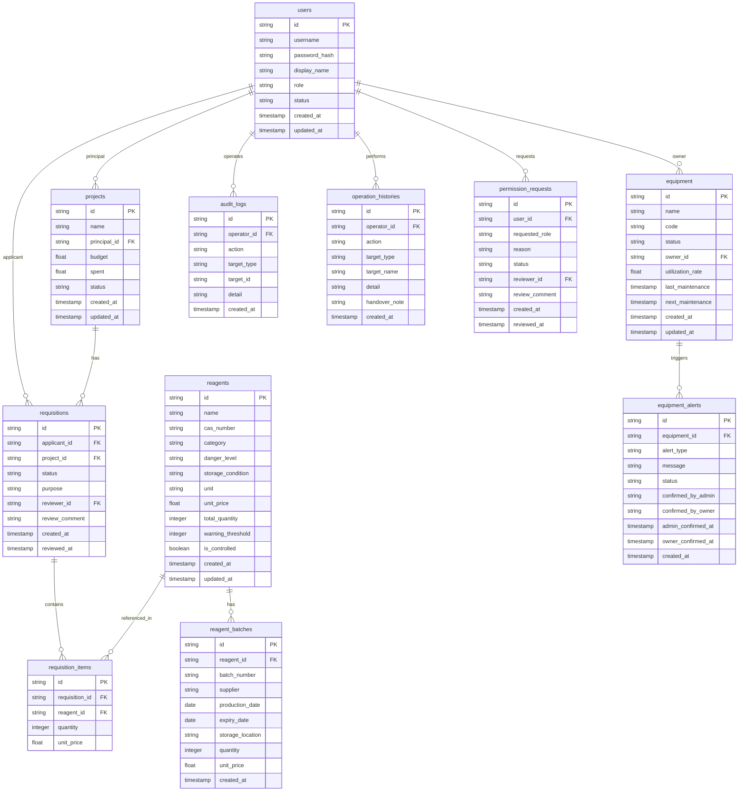

## 1. 架构设计

```mermaid
graph TB
    subgraph "前端层"
        "Vue3 SPA"
    end
    subgraph "后端层"
        "AdonisJS API Server"
        "Redis Cache & Queue"
    end
    subgraph "数据层"
        "PostgreSQL"
    end
    "Vue3 SPA" -->|"HTTP/REST"| "AdonisJS API Server"
    "AdonisJS API Server" -->|"SQL"| "PostgreSQL"
    "AdonisJS API Server" -->|"Cache/Queue"| "Redis Cache & Queue"
```

## 2. 技术说明

- 前端：Vue 3 + TypeScript + Tailwind CSS + Vue Router + Pinia
- 构建工具：Vite
- 后端：AdonisJS 6 + TypeScript
- 数据库：PostgreSQL 16
- 缓存与队列：Redis 7
- 图表库：ECharts（vue-echarts）
- UI 组件：Headless UI + 自定义组件
- 初始化工具：vite-init（vue-ts 模板）+ AdonisJS CLI

## 3. 路由定义

| 路由 | 用途 |
|------|------|
| / | 重定向到库存统计报表 |
| /inventory | 库存统计报表页 |
| /requisition | 领用申请页 |
| /project-report | 课题报表页 |
| /compliance | 安全合规页 |
| /finance | 经费管理页 |
| /permission | 权限审核页 |
| /batch | 试剂批次页 |
| /equipment | 设备利用率看板页 |
| /history | 操作历史页 |

## 4. API 定义

### 4.1 试剂库存 API

```typescript
interface Reagent {
  id: string
  name: string
  cas_number: string | null
  category: string
  danger_level: 'normal' | 'hazardous' | 'highly_hazardous'
  storage_condition: string
  unit: string
  unit_price: number
  total_quantity: number
  warning_threshold: number
  created_at: string
  updated_at: string
}

interface InventoryStats {
  total_reagent_count: number
  total_stock_value: number
  warning_count: number
  monthly_in: number
  monthly_out: number
  category_distribution: { category: string; count: number }[]
  danger_distribution: { level: string; count: number }[]
  trend: { month: string; in_count: number; out_count: number }[]
  warning_list: Reagent[]
}
```

### 4.2 领用申请 API

```typescript
interface Requisition {
  id: string
  applicant_id: string
  applicant_name: string
  project_id: string
  project_name: string
  status: 'pending' | 'approved' | 'rejected' | 'completed'
  items: RequisitionItem[]
  purpose: string
  created_at: string
  reviewed_at: string | null
  reviewer_id: string | null
  review_comment: string | null
}

interface RequisitionItem {
  reagent_id: string
  reagent_name: string
  quantity: number
  unit: string
}
```

### 4.3 课题报表 API

```typescript
interface ProjectReport {
  project_id: string
  project_name: string
  principal: string
  budget: number
  spent: number
  balance: number
  consumption: { reagent_name: string; quantity: number; amount: number }[]
  monthly_spending: { month: string; amount: number }[]
}
```

### 4.4 安全合规 API

```typescript
interface ComplianceFilter {
  danger_levels?: string[]
  controlled_categories?: string[]
  compliance_status?: 'compliant' | 'non_compliant' | 'pending_review'
}

interface AuditLog {
  id: string
  operator_id: string
  operator_name: string
  action: string
  target_type: string
  target_id: string
  detail: string
  created_at: string
}
```

### 4.5 仪器停用提醒 API

```typescript
interface EquipmentAlert {
  id: string
  equipment_id: string
  equipment_name: string
  alert_type: 'maintenance_due' | 'calibration_expired' | 'malfunction'
  message: string
  status: 'pending' | 'confirmed_by_admin' | 'confirmed_by_owner' | 'resolved'
  admin_confirmed_at: string | null
  owner_confirmed_at: string | null
  created_at: string
}

interface EquipmentUtilization {
  equipment_id: string
  equipment_name: string
  status: 'active' | 'inactive' | 'maintenance'
  utilization_rate: number
  total_hours: number
  monthly_usage: { month: string; hours: number }[]
}
```

### 4.6 操作历史 API

```typescript
interface OperationHistory {
  id: string
  operator_id: string
  operator_name: string
  action: string
  target_type: string
  target_name: string
  detail: string
  handover_note: string | null
  created_at: string
}
```

## 5. 服务端架构图

```mermaid
graph LR
    "Controller" --> "Service"
    "Service" --> "Repository"
    "Repository" --> "PostgreSQL"
    "Service" --> "Redis Cache"
    "Service" --> "Redis Queue"
```

## 6. 数据模型

### 6.1 数据模型定义



### 6.2 数据定义语言

```sql
CREATE TABLE users (
  id UUID PRIMARY KEY DEFAULT gen_random_uuid(),
  username VARCHAR(100) NOT NULL UNIQUE,
  password_hash VARCHAR(255) NOT NULL,
  display_name VARCHAR(100) NOT NULL,
  role VARCHAR(20) NOT NULL DEFAULT 'staff' CHECK (role IN ('admin', 'reagent_manager', 'project_leader', 'staff')),
  status VARCHAR(20) NOT NULL DEFAULT 'active' CHECK (status IN ('active', 'inactive', 'pending_review')),
  created_at TIMESTAMP NOT NULL DEFAULT NOW(),
  updated_at TIMESTAMP NOT NULL DEFAULT NOW()
);

CREATE TABLE reagents (
  id UUID PRIMARY KEY DEFAULT gen_random_uuid(),
  name VARCHAR(200) NOT NULL,
  cas_number VARCHAR(50),
  category VARCHAR(50) NOT NULL,
  danger_level VARCHAR(30) NOT NULL DEFAULT 'normal' CHECK (danger_level IN ('normal', 'hazardous', 'highly_hazardous')),
  storage_condition VARCHAR(100),
  unit VARCHAR(20) NOT NULL,
  unit_price DECIMAL(12,2) NOT NULL DEFAULT 0,
  total_quantity INTEGER NOT NULL DEFAULT 0,
  warning_threshold INTEGER NOT NULL DEFAULT 0,
  is_controlled BOOLEAN NOT NULL DEFAULT FALSE,
  created_at TIMESTAMP NOT NULL DEFAULT NOW(),
  updated_at TIMESTAMP NOT NULL DEFAULT NOW()
);

CREATE INDEX idx_reagents_category ON reagents(category);
CREATE INDEX idx_reagents_danger_level ON reagents(danger_level);
CREATE INDEX idx_reagents_is_controlled ON reagents(is_controlled);

CREATE TABLE reagent_batches (
  id UUID PRIMARY KEY DEFAULT gen_random_uuid(),
  reagent_id UUID NOT NULL REFERENCES reagents(id) ON DELETE CASCADE,
  batch_number VARCHAR(100) NOT NULL,
  supplier VARCHAR(200),
  production_date DATE,
  expiry_date DATE,
  storage_location VARCHAR(200),
  quantity INTEGER NOT NULL DEFAULT 0,
  unit_price DECIMAL(12,2) NOT NULL DEFAULT 0,
  created_at TIMESTAMP NOT NULL DEFAULT NOW()
);

CREATE INDEX idx_reagent_batches_reagent_id ON reagent_batches(reagent_id);
CREATE INDEX idx_reagent_batches_expiry ON reagent_batches(expiry_date);

CREATE TABLE projects (
  id UUID PRIMARY KEY DEFAULT gen_random_uuid(),
  name VARCHAR(200) NOT NULL,
  principal_id UUID NOT NULL REFERENCES users(id),
  budget DECIMAL(14,2) NOT NULL DEFAULT 0,
  spent DECIMAL(14,2) NOT NULL DEFAULT 0,
  status VARCHAR(20) NOT NULL DEFAULT 'active' CHECK (status IN ('active', 'completed', 'suspended')),
  created_at TIMESTAMP NOT NULL DEFAULT NOW(),
  updated_at TIMESTAMP NOT NULL DEFAULT NOW()
);

CREATE INDEX idx_projects_principal ON projects(principal_id);

CREATE TABLE requisitions (
  id UUID PRIMARY KEY DEFAULT gen_random_uuid(),
  applicant_id UUID NOT NULL REFERENCES users(id),
  project_id UUID NOT NULL REFERENCES projects(id),
  status VARCHAR(20) NOT NULL DEFAULT 'pending' CHECK (status IN ('pending', 'approved', 'rejected', 'completed')),
  purpose TEXT,
  reviewer_id UUID REFERENCES users(id),
  review_comment TEXT,
  created_at TIMESTAMP NOT NULL DEFAULT NOW(),
  reviewed_at TIMESTAMP
);

CREATE INDEX idx_requisitions_applicant ON requisitions(applicant_id);
CREATE INDEX idx_requisitions_project ON requisitions(project_id);
CREATE INDEX idx_requisitions_status ON requisitions(status);

CREATE TABLE requisition_items (
  id UUID PRIMARY KEY DEFAULT gen_random_uuid(),
  requisition_id UUID NOT NULL REFERENCES requisitions(id) ON DELETE CASCADE,
  reagent_id UUID NOT NULL REFERENCES reagents(id),
  quantity INTEGER NOT NULL,
  unit_price DECIMAL(12,2) NOT NULL DEFAULT 0
);

CREATE INDEX idx_requisition_items_requisition ON requisition_items(requisition_id);

CREATE TABLE equipment (
  id UUID PRIMARY KEY DEFAULT gen_random_uuid(),
  name VARCHAR(200) NOT NULL,
  code VARCHAR(50) NOT NULL UNIQUE,
  status VARCHAR(20) NOT NULL DEFAULT 'active' CHECK (status IN ('active', 'inactive', 'maintenance')),
  owner_id UUID REFERENCES users(id),
  utilization_rate DECIMAL(5,2) NOT NULL DEFAULT 0,
  last_maintenance TIMESTAMP,
  next_maintenance TIMESTAMP,
  created_at TIMESTAMP NOT NULL DEFAULT NOW(),
  updated_at TIMESTAMP NOT NULL DEFAULT NOW()
);

CREATE TABLE equipment_alerts (
  id UUID PRIMARY KEY DEFAULT gen_random_uuid(),
  equipment_id UUID NOT NULL REFERENCES equipment(id) ON DELETE CASCADE,
  alert_type VARCHAR(30) NOT NULL CHECK (alert_type IN ('maintenance_due', 'calibration_expired', 'malfunction')),
  message TEXT NOT NULL,
  status VARCHAR(30) NOT NULL DEFAULT 'pending' CHECK (status IN ('pending', 'confirmed_by_admin', 'confirmed_by_owner', 'resolved')),
  confirmed_by_admin BOOLEAN NOT NULL DEFAULT FALSE,
  confirmed_by_owner BOOLEAN NOT NULL DEFAULT FALSE,
  admin_confirmed_at TIMESTAMP,
  owner_confirmed_at TIMESTAMP,
  created_at TIMESTAMP NOT NULL DEFAULT NOW()
);

CREATE INDEX idx_equipment_alerts_equipment ON equipment_alerts(equipment_id);
CREATE INDEX idx_equipment_alerts_status ON equipment_alerts(status);

CREATE TABLE audit_logs (
  id UUID PRIMARY KEY DEFAULT gen_random_uuid(),
  operator_id UUID NOT NULL REFERENCES users(id),
  action VARCHAR(100) NOT NULL,
  target_type VARCHAR(50) NOT NULL,
  target_id UUID NOT NULL,
  detail TEXT,
  created_at TIMESTAMP NOT NULL DEFAULT NOW()
);

CREATE INDEX idx_audit_logs_operator ON audit_logs(operator_id);
CREATE INDEX idx_audit_logs_action ON audit_logs(action);
CREATE INDEX idx_audit_logs_created ON audit_logs(created_at);

CREATE TABLE operation_histories (
  id UUID PRIMARY KEY DEFAULT gen_random_uuid(),
  operator_id UUID NOT NULL REFERENCES users(id),
  action VARCHAR(100) NOT NULL,
  target_type VARCHAR(50) NOT NULL,
  target_name VARCHAR(200),
  detail TEXT,
  handover_note TEXT,
  created_at TIMESTAMP NOT NULL DEFAULT NOW()
);

CREATE INDEX idx_operation_histories_operator ON operation_histories(operator_id);
CREATE INDEX idx_operation_histories_created ON operation_histories(created_at);

CREATE TABLE permission_requests (
  id UUID PRIMARY KEY DEFAULT gen_random_uuid(),
  user_id UUID NOT NULL REFERENCES users(id),
  requested_role VARCHAR(20) NOT NULL,
  reason TEXT,
  status VARCHAR(20) NOT NULL DEFAULT 'pending' CHECK (status IN ('pending', 'approved', 'rejected')),
  reviewer_id UUID REFERENCES users(id),
  review_comment TEXT,
  created_at TIMESTAMP NOT NULL DEFAULT NOW(),
  reviewed_at TIMESTAMP
);

CREATE INDEX idx_permission_requests_user ON permission_requests(user_id);
CREATE INDEX idx_permission_requests_status ON permission_requests(status);
```
